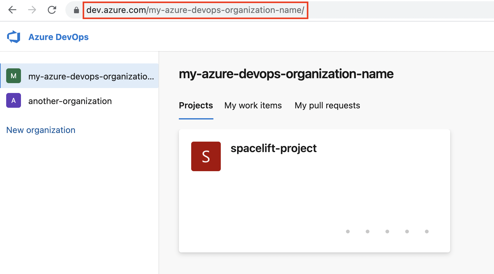

# Use Azure DevOps as your source code provider

Spacelift supports Azure DevOps as the code source for your [stacks](../../concepts/stack/README.md) and [modules](../../vendors/terraform/module-registry.md).

You can set up multiple Space-level and one default Azure DevOps integration per account.

## Create the Azure DevOps integration

!!! tip "Azure DevOps integration details"
    Learn more about setting up and using the Azure DevOps integration on the [Azure DevOps source control page](../../integrations/source-control/azure-devops.md).

### Initial setup

1. On the _Source control_ tab, click **Set up integration**, then choose **Azure DevOps** on the dropdown.
    
2. **Integration name**: Enter a name for your integration. It cannot be changed later because the Spacelift webhook endpoint is generated based on this name.
3. **Integration type**: Default (all spaces) or [Space-specific](../../concepts/spaces/README.md). Each Spacelift account can only support one default integration per VCS provider, which is available to all stacks and modules in the same Space as the integration.

### Find your organization URL

You will need your [Azure DevOps organization URL](https://docs.microsoft.com/en-us/azure/devops/release-notes/2018/sep-10-azure-devops-launch#administration){: rel="nofollow"}, which usually follows this format: `https://dev.azure.com/{my-organization-name}`.

!!! tip
    Depending on when your Azure DevOps organization was created, it may use a different format, for example: `https://{my-organization-name}.visualstudio.com`.

1. Navigate to your main organization page in Azure DevOps.
2. Copy the Azure DevOps organization URL.

### Create a personal access token

You need to create a [personal access token](https://docs.microsoft.com/en-us/azure/devops/organizations/accounts/use-personal-access-tokens-to-authenticate){: rel="nofollow"} in Azure DevOps to create the integration with Spacelift.

1. Navigate to _User settings_ > _Personal access tokens_ in the top-right section of the Azure DevOps page.

    

2. Click **New Token**.
3. Fill in the details to create a new personal access token:
    
    1. **Name**: Enter a descriptive name for the token.
    2. **Organization**: Select the organization to connect to Spacelift.
    3. **Expiration**: Select an expiration date for the token.
    4. **Scopes**: Select **Custom defined**, then check **Read & write** in the _Code_ section.
4. Click **Create**.
5. Copy the token details to finish the integration in Spacelift.
    

### Copy details into Spacelift

Now that your personal access token has been created, return to the integration configuration screen in Spacelift.

1. **Organization URL**: Paste your [Azure DevOps organization URL](#find-your-organization-url).
2. **User facing host URL**: Enter the URL that will be shown to the user and displayed in the Spacelift UI. This will be the same as the API host URL unless you are using [VCS Agents](../../concepts/vcs-agent-pools.md), in which case it should be `private://<vcs-agent-pool-name>/<path>`.
3. **Personal access token**: Paste the [personal access token](#create-a-personal-access-token) that Spacelift will use to access your Azure DevOps organization.
4. **Labels**: Organize integrations by assigning labels to them.
5. **Description**: A markdown-formatted free-form text field to describe the integration.
6. Click **Set up** to save your integration details.

### Set up webhooks

For every Azure DevOps repository being used in Spacelift stacks or modules, you will need to set up a webhook to notify Spacelift about project changes.

!!! note
    Default integrations are visible to all users of the account, but only **root** Space admins can see their details.

    Space-level integrations will be listed to users with **read** access to the integration Space. Integration details, however, contain sensitive information (such as the webhook secret) and are only visible to those with **admin** access.

1. On the _Source code_ page, click the **three dots** next to the integration name.
2. Click **See details** to find the _webhook endpoint_ and _webhook secret_.
    

#### Configure webhooks in Azure DevOps

1. In Azure DevOps, select the project you are connecting to Spacelift.
2. Navigate to _Project settings_ > _Service hooks_.
3. Click **Create subscription**, then select **Web Hooks** and click **Next**.
    
4. On the _Trigger_ page of the _New Service Hooks Subscription_ window:
      1. **Trigger on this type of event**: Select **Code pushed**, then click **Next**.
    
5. In the _Settings_ section of the _Action_ page:
    
      1. **URL**: Enter the _webhook endpoint_ from Spacelift.
      2. **Basic authentication username**: Leave blank.
      3. **Basic authentication password**: Enter the _webhook secret_ from Spacelift.
6. Click **Finish**.
7. **Repeat steps 3 through 6** for the following event triggers:
      - Pull request created.
      - Pull request merge attempted.
      - Pull request updated.
      - Pull request commented on.

Once all hooks are created, you should see them on the _Service Hooks_ page.

 (1).png>)

✅ Step 1 of the LaunchPad is complete! Now you can [connect your cloud account](../integrate-cloud/README.md).

