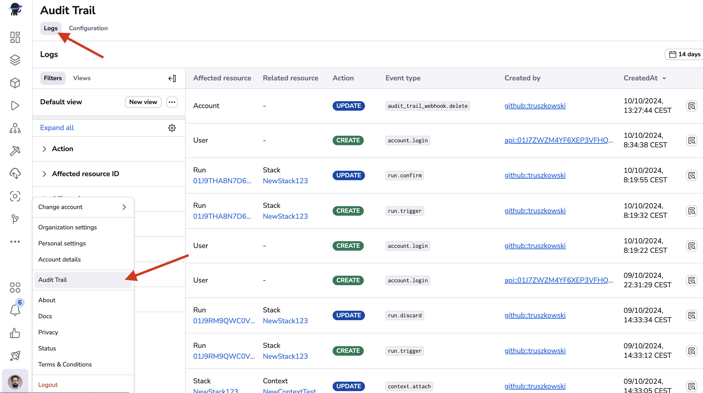

# Changelog

## Changes between v4.0.0 and v3.8.0

!!! info "Safe upgrade from any v3.x.x version"
    This release contains no breaking changes. You can safely upgrade from any v3.x.x version without requiring configuration changes or migration steps.

### 🌟 Feature of the Month: Auto-attach Cloud Integrations

Managing cloud integrations across multiple stacks and modules just got easier. AWS and Azure integrations can now be automatically attached using labels, eliminating the need to manually configure each stack.

**How it works:**

1. Create your cloud integration and add a label in the format `autoattach:<your_label>`
2. Enable the auto-attach toggle during setup
3. Add the same label to any stack or module
4. The integration automatically attaches - no manual configuration needed

Any stack or module with a matching label will automatically have the integration attached, and newly labeled resources will pick it up instantly. This follows the same pattern as other auto-attachable resources in Spacelift, making integration management consistent across your infrastructure.

**Learn more:**

- [AWS auto-attach integrations](../integrations/cloud-providers/aws.md#auto-attach-integrations)
- [Azure auto-attach integrations](../integrations/cloud-providers/azure.md#auto-attach-integrations)

### Features

- **Refreshed sidebar design**: The navigation sidebar now features a modern glassmorphism design with a lighter, semi-transparent appearance for improved visual aesthetics.

- **Command palette**: Navigate Spacelift faster with the new command palette. Access it with ⌘K (Mac) or Ctrl+K (Windows/Linux), or click "Search Spacelift" in the sidebar. Quickly create resources (stacks, modules, contexts) and jump to any section of the platform without clicking through menus.

- **Account default runner images**: Added support for account default runner images. See the [runtime security](../integrations/docker.md#account-default-runner-images) for more information.

    !!! note
        This feature was mistakenly listed in the v3.8.0 changelog but is actually included in this release.

- **Advanced Access Control**: Added granular permissions for Terraform Module Registry management. You can now control how module can be
    shared with other spaces. This allow to share a module with a space without granting full write to the target space.
    - `SPACE_SHARE_MODULE` - Allow modules to be shared with an assigned space from other spaces

    You may also probably want to set the `SPACE_READ` permission in order for your users to be able to see the availaible spaces in the UI.

    See the [module sharing documentation](../vendors/terraform/module-registry.md#sharing-modules) for more details.

- **Policy evaluation timeouts**: You can now set custom evaluation timeouts for different policy types to better control their execution duration. See the [policy timeouts documentation](../concepts/policy/README.md#evaluation-timeouts) for details.

- **Enhanced APM error reporting**: [Observability products](./reference-architecture/reference/telemetry.md) (Datadog, OpenTelemetry, etc.) were previously sometimes receiving the same generic "internal error" messages shown to end users. They now receive unwrapped errors with full stack traces and detailed technical context, making production issues significantly easier to debug while maintaining end-user security.

- **Terraform module updates**: The [AWS ECS](https://github.com/spacelift-io/terraform-aws-ecs-spacelift-selfhosted){: rel="nofollow"} and [EKS](https://github.com/spacelift-io/terraform-aws-eks-spacelift-selfhosted){: rel="nofollow"} Terraform modules have been updated to v2.0.0 and v3.0.0 respectively, with important improvements and breaking changes:

    **ECS module (v2.0.0)**:

    - Database credentials consolidated into `sensitive_env_vars` for better secret management
    - License token now uses write-only parameters to keep secrets out of state (requires OpenTofu/Terraform 1.11+)
    - Native support for distributed tracing through [Datadog APM and OpenTelemetry](./reference-architecture/reference/telemetry.md) sidecars

    **EKS module (v3.0.0)**:

    - EKS cluster version and RDS engine version are now required parameters, giving you explicit control over infrastructure versions
    - EKS module dependency upgraded from v20 to v21

    See the full release notes for migration details: [ECS v2.0.0](https://github.com/spacelift-io/terraform-aws-ecs-spacelift-selfhosted/releases/tag/v2.0.0){: rel="nofollow"} and [EKS v3.0.0](https://github.com/spacelift-io/terraform-aws-eks-spacelift-selfhosted/releases/tag/v3.0.0){: rel="nofollow"}.

- **Configurable PostgreSQL version (CloudFormation)**: You can now configure the PostgreSQL engine version for CloudFormation installations using the `postgres_engine_version` parameter in your `config.json` file.

    **📖 See the [PostgreSQL version upgrade guide](./cloudformation/postgresql-version-upgrade.md)** for complete instructions including downtime expectations, upgrade process, and cleanup procedures.

    !!! info "Terraform installations"
        If you're using Terraform-based installations, follow the [HashiCorp RDS upgrade tutorial](https://developer.hashicorp.com/terraform/tutorials/aws/rds-upgrade#upgrade-rds-instance){: rel="nofollow"} to upgrade your PostgreSQL version.

    !!! warning "Reminder: CloudFormation support phase-out"
        CloudFormation installations will eventually be phased out in favor of the more flexible Terraform/OpenTofu-based Reference Architecture. We will provide advance notice before discontinuing support. We recommend planning your migration to the Reference Architecture to ensure continued access to new features. See the [migration guide](./cloudformation/cloudformation-to-opentofu-terraform-migration.md) for a zero-downtime transition process.

### Fixes

- **Telemetry**: Improved trace quality by adding proper parent contexts to background operations, reducing orphaned spans in distributed tracing systems.
- **Telemetry**: Updated telemetry metadata to follow OpenTelemetry semantic conventions, improving compatibility with observability platforms and making traces easier to analyze.
- **Telemetry**: Errors are now unwrapped before being sent to observability platforms, providing more detailed context for debugging while maintaining generic error messages for end users.

### Documentation

- **Telemetry configuration guides**: Added comprehensive guides for configuring telemetry collection in Kubernetes installations. These guides provide step-by-step instructions for setting up observability with [Datadog](./reference-architecture/guides/telemetry/k8s-datadog.md), [OpenTelemetry with Grafana Stack](./reference-architecture/guides/telemetry/k8s-otel-grafana-stack.md), and [OpenTelemetry with Jaeger](./reference-architecture/guides/telemetry/k8s-otel-jaeger.md). Each guide includes installation steps, configuration examples, troubleshooting tips, and cleanup procedures.

## Changes between v3.8.0 and v3.7.0

### Features

- **Plugins**: Introduced a new plugin system that allows you to extend Spacelift's functionality with custom integrations and automations. Plugins are written using the [spaceforge](https://github.com/spacelift-io/plugins){: rel="nofollow"} Python SDK and can integrate with third-party services, automate workflows, and enhance your infrastructure management capabilities.

    Key features include:

    - **Marketplace**: Browse and install plugins from the Templates section in the Spacelift UI
    - **Auto-attachment**: Automatically attach plugins to stacks using labels
    - **First-class citizens**: Plugins are managed directly in Spacelift, not through stacks
    - **Configurable parameters**: Define and configure plugin-specific settings during installation
    - **Multiple execution phases**: Run plugins at different stages of your infrastructure lifecycle(before_init, after_plan, after_apply, etc.)

    See the [plugins documentation](../integrations/plugins.md) for installation guides, usage instructions, and plugin development guidelines.

- **Authorization & RBAC**: Stacks can now assume roles for elevated permissions through stack role attachments, replacing the legacy administrative flag. This new approach provides three key advantages:
    - **Cross-space access**: Attach roles for sibling spaces, not just the stack's own space and subspaces
    - **Fine-grained permissions**: Use [custom roles with specific actions](../concepts/authorization/rbac-system.md#custom-roles) instead of full Space Admin permissions
    - **Enhanced audit trail**: Role information (`actor_roles`) is included in [webhook payloads](../integrations/audit-trail.md#usage) for better visibility

The administrative flag is deprecated for stacks and [will be automatically disabled](../concepts/authorization/assigning-roles-stacks.md#migration-from-administrative-flag) on **June 1st, 2026**. On that date, Spacelift will backfill affected stacks with Space Admin roles (100% backward compatible), but manual migration is recommended to access advanced features and to avoid drifts in the OpenTofu/Terraform state.

!!! note
[Modules](../vendors/terraform/module-registry.md) are not affected by this change. The administrative flag for modules remains unchanged.

See the [stack role bindings documentation](../concepts/authorization/assigning-roles-stacks.md) for migration guides and detailed examples.

- **Authorization & RBAC**: Non-root Space Admins can now view all roles, users, API keys, and IdP group mappings (read-only) and manage role bindings within their administered spaces. Previously, these capabilities were limited to Root Space Admins only. See the [RBAC system documentation](../concepts/authorization/rbac-system.md#space-admin) for details.
- **Login Policy**: Enriched the roles input in login policy data with `slug` and `ulid` fields for better role identification and assignment. See the [login policy documentation](../concepts/policy/login-policy.md#roles) for details.

### Fixes

- **Modules**: Fixed an issue where legacy space modules were incorrectly displayed as having no read access when users had valid read permissions. That could have happened if still using legacy space and access policies.
- **Performance**: Postgres queue performance is now improved by adding indexes to the `message_queue_messages` and `message_queue_deduplications` tables.

## Changes between v3.7.0 and v3.6.0

### Features

- **Kubernetes Worker Pools**: The Kubernetes worker pool controller now supports auto-registration with version `v0.0.27`.

  Worker pools can be created and managed entirely through Kubernetes resources without manual setup in the Spacelift UI.
  The controller automatically registers pools with Spacelift, generates credentials, and handles the complete lifecycle.

  This enables pure GitOps workflows where worker pools are provisioned declaratively alongside other infrastructure.

  Additionally, OIDC-based API keys can be used to eliminate static credentials from the cluster entirely.

  See the [auto-registration documentation](../concepts/worker-pools/kubernetes-workers.md#auto-registration) for more details.

## Changes between v3.6.0 and v3.5.0

### Features

- **VCS Integrations**: The \"Use Git checkout\" field is now visible by default in all VCS integration details pages. This field indicates whether the integration uses git checkout to download source code (required for sparse checkout functionality).
- **Dashboard**: The Dashboard is now accessible to all users, not just admins. Non-admin users can view most dashboard widgets, with the Launch Pad and User Activity widgets remaining admin-only.
- **Filters**: Enhanced filtering interface with improved selection states, dropdown functionality, and visual styling for better user experience
- **Personal Settings**: You can now find new "Spaces" view under your personal settings. This view lets you see the permissions you have for each space, making it easier to understand your access across Spacelift.
- Added **SSO SAML** attribute mapping support. See the [custom attribute mapping documentation](../integrations/single-sign-on/README.md#custom-attribute-mapping) for more information.
- Errors and panics are now logged to stdout in a structured JSON format, providing better observability.

## Changes between v3.5.0 and v3.4.0

### Features

- Run details now display both the API key ID and name when triggered by an API key. Previously only the key ID was shown, which made it difficult to identify which key was used. The key ID is shown in shortened format. For example: `api::01K56PK::DevopsSpaceKey`.
- Added Samples section in policy view, which offers powerful filtering options to help quickly locate relevant samples
- [Role Based Access Control](../concepts/spaces/access-control.md) is now available for self-hosted distributions
- CloudFormation Drift Detection: Added native drift detection for CloudFormation stacks using AWS's DetectStackDrift API. Shows field-level differences for modified resources and flags deleted resources across root and nested stacks. [Note: Auto-reconciliation is not supported for CloudFormation as AWS does not provide reconciliation capabilities through their API.](../vendors/cloudformation/README.md#drift-detection-limitations)

## Changes between v3.4.0 and v3.3.0

### Features

- [Support for VCS agent pools for self-hosted distributions](../concepts/vcs-agent-pools.md): [installation instruction](../installing-spacelift/reference-architecture/guides/deploying-to-ecs.md#vcs-gateway-service)
- [OIDC configuration options are now configurable](../integrations/cloud-providers/oidc/README.md#overriding-issuer-and-jwks-endpoints-self-hosted) (`issuer` and `jwks_uri`)
- [Exposed a new configuration value](../installing-spacelift/reference-architecture/guides/observability.md#message-queues) for the message queue:
    - `MESSAGE_PROCESSING_TIMEOUT_SECONDS` environment variable controls how long messages can be processed before timing out (default: 900 seconds). Reducing this value (e.g., to 300 seconds) causes long-running messages to return to the queue faster, allowing other messages to be processed.

## Changes between v3.3.0 and v3.2.0

### Features

- Allow machine users to discard runs

- Allow filtering by stack name in resources view

- Added a filter to view enabled/disabled stacks in the stack list view.

- Upgraded to AWS STS v2 and we now use [regional endpoints](https://docs.aws.amazon.com/sdkref/latest/guide/feature-sts-regionalized-endpoints.html) for role assumption. Default region is us-east-1, configurable via integration settings.

### Fixes

- Fixed an issue where a user who locked a stack needed admin access to unlock it.

## Changes between v3.2.0 and v3.1.0

### Features

- Add ability to reset policy flags. It add a comprehensive policy flag reset mechanism with a multi-owner security model. Policies can now reset flags they have set, providing fine-grained control over flag management while preventing malicious policies from hijacking flags set by other policies.

- Add audit trail for user management login failures.

- Add Ready as a valid stack state for filtering.

### Fixes

- Load runtime configs only for the triggered stacks.

## Changes between v3.1.0 and v3.0.0

### Features

- To be able to transfer sensitive outputs between stacks, a new [stack-level setting](../concepts/stack/stack-dependencies.md#enabling-sensitive-outputs-for-references) needs to be explicitly enabled

### Fixes

- Fixed an issue where in certain cases (5000+ tasks) Ansible tracked runs could fail at the planning phase.

### Infrastructure

- Configurable database [backup retention period](https://docs.aws.amazon.com/AmazonRDS/latest/UserGuide/USER_WorkingWithAutomatedBackups.BackupRetention.html){: rel="nofollow"} via the `.database.backup_retention_period_days` variable in the JSON config file for Cloudformation-based installations.

```json
{
    [...]
    "database": {
        "backup_retention_period_days": 7
    }
}
```

## Changes between v2.6.1 and v3.0.0

We’re excited to announce Spacelift Self-Hosted v3! This version represents a significant milestone in Spacelift’s evolution, delivering enhanced flexibility and control to our users.

### Key Highlights:

- **Cloud-agnostic deployment**: Spacelift is no longer dependent on AWS services. We've introduced a new [Reference Architecture](./reference-architecture/README.md) concept that defines the basic requirements for a Self-Hosted installation. This enables Spacelift to run on AWS, Google Cloud Platform, Azure, or even on-premises infrastructure, as long as the [infrastructure requirements](./reference-architecture/environment-requirements.md) are met.
    - While you have the freedom to create your own infrastructure, we've developed four Terraform modules to simplify deployment to [AWS ECS](https://github.com/spacelift-io/terraform-aws-ecs-spacelift-selfhosted){: rel="nofollow"}, [AWS EKS](https://github.com/spacelift-io/terraform-aws-eks-spacelift-selfhosted){: rel="nofollow"}, [GCP GKE](https://github.com/spacelift-io/terraform-google-spacelift-selfhosted){: rel="nofollow"}, and [Azure AKS](https://github.com/spacelift-io/terraform-azure-spacelift-selfhosted){: rel="nofollow"}. Comprehensive deployment guides for these modules are available in the [guides](./reference-architecture/guides/README.md) section.
- **Simplified infrastructure**: The infrastructure footprint is now smaller and more streamlined. External dependencies like IoT [brokers](./reference-architecture/reference/mqtt-broker.md) and [queueing systems](./reference-architecture/reference/message-queues.md) are no longer required, as they're now built directly into the Spacelift application.
- **Enhanced first-time setup**: The new installation model features a streamlined onboarding experience. When you first access Spacelift, [you'll be greeted by a setup wizard](./reference-architecture/guides/first-setup.md) that guides you through configuring your account name. You can log into this page with the [temporary admin user](./reference-architecture/reference/general-configuration.md#admin-login) that also serves as break-glass access in case of SSO integration issues.
- **Greater infrastructure flexibility**: Without predefined CloudFormation templates, you have complete freedom to customize the infrastructure according to your specific requirements.
- **Customizable deployment process**: You can either customize the deployment process to fit your needs or leverage Spacelift's predefined Terraform modules and Helm charts for standardized deployments.
- **Enhanced observability**: [Improved monitoring capabilities](./reference-architecture/reference/telemetry.md) with added support for Datadog and OpenTelemetry.

### Licensing system

Self-Hosted v3 introduces [a new licensing method](./reference-architecture/reference/general-configuration.md#licensing). As we no longer rely on AWS License Manager, we've transitioned to a new JWT-based license token system. A Spacelift representative will provide you with a license token to activate your v3 instance. The license token has a defined validity period and requires renewal upon expiration.

#### Usage reporting

We support two ways of usage reporting: automatic and manual. You can enable automatic reporting by setting the `SPACELIFT_PUBLIC_API` variable to `https://app.spacelift.io`. In case your network policies prevent Spacelift from reaching our public API, you can still use the manual reporting method. More information about usage reporting is available in the [general configuration reference](./reference-architecture/reference/usage-reporting.md).

### Migration from CloudFormation to OpenTofu/Terraform

We've developed a comprehensive [migration toolkit](https://github.com/spacelift-io/self-hosted-v2-to-v3-kit){: rel="nofollow"} to facilitate the transition from the CloudFormation-based deployment to the OpenTofu/Terraform-based process. A detailed overview of the migration process is available in the [migration guide](./cloudformation/cloudformation-to-opentofu-terraform-migration.md).

**Prerequisites**: The migration toolkit requires a working installation of `v2.6.0` or later. You can also upgrade to `v3.0.0` with CloudFormation and later switch to the new Terraform modules.

### Artifacts and installation package

Currently, the installation artifacts remain unchanged. The package continues to include CloudFormation templates and shell scripts, allowing you to deploy Spacelift Self-Hosted v3 using existing methods. However, we recommend migrating to the new Terraform modules, as they offer greater flexibility and customization options for your deployment process.

**Note**: We will continue to support the CloudFormation approach and will provide customers with notice well in advance before discontinuing support for this installation method.

## Changes between v2.6.0 and v2.6.1

This release fixes an issue that could cause certain upgrades of existing Self-Hosted installations to fail. The issue was caused by one of our data migrations attempting to access the `allow_non_root_admin_space_creation` column on the `accounts` table before it existed.

This failure could happen if the following scenario was true:

- An upgrade was being performed on a self-hosted instance running v2.3.0 of Self-Hosted or older.
- The version being upgraded to was v2.4.0 or higher.
- An audit trail webhook was enabled.

In this situation, the upgrade would fail with the following error messages:

> could not run DB migrations and tasks: could not run migrations: could not migrate the database: failed to update encryption slug for webhook 1: a database constraint for which we have no friendly error message has been violated, we've been notified, reach out to us or wait until we add an error message if you want to know more

And:

> unexpected database error: ERROR: column \"allow_non_root_admin_space_creation\" of relation \"accounts\" does not exist (SQLSTATE 42703): ERROR: column \"allow_non_root_admin_space_creation\" of relation \"accounts\" does not exist (SQLSTATE 42703)

In this scenario, running the v2.6.1 installer should resolve the problem.

## Changes between v2.5.0 and v2.6.0

### Features

- Ignored run warnings: ever wondered why didn't your stack trigger? We've added a new tab on the stack page - **Ignored runs** - that shows you all the ignored runs for the last 7 days. Take a look at the [documentation](../concepts/run/ignored-triggers.md) for more details.
- Aggregated VCS checks: if you have multiple stacks tracking the same repository, you can enable the **Aggregate VCS checks** feature in the VCS integration's settings (**Source code** menu) which will allow you to group all the checks from the same commit into a predefined set of checks, making it easier to see the overall status of the commit. Documentation: [Azure DevOps](../integrations/source-control/azure-devops.md#aggregated-checks), [GitHub](../integrations/source-control/github.md#aggregated-checks), [GitLab](../integrations/source-control/gitlab.md#aggregated-checks), [Bitbucket Datacenter](../integrations/source-control/bitbucket-datacenter-server.md#aggregated-checks), [Bitbucket Cloud](../integrations/source-control/bitbucket-cloud.md#aggregated-checks).
- [Added native ServiceNow integration](../integrations/external-integrations/servicenow.md), allowing teams to provision and manage infrastructure directly from ServiceNow using Spacelift Blueprints. This integration enables automated stack creation via ServiceNow catalog items, while maintaining governance through Business Rules and REST Messages. **The feature is still in beta**.
- Space management improvements: [added a new account-level toggle](../concepts/spaces/allowing-non-root-admins-to-manage-spaces.md) that allows non-root admins to manage child spaces within their scope. When enabled, non-root admins can create and manage subspaces (with inheritance enforced), while root admins retain control over inheritance settings and overall topology.

### Infrastructure

- Scheduler service: cron jobs are now triggered via a [new ECS service called scheduler](./cloudformation/install.md#scheduler). This has no impact on the app functionality, but those who use custom VPCs will need to provide a new config value under `vpc_config` called `scheduler_security_group_id`. **Important**: the database security group must be updated as well since the scheduler service needs to access the database. So for custom VPC installations, the required updates are the following:
    - creating a new security group for the scheduler service
        - with no ingress
        - unrestricted egress
    - updating the database security group ingress to allow connections from the scheduler security group
    - please see the [advanced installations](./cloudformation/advanced-installations.md) page for code examples
- Disable XRay: if you wish to disable telemetry in the backend, you can do so by setting the `tracing_enabled` configuration value to `false` in the install script's config file.

```json
{
    [...]
    "account_name": "<account-name>",
    "aws_region": "<region>",
    "tracing_enabled": false
    [...]
}
```

- Enabled [AZ rebalancing](https://docs.aws.amazon.com/AmazonECS/latest/developerguide/service-rebalancing.html){: rel="nofollow"} in the ECS services: availability zone (AZ) rebalancing in Amazon ECS helps maintain high availability by automatically redistributing tasks across multiple AZs when an imbalance is detected, launching tasks in underutilized zones and stopping them in overloaded ones, all while minimizing manual intervention.
- Cloudwatch log driver mode is now in set to `non-blocking` [with 25MB buffer size](https://aws.amazon.com/blogs/containers/preventing-log-loss-with-non-blocking-mode-in-the-awslogs-container-log-driver/){: rel="nofollow"}: in the default blocking mode, if CloudWatch Logs is unreachable, container logging can block stdout/stderr and potentially halt the app. To improve resilience, we're opting for non-blocking mode, where logs are buffered in memory (up to max-buffer-size) instead of blocking app execution. If the buffer fills up, logs are dropped, but the app stays available.

## Changes between v2.4.0 and v2.5.0

### Features

- [Built-in Audit Trails](../integrations/audit-trail.md) - this aims to provide a faster, easier way to identify and fix issues without needing to reach out for support.



### Internal

- We've increased the default Postgres version from 13.7 to 13.16 because AWS has deprecated 13.7. This is a minor update that takes around 5 minutes and doesn't cause any outages.

## Changes between v2.3.0 and v2.4.0

### Features

- [MFA](../product/security/mfa.md) - you can now enforce MFA for all users in your organization
- Stack list redesign - we've revamped the stack list view to make it easier to navigate and manage your stacks
- Policy templates: quickly create and customize policies using predefined templates


### Fixes

- Fixed an issue where certain API calls failed for newer Bitbucket Datacenter versions (8.19+)
- Added an option to configure the `limit` query parameter of the [compare commits](https://developer.atlassian.com/server/bitbucket/rest/v905/api-group-repository/#api-api-latest-projects-projectkey-repos-repositoryslug-compare-changes-get){: rel="nofollow"} Bitbucket Datacenter API call. It is set by the `BITBUCKET_AFFECTED_CHANGES_PER_PAGE_FILES` environment variable.

### Internal

- The DB migrations will run during the application startup, instead of the installation script initiating it

## Changes between v2.2.0 and v2.3.0

### Features

- Ansible reloaded! We've shipped the following improvements for our [Ansible](../vendors/ansible/README.md) integration:
    - We've added the ability to specify a custom runtime config in YAML format. Click the dropdown button next to the `Trigger` button and choose `Trigger with custom runtime config`.
    - The final runtime configuration (including all custom configurations) can be retrieved for all runs. Use the 3 dots in the top right corner of the run details view and choose `Runtime config details`.
    - In the run changes views, ansible tasks are listed as separate resources.
    - We've added a new `Configuration Management` tab to the stack view. This view allows you to display the last status of each item in your Ansible inventory (i.e. the outcome of the last run).
    - We've added logs of task executions to the task details tab.
- Dashboard - Spacelift's new default view is the dashboard, which provides a high-level overview of your stacks, runs, drift detection schedules, as well as some basic metrics (stack failures, run duration etc.).

## Changes between v2.1.1 and v2.2.0

### Features

- Our bulk actions feature has been reworked, making it simpler to perform actions on multiple items at once.
- We've added support for [OIDC Based API Keys](../integrations/api.md#oidc-based-api-keys) to provide a more secure way of accessing our API without requiring static credentials.
- We've added the ability to add custom headers to your [audit trail webhooks](../integrations/audit-trail.md), making it easier than ever to integrate with external systems.
- We've added [an option](./cloudformation/install.md#load-balancer) to `config.json` to set `load_balancer.subnet_placement` to either public (default) or private. If the option is omitted, the default remains public.

### Fixes

- We've added a new check that automatically fails the run if a Kubernetes worker pod exits without properly marking the run as finished or failed.

## Changes between v2.1.0 and v2.1.1

### Fixes

- Use `boostMatches` when trying to find a branch in Bitbucket Datacenter. This fixes an issue where we could fail to find the stack's tracked branch if there were too many other branches in the repo with a similar name (for example `development`, `development-123`, etc). The exact number of similar branches depends on your Bitbucket configuration, but defaults to 25.
- Fixed an issue with the Raw Git integration that caused a `server does not support exact SHA1 refspec` error to be returned when using a Git server that doesn't support cloning with an exact SHA1 refspec.

## Changes between v2.0.0 and v2.1.0

!!! warning
    You must upgrade to v2.0.0 **before** installing v2.1.0. If you attempt to upgrade an existing
    installation running a version older than v2.0.0, the installer will report an error and
    exit without making any changes.

    If you are currently on a version older than v2.0.0 and don't have access to the v2.0.0 installer
    anymore, please reach out to our support team for new download links.

### Features

- The stack and module settings have been revamped, making it simpler and more efficient to manage your stacks and modules. One of the standout additions is the new Scheduling and Policies tabs, which have moved from the stack settings to the main stack view. Your schedules and policies are now more easily discoverable, and can also be viewed by team members who don’t have access to stack settings.

### Fixes

- We've fixed an issue with our initial Disaster Recovery support that meant that IoT policies would not be added to your secondary region when resetting an existing worker pool that was created before DR was configured. The impact of this would have been that workers from the affected pools would not be able to connect to your IoT broker after failing over. No user intervention is required to resolve this - the v2.1.0 installation process will fix any affected worker pools.
- We've fixed an issue affecting Bitbucket Data Center that prevented branches being retrieved correctly if the repository contained more than 25 branches that contained your stack's branch name as part of their name (for example if a stack has a tracked branch called `dev`, and other branches exist in the repository like `development`, `dev-1`, `dev-2`, etc). This could prevent the stack settings for an affected stack from being saved.

## Changes between v1.3.0 and v2.0.0

!!! warning
    This release of Self-Hosted involves mandatory downtime during the installation process. We expect that downtime to be between 5 and 10 minutes, but it's important that you do not start the installation at a time you cannot afford Spacelift to be unavailable.

v2.0.0 introduces multi-region failover support to Self-Hosted to help as part of a [disaster recovery](./cloudformation/disaster-recovery.md) process. One of these changes involves converting the single-region KMS key used to encrypt sensitive data like stack and context secrets to a multi-region key. In order to do that, the installation includes a migration to convert the data from one key to another.

The migration is performed inside a transaction, and in the case of any errors the changes will be rolled back to avoid a situation where data is encrypted using both old and new keys.

Although we have safeguards in place to ensure the migration is successful, we recommend taking a snapshot of your RDS cluster before performing the installation in case anything goes wrong.

### Features

- Added the ability to provide a [custom database connection string](./cloudformation/install.md#self-managed-database) during install/upgrade. This allows you to take full control over the database used by Spacelift.
- Added [multi-region disaster recovery](./cloudformation/disaster-recovery.md) support.
- Added support for OpenTofu 1.8.0.
- Various other small features and improvements.

### Fixes

- Fixed a misconfiguration that was causing the server logs to be filled with messages containing `failed to record HTTP transaction`.

## Changes between v1.2.1 and v1.3.0

### Features

- Added ability to view spaces as a list view, you can now switch between Diagram and List view using the toggle in the page header
- Added Account details drawer (under user menu) with self hosted version, license information and identity provider data.
- Updated documentation links to use the currently used self hosted version immediately
- Added list view customization
- Added stack settings scheduling and policies tabs
- Added module list and form redesign

### Fixes

- Fix: Raw Git does not work with terraform modules

## Changes between v1.2.0 and v1.2.1

### Fixes

- Fix for an issue where a commit to Bitbucket Datacenter could trigger more stacks than necessary
- Fix for an issue where crashed workers left runs in a hanging state
- If custom certificates are defined, Spacelift's internal HTTP client will use those for AWS-related requests as well

## Changes between v1.1.0-hotfix.1 and v1.2.0

### Features

- [Added OpenTofu support for Terragrunt](../vendors/terragrunt/terragrunt-tool.md)
    - **Important note**: in order to use this new feature, you need to recycle your worker pools. This is because new launcher versions are downloaded during the instance startup, and the old launchers do not support this new feature. Note: we recommend recycling the worker pools after each release anyway. The [native Kubernetes workers](../concepts/worker-pools/kubernetes-workers.md) are an exception to this rule since each run starts a new container running the latest launcher image for your Self-Hosted instance.
- [Added `Trigger always` flag to Stack Dependencies](../concepts/stack/stack-dependencies.md)
- Disabled the rate limiting for [policy sampling](../concepts/policy/README.md#sample-policy-inputs)
- Added LaunchPad, a dashboard for new Spacelift users that provides a guided tour of the platform
- Added support for [OPA v0.64](https://github.com/open-policy-agent/opa/releases/tag/v0.64.0)
- Support for moved and [imported](https://developer.hashicorp.com/terraform/language/import) Terraform resources
- Installation script:
    - [We added support for defining custom retention periods for all of the S3 buckets.](./cloudformation/install.md#s3-config) If you don't specify it, they remain untouched.

### Fixes

- Fixed a bug where some of the runs weren't scheduled because we attempted to checkout the same license from License Manager at the same time in parallel. Now license checkouts are serialized to avoid this issue.

## Changes between v1.1.0 and v1.1.0-hotfix.1

### Fixes

- Fixed an issue where license check-out could fail when multiple runs were scheduled at the same time

## Changes between v1.0.0 and v1.1.0

### Features

- [Beta Terragrunt support](../vendors/terragrunt/README.md)
- [Enhanced VCS integrations](https://feedback.spacelift.io/changelog/enhanced-vcs-integrations)
- [OpenTofu v1.6.2 support](../concepts/stack/creating-a-stack.md#3-choose-vendor)
- [New run history view](https://feedback.spacelift.io/changelog/introducing-the-new-run-history-view)
- [Redesigned stack creation view](https://feedback.spacelift.io/changelog/stack-creation-v2)

### Fixes

- Various backend and frontend fixes and improvements

## Changes between v0.0.12 and v1.0.0

### Features

- [User Management](../concepts/user-management/README.md)
- [Terraform Provider Registry](../vendors/terraform/provider-registry.md)
- The settings page is now split into Organization and Personal settings
- [OpenTofu v1.6.1 support](../concepts/stack/creating-a-stack.md#3-choose-vendor)
- [PR stack locking](../concepts/policy/push-policy/README.md#stack-locking)
- [Support for deploying workers via the Kubernetes operator](../concepts/worker-pools/kubernetes-workers.md)

### Fixes

- Improved license check-out logic
- Fix stale logs display for [targeted replans](../concepts/run/tracked.md#targeted-replan)
- Allow to persist roles and collections installed during run initialization for [Ansible stacks](../vendors/ansible/README.md) automatically
- Various other backend and frontend fixes and improvements

## Changes between v0.0.11 and v0.0.12

### Features

- [OpenTofu v1.6.0 support](../concepts/stack/creating-a-stack.md#3-choose-vendor)
- [PRs as notification targets](../concepts/policy/notification-policy.md#pull-request-notifications)
- [Run prioritization through Push Policy](../concepts/policy/push-policy/README.md#prioritization) (`prioritize` keyword)
- Add state size (in bytes) to `ManagedStateVersion` type in GraphQL

### Fixes

- Various backend and frontend fixes and improvements

## Changes between v0.0.10 and v0.0.11

### Features

- [New stack creation view](../concepts/stack/creating-a-stack.md)
- [Auto Attaching Contexts](../concepts/configuration/context.md#auto-attachments)
- [Context Hooks](../concepts/configuration/context.md#editing-hooks)
- Additional [project globs](../concepts/stack/stack-settings.md#project-globs)
- [Pull request default behaviour change](https://feedback.spacelift.io/changelog/upcoming-pull-request-default-behaviour-change)
    - Spacelift will start handling pull request events and creating proposed runs if no push policy is set as the default behaviour

### Fixes

- Various backend and frontend fixes and improvements

## Changes between v0.0.9 and v0.0.10

### Features

- Stack Dependencies with [output/input references](../concepts/stack/stack-dependencies.md#defining-references-between-stacks).
- [Ready run state](../concepts/run/README.md#ready).
- [Targeted replan support](../concepts/run/tracked.md#targeted-replan).
- New detailed terraform changes view.
- [Worker Pool Management views](../concepts/worker-pools#worker-pool-management-views).
- [Add OpenTofu and custom workflows support for terraform](../vendors/terraform/workflow-tool.md).

### Fixes

- Do not re-create SAML certificate during each install

## Changes between v0.0.8 and v0.0.9

### Features

- Increase worker default disk size to 40GB.
- Adding support for Terraform versions up to v1.5.7.
- Update frontend and backend to the latest versions.

### Fixes

- Enforce bucket policy to prevent objects getting fetched not using HTTPS.
- Updated no account ID message to indicate that it is caused by missing AWS credentials in the install script.

## Changes between v0.0.7 and v0.0.8

### Features

- Update CloudFormation worker pool template to allow [a custom instance role to be provided](../concepts/worker-pools/docker-based-workers.md#using-a-custom-iam-role).
- Update CloudFormation worker pool template to allow poweroff on crash to be disabled to aid debugging.
- Update CloudFormation worker pool template to [allow custom user data to be provided](../concepts/worker-pools/docker-based-workers.md#injecting-custom-commands-during-instance-startup).
- Update frontend and backend to the latest versions.
- Adding support for Terraform versions up to v1.5.4 and kubectl up to v1.27.4.
- Added support for [External Dependencies](../concepts/policy/push-policy/run-external-dependencies.md).
- Added support for [Raw Git](../integrations/source-control/raw-git.md) source code provider.

### Removals

- Remove the unused `ecs-state-handler` Lambda.

### Fixes

- Improve warning message during installation when changeset contains no changes.
- Fix role assumption and automatic ECR login in GovCloud regions.
- Don't incorrectly attempt to report errors to Bugsnag in Self-Hosting (errors were never reported, but this could cause some misleading log entries).
- Fix crash on run startup if the runner image was missing the `ps` command.
- Increase default worker pool size to `t3.medium`.
- Increase minimum drain instances to 3 to provide more resilience.
