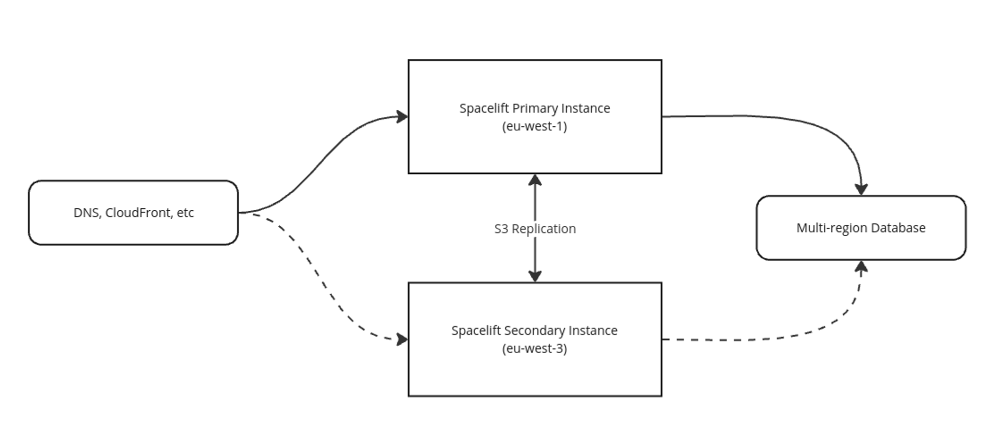
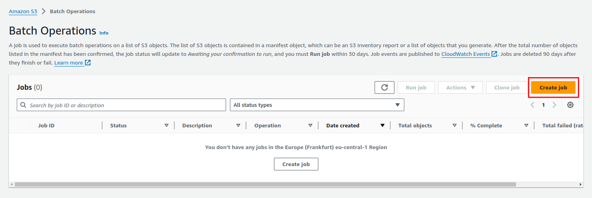
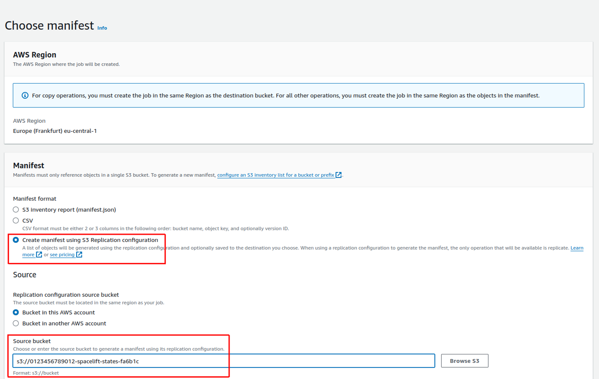
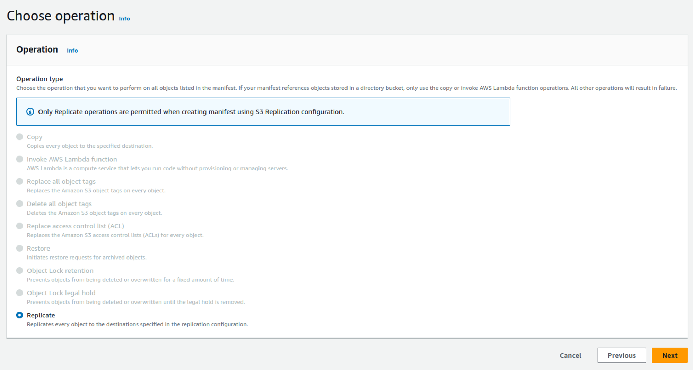
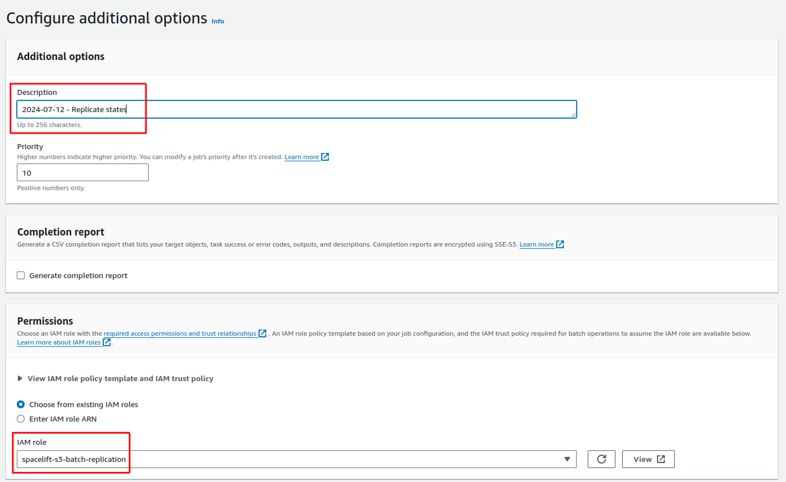
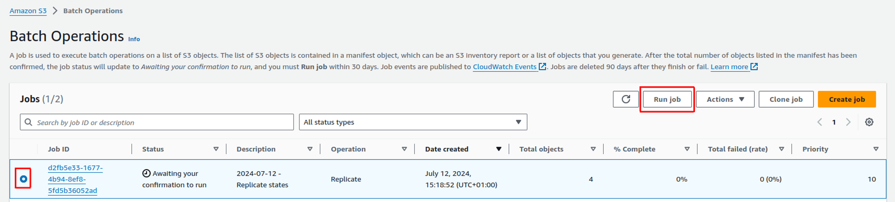
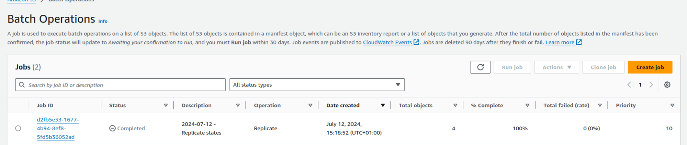

# Disaster Recovery

Spacelift Self-Hosted installations support multi-region disaster recovery (DR). This allows you to cope with an outage of an entire AWS region by failing over to a secondary region.

At a high level, the architecture of a multi-region DR installation of Spacelift looks like the following:



The main points to be aware of are:

- Two instances of Self-Hosted are deployed to two different AWS regions.
- S3 replication between the primary and secondary regions is used to automatically replicate things like state files, run logs and module definitions. The replication is bidirectional.
- Both regions connect to the same database instance (although only one instance needs write access at any one point in time).
- In the case of a failover, you can either update DNS records to switch from pointing at the primary to the secondary region, or you can use something like CloudFront to switch over without relying on DNS.

The rest of this page explains how to [install a DR instance of Self-Hosted](#installation), how to [convert an existing installation](#migrating-from-an-existing-installation-to-one-with-dr) to be capable of failover, and an [example runbook](#failover-runbook) explaining the failover and failback processes.

## Installation

### Prerequisites

To install a DR-capable version of Self-Hosted, you must meet the following requirements:

- A Postgres 13.7 or higher database capable of being used in multiple regions, and the Self-Hosted instance configured to use a [custom DB connection string](./install.md#self-managed-database).
    - NOTE: the database does not need to be active-active. It just needs to be capable of being used by the failover instance in the case of a regional failover (for example, [Aurora Global](https://aws.amazon.com/rds/aurora/global-database/)).
- Both instances of Self-Hosted need to be able to access your Postgres database. Because of this you will probably want to follow the [Advanced Installation](https://docs.spacelift.io/self-hosted/latest/product/administration/advanced-installations) guide when setting up your Self-Hosted instance to allow you to configure and have full control over the VPCs that your Self-Hosted instances use.
- A [custom IoT broker domain configuration](https://docs.aws.amazon.com/iot/latest/developerguide/iot-custom-endpoints-configurable-custom.html) along with the relevant DNS records configured to allow you to failover to your secondary region.

### Steps

To setup a DR instance of Spacelift to failover to in the case of an AWS outage in your primary region you can use the following steps:

1. Deploy your primary region.
2. Deploy your secondary (DR) region.
3. Configure S3 replication in your primary region.

The following sections explain each step in detail, describing how to setup a Self-Hosted installation with a primary region in `eu-west-1` and a secondary (DR) region in `eu-west-3`.

!!! warning
    Please note that the instructions deliberately leave out details like how to setup your DNS records for Self-Hosted because this does not differ from a standard Self-Hosted installation.

#### Deploying primary region

Deploy a copy of Self-Hosted as you normally would into your primary region, making sure to configure the following settings:

- `database.connection_string_ssm_arn` and `database.connection_string_ssm_kms_arn` to use a [self-managed database](./install.md#self-managed-database) capable of being used from multiple regions.
- `iot_broker_endpoint` pointing at your custom IoT broker domain (for example `worker-iot.spacelift.myorg.com`).

Once the installation has completed, it will output some information about your instance:

```sql
Installation info:

  * Load balancer DNS: spacelift-server-1234567890.eu-west-1.elb.amazonaws.com
  * Launcher container image: 012345678901.dkr.ecr.eu-west-1.amazonaws.com/spacelift-launcher:v2.0.0
  * Downloads bucket: 012345678901-spacelift-downloads-601776
  * Encryption primary key ARN: arn:aws:kms:eu-west-1:012345678901:key/mrk-abc92048ad9283944ab23cc22342b43f

S3 bucket replication info:

  * KMS key ARN: arn:aws:kms:eu-west-1:012345678901:key/77218af9-085a-42d7-95b4-3a79be1fb08f
  * States: arn:aws:s3:::012345678901-spacelift-states-ca9bf8
  * Run logs: arn:aws:s3:::012345678901-spacelift-run-logs-ca9bf8
  * Modules: arn:aws:s3:::012345678901-spacelift-modules-ca9bf8
  * Policy inputs: arn:aws:s3:::012345678901-spacelift-policy-inputs-ca9bf8
  * Workspaces: arn:aws:s3:::012345678901-spacelift-workspaces-ca9bf8
```

The key pieces of information you need for the next step are the _Encryption primary key ARN_ and the information under the _S3 bucket replication info_ section. Take a note of these values.

#### Deploying secondary region

Deploying your secondary region is very similar to deploying your primary region. The main differences are that you will provide some DR-specific config information, and you will also provide different values for the following properties:

- `aws_region` - set to the name of your secondary region.
- `database.db_cluster_identifier` - this is optional, and only required if you want the Spacelift CloudWatch dashboard to be deployed.
- `database.connection_string_ssm_arn` - points at a secret in your secondary region containing the database connection string.
- `database.connection_string_ssm_kms_arn` - a key available in your secondary region used to encrypt the database connection string secret.
- `load_balancer.certificate_arn` - a certificate manager TLS cert available in the secondary region.
- `disable_services` - set to `true` in the DR region.

The `disaster_recovery` section should look something like this:

```json
"disaster_recovery": {
  "is_dr_instance": true,
  "replica_region": "eu-west-1",
  "encryption_primary_key_arn": "arn:aws:kms:eu-west-1:012345678901:key/mrk-abc92048ad9283944ab23cc22342b43f",
  "s3_bucket_replication": {
    "enabled": true,
    "replica_kms_key_arn": "arn:aws:kms:eu-west-1:012345678901:key/77218af9-085a-42d7-95b4-3a79be1fb08f",
    "states_bucket_arn": "arn:aws:s3:::012345678901-spacelift-states-ca9bf8",
    "run_logs_bucket_arn": "arn:aws:s3:::012345678901-spacelift-run-logs-ca9bf8",
    "modules_bucket_arn": "arn:aws:s3:::012345678901-spacelift-modules-ca9bf8",
    "policy_inputs_bucket_arn": "arn:aws:s3:::012345678901-spacelift-policy-inputs-ca9bf8",
    "workspaces_bucket_arn": "arn:aws:s3:::012345678901-spacelift-workspaces-ca9bf8"
  }
},
```

- `disaster_recovery.encryption_primary_key_arn` is the _Encryption primary key ARN_ output from installing Self-Hosted in your **primary** region.
- Make sure that `s3_bucket_replication.enabled` is set to `true`, set `replica_region` to the region that your primary instance is installed into, and populate the rest of the values using the _S3 bucket replication info_ installer output.

So for example, your config file may look similar to this:

```json
{
    "account_name": "test-org",
    "aws_region": "eu-west-3",
    "disable_services": true,
    "database": {
        "connection_string_ssm_arn": "arn:aws:secretsmanager:eu-west-3:012345678901:secret:spacelift/database-secondary-BAD0vA",
        "connection_string_ssm_kms_arn": "arn:aws:kms:eu-west-3:012345678901:key/1a5a0be1-b083-43dc-babf-384766b4446e"
    },
    "load_balancer": {
        "certificate_arn": "arn:aws:acm:eu-west-3:012345678901:certificate/e2f6cfce-4925-4e85-8dcd-dbb2871583cd",
        "ssl_policy": "ELBSecurityPolicy-TLS-1-2-2017-01",
        "scheme": "internet-facing"
    },
    "disaster_recovery": {
        "is_dr_instance": true,
        "replica_region": "eu-west-1",
        "encryption_primary_key_arn": "arn:aws:kms:eu-west-1:012345678901:key/mrk-abc92048ad9283944ab23cc22342b43f",
        "s3_bucket_replication": {
          "enabled": true,
          "replica_kms_key_arn": "arn:aws:kms:eu-west-1:012345678901:key/77218af9-085a-42d7-95b4-3a79be1fb08f",
          "states_bucket_arn": "arn:aws:s3:::012345678901-spacelift-states-ca9bf8",
          "run_logs_bucket_arn": "arn:aws:s3:::012345678901-spacelift-run-logs-ca9bf8",
          "modules_bucket_arn": "arn:aws:s3:::012345678901-spacelift-modules-ca9bf8",
          "policy_inputs_bucket_arn": "arn:aws:s3:::012345678901-spacelift-policy-inputs-ca9bf8",
          "workspaces_bucket_arn": "arn:aws:s3:::012345678901-spacelift-workspaces-ca9bf8"
        }
    },
    "hostname": "spacelift.myorg.com",
    "iot_broker_endpoint": "worker-iot.spacelift.myorg.com",
    ... other settings
}
```

Once you’re ready, run the installer just like you would for the primary region. Just point at the config file for your DR region instead:

```bash
./install.sh -c config.dr.json
```

Once the installer completes, it will output some information that you’ll need to configure S3 replication in your primary instance:

```bash
Installation info:

  * Load balancer DNS: spacelift-server-987654321.eu-west-3.elb.amazonaws.com
  * Launcher container image: 012345678901.dkr.ecr.eu-west-3.amazonaws.com/spacelift-launcher:v0.0.1-preview1479
  * Downloads bucket: 012345678901-spacelift-downloads-24a213

S3 bucket replication info:

  * KMS key ARN: arn:aws:kms:eu-west-3:012345678901:key/583756c0-8666-4676-beae-a0099f7dbd5b
  * States: arn:aws:s3:::012345678901-spacelift-states-24a213
  * Run logs: arn:aws:s3:::012345678901-spacelift-run-logs-24a213
  * Modules: arn:aws:s3:::012345678901-spacelift-modules-24a213
  * Policy inputs: arn:aws:s3:::012345678901-spacelift-policy-inputs-24a213
  * Workspaces: arn:aws:s3:::012345678901-spacelift-workspaces-24a213

[2024-07-12T08:00:12+0000] INFO: Spacelift version v2.0.0 has been successfully installed!
```

The information you need is all under the _S3 bucket replication info_ section.

#### Enabling S3 replication from primary to secondary

At this point, the last remaining thing to configure is S3 replication. This ensures that things like modules, run logs and state files are replicated from your primary to secondary region so that they are available in the case you need to failover.

To do this, edit the config file for your primary region and populate the `.disaster_recovery.s3_bucket_replication` section:

```json
{
    "account_name": "test-org",
    "aws_region": "eu-west-1",
    "disaster_recovery": {
        "is_dr_instance": false,
        "replica_region": "eu-west-3",
        "s3_bucket_replication": {
            "enabled": true,
            "replica_kms_key_arn": "arn:aws:kms:eu-west-3:012345678901:key/583756c0-8666-4676-beae-a0099f7dbd5b",
            "states_bucket_arn": "arn:aws:s3:::012345678901-spacelift-states-24a213",
            "run_logs_bucket_arn": "arn:aws:s3:::012345678901-spacelift-run-logs-24a213",
            "modules_bucket_arn": "arn:aws:s3:::012345678901-spacelift-modules-24a213",
            "policy_inputs_bucket_arn": "arn:aws:s3:::012345678901-spacelift-policy-inputs-24a213",
            "workspaces_bucket_arn": "arn:aws:s3:::012345678901-spacelift-workspaces-24a213"
        }
    },
    ... other settings
}
```

Once you’ve done this, you can run the installer again to complete your DR setup:

```json
./install.sh -c config.json
```

## Migrating from an existing installation to one with DR

This section explains how to take an existing Self-Hosted installation, and enable multi-region failover for disaster recovery purposes. For the most part this follows the same process as if you were configuring a [DR installation from scratch](#installation), but some additional steps will be required to make the database available in multiple regions, and also replicate existing S3 objects.

### Install the latest version of Self-Hosted

In case your Self-Hosted installtion predates `v2.0.0` (eg. v1.x.x), the first step is to install `v2.0.0`. As part of the installation process any encrypted secret data in your database will be migrated from a single-region to a multi-region KMS key to allow for failover. To do this, just follow the standard installation process for any Self-Hosted version, but with the following caveats:

1. We **strongly advise** that you take a snapshot of your RDS cluster before starting the installation. The KMS migration is designed so that if the conversion of any of your secrets fail the entire process will be rolled back, but we still recommend making sure you have an up to date snapshot before starting the process.
2. The upgrade to v2.0.0 **involves downtime**. This is to ensure that no secrets are accidentally encrypted with the existing single-region key while the migration is taking place. The downtime should be relatively brief (less than 5 minutes).

When you have finished upgrading to the latest version of Self-Hosted, note the _Encryption primary key ARN_ in the _Installation info_ output from the script as well as the information in the _S3 bucket replication info_ section. You will need this information when configuring your DR instance later in this guide.

### Migrating the database

Next, migrate your database to a setup capable of being used in multiple regions, and update your Self-Hosted installation to use a [custom connection string](./install.md#self-managed-database) to access the database.

!!! info
    We don't provide instructions on how to migrate your database because the exact process would depend on what you want to migrate to. As an example however, you could use an [Aurora Global database](https://aws.amazon.com/rds/aurora/global-database/) and convert your existing database cluster into a global cluster capable of failover.

### Configure your secondary instance and setup S3 replication

Use the following sections of the installation guide to setup your secondary region as well as S3 replication:

- [Deploying secondary region](#deploying-secondary-region).
- [Enabling S3 replication](#enabling-s3-replication-from-primary-to-secondary)

### Perform S3 batch replication

At this point, your disaster recovery setup is fully configured, but because S3 replication rules don’t replicate existing objects that were created before the rules were put in place, you need to run some one-time manual batch jobs to copy the existing objects.

The following S3 buckets have replication enabled, so you will need to run a batch copy job for each:

- `spacelift-states` - contains any Spacelift-managed state files.
- `spacelift-run-logs` - contains the logs shown for runs in the Spacelift UI.
- `spacelift-modules` - contains the code for any modules uploaded to your Terraform module registry.
- `policy-inputs` - contains any policy samples.
- `spacelift-workspaces` - used to store the temporary data used by in-progress Spacelift runs.

#### Creating a batch operations role

To perform the batch replication jobs you need to define an IAM role that has permissions on both your source and destination buckets. You can use a policy like the following (although you can also adjust the policy to restrict it to the specific buckets you need to replicate):

```json
{
    "Version": "2012-10-17",
    "Statement": [
        {
            "Effect": "Allow",
            "Action": [
                "s3:InitiateReplication",
                "s3:GetReplicationConfiguration",
                "s3:PutInventoryConfiguration"
            ],
            "Resource": [
                "arn:aws:s3:::*",
                "arn:aws:s3:::*/*"
            ]
        },
        {
            "Effect": "Allow",
            "Action": [
                "s3:*"
            ],
            "Resource": [
                "arn:aws:s3:::myorg-spacelift-replication-reports-bucket",
                "arn:aws:s3:::myorg-spacelift-replication-reports-bucket/*"
            ]
        }
    ]
}
```

!!! info
    Please note that the previous policy allows access to a bucket called `myorg-spacelift-replication-reports-bucket`. This is to allow batch operations to store a [completion report for the job](https://docs.aws.amazon.com/AmazonS3/latest/userguide/batch-ops-examples-reports.html?icmpid=docs_amazons3_console) in case you need to investigate any failures. If you want to make use of this functionality you will need to also create a bucket for the reports and replace `myorg-spacelift-replication-reports-bucket` in the policy above with the name of the bucket you want to use.

Create a role with your policy attached, and use the following policy for the role’s trust relationship to allow S3 batch operations to assume the role:

```json
{
    "Version": "2012-10-17",
    "Statement": [
        {
            "Effect": "Allow",
            "Principal": {
                "Service": "batchoperations.s3.amazonaws.com"
            },
            "Action": "sts:AssumeRole"
        }
    ]
}
```

#### Running batch replication for a bucket

You will need to perform these steps for each bucket with replication enabled.

First, go to _Amazon S3 → Batch Operations_ in your AWS console and click on _Create job_:



#### Choose manifest

On the choose manifest screen, select the _Create manifest using S3 Replication configuration_ option, and then choose the bucket you want to replicate:



Leave all the other options at their defaults, and click the Next button.

#### Choose operation

The only option available on this page is _Replicate_. Choose it and click Next:



#### Configure additional options

On this page, enter a description for your job, for example `2024-07-12 - Replicate states bucket`.

You may also want to enable a completion report. This can be particularly useful in case any objects fail to replicate. If you want to do this, please see the [AWS documentation](https://docs.aws.amazon.com/AmazonS3/latest/userguide/batch-ops-examples-reports.html?icmpid=docs_amazons3_console) for details on how to configure the correct IAM roles and a bucket for the report.

In the permissions section, choose the S3 replication role you created earlier.



Click Next to review your job configuration.

#### Review

If everything looks good, click Create job to create the job.

#### Run batch operation

Once the job is in the _Awaiting your confirmation to run_ status, select it in the list of jobs, and click on Run job:



On the next screen, review the job configuration, and click on the _Run job_ button at the bottom of the screen.

If all goes well, your job should end up in the _Completed_ state once all the objects have successfully been replicated:



## Failover runbook

The following two sections explain how to failover to and failback from your secondary region.

### Failing over

To failover to your secondary region, use the following steps:

1. Make sure your database is available for your secondary region to use in read-write mode. For example, failover to your secondary region so that the secondary DB connection is writable.
2. Run the following command to start the services in your secondary region: `./start-stop-services.sh -e true -c config.dr.json` (where config.dr.json contains the configuration for your secondary region).
    1. Note: it may take a few minutes for the services to start fully.
3. Update your server DNS to point at the load balancer for your secondary region.
4. Update your IoT broker custom domain DNS to point at the IoT broker endpoint in your secondary region.
5. Restart your workers to allow them to reconnect to the IoT broker in your secondary region. If using Kubernetes workers, restart the controller pod. One way to restart the workers is to click the [_Cycle_](../../concepts/worker-pools/README.md#cycle) button in the UI. Another way is to manually shut down the virtual machines in the cloud provider. Since they're in an auto-scaling group, new ones will be started automatically.
6. Run the following command to stop the services in your primary region: `./start-stop-services.sh -e false -c config.json` (where config.json contains the configuration for your secondary region).
    1. Note that while you could leave the services running in your primary region, they will begin to fail and go into a crash loop because they will no-longer be able to access the Spacelift database after it is failed over to the secondary region.

!!! warning
    After failing over to the secondary region, you will need to clear your cookies before being able to login to Spacelift.

### Failing back

1. Make sure your database is available for your primary region to use in read-write mode. For example, failover to your primary region so that the primary DB connection is writable.
2. Run the following command to start the services in your primary region: `./start-stop-services.sh -e true -c config.json` (where config.json contains the configuration for your primary region).
3. Update your DNS to point at the load balancer for your primary region.
4. Update your IoT broker custom domain DNS to point at the IoT broker endpoint in your primary region.
5. Restart your workers to allow them to reconnect to the IoT broker in your secondary region. If using Kubernetes workers, restart the controller pod.
6. Run the following command to stop the services in your secondary region: `./start-stop-services.sh -e false -c config.dr.json` (where config.dr.json contains the configuration for your secondary region).
    1. Note that while you could leave the services running in your secondary region, they will begin to fail and go into a crash loop because they will no-longer be able to access the Spacelift database after it is failed back to the primary region.

### Considerations after failing over

- If you need to run the install.sh script against your secondary instance after failing over, make sure to adjust the `disable_services` property in the config file to false . Otherwise running the installer will stop your Spacelift services.
- If you plan on permanently switching to the new region, you should also change the `is_dr_instance` property to `false` (and set it to `true` in your other region). This is important so that things like database migrations run successfully when new versions are installed.
