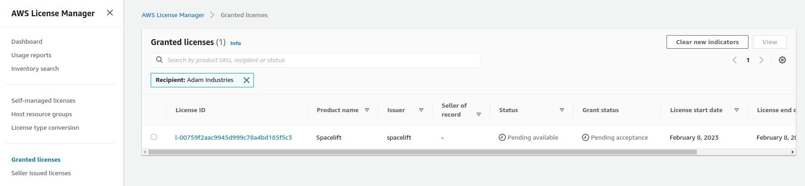
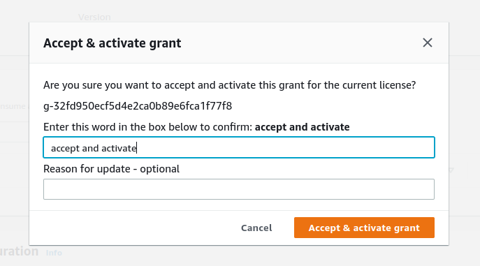

# Installation Guide

This guide contains instructions on installing a self-hosted copy of Spacelift in an AWS account you control.

## Pre-requisites

Before proceeding with the installation, you need to satisfy the following pre-requisites:

- You need access to an AWS account you wish to install Spacelift into.
- You need to choose a hostname that you wish to use for your Spacelift installation, for example `spacelift.example.com`. This needs to be on a domain that you control and can add DNS records to.
- You need to create an ACM certificate for your chosen domain in the same account that you want to install Spacelift in.

## Requirements

The installation process requires the following tools:

- A Mac or Linux machine to run the installation script from.
- A copy of the [AWS CLI v2](https://docs.aws.amazon.com/cli/latest/userguide/getting-started-install.html), configured to access the account you wish to install Spacelift into.
- [jq](https://stedolan.github.io/jq/) version 1.6.
- Standard unix utilities including bash, base64, cat, read, openssl.
- [Docker](https://www.docker.com/).

## Spacelift infrastructure

### Server and drain

The Spacelift infrastructure has two core parts: the server and the drain. The server is a web application that provides a GraphQL API that serves frontend and every HTTPS request in general. The drain is a worker that processes all asynchronous tasks such as VCS webhooks, run scheduling, worker handling, etc. The drain consumes messages from several SQS queues. The server serves requests through a load balancer.

As of today, both the server and the drain are ECS services running on Fargate. We have autoscaling set up for the server so ideally you don't need to worry about scaling it.


### Scheduler

Scheduler is a service that is responsible for scheduling cron jobs and other periodic tasks (e.g. drift detection triggering). It uses the database as a basis for scheduling and puts messages into an SQS queue for the drain to consume.

### Worker pool infrastructure

A worker pool is a group of workers that can be used to run workloads. During the startup the worker will attempt to connect to the regional AWS IoT Core broker endpoint and register itself. The drain and the server will then be able to communicate with the worker via AWS IoT Core, specifically via MQTT.


## Running Costs

We estimate the baseline running costs of a Spacelift Self-Hosted instance to be around $15 per day (roughly $450 per month). Note that this is with no activity in your account, so your costs may be higher after factoring in things like bandwidth.

These baseline costs include all of the resources deployed as part of your Spacelift install, for example Aurora RDS, Fargate cluster, and KMS keys.

## Installation

This section explains the installation process for Spacelift. You may also be interested in the following pages that explain how to configure the Slack integration as well as advanced installations and disaster recovery:

- [Slack integration setup](./slack-integration-setup.md) - explains how to configure the Slack integration for your Spacelift instance.
- [Advanced installations](./advanced-installations.md) - explains how to configure advanced options like providing a custom VPC configuration, or specifying HTTP proxy settings.
- [Disaster recovery](./disaster-recovery.md) - explains how to configure your installation for multi-region failover.

### AWS Requirements

Before you start the installation process, make sure the following requirements are met:

- The region that you wish to install self-hosting in has at least 3 EIPs available. The [default quota](https://docs.aws.amazon.com/AWSEC2/latest/UserGuide/elastic-ip-addresses-eip.html#using-instance-addressing-limit) per region in an AWS account only allows 5 EIPs to be created, so you may need to choose another region or ask for an increase. These EIPs are used as part of NAT Gateways to allow outbound traffic from Spacelift. If you want full control over your networking setup, please see [advanced installations](./advanced-installations.md).

### Accepting your License

When you sign up for self-hosting, a license will be issued to your AWS account via AWS License Manager. Before you can use your license, you need to accept it.

Navigate to AWS License Manager in your AWS Console, and go to _Granted licenses_:



**Note:** if this is your first time accessing License Manager, you may need to grant permissions to AWS before you can use it. If this is the case you will automatically be prompted to grant permission.

Click on your license ID, and then choose the _Accept & activate license_ option on the license page:


Follow the instructions on the popup that appears to activate your license:



That’s it - you’re now ready to proceed with the rest of the installation!

### Release Archive

Spacelift self-hosted is distributed as an archive containing everything needed to install Spacelift into your AWS account. The archive has the following structure:

- `config.json` - the configuration file containing all necessary configuration options. Some options come prepopulated with default values.
- `bin` - contains binaries including a copy of the launcher built for self-hosting.
- `cloudformation` - contains CloudFormation templates used to deploy Spacelift.
- `container-images` - contains container images for running the Spacelift backend as well as a launcher image.
- `install.sh` - the installation script.
- `uninstall.sh` - the uninstallation script.
- `scripts` - contains other scripts called by the installation script.
- `version` - contains the version number.

### Signature Validation

Along with the release archive, we also provide a SHA-256 checksum of the archive as well as a GPG signature. The fingerprint of our GPG key is `380BD7699053035B71D027B173EBA0CF3B3F4A46`, and you can import it using the following command:

```shell
gpg --keyserver hkps://keys.openpgp.org --recv-keys 380BD7699053035B71D027B173EBA0CF3B3F4A46
```

You can verify the integrity of the release archive using the following command:

```shell
sha256sum -c self-hosted-<version>.tar.gz_SHA256SUMS
```

And you can verify the authenticity using the following command:

```shell
gpg --verify self-hosted-<version>.tar.gz_SHA256SUMS.sig
```

### Extraction

First, extract the release artifacts and move to the extracted directory (replacing `<version>` with the version you are installing):

```shell
tar -zxf self-hosted-<version>.tar.gz
cd self-hosted-<version>
```

### Configuration

The included `config.json` file provides an easy way to provide additional and required configuration for the resources created during the deployment.

The mandatory fields are:

- `account_name` - the name of your Spacelift account. Note: the URL of your Spacelift installation doesn't necessarily need to match this name but the account name affects the URL of the [module registry](https://docs.spacelift.io/vendors/terraform/module-registry.html).
- `aws_region` - the AWS region you wish to install Spacelift into.
- `load_balancer.certificate_arn` - the ARN of the ACM certificate you created in the pre-requisites.
- `spacelift_hostname` - the hostname you wish to use for your Spacelift installation without the protocol or trailing slash, for example `spacelift.mycorp.com`.
- `sso_config.admin_login` - the email address of the user you wish to use as the initial admin user for your Spacelift installation.
- `sso_config.sso_type` - the type of SSO you wish to use. Valid values are `OIDC` and `SAML`.
- `sso_config.oidc_args` - if `sso_type` is `OIDC`, all fields are mandatory:
    - `client_id` - the OIDC client ID.
    - `client_credentials` - the OIDC client secret.
    - `identity_provider_host` - the OIDC identity provider host with protocol. Example: `"https://mycorp.okta.com"`.
- `sso_config.saml_args` - if `sso_type` is `SAML`, `dynamic` and `metadata` fields are mandatory:
    - `dynamic` - `true` or `false`. if `true` then `metadata` must be a URL to the SAML IDP metadata. If `false` then `metadata` must be the SAML IDP metadata.
    - `metadata` - either the full SAML IDP metadata or the URL to the SAML IDP metadata.
    - `name_id_format` - [SAML name identifier format](https://docs.spacelift.io/integrations/single-sign-on/#nameid-format), can be left empty. Valid values are `TRANSIENT`, `EMAIL_ADDRESS` or `PERMANENT`. Defaults to `TRANSIENT`.

**NOTE:** we recommend that you store your config.json file so that you can reuse it when upgrading to newer Spacelift versions.

#### Optional configuration options

##### Webhooks URL

By default Spacelift if configured to receive webhooks on the URL specified by the `spacelift_hostname` configuration option. If you want to receive webhooks via a different URL, you can specify the `webhooks_endpoint` property:

```json
{
  "spacelift_hostname": "spacelift.myorg.com",
  "webhooks_endpoint": "webhooks.spacelift.myorg.com",
  ... other settings
}
```

!!! warning
    Please note, this URL is used by Spacelift to build the webhook endpoints displayed within
    the Spacelift user interface. This setting does not affect how traffic is routed to your
    Spacelift instance, and you are responsible for configuring DNS and any other infrastructure
    required to route the webhooks traffic to your Spacelift server instance.

##### IoT Broker Endpoint

Spacelift uses AWS IoT Core to communicate with workers in order to schedule runs. By default Spacelift will use the IoT broker endpoint for the installation region of your AWS account, but you can also use your own custom IoT broker endpoint, for example `worker-iot.spacelift.myorg.com`.

To configure this, use the following steps:

1. Follow the [AWS documentation](https://docs.aws.amazon.com/iot/latest/developerguide/iot-custom-endpoints-configurable-custom.html) to configure a custom IoT broker endpoint in your Spacelift region, and to setup DNS to point your custom domain name at the broker endpoint.
2. Specify the `iot_broker_endpoint` setting in your config.json file.

Your config.json file should look something like this:

```json
{
  "spacelift_hostname": "spacelift.myorg.com",
  "iot_broker_endpoint": "worker-iot.spacelift.myorg.com",
  ... other settings
}
```

##### Load balancer

Load balancer configuration has a mix of required and optional fields alongside some which
should already be prefilled. The object itself looks like this:

```json
"load_balancer": {
    "certificate_arn": "",
    "scheme": "internet-facing",
    "ssl_policy": "ELBSecurityPolicy-TLS-1-2-2017-01",
    "subnet_placement": "public",
    "tag": {
        "key": "",
        "value": ""
    }
}
```

The prefilled fields are valid defaults and can be left unchanged, while the `certificate_arn` field is required and must be set, and the `tag` object is optional and can be used to set a custom tag against the load balancer resource.

The `scheme` can be either `internet-facing` or `internal` and defaults to `internet-facing`: internal load balancers can only route requests from clients with access to the VPC for the load balancer, while internet-facing load balancers can route requests from clients over the internet.

`ssl_policy` is the name of the security policy that defines ciphers and protocols. The default value is `ELBSecurityPolicy-TLS-1-2-2017-01` which is the most recent security policy that supports TLS 1.2. For more information, see [Security policies](https://docs.aws.amazon.com/elasticloadbalancing/latest/application/create-https-listener.html#describe-ssl-policies).

`subnet_placement` defines in which subnets a load balancer is launched. It can be set to either `public`(default) or `private`.

##### Database

There are two ways to configure the database: either let Spacelift create the RDS cluster for you or you can create and manage it yourself, and just provide the SecretsManager secret ARN to the installer.

The possible configuration options are:

- `database.delete_protection_enabled` - **only for Spacelift-managed databases**. Whether to enable deletion protection for the database (defaults to `true`). Note: `uninstall.sh` script will disable this option before deleting the database. Leave it empty for self-managed databases.
- `database.instance_class` - **only for Spacelift-managed databases**. The instance class of the database (defaults to `db.t4g.large`). Leave it empty for self-managed databases.
- `database.postgres_engine_version` - **only for Spacelift-managed databases**. The PostgreSQL engine version to use (defaults to `13.21`). See the [PostgreSQL version upgrade guide](./postgresql-version-upgrade.md) for information on upgrading to a newer version.
- `database.connection_string_ssm_arn` - **only for self-managed databases**. The ARN of the SSM parameter that stores the connection string to the database. Leave it empty for Spacelift-managed databases.
- `database.connection_string_ssm_kms_arn` - **only for self-managed databases**. The ARN of the KMS key used to encrypt the SSM parameter. Leave it empty for Spacelift-managed databases.

###### Self-managed database

In case you want to use a self-managed database, your SSM secret needs to have the following format:

```json
{"DATABASE_URL":"postgres://<username>:<password>@<rds-url>/<db-name>?statement_cache_capacity=0"}
```

For example:

```json
{"DATABASE_URL":"postgres://spacelift:pw@spacelift.cluster-abc123.eu-west-3.rds.amazonaws.com:5432/spacelift?statement_cache_capacity=0"}
```

When choosing an encryption key for the secret, we recommend using the Spacelift Master KMS key. The key is being created by `spacelift-infra-kms` CloudFormation stack. The ECS tasks will read this secret so the execution role of the ECS task needs to have permissions to decrypt the secret - by default the execution roles have permission to decrypt secrets encrypted with the Spacelift Master KMS key.

!!! note
    Make sure the Postgres version is the same as the one in the Cloudformation template. In general, there shouldn't be issues with newer versions but it's the safest to use the same major version at least. To upgrade your PostgreSQL version, see the [PostgreSQL version upgrade guide](./postgresql-version-upgrade.md).

###### Going from Spacelift-managed to self-managed database

The transition from a Spacelift-managed database to a self-managed one is seamless. When using a Spacelift-managed database, the installer saves the connection string into a secret named `spacelift/database`. However, when migrating to a self-managed one, the installer will remove it.

!!! warning
    The `spacelift/database` secret will be deleted during the next installation after `connection_string_ssm_arn` is populated. Please make sure to create a completely new secret, rather than passing the ARN of the existing `spacelift/database` secret into your config file, otherwise the upgrade will fail.

You must copy the connection string from the existing secret and create your own secret with the same value. Finally, populate `connection_string_ssm_arn` and `connection_string_ssm_kms_arn` in the configuration file while making sure that `delete_protection_enabled` and `instance_class` are empty (since they are disregarded for self-managed databases):

```json
"database": {
    "delete_protection_enabled": "",
    "instance_class": "",
    "connection_string_ssm_arn": "arn:aws:secretsmanager:eu-west-3:123456789:secret:spacelift/custom-connectionstring-jYx1BH",
    "connection_string_ssm_kms_arn": "arn:aws:kms:eu-west-3:123456789:key/12345678-1234-1234-1234-123456789012"
}
```

The installer detects that `connection_string_ssm_arn` is set and will stop deploying both database-related Cloudformation stacks (`spacelift-infra-db`, `spacelift-infra-db-secrets`). In fact, you can take control of those two stacks and update them as you see fit, the installer will not touch them anymore.

##### Monitoring & Alerting

As part of the self-hosting installation, we deploy a monitoring dashboard to help you monitor the health of your Spacelift installation. It is accessible via the CloudWatch UI.

Additionally, we can also create a few preconfigured alerts for you. You can configure the following options for the CloudWatch alarms:

```json
"alerting": {
    "sns_topic_arn": ""
}
```

If an SNS topic ARN is configured, we'll create an SNS subscription for each alarm. If left empty, we won't create any alarms, only the monitoring dashboard.

Important! Your SNS topic's [access policy](https://docs.aws.amazon.com/sns/latest/dg/sns-access-policy-use-cases.html) must allow the `cloudwatch.amazonaws.com` service principal to publish to the topic. An example access policy:

```json
{
  "Sid": "Allow_Publish_Alarms",
  "Effect": "Allow",
  "Principal": {
    "Service": "cloudwatch.amazonaws.com"
  },
  "Action": "sns:Publish",
  "Resource": "<sns-topic-arn>"
}
```

##### Global tags

You can add additional tags to all the resources created by the installer by adding
your desired tags to the `global_resources_tags` array in the _config.json_:

```json
"global_resource_tags": [
    {
        "key": "selfhost",
        "value": "spacelift"
    }
]
```

##### S3 Config

You can configure the following options for the S3 buckets, they are all required, but have prefilled values in the config.

| Bucket name                       |                                                        Description                                                        |
| --------------------------------- | :-----------------------------------------------------------------------------------------------------------------------: |
| `run_logs`                        |                                         This is where we store the logs of a run.                                         |
| `deliveries_bucket`               |                                       Contains webhook and audit trail deliveries.                                        |
| `large_queue_messages_bucket`     |                  SQS has a limitation of message size (256 KiB), we use an S3 bucket to work around it.                   |
| `metadata_bucket`                 |                                         Contains metadata for run initialization.                                         |
| `policy_inputs_bucket`            | We store policy inputs here - this is used for [Policy Sampling](../../concepts/policy/README.md#sample-policy-inputs). |
| `uploads_bucket`                  |   Used for uploading [stack states during stack creation](../../faq/README.md#how-do-i-import-the-state-for-my-stack).    |
| `user_uploaded_workspaces_bucket` |    Used for storing code for the [local preview](../../concepts/stack/stack-settings.md#enable-local-preview) feature.    |
| `workspaces_bucket`               |                      The workspaces are stored here for paused runs (eg.: waiting for confirmation).                      |
| `access_logs_bucket`              |                                            Access logs for the load balancer.                                             |

```json
    "s3_config": {
        "run_logs_expiration_days": 60,
        "deliveries_bucket_expiration_days": 1,
        "large_queue_messages_bucket_expiration_days": 2,
        "metadata_bucket_expiration_days": 2,
        "policy_inputs_bucket_expiration_days": 2,
        "uploads_bucket_expiration_days": 1,
        "user_uploaded_workspaces_bucket_expiration_days": 1,
        "workspaces_bucket_expiration_days": 7,
        "access_logs_bucket_expiration_days": 7
    }
```

##### Usage data

Usage data only involves data related to service operation such as Spacelift object creation and modifications.
It does not involve any customer data such as object names, policy bodies, or free text fields.

You can decide whether you automatically share usage data via our metrics endpoint, or manually by exporting it via Web UI.
To enable automatic usage data reporting simply set the `automatically_report_usage_data` variable to `true`.

```json
"automatically_report_usage_data": true,
... other settings
```

#### Identity Provider

Note: When using OIDC, the identity provider _must_ support the `email` scope. Identity providers that do not support the `email` scope are unsupported (Ex. GitHub). For more information, check out our docs on [SSO](../../integrations/single-sign-on/README.md#setting-up-oidc).

##### URLs

You may need certain URLs when configuring an application in your identity provider. For SAML, use the following URLs:

- Single Sign-On URL: `https://<spacelift-hostname>/saml/acs`
- Entity ID (audience): `https://<spacelift-hostname>/saml/metadata`

For OIDC, use the following URL:

- Authorized redirect URL: `https://<spacelift-hostname>/oidc/exchange`

**NOTE:** please make sure to substitute `<spacelift-hostname>` with the hostname you plan to use for your Spacelift install.

##### SAML Metadata

If you are using non-dynamic SAML metadata rather than using a dynamic metadata URL, you need to ensure that the metadata provided is a valid JSON-escaped string. One way to do this is to use `jq` to escape your metadata. For example, if your metadata was contained in a file called _metadata.xml_, you could run the following command:

```shell
cat metadata.xml| jq -R -s '.'
```

You would then enter the escaped string into your _config.json_ file:

```json
"saml_args": {
    "metadata": "<?xml version=\"1.0\" encoding=\"utf-8\"?><EntityDescriptor ID=\"_90756ab2...",
    "dynamic": false,
    "name_id_format": "EMAIL_ADDRESS"
}
```

##### Updating identity provider during installs and upgrades

The installer will set up the identity provider the first time you install Spacelift. Subsequent upgrades won't change it even if you have changed the configuration file. This is to prevent accidental changes to the identity provider configuration.

There are two way to update an existing identity provider:

- Run the `update-sso-settings.sh` script that you can find [below](#updating-existing-sso-configuration)
- Set `sso_config.update_on_install` to `true` in the configuration file. This will force the installer to update the identity provider configuration even during upgrades.

### Running the installer

This section covers simple installations using a Spacelift-created VPC and a public facing HTTP load balancer. For information about using an existing VPC please see [advanced installations](./advanced-installations.md).

To run the installer, pass in the path of the configuration file:

```shell
./install.sh [-c "<configuration file>"]
```

The `-c` flag is optional, it defaults to `config.json` if not specified.

When the installer starts, it will check it can connect to your AWS account, and will ask for confirmation to continue. Please check the AWS account ID is correct, and if so enter `yes`:

```shell
./install.sh
[2023-01-24T12:17:52+0000] INFO: installing version v0.0.6 of Spacelift into AWS account 123456789012

Are you sure you want to continue? Only 'yes' will be accepted: yes
```

Please note, the installation process can take between 10 and 20 minutes to create all of the required infrastructure for Spacelift.

#### Troubleshooting

If you see the following error message indicating that the account could not be found, please check the credentials for your AWS CLI are correctly configured:

```shell
ERROR: could not find AWS account ID. Cannot continue with Spacelift install. Please check that your AWS CLI credentials are correct and have not expired.
```

This error message can also be displayed if your AWS credentials are connected to a GovCloud account but a non-GovCloud region has been specified in the `aws_region` configuration option.

### Setting up DNS entries

Once the installer has completed, you should see output similar to the following, providing you with the DNS address of the load balancer along with the Launcher container image URL:

```shell
Installation info:

  * Load balancer DNS: spacelift-server-1234567890.eu-west-1.elb.amazonaws.com
  * Launcher container image: 123456789012.dkr.ecr.eu-west-1.amazonaws.com/spacelift-launcher:v0.0.6

[2023-01-24T11:30:59+0000] INFO: Spacelift version v0.0.6 has been successfully installed!
```

Please use the _Load balancer DNS_ to setup a CNAME entry or an A record using an alias. This entry should point from the hostname you want to use for Spacelift (e.g. `spacelift.saturnhead.io`) to the Spacelift Load Balancer.

Once your DNS changes propagate, you should be able to login to your instance by navigating to its hostname (for example `https://spacelift.saturnhead.io`). Assuming everything has been successful, you should see a welcome screen similar to the following:


### Creating your first worker pool

Before you can create stacks or trigger any runs, you need a worker pool. For more information please see our [worker pools](../../concepts/worker-pools) page.

## Updating existing SSO configuration

If you already have an existing SSO configuration and want to update it, you need to update the `sso_config` section of the configuration file and run the update script:

```shell
./scripts/update-sso-settings.sh [-c "<configuration file>"]
```

It will run the ECS task that will update the SSO configuration.

## Upgrading

To upgrade to the latest version of self-hosting, follow these steps:

1. Make sure your config.json file is fully configured to match your existing installation. Ideally you should use the config file from your previous installation.
2. Run `./install.sh`.
3. Deploy the latest version of the [CloudFormation worker pool template](../../concepts/worker-pools/docker-based-workers.md#cloudformation-template), and restart any workers connected to your Spacelift installation to make sure they're running the latest version.

## Uninstalling

If you want to completely uninstall Spacelift, you can use the `uninstall.sh` script. By default, the script will retain S3 buckets, database and KMS keys so that they can be restored later.

To run the uninstall script, use the following command, specifying your AWS region:

```shell
./uninstall.sh [-c <config-file>] [-f | -n | -h]
```

Flags:

- `-c <config-file>`: path to the config file (default: `config.json`)
- `-f`: force uninstallation, do not prompt for confirmation
- `-n`: do not retain S3 buckets, database or KMS keys. complete uninstallation.
- `-h`: show help

For example:

```shell
./uninstall.sh
```
