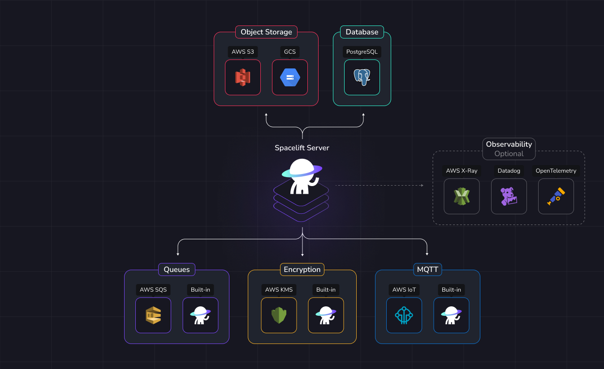

# External Dependencies

This document provides a comprehensive overview of all external components necessary to operate Spacelift. It is useful for those planning to deploy a self-hosted version of Spacelift and seeking to ensure their infrastructure is appropriately prepared.

The configuration of these components is flexible. For instance, you may opt to use Google Object Storage alongside AWS SQS for queuing.

This modular approach allows you to tailor the setup to suit your specific needs, giving you the freedom to design and deploy Spacelift in a manner that aligns with your infrastructure preferences.

{ .on-glb }

For convenience, we provide implementations of certain requirements built into Spacelift, allowing you to avoid reliance on separate external services.

Therefore, using an external service for the following components is optional:

- Message queues.
- Encryption.
- MQTT Broker.

On the other hand, the components below are mandatory and **must be provided**:

- PostgreSQL database.
- Object storage backend.

## Database

Spacelift only supports **PostgreSQL**.

!!! warning

        Creating a database in Kubernetes, while possible, is not recommended. If you choose to do so, set up a volume for continuity of operations in the event of a power outage.

While PostgreSQL versions higher than 17 may work with Spacelift, please note that these versions have not been officially tested or supported.

As such, we cannot guarantee compatibility or provide assistance for any issues that may arise. We recommend using these versions at your own discretion and risk.

The recommended approach is to use the database service provided by your cloud provider for running PostgreSQL.

However, if necessary, you may choose to manage and operate your own PostgreSQL instance independently. There are no obligations to use a cloud provider’s service.

If you already have an existing PostgreSQL instance running, you can reuse it. Spacelift simply requires a dedicated database with full administrative permissions.

|                 |           Supported            |
| :-------------- | :----------------------------: |
| PostgreSQL ≤ 13 |               ❌                |
| PostgreSQL 14.x |               ✅                |
| PostgreSQL 15.x |               ✅                |
| PostgreSQL 16.x |               ✅                |
| PostgreSQL 17.x |               ✅                |
| PostgreSQL ≥ 18 | ⚠️ **not officially supported** |

## Object storage backend

An object storage backend is essential for Spacelift to store various files, including run logs, Terraform state files, and other necessary data.

This storage ensures the proper management and persistence of critical information needed for the operation of Spacelift.

|                      | Supported |
| :------------------- | :-------: |
| AWS S3               |     ✅     |
| Google Cloud Storage |     ✅     |
| Azure Blob Storage   |     ✅     |
| MinIO                |     ✅     |

🔗 [Object storage reference](./reference/object-storage.md)

## Encryption

!!! danger
    Once an encryption method is selected, transitioning to an alternative method will not be possible, as it would require the migration of all encrypted database entries, which is not supported. Therefore, it is essential to make a well-informed decision when selecting the encryption method.

Spacelift employs encryption to protect sensitive data stored in the database, ensuring that such information is not stored in plaintext.

When using the built-in encryption mechanism, a private RSA key is required, which must be passed to the Spacelift backend via an environment variable. This approach introduces a potential risk, as the secret could be accessed if not properly secured. It is important to carefully consider how this secret will be managed and protected within your infrastructure.

Spacelift also requires the use of an asymmetric key pair for performing the signing and verification of JWT (JSON Web Tokens).

The asymmetric key pair consists of a private key, which is used to sign the token, and a corresponding public key, which is used to verify its authenticity. This process ensures that the integrity of the tokens is maintained, and that they can be trusted by the recipient, as the signature is uniquely tied to the private key and cannot be altered without detection.

|                       | Supported |
| :-------------------- | :-------: |
| AWS KMS               |     ✅     |
| Built-in RSA + AES256 |     ✅     |

🔗 [Encryption reference](./reference/encryption.md)

## Message queues

Spacelift uses message queues to dispatch events for asynchronous processing. We support two types of message queue: AWS SQS, or a built-in message queue that uses the Postgres database. We recommend using the built-in message queue for any new installations, but SQS support is provided for backwards-compatibility with existing installations.

|          | Supported |
| :------- | :-------: |
| AWS SQS  |     ✅     |
| Built-in |     ✅     |

🔗 [Message queues reference](./reference/message-queues.md)

## MQTT broker

A MQTT broker is required for communication with workers.

Spacelift can run its own MQTT broker embedded with the Spacelift Server.

!!! info
    If you want to use IoT Core as the MQTT broker, [you must](./reference/mqtt-broker.md#message-queue-type) use AWS SQS for message queues.

|              | Supported |
| :----------- | :-------: |
| AWS IoT Core |     ✅     |
| Built-in     |     ✅     |

🔗 [MQTT broker reference](./reference/mqtt-broker.md)

## Observability

### Logging

Spacelift components will output logs in JSON to the standard output (`/dev/stdout`).

Since log collection is dependent on the observability system you use and the infrastructure you deploy Spacelift to, it is out of scope for this document.

### Telemetry

Spacelift also support tracing for in depth debugging. That is fully optional and can be disabled.

| Vendor        | Supported |
| :------------ | :-------: |
| Datadog       |     ✅     |
| AWS X-Ray     |     ✅     |
| OpenTelemetry |     ✅     |

🔗 [Telemetry reference](./reference/telemetry.md)
