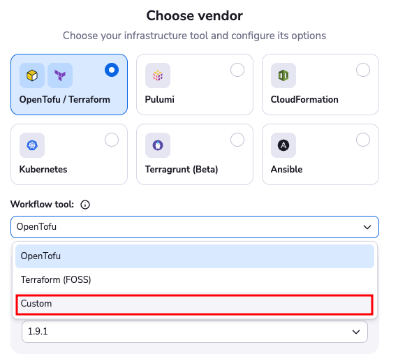
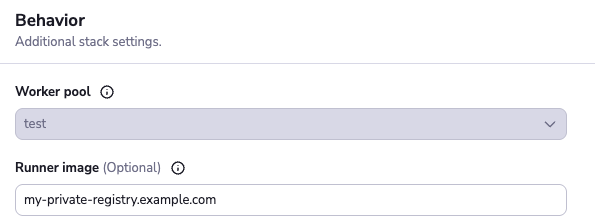
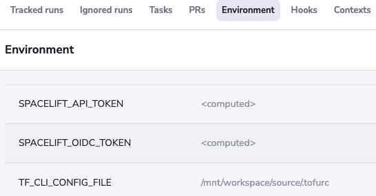
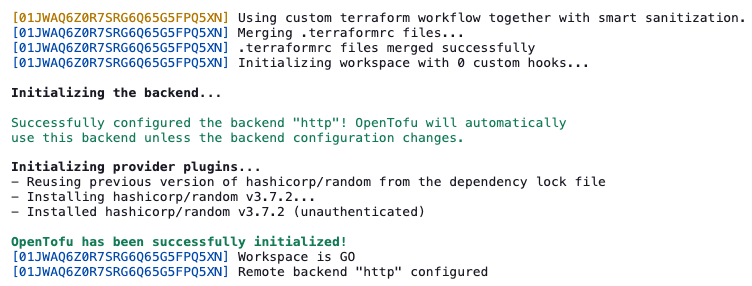

# Deploying to air-gapped environments

An air-gapped environment is a network security measure that physically isolates computers or networks from unsecured networks, such as the public internet.

Air-gapped environments can vary significantly in their level of isolation and implementation:

- **Complete isolation**: Systems have absolutely no network connectivity to external networks
- **Partial air gaps**: Certain systems or network segments have limited, controlled access to external networks through secure gateways, proxies, or one-way data flows

When deploying Spacelift in air-gapped environments, you'll need to consider which type of air gap you're working with, as this will determine the specific configuration requirements and constraints for your deployment.

This guide outlines the key considerations and implementation strategies for deploying Spacelift in networks isolated from the internet.

## VCS provider

If your Spacelift network has connectivity to your VCS providers, you can skip this section.

VCS agents are not supported yet for Self-Hosted installations, so if your VCS provider is located in another network than
your spacelift installation, you must update your network policies and firewall to allow Spacelift to communicate with it.

## OpenTofu/Terraform

Running OpenTofu/Terraform in an internet-isolated network requires careful consideration of provider management and the binary distribution (tofu or terraform CLI).

Multiple approaches exist to address this challenge.
This guide focuses on caching providers and the OpenTofu/Terraform binary directly within the Docker runner image used by your stacks.
One of the advantages of this approach is that you'll have great control of your supply chain and thus mitigate potential attacks.

!!! note
      Ensure your Spacelift installation can reach the endpoints required by your configured providers.

### Installing the vendor binary

By default, Spacelift attempts to download the OpenTofu/Terraform version specified in your stack configuration when using an OpenTofu/Terraform vendor.

The first step is to configure a custom workflow tool instead of the default vendor.



Next, create the following file in your repository at `.spacelift/workflow.yml`:



```text
init: tofu init -input=false
workspaceSelect: tofu workspace select "{{ .WorkspaceName }}"
workspaceNew: tofu workspace new "{{ .WorkspaceName }}"
plan: tofu plan -input=false -lock={{ .Lock }} {{ if not .Refresh }}-refresh=false {{ end }}-out={{ .PlanFileName }} {{ range .Targets }}-target='{{ . }}' {{ end }}
showState: tofu show -json
showPlan: tofu show -json "{{ .PlanFileName }}"
getOutputs: tofu output -json
apply: tofu apply -auto-approve -input=false "{{ .PlanFileName }}"
destroy: tofu destroy -auto-approve -input=false
```



This configuration prevents Spacelift from downloading OpenTofu/Terraform from the internet. However, this requires providing a Docker image with OpenTofu/Terraform pre-installed.

Use the following Dockerfile as a reference for building compatible images. Modify it as needed to install OpenTofu/Terraform or other custom binaries for your workflow:

```dockerfile
FROM public.ecr.aws/spacelift/runner-terraform AS builder

ARG VERSION=1.9.1
ARG PLATFORM=linux_amd64

USER root

RUN apk add --update gnupg && \
    wget https://github.com/opentofu/opentofu/releases/download/v${VERSION}/tofu_${VERSION}_${PLATFORM}.zip &&\
    wget https://github.com/opentofu/opentofu/releases/download/v${VERSION}/tofu_${VERSION}_${PLATFORM}.zip.gpgsig &&\
    wget -qO- https://get.opentofu.org/opentofu.gpg | gpg --import && \
    gpg --verify tofu_${VERSION}_${PLATFORM}.zip.gpgsig tofu_${VERSION}_${PLATFORM}.zip && \
    unzip tofu_${VERSION}_${PLATFORM}.zip -d /tmp

FROM public.ecr.aws/spacelift/runner-terraform

COPY --from=builder /tmp/tofu /bin/tofu

```

### Installing providers

Download OpenTofu/Terraform providers offline and cache them in your Docker image, enabling OpenTofu/Terraform to retrieve them from disk rather than attempting internet downloads.

The [`providers mirror`](https://opentofu.org/docs/cli/commands/providers/mirror/) subcommand provides an efficient solution for that.

```shell
# Run this command in the directory containing your OpenTofu/Terraform code.
# It will read your .terraform.lock.hcl file and download the required providers
$ tofu providers mirror -platform=linux_amd64 ../providers
- Mirroring hashicorp/random...
  - Selected v3.7.2 to match dependency lock file
  - Downloading package for linux_amd64...
  - Package authenticated: signed
```

!!! note
    Ensure you specify the correct `-platform` flag to match your runner platform.
    For example, running this command from a macOS workstation without the platform flag may download incompatible providers.

This command downloads all required providers to a local `./providers` directory. Add this directory to your Docker image:

```dockerfile
# OpenTofu/Terraform binary installation from previous step goes here
FROM public.ecr.aws/spacelift/runner-terraform

# Add providers
ADD providers /providers

COPY --from=builder /tmp/tofu /bin/tofu
```

Push the image to a registry accessible by your Spacelift installation and configure your stacks to use it.



Configure OpenTofu/Terraform to retrieve providers from the local filesystem by creating a `.tofurc` (or `.terraformrc`)
file in your repository root and setting the `TF_CLI_CONFIG_FILE` environment variable.

```hcl
# Add the following to a .tofurc or .terraformrc file in the root of your repository
provider_installation {
  filesystem_mirror {
    path    = "/providers"
  }
}
```

Configure your stack to use this configuration by setting `TF_CLI_CONFIG_FILE=/mnt/workspace/source/.tofurc`:



The initialization step should now function completely offline.



!!! warning
    Precise control over OpenTofu/Terraform provider versions is essential for offline operation. Ensure your repository contains a `.terraform.lock.hcl` file.

    Verify that the lock file includes all providers for resources in your state. Missing provider entries may cause OpenTofu/Terraform to attempt downloading additional providers.
