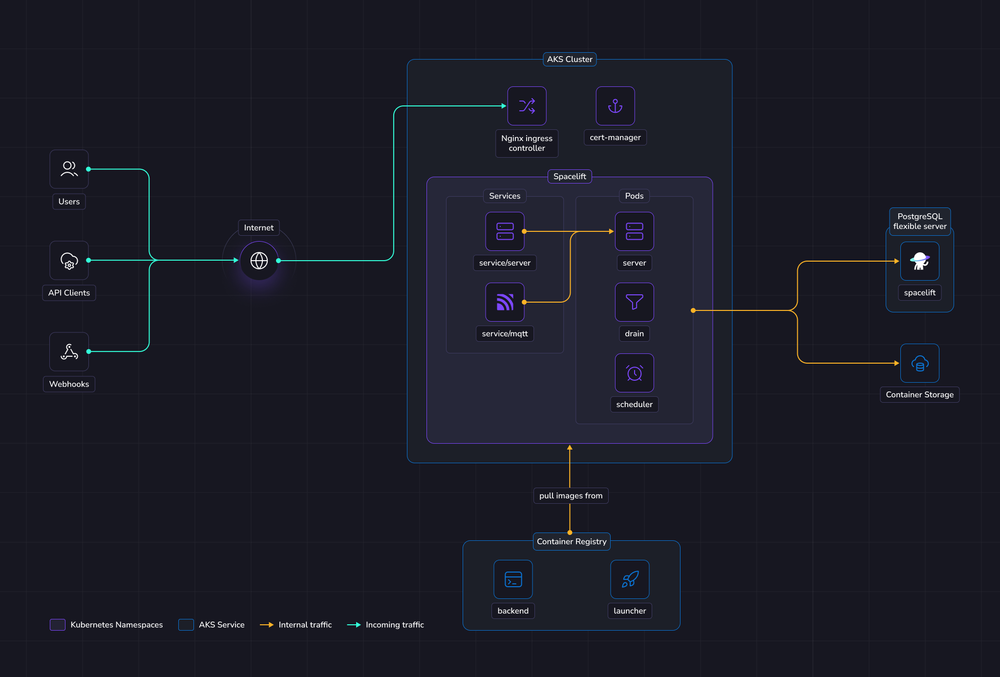

# Deploying to AKS

This guide provides a way to quickly get Spacelift up and running on an Azure Kubernetes Service (AKS) cluster. In this guide we show a relatively simple networking setup where Spacelift is accessible via a public load balancer.

To deploy Spacelift on AKS you need to take the following steps:

1. [Deploy your cluster and other infrastructure components](#deploy-infrastructure).
2. [Push the Spacelift images to your container registry](#push-images-to-container-registry).
3. [Deploy the Spacelift backend services using our Helm chart](#deploy-spacelift).

## Overview

The illustration below shows what the infrastructure looks like when running Spacelift in AKS.

{ .on-glb }

### Networking

!!! info
    More details regarding networking requirements for Spacelift can be found on [this page](../reference/networking.md).

    This section will solely focus on how the Azure infrastructure will be configured to meet Spacelift's requirements.

In this guide we'll create a new Virtual Network and subnetwork to allocate IPs for nodes, pods and services running in the cluster.

The database will allocate a private IP in the VPC, and we'll connect directly to it from pods running in the cluster.

Incoming HTTPS traffic will be handled by an nginx ingress controller.
It will bind to a reserved static IPv4 address that you can add to your DNS zone.

### Object Storage

The Spacelift instance needs an object storage backend to store Terraform state files, run logs, and other things.
Several Azure Storage containers will be created in this guide. This is a hard requirement for running Spacelift.

Spacelift supports flexible authentication methods for Azure Blob Storage, including environment variables and Workload Identity. More details about object storage requirements and authentication can be found [here](../reference/object-storage.md).

### Database

Spacelift requires a PostgreSQL database to operate. In this guide we'll create a new dedicated Postgresql Flexible Server instance.

More details about database requirements for Spacelift can be found [here](../external-dependencies.md#database).

### AKS

In this guide, we'll create a new AKS cluster to run Spacelift. The Spacelift application can be deployed to that cluster using a Helm chart.

The chart will deploy 3 main components:

- The scheduler.
- The drain.
- The server.

The scheduler is the component that handles recurring tasks. It creates new entries in a message queue when a new task needs to be performed.

The drain is an async background processing component that picks up items from message queues and processes events.

The server hosts the Spacelift GraphQL API, REST API and serves the embedded frontend assets.
It also contains the MQTT server to handle interactions with workers.
The server is exposed to the outside world using `Ingress` resources. There is also a MQTT `Service` to expose the broker to workers.

### Workers

In this guide Spacelift workers will be also deployed in AKS.
That means that your Spacelift runs will be executed in the same environment as the app itself (we recommend using a separate K8s namespace).

We recommend running your Spacelift workers in a separate namespace inside the same cluster as your Spacelift installation unless you have a specific requirement to deploy your workers elsewhere. This approach simplifies your infrastructure deployment, and reduces the surface area of your installation.

## Requirements

Before proceeding with the next steps, the following tools must be installed on your computer.

- [Azure CLI](https://learn.microsoft.com/en-us/cli/azure/){: rel="nofollow"}.
- [Docker](https://docs.docker.com/engine/install/){: rel="nofollow"}.
- [Helm](https://helm.sh/docs/helm/helm_install/){: rel="nofollow"}.
- [OpenTofu](https://opentofu.org/){: rel="nofollow"} or [Terraform](https://developer.hashicorp.com/terraform){: rel="nofollow"}.

!!! info
    In the following sections of the guide, OpenTofu will be used to deploy the infrastructure needed for Spacelift. If you are using Terraform, simply swap `tofu` for `terraform`.

## Generate encryption key

Spacelift requires an RSA key to encrypt sensitive information stored in the Postgres database. Please follow the instructions in the [RSA Encryption](../reference/encryption.md#rsa) section of our reference documentation to generate a new key.

## Deploy infrastructure

!!! warning
    Before attempting to apply the following Terraform module, make sure you have the correct permissions on your Azure subscription.
    You can create a least-privileges role based on the architecture overview above, or use Azure's built-in **Owner** role.
    The **Contributor** role does not provide sufficient permissions because the Terraform module makes IAM role assignments.

We provide a [Terraform module](https://github.com/spacelift-io/terraform-azure-spacelift-selfhosted){: rel="nofollow"} to help you deploy Spacelift's infrastructure requirements.

Before you start, set a few environment variables that will be used by the Spacelift modules:

```shell
# Extract this from your archive: self-hosted-v4.0.0.tar.gz
export TF_VAR_spacelift_version="v4.0.0"

# Configure a default temporary admin account that could be used to setup the instance.
export TF_VAR_admin_username="admin"
export TF_VAR_admin_password="<password-here>"

# Configure the Spacelift license
export TF_VAR_license_token="<license-received-from-Spacelift>"

# Set this to the base64-encoded RSA private key that you generated earlier in the "Generate encryption key" section of this guide.
export TF_VAR_encryption_rsa_private_key="<base64-encoded-private-key>"

# Adjust the following variable to the Azure subscription ID where you want to deploy your infrastructure.
export TF_VAR_subscription_id="<subscription-id>"

# Set this to the Azure location you wish to deploy your Spacelift infrastructure to. For example, polandcentral.
export TF_VAR_location="<azure-location>"

# Adjust the following variable if you want to use a different Azure resource group name for your infrastructure.
export TF_VAR_resource_group_name="spacelift"

# Set this to the domain name you want to access Spacelift from, for example "spacelift.example.com". Do not prefix this
# with the protocol (e.g. https://).
export TF_VAR_website_domain="<domain-name>"

# Uncomment the following line to enable automatically sharing usage data via our metrics endpoint.
# If you don't enable this, you can still export the usage data via the Web UI.
# export TF_VAR_spacelift_public_api="https://app.spacelift.io"
```

!!! note
    The admin login/password combination is only used for the very first login to the Spacelift instance. It can be removed after the initial setup. More information can be found in the [initial setup](./first-setup.md) section.

Below is a small example of how to use this module:

```hcl
variable "spacelift_version" {
  type = string
}

variable "license_token" {
  type      = string
  sensitive = true
}

variable "encryption_rsa_private_key" {
  type      = string
  sensitive = true
}

variable "k8s_namespace" {
  type    = string
  default = "spacelift"
}

variable "website_domain" {
  type = string
}

variable "admin_username" {
  type = string
}

variable "admin_password" {
  type      = string
  sensitive = true
}

variable "subscription_id" {
  type = string
}

variable "location" {
  type = string
}

variable "resource_group_name" {
  type = string
}

provider "azurerm" {
  features {}
  subscription_id = var.subscription_id
}

module "spacelift" {
  source = "github.com/spacelift-io/terraform-azure-spacelift-selfhosted?ref=v1.0.0"

  app_domain                 = var.website_domain
  spacelift_version          = var.spacelift_version
  license_token              = var.license_token
  encryption_rsa_private_key = var.encryption_rsa_private_key
  k8s_namespace              = "spacelift"
  admin_username             = var.admin_username
  admin_password             = var.admin_password
  location                   = var.location
  resource_group_name        = var.resource_group_name
}

output "shell" {
  value     = module.spacelift.shell
  sensitive = true
}

output "kubernetes_secrets" {
  sensitive = true
  value     = module.spacelift.kubernetes_secrets
}

output "helm_values" {
  value     = module.spacelift.helm_values
}
```

Feel free to take a look at the documentation for the [terraform-azure-spacelift-selfhosted](https://search.opentofu.org/module/spacelift-io/spacelift-selfhosted/azure/latest){: rel="nofollow"} module before applying your infrastructure in case there are any settings that you wish to adjust. Once you are ready, apply your changes:

```shell
tofu apply
```

Once applied, grab all the variables that need to be exported in your shell for the rest of this guide. We expose a `shell` output in terraform that you can source directly for convenience:

```shell
# Source in your shell all the required env vars to continue the installation process
$(tofu output -raw shell)
```

!!! info
    During this guide you'll export shell variables that will be useful in future steps. So please keep the same shell open for the entire guide.

### Configure your DNS zone

Configure the following record in your DNS zone. The `${PUBLIC_IP_ADDRESS}` environment variable should be available in your shell from the previous step.

```zone
spacelift.mycompany.com       3600 IN  A     ${PUBLIC_IP_ADDRESS}
```

!!! info
    It is useful to configure this entry as early as possible since it will be used by the Let's Encrypt handshake later. So it's better to do this right now, and continue the setup while records are being propagated.

## Push images to Container Registry

From the previous terraform apply step, you need to grab the URL of the registry from the output and push our docker images to it.

```shell
# Login to Azure Container Registry

az acr login --name ${PRIVATE_CONTAINER_REGISTRY_NAME}
az acr login --name ${PUBLIC_CONTAINER_REGISTRY_NAME}

```

```shell
tar -xzf self-hosted-${SPACELIFT_VERSION}.tar.gz -C .

docker image load --input="self-hosted-${SPACELIFT_VERSION}/container-images/spacelift-launcher.tar"
docker tag "spacelift-launcher:${SPACELIFT_VERSION}" "${LAUNCHER_IMAGE}:${SPACELIFT_VERSION}"
docker push "${LAUNCHER_IMAGE}:${SPACELIFT_VERSION}"

docker image load --input="self-hosted-${SPACELIFT_VERSION}/container-images/spacelift-backend.tar"
docker tag "spacelift-backend:${SPACELIFT_VERSION}" "${BACKEND_IMAGE}:${SPACELIFT_VERSION}"
docker push "${BACKEND_IMAGE}:${SPACELIFT_VERSION}"
```

## Deploy Spacelift

First, we need to configure Kubernetes credentials to interact with the AKS cluster.

```shell
# We set a kubeconfig so we do not mess up with any existing config.
export KUBECONFIG=${HOME}/.kube/config_spacelift
az aks get-credentials --resource-group ${AZURE_RESOURCE_GROUP_NAME} --name ${AKS_CLUSTER_NAME} --overwrite-existing
```

!!! warning
    Make sure the above `KUBECONFIG` environment variable is present when running following helm commands.

### NGINX controller

```shell
helm upgrade --install ingress-nginx ingress-nginx \
  --repo https://kubernetes.github.io/ingress-nginx \
  --namespace ingress-nginx \
  --create-namespace \
  --version v4.12.0 \
  --set rbac.create=true \
  --set controller.service.externalTrafficPolicy=Local \
  --set controller.service.loadBalancerIP=${PUBLIC_IP_ADDRESS} \
  --set crds.enabled=true
```

### Cert manager

Spacelift should run under valid HTTPS endpoints, so you need to provide valid certificates to Ingress resources deployed by Spacelift.
One simple way to achieve that is to use cert-manager to generate [Let's Encrypt](https://letsencrypt.org/){: rel="nofollow"} certificates.

If you already have cert-manager running in your cluster and know how to configure Certificates on Ingress, you can skip this step.

```shell
helm repo add jetstack https://charts.jetstack.io --force-update

helm upgrade \
    --install \
    cert-manager jetstack/cert-manager \
    --namespace cert-manager \
    --create-namespace \
    --version v1.19.2 \
    --set crds.enabled=true \
    --set global.leaderElection.namespace=cert-manager \
    --set resources.requests.cpu=100m \
    --set resources.requests.memory=256Mi \
    --set webhook.resources.requests.cpu=100m \
    --set webhook.resources.requests.memory=256Mi \
    --set cainjector.resources.requests.cpu=100m \
    --set cainjector.resources.requests.memory=256Mi \
    --set startupapicheck.resources.requests.cpu=100m \
    --set startupapicheck.resources.requests.memory=256Mi
```

!!! info
    Note that this command can take a few minutes to finish.

Next, we will configure an issuer to tell cert-manager how to generate certificates.
In this guide we'll use [ACME](https://cert-manager.io/docs/configuration/acme/){: rel="nofollow"} with Let's Encrypt and [HTTP01 challenges](https://letsencrypt.org/docs/challenge-types/){: rel="nofollow"}.

!!! note
    It is highly recommended testing against the Let's Encrypt staging environment before using the production environment.
    This will allow you to get things right before issuing trusted certificates and reduce the chance of hitting rate limits.
    Note that the staging root CA is untrusted by browsers, and Spacelift workers won't be able to connect to the server endpoint either.

=== "Production"

    ```shell
    export ACME_EMAIL="your email"

    kubectl apply -f - <<EOF
    apiVersion: cert-manager.io/v1
    kind: ClusterIssuer
    metadata:
      name: letsencrypt-prod
    spec:
      acme:
        email: $ACME_EMAIL
        server: https://acme-v02.api.letsencrypt.org/directory
        privateKeySecretRef:
          name: prod-issuer-account-key
        solvers:
          - http01:
              ingress:
                ingressClassName: nginx
    EOF
    ```

=== "Staging (optional)"

    ```shell
    export ACME_EMAIL="your email"

    kubectl apply -f - <<EOF
    apiVersion: cert-manager.io/v1
    kind: ClusterIssuer
    metadata:
      name: letsencrypt-staging
    spec:
      acme:
        email: $ACME_EMAIL
        server: https://acme-staging-v02.api.letsencrypt.org/directory
        privateKeySecretRef:
          name: staging-issuer-account-key
        solvers:
          - http01:
              ingress:
                ingressClassName: nginx
    EOF
    ```

### Install Spacelift

### Create Kubernetes namespace

```shell
kubectl create namespace $K8S_NAMESPACE --dry-run=client -o yaml | kubectl apply -f -
```

### Create secrets

The Spacelift services need various environment variables to be configured in order to function correctly.
In this guide we will create three Spacelift secrets to pass these variables to the Spacelift backend services:

- `spacelift-shared` - contains variables used by all services.
- `spacelift-server` - contains variables specific to the Spacelift server.
- `spacelift-drain` - contains variables specific to the Spacelift drain.

For convenience, the `terraform-azure-spacelift-selfhosted` Terraform module provides a kubernetes_secrets output that you can pass to kubectl apply to create the secrets:

```shell
tofu output -raw kubernetes_secrets > secrets.yaml
kubectl apply -f secrets.yaml
```

### Deploy application

You need to provide a number of configuration options to Helm when deploying Spacelift to configure it correctly for your environment.
You can generate a Helm values.yaml file to use via the `helm_values` output variable of the `terraform-azure-spacelift-selfhosted` Terraform module:

```shell
tofu output -raw helm_values > spacelift-values.yaml
```

Feel free to take a look at this file to understand what is being configured.
Once you're happy, run the following command to deploy Spacelift:

```shell
helm upgrade \
  --repo https://downloads.spacelift.io/helm \
  spacelift \
  spacelift-self-hosted \
  --install --wait --timeout 20m \
  --namespace "$K8S_NAMESPACE" \
  --values "spacelift-values.yaml"
```

!!! tip
    You can follow the deployment progress with: `kubectl logs -n ${K8S_NAMESPACE} deployments/spacelift-server`

### VCS Gateway Service

Ideally, your VCS provider [should be accessible](../reference/networking.md) from both the Spacelift backend and its workers. If direct access is not possible, you can use [VCS Agent Pools](../../../concepts/vcs-agent-pools.md) to proxy the connections from the Spacelift backend to your VCS provider.

The VCS Agent Pool architecture introduces a VCS Gateway service, deployed alongside the Spacelift backend, and exposed via an Ingress. External VCS Agents connect over gRPC (port 443 with TLS termination), while internal Spacelift services (server, drain) communicate with the gateway via HTTP using pod IP addresses within the cluster.

To enable this setup, add the following variable to your module configuration:

```hcl
module "spacelift" {
  # VCS Gateway configuration
  vcs_gateway_domain = "vcs-gateway.mycorp.io"  # The DNS record for the VCS Gateway service, without protocol.

  # Other settings are omitted for brevity
}
```

After applying the Terraform changes, regenerate your `spacelift-values.yaml` from the `helm_values` output and redeploy the Helm chart to enable the VCS Gateway service.

Configure a DNS A record pointing your VCS Gateway domain to the same `{PUBLIC_IP_ADDRESS}` used by the Spacelift server. The nginx ingress controller supports [host-based routing](https://kubernetes.github.io/ingress-nginx/user-guide/basic-usage/){: rel="nofollow"}, allowing both the Spacelift server and VCS Gateway to share the same IP address while routing traffic to their respective services based on the `Host` header.

With the backend now configured, proceed to the [VCS Agent Pools guide](../../../concepts/vcs-agent-pools.md) to complete the setup.

## Next steps

Now that your Spacelift installation is up and running, take a look at the [initial installation](./first-setup.md) section for the next steps to take.

### Configure telemetry

You can configure telemetry collection to monitor your installation's performance and troubleshoot issues. See our [telemetry configuration guides](./telemetry/README.md) for step-by-step instructions on setting up Datadog, OpenTelemetry with Jaeger, or OpenTelemetry with Grafana Stack.

### Create a worker pool

We recommend that you deploy workers in a dedicated namespace.

```shell
# Choose a namespace to deploy the workers to
export K8S_WORKER_POOL_NAMESPACE="spacelift-workers"
kubectl create namespace $K8S_WORKER_POOL_NAMESPACE --dry-run=client -o yaml | kubectl apply -f -
```

!!! warning
    When creating your `WorkerPool`, make sure **[to configure resources](../../../concepts/worker-pools/kubernetes-workers.md#run-pods)**. This is highly recommended because otherwise very high resources requests can be set automatically by your admission controller.

    Also make sure to deploy the WorkerPool and its secrets into **the correct namespace** we just created by adding `-n ${K8S_WORKER_POOL_NAMESPACE}` to the commands in the guide below.

➡️ **You need to follow this guide for configuring [Kubernetes Workers](../../../concepts/worker-pools/kubernetes-workers.md).**

## Deletion / uninstall

Before running `tofu destroy` on the infrastructure, we recommended that you do a proper cleanup in the K8s cluster. That's because the Spacelift helm chart links a couple of Azure resources (such as an external IP) that are not managed by Terraform. If you do not remove them from K8s, `tofu destroy` will complain because some resources like networks cannot be removed if not empty.

```shell
helm uninstall -n $K8S_NAMESPACE spacelift
helm uninstall -n cert-manager cert-manager
helm uninstall -n ingress-nginx ingress-nginx
kubectl delete namespace $K8S_WORKER_POOL_NAMESPACE
kubectl delete namespace $K8S_NAMESPACE
kubectl delete namespace cert-manager

tofu destroy
```

!!! note
    Namespace deletions in Kubernetes can take a while or even get stuck. If that happens, you need to remove the finalizers from the stuck resources.
