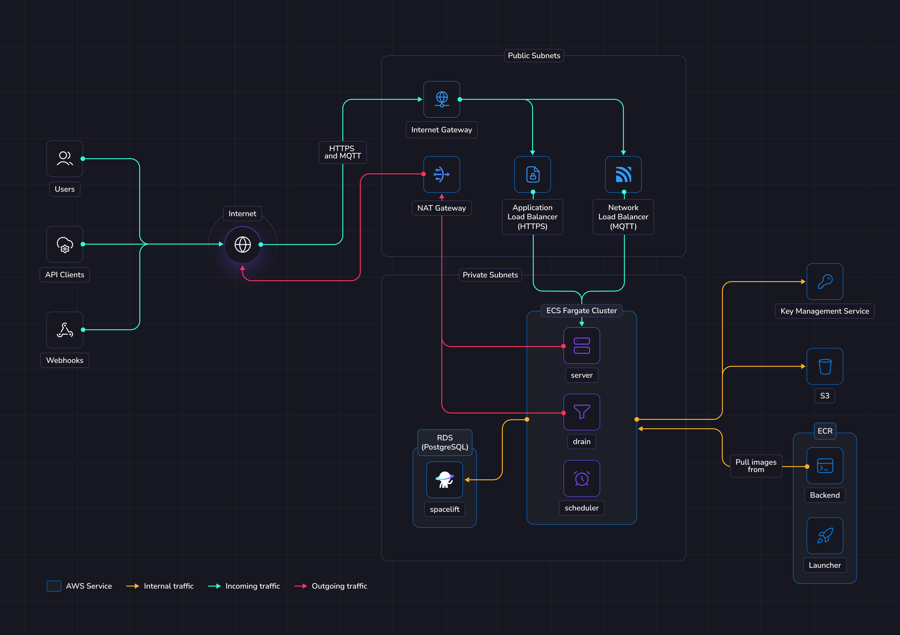
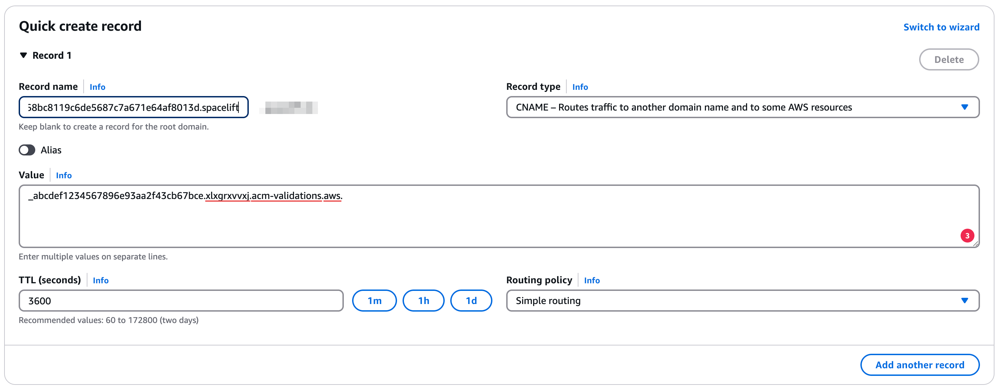

# Deploying to ECS

This guide provides a way to quickly get Spacelift up and running on an Elastic Compute Service (ECS) Fargate cluster. In this guide we show a relatively simple networking setup where Spacelift is accessible via a public load balancer, but you can adjust this as long as you meet the basic [networking requirements](../environment-requirements.md#configure-networking) for Spacelift.

To deploy Spacelift on ECS you need to take the following steps:

1. [Deploy your basic infrastructure components](#deploy-infrastructure).
2. [Push the Spacelift images to your Elastic Container Registry](#push-images-to-elastic-container-registry).
3. [Deploy the Spacelift backend services using our ECS Terraform module](#deploy-spacelift).

## Overview

The illustration below shows what the infrastructure looks like when running Spacelift in ECS.

{ .on-glb }

### Networking

!!! info
    More details regarding networking requirements for Spacelift can be found on [this page](../reference/networking.md).

    This section will solely focus on how the ECS infrastructure will be configured to meet Spacelift's requirements.

In this guide we'll create a new VPC with public and private subnets. The public subnets will contain the following items to allow communication between Spacelift and the external internet:

- An [Application Load Balancer](https://docs.aws.amazon.com/elasticloadbalancing/latest/application/introduction.html){: rel="nofollow"} to allow inbound HTTPS traffic to reach the Spacelift server instances.
- A [Network Load Balancer](https://docs.aws.amazon.com/elasticloadbalancing/latest/network/introduction.html){: rel="nofollow"} to allow inbound MQTT traffic to reach the Spacelift server instances.
- An [Internet Gateway](https://docs.aws.amazon.com/vpc/latest/userguide/VPC_Internet_Gateway.html){: rel="nofollow"} to allow inbound access to those load balancers.
- A [NAT Gateway](https://docs.aws.amazon.com/vpc/latest/userguide/vpc-nat-gateway.html){: rel="nofollow"} to allow egress traffic from the Spacelift services.

The private subnets contain the Spacelift RDS Postgres database, along with the Spacelift ECS services and are not directly accessible via the internet.

### Object Storage

The Spacelift instance needs an object storage backend to store Terraform state files, run logs, and other things.
Several S3 buckets will be created in this guide. This is a hard requirement for running Spacelift.

Spacelift uses the AWS SDK default credential provider chain for S3 authentication, supporting environment variables, shared credential files and IAM roles for ECS. More details about object storage requirements and authentication can be found [here](../reference/object-storage.md).

### Database

Spacelift requires a PostgreSQL database to operate. In this guide we'll create a new Aurora Serverless RDS instance.
You can also reuse an existing instance and create a new database in it. In that case you'll have to adjust the database URL and other settings across the guide.
It's also up to you to configure appropriate networking to expose this database to Spacelift's VPC.

You can switch the `create_database` option to false in the terraform module to disable creating an RDS instance.

More details about database requirements for Spacelift can be found [here](../external-dependencies.md#database).

### ECS

In this guide, we'll deploy a new [ECS Fargate](https://docs.aws.amazon.com/AmazonECS/latest/developerguide/AWS_Fargate.html){: rel="nofollow"} cluster to run Spacelift. The Spacelift application can be deployed using the [terraform-aws-ecs-spacelift-selfhosted](https://github.com/spacelift-io/terraform-aws-ecs-spacelift-selfhosted){: rel="nofollow"} Terraform module.

The Terraform module will deploy the ECS cluster, associated resources like IAM roles, and the following Spacelift services:

- The scheduler.
- The drain.
- The server.

The scheduler is the component that handles recurring tasks. It creates new entries in a message queue when a new task needs to be performed.

The drain is an async background processing component that picks up items from the queue and processes events.

The server hosts the Spacelift GraphQL API, REST API and serves the embedded frontend assets. It also contains the MQTT server to handle interactions with workers. The server is exposed to the outside world using an Application Load Balancer for HTTP traffic, and a Network Load Balancer for MQTT traffic.

### Workers

In this guide Spacelift workers will be deployed as an EC2 autoscaling group, using the [terraform-aws-spacelift-workerpool-on-ec2](https://github.com/spacelift-io/terraform-aws-spacelift-workerpool-on-ec2){: rel="nofollow"} Terraform module.

## Requirements

Before proceeding with the next steps, the following tools must be installed on your computer.

- [AWS CLI v2](https://aws.amazon.com/cli/){: rel="nofollow"}.
- [Docker](https://docs.docker.com/engine/install/){: rel="nofollow"}.
- [OpenTofu](https://opentofu.org/){: rel="nofollow"} or [Terraform](https://developer.hashicorp.com/terraform){: rel="nofollow"}.

!!! info
    In the following sections of the guide, OpenTofu will be used to deploy the infrastructure needed for Spacelift. If you are using Terraform, simply swap `tofu` for `terraform`.

### Server certificate

To be able to reach your Spacelift installation using HTTPS, we need a valid certificate to serve it under secure endpoints.
Before jumping into deploying Spacelift, we first need to create a valid ACM certificate.

We are going to use DNS validation to make sure the issued certificate is valid, so you need to have access to
your DNS zone to add to it the ACM certificate validation CNAME entries.

The Spacelift infrastructure module will take as an input an ACM certificate ARN.
You can either create one yourself manually or use the OpenTofu code snippets below to help you create one.

=== "OpenTofu / Terraform"

    You can apply the following snippet of OpenTofu code with a credentials set allowed to configure your route53 zone.

    ```hcl
    resource "aws_acm_certificate" "server-certificate" {
      # Update this entry to match the domain of the Spacelift installation
      domain_name       = "spacelift.example.com"
      validation_method = "DNS"
    }

    data "aws_route53_zone" "spacelift-zone" {
      # Update this entry to match your desired DNS zone
      name = "example.com."
    }

    resource "aws_route53_record" "server-certificate" {
      for_each = {
        for dvo in aws_acm_certificate.server-certificate.domain_validation_options : dvo.domain_name => {
          name   = dvo.resource_record_name
          record = dvo.resource_record_value
          type   = dvo.resource_record_type
        }
      }

      allow_overwrite = true
      name            = each.value.name
      records         = [each.value.record]
      ttl             = 60
      type            = each.value.type
      zone_id         = data.aws_route53_zone.spacelift-zone.zone_id
    }

    resource "aws_acm_certificate_validation" "server-certificate" {
      certificate_arn         = aws_acm_certificate.server-certificate.arn
      validation_record_fqdns = [for record in aws_route53_record.server-certificate : record.fqdn]
    }
    ```

=== "Manually"

    You can apply the following snippet of OpenTofu code and then just go to your Route53 console to create the
    DNS entries specified in the output.

    ```hcl
    resource "aws_acm_certificate" "server-certificate" {
      # Update this entry to match the domain of the Spacelift installation
      domain_name       = "spacelift.example.com"
      validation_method = "DNS"
    }

    output "certificate-verification-records" {
      value = <<EOT
      ℹ️ Please create the following entries in your DNS zone

      %{ for dvo in aws_acm_certificate.server-certificate.domain_validation_options ~}
      ${dvo.resource_record_name} 3600 IN ${dvo.resource_record_type} ${dvo.resource_record_value}
      %{ endfor ~}
      EOT
    }
    ```

    ```shell
    $ TF_VAR_server_domain=spacelift.example.com tofu apply

    # [...]

    Outputs:

    certificate-verification-records = <<EOT
    ℹ️  Please create the following entries in your DNS zone

    _68bc8119c6de5687c7a671e64af8013d.spacelift.example.com. 3600 IN CNAME _abcdef1234567896e93aa2f43cb67bce.xlxgrxvvxj.acm-validations.aws.

    EOT
    ```

    { .on-glb }

## Deploy infrastructure

We provide Terraform modules to deploy Spacelift's [infrastructure requirements](https://github.com/spacelift-io/terraform-aws-spacelift-selfhosted){: rel="nofollow"} as well as a [module to deploy the Spacelift services to ECS](https://github.com/spacelift-io/terraform-aws-ecs-spacelift-selfhosted){: rel="nofollow"}.

Some parts of these modules can be customized to avoid deploying parts of the infra in case you want to handle that yourself.
For example, you may want to disable the database if you already have a Postgres instance and want to reuse it, or you may want to [provide your own IAM roles](https://github.com/spacelift-io/terraform-aws-ecs-spacelift-selfhosted?tab=readme-ov-file#deploy-with-existing-iam-roles){: rel="nofollow"} or [enable CloudWatch logging](https://github.com/spacelift-io/terraform-aws-ecs-spacelift-selfhosted?tab=readme-ov-file#with-cloudwatch-logging){: rel="nofollow"}.

Before you start, set a few environment variables that will be used by the Spacelift modules:

```shell
# Set this to the AWS region you wish to deploy Spacelift to, e.g. "eu-west-1".
export TF_VAR_aws_region=<aws-region>

# Set this to the domain name you want to access Spacelift from, e.g. "spacelift.example.com".
export TF_VAR_server_domain=<server-domain>

# Set this to the domain name you want to use for MQTT communication with the workers, e.g. "mqtt.spacelift.example.com".
export TF_VAR_mqtt_domain=<mqtt-domain>

# Set this to the username for the admin account to use during setup.
export TF_VAR_admin_username=<admin-username>

# Set this to the password for that account.
export TF_VAR_admin_password=<admin-password>

# Extract this from your archive: self-hosted-v4.0.0.tar.gz
export TF_VAR_spacelift_version=v4.0.0

# Set this to the token given to you by your Spacelift representative.
export TF_VAR_license_token=<license-token>

# If you want to pass your own ACM certificate to use, uncomment the following variable and set it
# to the ARN of the certificate you want to use. Please note, the ACM certificate must be successfully
# issued, otherwise deploying the services will fail.
#
# ℹ️ If you have configured your certificate using OpenTofu or Terraform in the previous step, you can just ignore this
# variable since you might want to reference the aws_acm_certificate_validation resource directly.
export TF_VAR_server_certificate_arn=""

# If you want to automatically send usage data to Spacelift, uncomment the following variable.
#export TF_VAR_enable_automatic_usage_data_reporting="true"
```

!!! note
    The admin login/password combination is only used for the very first login to the Spacelift instance. It can be removed after the initial setup. More information can be found in the [initial setup](./first-setup.md) section.

Below is an example of how to use these modules:

```hcl
variable "aws_region" {
  type        = string
  description = "The AWS region you want to install Spacelift into."
  default     = "eu-north-1"
}

variable "server_domain" {
  type        = string
  description = "The domain name you want to use for your Spacelift instance (e.g. spacelift.example.com)."
}

variable "mqtt_domain" {
  type        = string
  description = "The domain name you want to use for your Spacelift instance (e.g. spacelift.example.com)."
}

variable "admin_username" {
  type        = string
  description = "The admin username for initial setup purposes."
}

variable "admin_password" {
  type        = string
  description = "The admin password for initial setup purposes."
}

variable "spacelift_version" {
  type        = string
  description = "The version of Spacelift being deployed. This is used to decide what ECR image tag to use."
}

variable "license_token" {
  type        = string
  description = "The license token for selfhosted, issued by Spacelift."
  sensitive   = true
}

variable "server_certificate_arn" {
  type        = string
  description = "The ARN of the certificate to use for the Spacelift server."
}

variable "deploy_services" {
  type        = bool
  description = "Whether to deploy the Spacelift ECS services or not."
  default     = false
}

terraform {
  required_providers {
    aws = {
      source  = "hashicorp/aws"
      version = "~> 6.0"
    }
  }
}

provider "aws" {
  region = var.aws_region

  default_tags {
    tags = {
      "app" = "spacelift-selfhosted"
    }
  }
}

# Deploy the basic infrastructure needed for Spacelift to function.
module "spacelift-infra" {
  source = "github.com/spacelift-io/terraform-aws-spacelift-selfhosted?ref=v2.0.0"

  region = var.aws_region

  rds_engine_version         = "17.7"
  rds_instance_configuration = {
    "primary" : {
      instance_identifier : "primary"
      instance_class : "db.serverless"
    }
  }

  rds_serverlessv2_scaling_configuration = {
    min_capacity = 0.5
    max_capacity = 5.0
  }

  website_endpoint = "https://${var.server_domain}"
}

# Deploy the ECS services that run Spacelift.
module "spacelift-services" {
  count = var.deploy_services ? 1 : 0

  source = "github.com/spacelift-io/terraform-aws-ecs-spacelift-selfhosted?ref=v2.0.0"

  region        = var.aws_region
  unique_suffix = module.spacelift-infra.unique_suffix
  server_domain = var.server_domain

  # NOTE: there's nothing special about port number 1984. Your workers just need to be able to access this port
  # on the Spacelift server.
  mqtt_broker_endpoint                 = "tls://${var.mqtt_domain}:1984"
  vpc_id                               = module.spacelift-infra.vpc_id
  server_lb_subnets                    = module.spacelift-infra.public_subnet_ids

  # It's also possible to reference the certificate resource ARN directly from the previous step.
  # That could be useful if you want to keep a single terraform codebase for both certificate provisioning and the
  # spacelift installation.
  # You can uncomment the line below and get rid of the var.server_certificate_arn variable if you want to do so.
  #server_lb_certificate_arn            = aws_acm_certificate_validation.server-certificate.certificate_arn
  server_lb_certificate_arn            = var.server_certificate_arn

  server_security_group_id             = module.spacelift-infra.server_security_group_id
  mqtt_lb_subnets                      = module.spacelift-infra.public_subnet_ids
  ecs_subnets                          = module.spacelift-infra.private_subnet_ids
  admin_username                       = var.admin_username
  admin_password                       = var.admin_password
  backend_image                        = module.spacelift-infra.ecr_backend_repository_url
  backend_image_tag                    = var.spacelift_version
  launcher_image                       = module.spacelift-infra.ecr_launcher_repository_url
  launcher_image_tag                   = var.spacelift_version
  license_token                        = var.license_token
  deliveries_bucket_name               = module.spacelift-infra.deliveries_bucket_name
  large_queue_messages_bucket_name     = module.spacelift-infra.large_queue_messages_bucket_name
  metadata_bucket_name                 = module.spacelift-infra.metadata_bucket_name
  modules_bucket_name                  = module.spacelift-infra.modules_bucket_name
  policy_inputs_bucket_name            = module.spacelift-infra.policy_inputs_bucket_name
  run_logs_bucket_name                 = module.spacelift-infra.run_logs_bucket_name
  states_bucket_name                   = module.spacelift-infra.states_bucket_name
  uploads_bucket_name                  = module.spacelift-infra.uploads_bucket_name
  uploads_bucket_url                   = module.spacelift-infra.uploads_bucket_url
  user_uploaded_workspaces_bucket_name = module.spacelift-infra.user_uploaded_workspaces_bucket_name
  workspace_bucket_name                = module.spacelift-infra.workspace_bucket_name
  kms_encryption_key_arn               = module.spacelift-infra.kms_encryption_key_arn
  kms_signing_key_arn                  = module.spacelift-infra.kms_signing_key_arn
  kms_key_arn                          = module.spacelift-infra.kms_key_arn
  drain_security_group_id              = module.spacelift-infra.drain_security_group_id
  scheduler_security_group_id          = module.spacelift-infra.scheduler_security_group_id

  secrets_manager_secret_arns = [module.spacelift-infra.database_secret_arn]
  sensitive_env_vars          = [
    {
      name = "DATABASE_URL"
      valueFrom = "${module.spacelift-infra.database_secret_arn}:DATABASE_URL::"
    },
    {
      name = "DATABASE_READ_ONLY_URL"
      valueFrom = "${module.spacelift-infra.database_secret_arn}:DATABASE_READ_ONLY_URL::"
    }
  ]

  server_log_configuration = {
    logDriver : "awslogs",
    options : {
      "awslogs-region" : var.aws_region,
      "awslogs-group" : "/ecs/spacelift-server",
      "awslogs-create-group" : "true",
      "awslogs-stream-prefix" : "server"
    }
  }

  drain_log_configuration = {
    logDriver : "awslogs",
    options : {
      "awslogs-region" : var.aws_region,
      "awslogs-group" : "/ecs/spacelift-drain",
      "awslogs-create-group" : "true",
      "awslogs-stream-prefix" : "drain"
    }
  }

  scheduler_log_configuration = {
    logDriver : "awslogs",
    options : {
      "awslogs-region" : var.aws_region,
      "awslogs-group" : "/ecs/spacelift-scheduler",
      "awslogs-create-group" : "true",
      "awslogs-stream-prefix" : "scheduler"
    }
  }
}

output "server_lb_dns_name" {
  value = var.deploy_services ? module.spacelift-services[0].server_lb_dns_name : ""
}

output "mqtt_lb_dns_name" {
  value = var.deploy_services ? module.spacelift-services[0].mqtt_lb_dns_name : ""
}

output "shell" {
  value = module.spacelift-infra.shell
}

output "tfvars" {
  value     = module.spacelift-infra.tfvars
  sensitive = true
}
```

Feel free to take a look at the documentation for the [terraform-aws-ecs-spacelift-selfhosted](https://search.opentofu.org/module/spacelift-io/ecs-spacelift-selfhosted/aws/latest){: rel="nofollow"} module before applying your infrastructure in case there are any settings that you wish to adjust. Once you are ready, apply your changes:

```shell
tofu apply
```

Once applied, you should grab all variables that need to be exported in the shell that will be used in next steps. We expose a `shell` output in terraform that you can source directly for convenience.

```shell
# Source in your shell all the required env vars to continue the installation process
$(tofu output -raw shell)

# Output the required tfvars that will be used in further applies. Note that the ".auto.tfvars"
# filename is being used to allow the variables to be automatically loaded by OpenTofu.
tofu output -raw tfvars > spacelift.auto.tfvars
```

!!! info
    During this guide you'll export shell variables that will be useful in future steps. So please keep the same shell open for the entire guide.

## Push images to Elastic Container Registry

Assuming you have sourced the `shell` output as described in the previous section, you can run the following commands to upload the container images to your container registries and the launcher binary to the binaries S3 bucket:

```shell
# Login to the private ECR
aws ecr get-login-password --region "${AWS_REGION}" | docker login --username AWS --password-stdin "${PRIVATE_ECR_LOGIN_URL}"

tar -xzf self-hosted-${TF_VAR_spacelift_version}.tar.gz -C .

docker image load --input="self-hosted-${TF_VAR_spacelift_version}/container-images/spacelift-launcher.tar"
docker tag "spacelift-launcher:${TF_VAR_spacelift_version}" "${LAUNCHER_IMAGE}:${TF_VAR_spacelift_version}"
docker push "${LAUNCHER_IMAGE}:${TF_VAR_spacelift_version}"

docker image load --input="self-hosted-${TF_VAR_spacelift_version}/container-images/spacelift-backend.tar"
docker tag "spacelift-backend:${TF_VAR_spacelift_version}" "${BACKEND_IMAGE}:${TF_VAR_spacelift_version}"
docker push "${BACKEND_IMAGE}:${TF_VAR_spacelift_version}"

aws s3 cp --no-guess-mime-type "./self-hosted-${TF_VAR_spacelift_version}/bin/spacelift-launcher" "s3://${BINARIES_BUCKET_NAME}/spacelift-launcher"
```

## Deploy Spacelift

In this section, we'll deploy the Spacelift services to your ECS cluster, and then deploy an initial worker pool.

### Deploy application

To deploy the services, set the following environment variable to enable the [services module](https://github.com/spacelift-io/terraform-aws-ecs-spacelift-selfhosted){: rel="nofollow"} to be deployed:

```shell
export TF_VAR_deploy_services="true"
```

Now go ahead and run `tofu apply` again to deploy the ECS cluster and services.

Once this module has been applied successfully, you should be able to setup DNS entries for the server and MQTT broker endpoints using the `server_lb_dns_name` and `mqtt_lb_dns_name` outputs.

### Configure your DNS zone

You need to set two CNAMEs in your DNS zone.
One for the main application and one for the MQTT endpoint for the workers.

=== "OpenTofu / Terraform"

    You can add the following entries to your OpenTofu code.

    ```hcl

    data "aws_route53_zone" "spacelift-zone" {
      # Update this entry to match your desired DNS zone
      name = "example.com."
    }

    # This one is the main address of your Spacelift installation.
    # It should be a CNAME to the tofu output server_lb_dns_name.
    resource "aws_route53_record" "server" {
      zone_id = data.aws_route53_zone.spacelift-zone.zone_id
      name    = var.server_domain
      type    = "CNAME"
      ttl     = 300
      records = [module.spacelift-services[0].server_lb_dns_name]
    }

    # This one is the address of your MQTT endpoint.
    # It should be a CNAME to the tofu output mqtt_lb_dns_name.
    resource "aws_route53_record" "mqtt" {
      zone_id = data.aws_route53_zone.spacelift-zone.zone_id
      name    = var.mqtt_domain
      type    = "CNAME"
      ttl     = 300
      records = [module.spacelift-services[0].mqtt_lb_dns_name]
    }
    ```

=== "Manually"

    ```zone
    # This one is the main address of your Spacelift installation.
    # It should be a CNAME to the tofu output server_lb_dns_name.
    ${TF_VAR_server_domain}             300 IN  CNAME     $(tofu output -raw server_lb_dns_name)

    # This one is the address of your MQTT endpoint.
    # It should be a CNAME to the tofu output mqtt_lb_dns_name.
    ${TF_VAR_mqtt_domain}               300 IN  CNAME     $(tofu output -raw mqtt_lb_dns_name)
    ```

### VCS Gateway Service

Ideally, your VCS provider [should be accessible](../reference/networking.md) from both the Spacelift backend and its workers. If direct access is not possible, you can use [VCS Agent Pools](../../../concepts/vcs-agent-pools.md) to proxy the connections from the Spacelift backend to your VCS provider.

The VCS Agent Pool architecture introduces a separate ECS service, deployed alongside the Spacelift backend, and exposed via a dedicated Application Load Balancer. This load balancer listens on port 443 and requires a valid TLS certificate to be attached to it.

To support this setup, extend your module configuration with the following:

```hcl
module "spacelift-infra" {
  create_vcs_gateway = true

  # Other settings are omitted for brevity
}

module "spacelift-services" {
  vcs_gateway_domain = "vcs-gateway.mycorp.io" # The DNS record for the VCS Gateway service, without protocol.
  vcs_gateway_security_group_id = module.spacelift-infra.vcs_gateway_security_group_id
  vcs_gateway_certificate_arn = "<VCS Gateway certificate ARN>" # Note that this certificate MUST be successfully issued. It cannot be attached to the load balancer in a pending state.
  vcs_gateway_lb_subnets = module.spacelift-infra.public_subnet_ids # The subnets for the load balancer. Make these public if the LB is internet-facing (default). The LB scheme can be modified with the `vcs_gateway_internal` variable.

  # Other settings are omitted for brevity
}
```

Don't forget to set up the DNS record for the VCS Gateway service, pointing to the load balancer's DNS name:

```hcl
resource "aws_route53_record" "vcs_gateway" {
  zone_id = data.aws_route53_zone.spacelift-zone.zone_id
  name    = "vcs-gateway.mycorp.io"
  type    = "CNAME"
  ttl     = 300
  records = [module.spacelift-services.vcs_gateway_lb_dns_name]
}
```

With the backend now configured, proceed to the [VCS Agent Pools guide](../../../concepts/vcs-agent-pools.md) to complete the setup.

## Next steps

Now that your Spacelift installation is up and running, take a look at the [initial installation](./first-setup.md) section for the next steps to take.

### Create a worker pool

This section will show you how to deploy an EC2 based worker using our [terraform-aws-spacelift-workerpool-on-ec2](https://github.com/spacelift-io/terraform-aws-spacelift-workerpool-on-ec2){: rel="nofollow"} module.

The first step is to follow the instructions in our [worker pool documentation](../../../concepts/worker-pools/README.md) to generate credentials for your worker pool, and to create a new pool in Spacelift.

Once you have a private key and token for your worker pool, set the following Terraform variables:

```shell
# The ID of your worker pool, for example 01JPA4M2M7MCYF8JZBS4447JPA. You can get this from the
# worker pool page in Spacelift.
export TF_VAR_worker_pool_id="<worker-pool-id>"

# The token for your worker pool, downloaded from Spacelift when creating the pool.
export TF_VAR_worker_pool_config="<worker-pool-token>"

# The base64-encoded private key for your worker pool. Please refer to the worker
# pool documentation for commands to use to base64-encode the key.
export TF_VAR_worker_pool_private_key="<worker-pool-private-key>"
```

Next, you can use the following code to deploy your worker pool. Note that this deploys the workers into the same VPC as Spacelift, but this is not required for the workers to function. Please refer to the [worker network requirements](../../../concepts/worker-pools/README.md#network-security) for more details if you wish to adjust this.

```hcl
variable "vpc_id" {
  type        = string
  description = "The VPC Spacelift is installed into."
}

variable "availability_zones" {
  type        = list(string)
  description = "The availability zones to deploy workers to."
}

variable "private_subnet_ids" {
  type        = list(string)
  description = "The subnets to use for the workers."
}

variable "aws_region" {
  type        = string
  description = "AWS region to deploy resources."
}

variable "worker_pool_id" {
  type        = string
  description = "The ID of the worker pool."
}

variable "worker_pool_config" {
  type        = string
  description = "The worker pool configuration to use."
}

variable "worker_pool_private_key" {
  type        = string
  description = "The worker pool private key."
}

variable "binaries_bucket_name" {
  type        = string
  description = "The URI to the launcher binary in S3."
}

locals {
  launcher_s3_uri = "s3://${var.binaries_bucket_name}/spacelift-launcher"
}

data "aws_security_group" "default" {
  name   = "default"
  vpc_id = var.vpc_id
}

module "default-pool" {
  source = "github.com/spacelift-io/terraform-aws-spacelift-workerpool-on-ec2?ref=v5.2.0"

  secure_env_vars = {
    SPACELIFT_TOKEN            = var.worker_pool_config
    SPACELIFT_POOL_PRIVATE_KEY = var.worker_pool_private_key
  }
  configuration = <<-EOT
    export SPACELIFT_SENSITIVE_OUTPUT_UPLOAD_ENABLED=true
  EOT

  min_size           = 2
  max_size           = 2
  worker_pool_id     = var.worker_pool_id
  security_groups    = [data.aws_security_group.default.id]
  vpc_subnets        = var.private_subnet_ids

  selfhosted_configuration = {
    s3_uri = local.launcher_s3_uri
  }
}
```

## Deletion / uninstall

Before running `tofu destroy` on the infrastructure, you may want to set the following properties for the terraform-aws-spacelift-selfhosted module to allow the RDS, ECR and S3 resources to be cleaned up properly:

```hcl
module "spacelift" {
  source = "github.com/spacelift-io/terraform-aws-spacelift-selfhosted?ref=v2.0.0"

  # Other settings...

  # Disable delete protection for RDS and S3 to allow resources to be cleaned up
  rds_delete_protection_enabled = false
  s3_retain_on_destroy          = false
  ecr_force_delete              = true
}
```

Remember to apply those changes before running `tofu destroy`.
