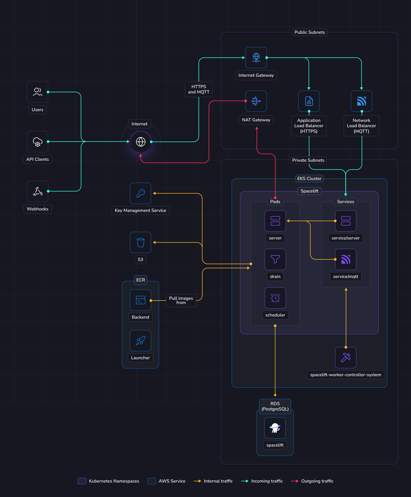

# Deploying to EKS

This guide provides a way to quickly get Spacelift up and running on an Elastic Kubernetes Service (EKS) cluster. In this guide we show a relatively simple networking setup where Spacelift is accessible via a public load balancer, but you can adjust this to meet your requirements as long as you meet the basic [networking requirements](../environment-requirements.md#configure-networking) for Spacelift.

To deploy Spacelift on EKS you need to take the following steps:

1. [Deploy your basic infrastructure components](#deploy-infrastructure).
2. [Push the Spacelift images to your Elastic Container Registry](#push-images-to-elastic-container-registry).
3. [Deploy the Spacelift backend services using our Helm chart](#deploy-spacelift).

## Overview

The illustration below shows what the infrastructure looks like when running Spacelift in EKS.

{ .on-glb }

### Networking

!!! info
    More details regarding networking requirements for Spacelift can be found on [this page](../reference/networking.md).

    This section will solely focus on how the EKS infrastructure will be configured to meet Spacelift's requirements.

In this guide we'll create a new VPC with public and private subnets. The public subnets will contain the following items to allow communication between Spacelift and the external internet:

- An [Application Load Balancer](https://docs.aws.amazon.com/elasticloadbalancing/latest/application/introduction.html){: rel="nofollow"} to allow inbound HTTPS traffic to reach the Spacelift server instances. This load balancer will be created automatically via a Kubernetes Ingress.
- An [Internet Gateway](https://docs.aws.amazon.com/vpc/latest/userguide/VPC_Internet_Gateway.html){: rel="nofollow"} to allow inbound access to the load balancer.
- A [NAT Gateway](https://docs.aws.amazon.com/vpc/latest/userguide/vpc-nat-gateway.html){: rel="nofollow"} to allow egress traffic from the Spacelift services.

The private subnets contain the Spacelift RDS Postgres database, along with the Spacelift Kubernetes pods and are not directly accessible via the internet.

### Object Storage

The Spacelift instance needs an object storage backend to store Terraform state files, run logs, and other things.
Several S3 buckets will be created in this guide. This is a hard requirement for running Spacelift.

Spacelift uses the AWS SDK default credential provider chain for S3 authentication, supporting environment variables, shared credential files and IAM roles for EKS. More details about object storage requirements and authentication can be found [here](../reference/object-storage.md).

### Database

Spacelift requires a PostgreSQL database to operate. In this guide we'll create a new Aurora Serverless RDS instance.
You can also reuse an existing instance and create a new database in it. In that case you'll have to adjust the database URL and other settings across the guide.
It's also up to you to configure appropriate networking to expose this database to Spacelift's VPC.

You can switch the `create_database` option to false in the terraform module to disable creating an RDS instance.

More details about database requirements for Spacelift can be found [here](../external-dependencies.md#database).

### EKS

In this guide, we'll create a new [EKS cluster](https://aws.amazon.com/eks/){: rel="nofollow"} to run Spacelift. The EKS cluster will use a very simple configuration including an internet-accessible public endpoint.

The following services will be deployed as Kubernetes pods:

- The scheduler.
- The drain.
- The server.

The scheduler is the component that handles recurring tasks. It creates new entries in a message queue when a new task needs to be performed.

The drain is an async background processing component that picks up items from the queue and processes events.

The server hosts the Spacelift GraphQL API, REST API and serves the embedded frontend assets. It also contains the MQTT server to handle interactions with workers. The server is exposed to the outside world using an Application Load Balancer for HTTP traffic, and a Network Load Balancer for MQTT traffic.

### Workers

In this guide Spacelift workers will also be deployed in EKS. That means that your Spacelift runs will be executed in the same environment as the app itself (we recommend using another K8s namespace).

If you want to run workers outside the EKS cluster created for Spacelift, you can set the `mqtt_broker_domain` option of the Terraform module below. In order for this to work, you will also need to perform some additional tasks like setting up a DNS record for the MQTT broker endpoint, and making the launcher image available to your external workers if you wish to run them in Kubernetes. If you're unsure what this entails, we recommend that you stick with the default option.

We highly recommend running your Spacelift workers within the same cluster, in a dedicated namespace. This simplifies the infrastructure deployment and makes it more secure since your runs are executed in the same environment.

## Requirements

Before proceeding with the next steps, the following tools must be installed on your computer.

- [AWS CLI v2](https://aws.amazon.com/cli/){: rel="nofollow"}.
- [Docker](https://docs.docker.com/engine/install/){: rel="nofollow"}.
- [Helm](https://helm.sh/docs/helm/helm_install/).
- [OpenTofu](https://opentofu.org/){: rel="nofollow"} or [Terraform](https://developer.hashicorp.com/terraform){: rel="nofollow"}.

!!! info
    In the following sections of the guide, OpenTofu will be used to deploy the infrastructure needed for Spacelift. If you are using Terraform, simply swap `tofu` for `terraform`.

### Server certificate

Spacelift should run under an HTTPS endpoint, so you need to provide a valid certificate to the Ingress resource deployed by Spacelift. In this guide we will assume that you already have an [ACM certificate](https://aws.amazon.com/certificate-manager/){: rel="nofollow"} for the domain that you wish to host Spacelift on.

!!! warning
    Please note, your certificate must be in the _Issued_ status before you will be able to access Spacelift.

## Deploy infrastructure

We provide a Terraform module to deploy Spacelift's [infrastructure requirements](https://github.com/spacelift-io/terraform-aws-eks-spacelift-selfhosted){: rel="nofollow"}.

Some parts of the module can be customized to avoid deploying parts of the infra in case you want to handle that yourself. For example, you may want to disable the database if you already have a Postgres instance and want to reuse it.

!!! note
    If you want to reuse an existing cluster, you can read [this section](https://github.com/spacelift-io/terraform-aws-eks-spacelift-selfhosted#use-an-existing-eks-cluster){: rel="nofollow"} of the EKS module.
    You'll need to deploy all the infrastructure [dependencies](../external-dependencies.md) (object storage and database) and make sure your cluster is able to reach them.

Before you start, set a few environment variables that will be used by the Spacelift modules:

```shell
# Extract this from your archive: self-hosted-v4.0.0.tar.gz
export TF_VAR_spacelift_version="v4.0.0"

# The AWS region you want to deploy Spacelift to.
export TF_VAR_aws_region="eu-west-1"

# Configure the Spacelift license
export TF_VAR_license_token="<license-received-from-Spacelift>"

# Set this to the domain name you want to access Spacelift from.
export TF_VAR_server_domain="spacelift.example.com"

# Uncomment and set the following domain if you want to run Spacelift workers outside of
# the EKS cluster Spacelift is running in.
#export TF_VAR_mqtt_broker_domain="mqtt.spacelift.example.com"

# Configure a default temporary admin account that could be used to setup the instance.
export TF_VAR_admin_username="admin"
export TF_VAR_admin_password="<password-here>"

# Set the following to the ARN of the AWS ACM certificate you want to use.
export TF_VAR_server_acm_arn="<ACM certificate ARN>"

# Uncomment the following line to enable automatically sharing usage data via our metrics endpoint.
# If you don't enable this, you can still export the usage data via the Web UI.
# export TF_VAR_spacelift_public_api="https://app.spacelift.io"
```

!!! note
    The admin login/password combination is only used for the very first login to the Spacelift instance. It can be removed after the initial setup. More information can be found in the [initial setup](./first-setup.md) section.

Below is an example of how to use this module:

```hcl
variable "spacelift_version" {
  type = string
}

variable "aws_region" {
  type = string
}

variable "license_token" {
  type      = string
  sensitive = true
}

variable "k8s_namespace" {
  type    = string
  default = "spacelift"
}

variable "server_domain" {
  type = string
}

variable "mqtt_broker_domain" {
  type    = string
  default = null
}

variable "admin_username" {
  type      = string
}

variable "admin_password" {
  type      = string
  sensitive = true
}

variable "server_acm_arn" {
  type        = string
}

terraform {
  required_providers {
    aws = {
      source  = "hashicorp/aws"
      version = "~> 5.0"
    }
  }
}

provider "aws" {
  region = var.aws_region

  default_tags {
    tags = {
      "app" = "spacelift-selfhosted"
    }
  }
}

module "spacelift" {
  source = "github.com/spacelift-io/terraform-aws-eks-spacelift-selfhosted?ref=v3.1.0"

  spacelift_version   = var.spacelift_version
  aws_region          = var.aws_region
  license_token       = var.license_token
  k8s_namespace       = var.k8s_namespace
  server_domain       = var.server_domain
  mqtt_broker_domain  = var.mqtt_broker_domain
  admin_username      = var.admin_username
  admin_password      = var.admin_password
  server_acm_arn      = var.server_acm_arn
  rds_engine_version  = "17.7"
  eks_upgrade_policy  = {
    support_type = "STANDARD"
  }
}
```

!!! info "EKS Upgrade Policy"
    The `eks_upgrade_policy` determines how your EKS cluster handles Kubernetes version upgrades when standard support ends.

    - **STANDARD**: Automatically upgrades to the next Kubernetes version when the 14-month standard support period ends. This option provides more frequent security patches and bug fixes at a lower cost.
    - **EXTENDED** (AWS default): Prevents automatic upgrades and keeps the cluster on the current version for an additional 12 months after standard support ends. This incurs higher costs and receives fewer updates.

    By explicitly setting `support_type = "STANDARD"` in the example above, you're opting out of AWS's default extended support behavior.

    **Important**: You can only change the upgrade policy while your cluster is running a Kubernetes version in standard support. Once a cluster version enters extended support, you cannot change the policy until you upgrade to a standard-supported version. For more details, see [AWS EKS extended support documentation](https://docs.aws.amazon.com/eks/latest/userguide/kubernetes-versions.html){: rel="nofollow"}.

```hcl
output "shell" {
  sensitive = true
  value     = module.spacelift.shell
}

output "kubernetes_ingress_class" {
  value = module.spacelift.kubernetes_ingress_class
}

output "kubernetes_secrets" {
  sensitive = true
  value     = module.spacelift.kubernetes_secrets
}

output "helm_values" {
  value     = module.spacelift.helm_values
}
```

Feel free to take a look at the documentation for the [terraform-aws-eks-spacelift-selfhosted](https://search.opentofu.org/module/spacelift-io/eks-spacelift-selfhosted/aws/latest){: rel="nofollow"} module before applying your infrastructure in case there are any settings that you wish to adjust. Once you are ready, apply your changes:

```shell
tofu apply
```

Once applied, you should grab all variables that need to be exported in the shell that will be used in next steps. We expose a `shell` output in terraform that you can source directly for convenience.

```shell
# Source in your shell all the required env vars to continue the installation process
$(tofu output -raw shell)
```

!!! info
    During this guide you'll export shell variables that will be useful in future steps. So please keep the same shell open for the entire guide.

## Push images to Elastic Container Registry

Assuming you have sourced the `shell` output as described in the previous section, you can run the following commands to upload the container images to your container registries and the launcher binary to the binaries S3 bucket:

```shell
# Login to the private ECR
aws ecr get-login-password --region "${AWS_REGION}" | docker login --username AWS --password-stdin "${PRIVATE_ECR_LOGIN_URL}"

tar -xzf self-hosted-${SPACELIFT_VERSION}.tar.gz -C .

docker image load --input="self-hosted-${TF_VAR_spacelift_version}/container-images/spacelift-launcher.tar"
docker tag "spacelift-launcher:${SPACELIFT_VERSION}" "${LAUNCHER_IMAGE}:${SPACELIFT_VERSION}"
docker push "${LAUNCHER_IMAGE}:${SPACELIFT_VERSION}"

docker image load --input="self-hosted-${TF_VAR_spacelift_version}/container-images/spacelift-backend.tar"
docker tag "spacelift-backend:${SPACELIFT_VERSION}" "${BACKEND_IMAGE}:${SPACELIFT_VERSION}"
docker push "${BACKEND_IMAGE}:${SPACELIFT_VERSION}"

# Uploading the launcher binary is only needed if you plan to run workers outside of Kubernetes, so
# you can skip the following command if you don't intend on doing that.
aws s3 cp --no-guess-mime-type "./self-hosted-${TF_VAR_spacelift_version}/bin/spacelift-launcher" "s3://${BINARIES_BUCKET_NAME}/spacelift-launcher"
```

## Deploy Spacelift

First, we need to configure Kubernetes credentials to interact with the EKS cluster.

```shell
# We set a kubeconfig so we do not interfere with any existing config.
export KUBECONFIG=${HOME}/.kube/config_spacelift
aws eks update-kubeconfig --name ${EKS_CLUSTER_NAME} --region ${AWS_REGION}
```

!!! warning
    Make sure the above `KUBECONFIG` environment variable is present when running the helm commands later in this guide.

### Create Kubernetes namespace

```shell
kubectl apply -f - <<EOF
apiVersion: v1
kind: Namespace
metadata:
  name: "$K8S_NAMESPACE"
  labels:
    eks.amazonaws.com/pod-readiness-gate-inject: "enabled"
EOF
```

!!! info
    In the command above, we're labelling the namespace with `eks.amazonaws.com/pod-readiness-gate-inject`. The reason
    for this is to enable [pod readiness gates](https://kubernetes-sigs.github.io/aws-load-balancer-controller/v2.4/deploy/pod_readiness_gate/){: rel="nofollow"}
    for the AWS load balancer controller. In addition the label key differs from the `elbv2.k8s.aws/pod-readiness-gate-inject`
    key mentioned in the load balancer controller docs because this guide is using EKS Auto.

    Pod readiness gates are optional, but can help to prevent situations where requests are routed to pods that aren't
    ready to handle them when using the AWS load balancer controller.

### Create IngressClass

To allow access to the Spacelift HTTP server via an AWS Application Load Balancer, we need to create an _IngressClassParams_ and _IngressClass_ resource to specify the subnets and ACM certificate to use. The Terraform module provides a `kubernetes_ingress_class` output for convenience that you can pass to `kubectl apply` to create the resources:

```shell
tofu output -raw kubernetes_ingress_class | kubectl apply -f -
```

### Create secrets

The Spacelift services need various environment variables to be configured to operate correctly.
In this guide we will create three Spacelift secrets to pass these variables to the Spacelift backend services:

- `spacelift-shared` - contains variables used by all services.
- `spacelift-server` - contains variables specific to the Spacelift server.
- `spacelift-drain` - contains variables specific to the Spacelift drain.

For convenience, the `terraform-aws-eks-spacelift-selfhosted` Terraform module provides a `kubernetes_secrets` output that you can pass to `kubectl apply` to create the secrets:

```shell
tofu output -raw kubernetes_secrets | kubectl apply -f -
```

To find out more about all of the configuration options that are available, please see the [reference section](../reference/README.md) of this documentation.

### Deploy application

You need to provide a number of configuration options to Helm when deploying Spacelift to configure it correctly for your environment. You can generate a Helm values.yaml file to use via the `helm_values` output variable of the `terraform-aws-eks-spacelift-selfhosted` Terraform module:

```shell
tofu output -raw helm_values > spacelift-values.yaml
```

Feel free to take a look at this file to understand what is being configured.
Once you're happy, run the following command to deploy Spacelift:

```shell
helm upgrade \
  --repo https://downloads.spacelift.io/helm \
  spacelift \
  spacelift-self-hosted \
  --install --wait --timeout 20m \
  --namespace "$K8S_NAMESPACE" \
  --values "spacelift-values.yaml"
```

!!! tip
    You can follow the deployment progress with: `kubectl logs -n ${K8S_NAMESPACE} deployments/spacelift-server`

Once the chart has deployed correctly, you can get the information you need to setup DNS entries for Spacelift. To get the domain name of the Spacelift application load balancer you can use the `ADDRESS` field from the `kubectl get ingresses` command, like in the following example:

```shell
$ kubectl get ingresses --namespace "$K8S_NAMESPACE"
NAME        CLASS   HOSTS                     ADDRESS                                                                    PORTS     AGE
server-v4   alb     spacelift.example.com     k8s-spacelif-serverv4-1234567890-1234567890.eu-west-1.elb.amazonaws.com    80, 443   5m32s
```

If you are using external workers, you can get the domain name of your MQTT broker from the `EXTERNAL-IP` field from the `kubectl get services` command, like in the following example:

```shell
$ kubectl get services --namespace "$K8S_NAMESPACE" "spacelift-mqtt"
NAME             TYPE           CLUSTER-IP      EXTERNAL-IP                                                               PORT(S)          AGE
spacelift-mqtt   LoadBalancer   172.20.252.37   k8s-spacelif-spacelif-1234567890-1234567890.elb.eu-north-1.amazonaws.com  1984:30498/TCP   5m49s
```

### Configure your DNS zone

You should now go ahead and create appropriate CNAME entries to allow access to your Spacelift and (if using external workers) MQTT addresses.

```zone
# This one is the main address of your Spacelift installation.
# It should be a CNAME to the server-v4 ingress (see above).
${TF_VAR_server_domain}                    300 IN  CNAME     <lb-name>.<region>.elb.amazonaws.com

# This one is the address of your MQTT endpoint.
# It should be a CNAME to the external IP of the spacelift-mqtt service (see above).
${TF_VAR_mqtt_broker_domain}               300 IN  CNAME     <lb-name>.elb.<region>.amazonaws.com
```

### VCS Gateway Service

Ideally, your VCS provider [should be accessible](../reference/networking.md) from both the Spacelift backend and its workers. If direct access is not possible, you can use [VCS Agent Pools](../../../concepts/vcs-agent-pools.md) to proxy the connections from the Spacelift backend to your VCS provider.

The VCS Agent Pool architecture introduces a VCS Gateway service, deployed alongside the Spacelift backend, and exposed via a dedicated Application Load Balancer. External VCS Agents connect to this load balancer over gRPC (port 443 with TLS termination), while internal Spacelift services (server, drain) communicate with the gateway via HTTP using pod IP addresses within the cluster.

To enable this setup, add the following variables to your module configuration:

```hcl
module "spacelift" {
  # VCS Gateway configuration
  vcs_gateway_domain  = "vcs-gateway.mycorp.io"  # The DNS record for the VCS Gateway service, without protocol.
  vcs_gateway_acm_arn = "<VCS Gateway certificate ARN>"  # Must be a valid, issued certificate (separate from the server certificate).

  # Other settings are omitted for brevity
}
```

After applying the Terraform changes, regenerate your `spacelift-values.yaml` from the `helm_values` output and redeploy the Helm chart to enable the VCS Gateway service.

Set up the DNS record for the VCS Gateway service. You can find the load balancer address from the ingress:

```shell
kubectl get ingresses --namespace "$K8S_NAMESPACE" spacelift-vcs-gateway
```

Create a CNAME record pointing your VCS Gateway domain to this load balancer address:

```zone
${TF_VAR_vcs_gateway_domain}               300 IN  CNAME     <vcs-gateway-lb-name>.<region>.elb.amazonaws.com
```

With the backend now configured, proceed to the [VCS Agent Pools guide](../../../concepts/vcs-agent-pools.md) to complete the setup.

## Next steps

Now that your Spacelift installation is up and running, take a look at the [initial installation](./first-setup.md) section for the next steps to take.

### Configure telemetry

You can configure telemetry collection to monitor your installation's performance and troubleshoot issues. See our [telemetry configuration guides](./telemetry/README.md) for step-by-step instructions on setting up Datadog, OpenTelemetry with Jaeger, or OpenTelemetry with Grafana Stack.

### Create a worker pool

We recommend that you deploy workers in a dedicated namespace.

```shell
# Choose a namespace to deploy the workers to
export K8S_WORKER_POOL_NAMESPACE="spacelift-workers"
kubectl create namespace $K8S_WORKER_POOL_NAMESPACE --dry-run=client -o yaml | kubectl apply -f -
```

!!! warning
    When creating your `WorkerPool`, make sure **[to configure resources](../../../concepts/worker-pools/kubernetes-workers.md#run-pods)**. This is highly recommended because otherwise very high resources requests can be set automatically by your admission controller.

    Also make sure to deploy the WorkerPool and its secrets into **the correct namespace** we just created by adding `-n ${K8S_WORKER_POOL_NAMESPACE}` to the commands in the guide below.

➡️ **You need to follow this guide for configuring [Kubernetes Workers](../../../concepts/worker-pools/kubernetes-workers.md).**

## Deletion / uninstall

Before running `tofu destroy` on the infrastructure, it is recommended to do a proper clean-up in the K8s cluster. That's because the Spacelift helm chart creates some AWS resources (such as load balancers) that are not managed by Terraform. If you do not remove them from K8s, `tofu destroy` will complain because some resources like networks cannot be removed if not empty.

```shell
helm uninstall -n $K8S_NAMESPACE spacelift
kubectl delete namespace $K8S_WORKER_POOL_NAMESPACE
kubectl delete namespace $K8S_NAMESPACE
```

!!! note
    Namespace deletions in Kubernetes can take a while or even get stuck. If that happens, you need to remove the finalizers from the stuck resources.

Before running `tofu destroy` on the infrastructure, you may want to set the following properties for the terraform-aws-spacelift-selfhosted module to allow the RDS, ECR and S3 resources to be cleaned up properly:

```hcl
module "spacelift" {
  source = "github.com/spacelift-io/terraform-aws-eks-spacelift-selfhosted?ref=v3.1.0"

  # Other settings..

  rds_delete_protection_enabled = false
  s3_retain_on_destroy          = false
  ecr_force_delete              = true
}
```

Remember to apply those changes before running `tofu destroy`.
