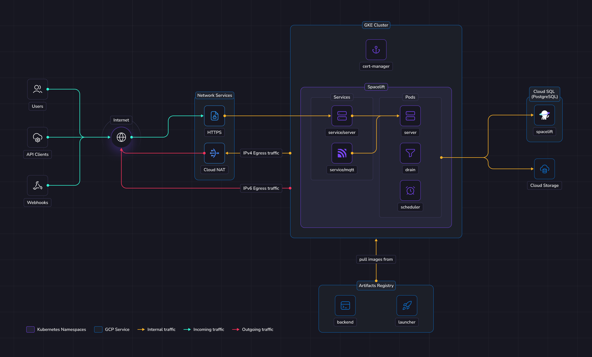
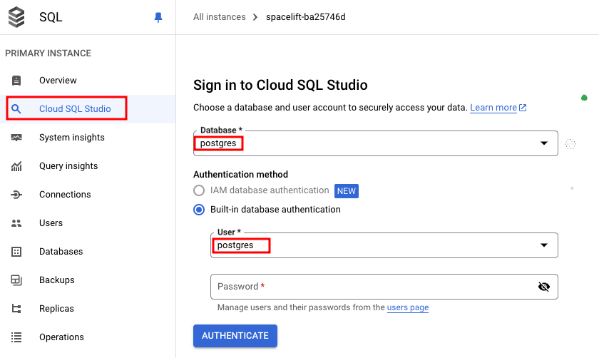

# Deploying to GKE

This guide provides a way to quickly get Spacelift up and running on a Google Kubernetes Engine (GKE) cluster. In this guide we show a relatively simple networking setup where Spacelift is accessible via a public load balancer, but you can adjust this to meet your requirements as long as you meet the basic [networking requirements](../environment-requirements.md#configure-networking) for Spacelift.

To deploy Spacelift on GKE you need to take the following steps:

1. [Deploy your cluster and other infrastructure components](#deploy-infrastructure).
2. [Push the Spacelift images to your artifact registry](#push-images-to-artifact-registry).
3. [Deploy the Spacelift backend services using our Helm chart](#deploy-spacelift).

## Overview

The illustration below shows what the infrastructure looks like when running Spacelift in GKE.

{ .on-glb }

### Networking

!!! info
    More details regarding networking requirements for Spacelift can be found on [this page](../reference/networking.md).

    This section will solely focus on how the GCP infrastructure will be configured to meet Spacelift's requirements.

In this guide we'll create a new VPC network and subnetwork to allocate IPs for nodes, pods and services running in the cluster. We'll create a GKE [VPC native](https://cloud.google.com/kubernetes-engine/docs/concepts/alias-ips){: rel="nofollow"} cluster.

The Spacelift instance deployed in this guide is dual stack IPv4/IPv6. That's why for example we'll allocate two static addresses, and create two `Ingress` resources.

The IPv4 outgoing traffic is handled with SNAT. For that we'll deploy a Cloud NAT component in GCP.
For IPv6 traffic, each pod will have its own publicly routable address, so no further action is needed here.

The database will be allocated a private IP in the VPC, and we'll connect to this from pods running in the cluster using cloud-sql-proxy.

Incoming HTTPS traffic will be handled by Load balancers. Those load balancers are automatically created when deploying Ingress resources in the cluster.
They will bind reserved static v4 and v6 IP addresses that you can add to your DNS zone.

!!! warning
    Although load balancers may appear ready to handle traffic immediately after setup, there is often a brief delay before traffic is routed correctly. If the setup is complete but you are experiencing connection reset issues, please wait at least five minutes before starting your investigation.

It's also possible to deploy Spacelift in an existing VPC, for that you need to set `enable_network` option to `false`, and provide your own network.

<details> <!-- markdownlint-disable-line MD033 -->
<summary>Terraform code example</summary> <!-- markdownlint-disable-line MD033 -->

```hcl
resource "google_compute_network" "default" {
  name                     = "test"
  auto_create_subnetworks  = false
  enable_ula_internal_ipv6 = true
}

resource "google_compute_subnetwork" "default" {
  name             = "test"
  network          = google_compute_network.default.id
  region           = var.region
  stack_type       = "IPV4_IPV6"
  ipv6_access_type = "EXTERNAL"
  ip_cidr_range    = "10.0.0.0/16"

  # Those ranges are required for GKE
  secondary_ip_range {
    range_name = "services"
    ip_cidr_range = "192.168.16.0/22"
  }
  secondary_ip_range {
    range_name = "pods"
    ip_cidr_range = "192.168.0.0/20"
  }
}

module "spacelift" {
  source = "github.com/spacelift-io/terraform-google-spacelift-selfhosted?ref=v1.0.0"

  region         = var.region
  project        = var.project
  website_domain = var.app_domain
  database_tier  = "db-f1-micro"

  enable_network = false
  network        = google_compute_network.default
  subnetwork     = google_compute_subnetwork.default
}
```

</details>

### Object Storage

The Spacelift instance needs an object storage backend to store Terraform state files, run logs, and other things.
Several Google Storage buckets will be created in this guide. This is a hard requirement for running Spacelift.

Spacelift uses Application Default Credentials (ADC) for Google Cloud Storage authentication, supporting multiple credential sources including attached service accounts and Workload Identity Federation for GKE environments. More details about object storage requirements and authentication can be found [here](../reference/object-storage.md).

### Database

Spacelift requires a PostgreSQL database to operate. In this guide we'll create a new dedicated Cloud SQL instance.
You can also reuse an existing instance and create a new database in it. In that case you'll have to adjust the database URL and other settings across the guide.
It's also up to you to configure appropriate networking to expose this database to Spacelift's VPC.

You can switch the `enable_database` option to false in the terraform module to ask not create a Cloud SQL instance.

More details about database requirements for Spacelift can be found [here](../external-dependencies.md#database).

### GKE

In this guide, we'll deploy a new [autopilot](https://cloud.google.com/kubernetes-engine/docs/concepts/autopilot-overview){: rel="nofollow"} GKE cluster to deploy Spacelift. The Spacelift application can be deployed using a Helm chart.
The chart will deploy 3 main components:

- The scheduler.
- The drain.
- The server.

The scheduler is the component that handles recurring tasks. It creates new entries in a message queue when a new task needs to be performed.

The drain is an async background processing component that picks up items from the queue and processes events.

The server hosts the Spacelift GraphQL API, REST API and serves the embedded frontend assets. It also contains the MQTT server to handle interactions with workers. The server is exposed to the outside world using a `Ingress` resources. There is also a MQTT `Service` to exposes the broker to workers.

This MQTT Service is a `ClusterIP` by default, but can be switched to a `LoadBalancer` if you need to expose the MQTT service to workers from the outside of the VPC.

If you have a cluster running already, it's also possible to deploy Spacelift in it.
For that, you can set `enable_gke` options to `false` and provide a reference to your own resources.

You may also want to disable creation of a new VPC and set `enable_network` to `false`. See [networking](#networking) section above for more details.

In that situation, you need to provide a `node_service_account` input that should reference the service account used by your cluster nodes.
This is used to grant your nodes permission to pull images from the artifact registry repository that will contain Spacelift docker images.

<details> <!-- markdownlint-disable-line MD033 -->
<summary>Terraform code example</summary> <!-- markdownlint-disable-line MD033 -->

```hcl
resource "google_compute_network" "default" {
  name                     = "test"
  auto_create_subnetworks  = false
  enable_ula_internal_ipv6 = true
}

resource "google_service_account" "gke-nodes" {
  account_id = "gke-nodes"
}

module "spacelift" {
  source = "github.com/spacelift-io/terraform-google-spacelift-selfhosted?ref=v1.0.0"

  region         = var.region
  project        = var.project
  website_domain = var.app_domain
  database_tier  = "db-f1-micro"

  enable_gke           = false
  enable_network       = false
  node_service_account = google_service_account.gke-nodes
  network              = google_compute_network.default
}
```

</details>

### Workers

In this guide Spacelift workers will also be deployed in GKE.
That means that your Spacelift runs will be executed in the same environment as the app itself (we recommend using another K8s namespace).

If you want to run workers from the outside of the VPC, you can switch the `enable_external_workers` option of the Terraform module below.
Then you'll have to do some extra step and configuration while following the guide. If you're unsure what this entails, it is recommended to stick with the default option.

We highly recommend running your Spacelift workers within the same cluster, in a dedicated namespace. This simplifies the infrastructure deployment and makes it more secure since your runs are executed in the same environment.

## Requirements

Before proceeding with the next steps, the following tools must be installed on your computer.

- [Google Cloud CLI](https://cloud.google.com/sdk/docs/install){: rel="nofollow"}.
- [Docker](https://docs.docker.com/engine/install/){: rel="nofollow"}.
- [Helm](https://helm.sh/docs/helm/helm_install/){: rel="nofollow"}.
- [OpenTofu](https://opentofu.org/){: rel="nofollow"} or [Terraform](https://developer.hashicorp.com/terraform){: rel="nofollow"}.

!!! info
    In the following sections of the guide, OpenTofu will be used to deploy the infrastructure needed for Spacelift. If you are using Terraform, simply swap `tofu` for `terraform`.

## Generate encryption key

Spacelift requires an RSA key to encrypt sensitive information stored in the Postgres database. Please follow the instructions in the [RSA Encryption](../reference/encryption.md#rsa) section of our reference documentation to generate a new key.

## Deploy infrastructure

We provide a [Terraform module](https://github.com/spacelift-io/terraform-google-spacelift-selfhosted){: rel="nofollow"} to help you deploy Spacelift's infrastructure requirements.
Some parts of this module can be customized to avoid deploying part of the infra in case you want to handle that yourself.
For example, you may want to disable the database if you already have a Cloud SQL instance and want to reuse it.

Before you start, set a few environment variables that will be used by the Spacelift modules:

```shell
# Extract this from your archive: self-hosted-v3.0.0.tar.gz
export TF_VAR_spacelift_version="v3.0.0"

# Configure a default temporary admin account that could be used to setup the instance.
export TF_VAR_admin_username="admin"
export TF_VAR_admin_password="<password-here>"

# Configure the Spacelift license
export TF_VAR_license_token="<license-received-from-Spacelift>"

# Set this to the base64-encoded RSA private key that you generated earlier in the "Generate encryption key" section of this guide.
export TF_VAR_encryption_rsa_private_key="<base64-encoded-private-key>"

# Set this to the GCP region you want to deploy your infrastructure to, e.g. europe-west6.
export TF_VAR_region="<gcp-region>"

# Set this to the name of your GCP project.
export TF_VAR_project="<project>"

# Uncomment the following line to enable automatically sharing usage data via our metrics endpoint.
# If you don't enable this, you can still export the usage data via the Web UI.
# export TF_VAR_spacelift_public_api="https://app.spacelift.io"
```

!!! note
    The admin login/password combination is only used for the very first login to the Spacelift instance. It can be removed after the initial setup. More information can be found in the [initial setup](./first-setup.md) section.

Below is a small example of how to use this module:

```hcl
variable "spacelift_version" {
  type = string
}

variable "license_token" {
  type      = string
  sensitive = true
}

variable "encryption_rsa_private_key" {
  type      = string
  sensitive = true
}

# Do not prefix with https://
# e.g.: spacelift.mycompany.com
variable "website_domain" {
  type = string
}

variable "admin_username" {
  type      = string
}

variable "admin_password" {
  type      = string
  sensitive = true
}

variable "region" {
  type = string
}

variable "project" {
  type = string
}

provider "google" {
  region         = var.region
  project        = var.project
  default_labels = { "app" = "spacelift" }
}

module "spacelift" {
  source = "github.com/spacelift-io/terraform-google-spacelift-selfhosted?ref=v1.0.0"

  region                     = var.region
  project                    = var.project
  website_domain             = var.website_domain
  database_tier              = "db-f1-micro"
  enable_external_workers    = false # Switch to true to enable running workers outside of the VPC.
  spacelift_version          = var.spacelift_version
  license_token              = var.license_token
  encryption_rsa_private_key = var.encryption_rsa_private_key
  k8s_namespace              = "spacelift"
  admin_username             = var.admin_username
  admin_password             = var.admin_password
}

output "shell" {
  value     = module.spacelift.shell
  sensitive = true
}

output "kubernetes_secrets" {
  sensitive = true
  value     = module.spacelift.kubernetes_secrets
}

output "helm_values" {
  value     = module.spacelift.helm_values
}
```

Feel free to take a look at the documentation for the [terraform-google-spacelift-selfhosted](https://search.opentofu.org/module/spacelift-io/spacelift-selfhosted/google/latest){: rel="nofollow"} module before applying your infrastructure in case there are any settings that you wish to adjust. Once you are ready, apply your changes:

```shell
tofu apply
```

!!! info
    If you encounter the following error:
    ```googleapi: Error 400: Service account service-xxxxxxxxxxxx@service-networking.iam.gserviceaccount.com does not exist```,
    it means that the Service Networking service account was not created for your project.
    To manually provision this service account, run the following command:
    ```shell
    # Replace YOUR_PROJECT_ID with your actual GCP project ID. This command will create the required managed service account so it can be used in IAM policies and network configurations.
    gcloud beta services identity create \
      --service=servicenetworking.googleapis.com \
      --project=YOUR_PROJECT_ID
    ```

Once applied, you should grab all variables that need to be exported in the shell that will be used in next steps. We expose a `shell` output in terraform that you
can source directly for convenience.

```shell
# Source in your shell all the required env vars to continue the installation process
$(tofu output -raw shell)
```

!!! info
    During this guide you'll export shell variables that will be useful in future steps. So please keep the same shell open for the entire guide.

### Configure your DNS zone

Configure the following records in your DNS zone. The `${PUBLIC_IP_ADDRESS}` and `${PUBLIC_IPV6_ADDRESS}` environment variables should be available in your shell from the previous step.

```zone
spacelift.example.com        3600 IN  A     ${PUBLIC_IP_ADDRESS}
spacelift.example.com        3600 IN  AAAA  ${PUBLIC_IPV6_ADDRESS}

; Optional - only if you enabled external workers
mqtt.spacelift.example.com   3600 IN  A     ${MQTT_IP_ADDRESS}
mqtt.spacelift.example.com   3600 IN  AAAA  ${MQTT_IPV6_ADDRESS}
```

!!! info
    It is useful to configure these entries ASAP since they will be used by the Let's Encrypt handshake later. So it's better to do this right now, and continue the setup while records are being propagated.

### Configure database

We need to grant privileges to the SQL user to be able to create roles. The Spacelift application runs DB migrations on startup, and it needs to be able to create certain objects in the database.

As of now, there are two ways to do that. Either in the UI or locally using the `cloud-sql-proxy`.

=== "Cloud console"

    You need to click on the database instance in the GCP console, then go to the `Cloud SQL Studio` tab on the left. Choose `postgres` database, use `postgres` as username and the root password from the Terraform module's output (`$DB_ROOT_PASSWORD`).

    

    Replace the variables with the ones from Terraform output, and execute following queries:

    ```sql
    ALTER USER "$DATABASE_USER" CREATEROLE;
    GRANT ALL PRIVILEGES ON DATABASE "$DATABASE_NAME" TO "$DATABASE_USER";
    ```

=== "Locally with cloud-sql-proxy"

    You can find more info about how to install cloud-sql-proxy in the [official documentation](https://cloud.google.com/sql/docs/postgres/connect-instance-auth-proxy){: rel="nofollow"}.

    ```shell
    # Runs the proxy in the background
    ./cloud-sql-proxy ${DATABASE_CONNECTION_NAME}&

    # Grant sql user permissions to the database
    PGPASSWORD=${DB_ROOT_PASSWORD} \
        psql -h 127.0.0.1 -U postgres -c "ALTER USER \"${DATABASE_USER}\" CREATEROLE; GRANT ALL PRIVILEGES ON DATABASE \"${DATABASE_NAME}\" TO \"${DATABASE_USER}\";"

    # Stop the cloud sql proxy
    kill %1
    ```

## Push images to Artifact Registry

From the previous terraform apply step, you need to grab the URL of the registry from the output and push our docker images to it.

```shell
# Login to Google Artifact Registry
gcloud auth login
gcloud auth configure-docker ${ARTIFACT_REGISTRY_DOMAIN}
```

```shell
tar -xzf self-hosted-${SPACELIFT_VERSION}.tar.gz -C .

docker image load --input="self-hosted-${TF_VAR_spacelift_version}/container-images/spacelift-launcher.tar"
docker tag "spacelift-launcher:${SPACELIFT_VERSION}" "${LAUNCHER_IMAGE}:${SPACELIFT_VERSION}"
docker push "${LAUNCHER_IMAGE}:${SPACELIFT_VERSION}"

docker image load --input="self-hosted-${TF_VAR_spacelift_version}/container-images/spacelift-backend.tar"
docker tag "spacelift-backend:${SPACELIFT_VERSION}" "${BACKEND_IMAGE}:${SPACELIFT_VERSION}"
docker push "${BACKEND_IMAGE}:${SPACELIFT_VERSION}"
```

## Deploy Spacelift

First, we need to configure Kubernetes credentials to interact with the GKE cluster.

```shell
# We set a kubeconfig so we do not mess up with any existing config.
export KUBECONFIG=${HOME}/.kube/config_spacelift
gcloud container clusters get-credentials ${GKE_CLUSTER_NAME} --location ${GCP_LOCATION} --project ${GCP_PROJECT}
```

!!! warning
    Make sure the above `KUBECONFIG` environment variable is present when running following helm commands.

### Cert manager

Spacelift should run under valid HTTPS endpoints, so you need to provide valid certificates to Ingress resources deployed by Spacelift.
One simple way to achieve that is to use cert-manager to generate [Let's Encrypt](https://letsencrypt.org/){: rel="nofollow"} certificates.

If you already have cert-manager running in your cluster and know how to configure Certificates on Ingress resources, you can skip this step.

```shell
helm repo add jetstack https://charts.jetstack.io --force-update

helm upgrade \
    --install \
    cert-manager jetstack/cert-manager \
    --namespace cert-manager \
    --create-namespace \
    --version v1.16.2 \
    --set crds.enabled=true \
    --set global.leaderElection.namespace=cert-manager \
    --set resources.requests.cpu=100m \
    --set resources.requests.memory=256Mi \
    --set webhook.resources.requests.cpu=100m \
    --set webhook.resources.requests.memory=256Mi \
    --set cainjector.resources.requests.cpu=100m \
    --set cainjector.resources.requests.memory=256Mi
```

!!! info
    Note that this command can take a few minutes to finish as GKE scales up itself to be able to run the pods.

Next, we will configure an issuer to tell cert-manager how to generate certificates.
In this guide we'll use [ACME](https://cert-manager.io/docs/configuration/acme/){: rel="nofollow"} with Let's Encrypt and [HTTP01 challenges](https://letsencrypt.org/docs/challenge-types/){: rel="nofollow"}.

!!! note
    It is highly recommended to test against the Let's Encrypt staging environment before using the production environment.
    This will allow you to get things right before issuing trusted certificates and reduce the chance of hitting rate limits.
    Note that the staging root CA is untrusted by browsers, and Spacelift workers won't be able to connect to the server endpoint either.

=== "Production"

    ```shell
    export ACME_EMAIL="your email"

    kubectl apply -f - <<EOF
    apiVersion: cert-manager.io/v1
    kind: ClusterIssuer
    metadata:
      name: letsencrypt-prod
    spec:
      acme:
        email: $ACME_EMAIL
        server: https://acme-v02.api.letsencrypt.org/directory
        privateKeySecretRef:
          name: prod-issuer-account-key
        solvers:
        - http01:
            ingress:
              ingressClassName: nginx
    EOF
    ```

=== "Staging (optional)"

    ```shell
    export ACME_EMAIL="your email"

    kubectl apply -f - <<EOF
    apiVersion: cert-manager.io/v1
    kind: ClusterIssuer
    metadata:
      name: letsencrypt-staging
    spec:
      acme:
        email: $ACME_EMAIL
        server: https://acme-staging-v02.api.letsencrypt.org/directory
        privateKeySecretRef:
          name: staging-issuer-account-key
        solvers:
        - http01:
            ingress:
              ingressClassName: nginx
    EOF
    ```

### Install Spacelift

### Create Kubernetes namespace

```shell
kubectl create namespace $K8S_NAMESPACE --dry-run=client -o yaml | kubectl apply -f -
```

### Create secrets

The Spacelift services need various environment variables to be configured in order to function correctly.
In this guide we will create three Spacelift secrets to pass these variables to the Spacelift backend services:

- `spacelift-shared` - contains variables used by all services.
- `spacelift-server` - contains variables specific to the Spacelift server.
- `spacelift-drain` - contains variables specific to the Spacelift drain.

For convenience, the `terraform-google-spacelift-selfhosted` Terraform module provides a kubernetes_secrets output that you can pass to kubectl apply to create the secrets:

```shell
tofu output -raw kubernetes_secrets > secrets.yaml
# If you are deploying your own database outside of the provided OpenTofu module, you also have to provide following vars
# for the spacelift-shared secret.
#
# - DATABASE_URL
# - DATABASE_READ_ONLY_URL (optional, only if you want to have a read replica)
kubectl apply -f secrets.yaml
```

### Deploy application

You need to provide a number of configuration options to Helm when deploying Spacelift to configure it correctly for your environment.
You can generate a Helm values.yaml file to use via the `helm_values` output variable of the `terraform-google-spacelift-selfhosted` Terraform module:

```shell
tofu output -raw helm_values > spacelift-values.yaml
```

Feel free to take a look at this file to understand what is being configured.
Once you're happy, run the following command to deploy Spacelift:

```shell
helm upgrade \
  --repo https://downloads.spacelift.io/helm \
  spacelift \
  spacelift-self-hosted \
  --install --wait --timeout 20m \
  --namespace "$K8S_NAMESPACE" \
  --values "spacelift-values.yaml"
```

!!! tip
    You can follow the deployment progress with: `kubectl logs -n ${K8S_NAMESPACE} deployments/spacelift-server`

## Next steps

Now that your Spacelift installation is up and running, take a look at the [initial installation](./first-setup.md) section for the next steps to take.

### Create a worker pool

We recommend that you deploy workers in a dedicated namespace.

```shell
# Choose a namespace to deploy the workers to
export K8S_WORKER_POOL_NAMESPACE="spacelift-workers"
kubectl create namespace $K8S_WORKER_POOL_NAMESPACE --dry-run=client -o yaml | kubectl apply -f -
```

!!! warning
    When creating your `WorkerPool`, make sure **[to configure resources](../../../concepts/worker-pools/kubernetes-workers.md#run-pods)**. This is highly recommended because otherwise very high resources requests can be set automatically by your admission controller.

    Also make sure to deploy the WorkerPool and its secrets into **the correct namespace** we just created by adding `-n ${K8S_WORKER_POOL_NAMESPACE}` to the commands in the guide below.

➡️ **You need to follow this guide for configuring [Kubernetes Workers](../../../concepts/worker-pools/kubernetes-workers.md).**

## Deletion / uninstall

Before running `tofu destroy` on the infrastructure, we recommend that you remove the Spacelift resources from your Kubernetes cluster. This is because the Spacelift helm chart creates some GCP resources (such as a network endpoint group) that are not managed by Terraform. If you do not remove them from Kubernetes, `tofu destroy` will complain because some resources like networks cannot be removed if not empty.

!!! note
    The `database_deletion_protection` variable in the Terraform module controls whether the database can be automatically deleted. If set to `true` — or if omitted, as it defaults to `true` — the database **will be protected from deletion**. This means running `tofu destroy` **will not delete** the database, and you will need to remove it manually.

```shell
helm uninstall -n $K8S_NAMESPACE spacelift
helm uninstall -n cert-manager cert-manager
kubectl delete namespace $K8S_WORKER_POOL_NAMESPACE
kubectl delete namespace $K8S_NAMESPACE
kubectl delete namespace cert-manager

tofu destroy
```

!!! note
    Namespace deletions in Kubernetes can take a while or even get stuck. If that happens, you need to remove the finalizers from the stuck resources.
