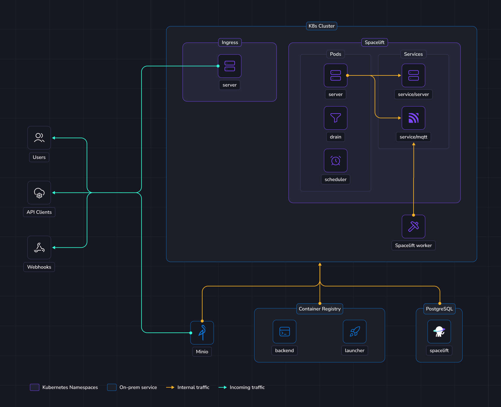
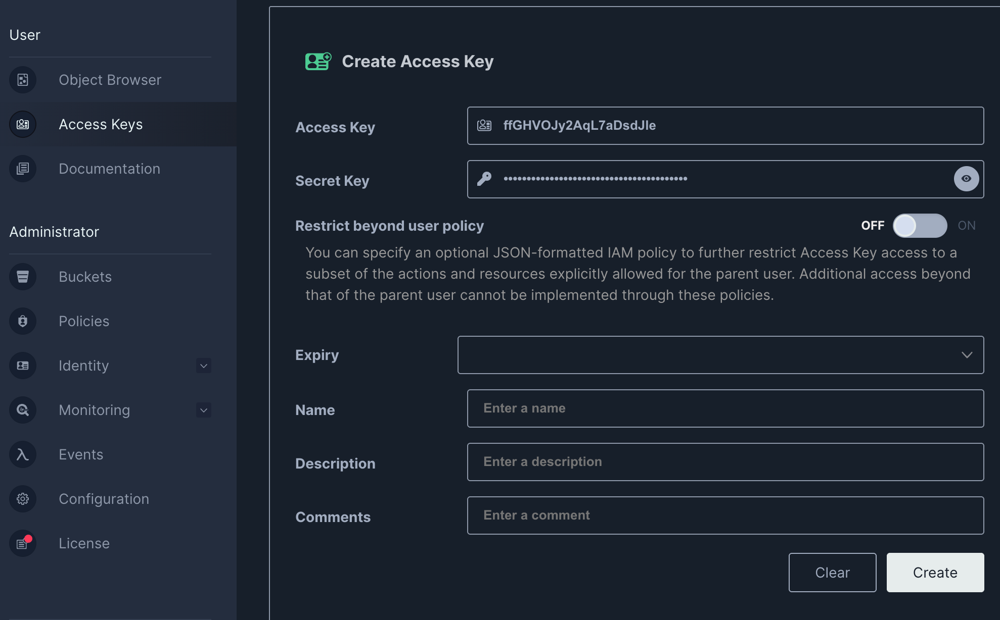

# Deploying to an on-prem Kubernetes cluster

This guide provides a way to quickly get Spacelift up and running on your Kubernetes cluster.

To deploy Spacelift on-premises, you need to take the following steps:

1. [Push the Spacelift images to your container registry](#push-images-to-container-registry).
2. [Create buckets and lifetime policies in MinIO](#setup-required-buckets-in-minio)
3. [Deploy the Spacelift backend services using our Helm chart](#deploy-spacelift).

## Overview

The illustration below shows what the infrastructure looks like when running Spacelift in the Kubernetes cluster.

{ .on-glb }

### Networking

More details regarding networking requirements for Spacelift can be found on [this page](../reference/networking.md).

### Object Storage

The Spacelift instance needs an object storage backend to store Terraform state files, run logs, and other artifacts.
For on-premises deployment, we expect that MinIO will be deployed in your cluster.
Please check the official [docs](https://min.io/docs/minio/kubernetes/upstream/index.html){: rel="nofollow"} for deployment options.

#### Exposing MinIO

MinIO should also be exposed outside the cluster to make presigned URLs accessible to clients, such as users [uploading state files](../../../concepts/stack/creating-a-stack.md#terraform),
workers downloading workspaces as well as `spacectl`'s [local preview feature](../../../concepts/stack/stack-settings.md#enable-local-preview).

You must configure **CORS policies** on the MinIO side to allow your Spacelift installation to perform cross-origin requests.
Indeed, files uploaded from the browser are directly sent to the MinIO endpoint without going through Spacelift.

!!! warning
    Spacelift adds metadata on uploaded objects using underscore in their names. Some reverse proxies filter out those headers, and that might cause uploads to fail.

    If you are deploying [ingress-nginx](https://github.com/kubernetes/ingress-nginx){: rel="nofollow"} using Helm to expose your MinIO instance, you need to configure the following values:

    ```yaml
    # values.yml
    controller:
      config:
        enable-underscores-in-headers: "true"
    ```

You must provide [the required buckets](#setup-required-buckets-in-minio) as this is a hard requirement for running Spacelift.

### Database

Spacelift requires a PostgreSQL database to operate.

More details about database requirements for Spacelift can be found [here](../external-dependencies.md#database).

### Kubernetes

The Spacelift application can be deployed using a Helm chart.
The chart will deploy the 3 main components:

- The scheduler.
- The drain.
- The server.

The scheduler is the component that handles recurring tasks. It creates new entries in a message queue when a new task needs to be performed.

The drain is an async background processing component that picks up items from message queues and processes events.

The server hosts the Spacelift GraphQL API, REST API and serves the embedded frontend assets.
It also contains the MQTT server to handle interactions with workers.
The server is exposed to the outside world using an `Ingress` resource. There is also an MQTT `Service` that exposes the broker to workers.

### Workers

In this guide, Spacelift workers will also be deployed in your Kubernetes cluster.
That means your Spacelift runs will be executed in the same environment as the app itself (we recommend using a separate K8s namespace).

We highly recommend running your Spacelift workers within the same cluster, in a dedicated namespace.
This simplifies the infrastructure deployment and makes it more secure since your runs are executed in the same environment since you don't need to expose [the MQTT server](../reference/mqtt-broker.md#mqtt-broker) with a load balancer.

## Requirements

Before proceeding with the next steps, the following tools must be installed on your computer:

- [Docker](https://docs.docker.com/engine/install/){: rel="nofollow"}
- [Helm](https://helm.sh/docs/helm/helm_install/){: rel="nofollow"}
- [OpenTofu](https://opentofu.org/){: rel="nofollow"} or [Terraform](https://www.terraform.io/){: rel="nofollow"}

## Generate encryption key

Spacelift requires an RSA key to encrypt sensitive information stored in the Postgres database. Please follow the instructions in the [RSA Encryption](../reference/encryption.md#rsa) section of our reference documentation to generate a new key.

## Init

Before you start, set a few environment variables that will be used in this guide:

```shell
# Extract this from your archive: self-hosted-v3.0.0.tar.gz
export SPACELIFT_VERSION="v3.0.0"

export SERVER_DOMAIN="your domain of self-hosted Spacelift"

# The Kubernetes namespace to deploy Spacelift to
export K8S_NAMESPACE="spacelift"

# Configure a default temporary admin account that could be used to setup the instance.
export ADMIN_USERNAME="admin"
export ADMIN_PASSWORD="<password-here>"

# Configure the Spacelift license
export LICENSE_TOKEN="<license-received-from-Spacelift>"

# Set this to the base64-encoded RSA private key that you generated earlier in the "Generate encryption key" section of this guide.
export ENCRYPTION_RSA_PRIVATE_KEY="<base64-encoded-private-key>"

```

## Push images to Container Registry

You need to provide container registries for the backend image and the launcher image.
This script assumes that you are logged in into your registry.

```shell

export LAUNCHER_IMAGE="your docker registry address for the launcher image"
export BACKEND_IMAGE="your docker registry address for the backend image"

tar -xzf self-hosted-${SPACELIFT_VERSION}.tar.gz -C .

docker image load --input="self-hosted-${SPACELIFT_VERSION}/container-images/spacelift-launcher.tar"
docker tag "spacelift-launcher:${SPACELIFT_VERSION}" "${LAUNCHER_IMAGE}:${SPACELIFT_VERSION}"
docker push "${LAUNCHER_IMAGE}:${SPACELIFT_VERSION}"

docker image load --input="self-hosted-${SPACELIFT_VERSION}/container-images/spacelift-backend.tar"
docker tag "spacelift-backend:${SPACELIFT_VERSION}" "${BACKEND_IMAGE}:${SPACELIFT_VERSION}"
docker push "${BACKEND_IMAGE}:${SPACELIFT_VERSION}"
```

## Setup required buckets in MinIO

You need to create all [the required buckets](../reference/object-storage.md) in MinIO. This can be done using a few different options:

- Using the MinIO mc client
- Using OpenTofu or Terraform
- Manually in the MinIO console

Here is a minimum example using Terraform:

<details><!-- markdownlint-disable-line MD033 -->
<summary>Click to expand Terraform code for MinIO buckets</summary><!-- markdownlint-disable-line MD033 -->

```terraform
terraform {
  required_providers {
    minio = {
      source  = "aminueza/minio"
      version = "3.5.0"
    }
  }
}

provider "minio" {
}

variable "retain_on_destroy" {
  default = false
}

resource "minio_s3_bucket" "binaries" {
  bucket        = "spacelift-binaries"
  force_destroy = !var.retain_on_destroy
}

resource "minio_s3_bucket" "deliveries" {
  bucket        = "spacelift-deliveries"
  force_destroy = !var.retain_on_destroy
}

resource "minio_s3_bucket" "large_queue" {
  bucket        = "spacelift-large-queue-messages"
  force_destroy = !var.retain_on_destroy
}

resource "minio_s3_bucket" "metadata" {
  bucket        = "spacelift-metadata"
  force_destroy = !var.retain_on_destroy
}

resource "minio_s3_bucket" "modules" {
  bucket        = "spacelift-modules"
  force_destroy = !var.retain_on_destroy
}

resource "minio_s3_bucket" "policy" {
  bucket        = "spacelift-policy-inputs"
  force_destroy = !var.retain_on_destroy
}

resource "minio_s3_bucket" "run_logs" {
  bucket        = "spacelift-run-logs"
  force_destroy = !var.retain_on_destroy
}

resource "minio_s3_bucket" "states" {
  bucket        = "spacelift-states"
  force_destroy = !var.retain_on_destroy
}

resource "minio_s3_bucket" "uploads" {
  bucket        = "spacelift-uploads"
  force_destroy = !var.retain_on_destroy
}

resource "minio_s3_bucket" "user_uploads" {
  bucket        = "spacelift-user-uploaded-workspaces"
  force_destroy = !var.retain_on_destroy
}

resource "minio_s3_bucket" "workspace" {
  bucket        = "spacelift-workspaces"
  force_destroy = !var.retain_on_destroy
}

resource "minio_s3_bucket_versioning" "binaries" {
  bucket = minio_s3_bucket.binaries.bucket
  versioning_configuration {
    status = "Enabled"
  }
}

resource "minio_s3_bucket_versioning" "modules" {
  bucket = minio_s3_bucket.modules.bucket
  versioning_configuration {
    status = "Enabled"
  }
}

resource "minio_s3_bucket_versioning" "policy" {
  bucket = minio_s3_bucket.policy.bucket
  versioning_configuration {
    status = "Enabled"
  }
}

resource "minio_s3_bucket_versioning" "run_logs" {
  bucket = minio_s3_bucket.run_logs.bucket
  versioning_configuration {
    status = "Enabled"
  }
}

resource "minio_s3_bucket_versioning" "states" {
  bucket = minio_s3_bucket.states.bucket
  versioning_configuration {
    status = "Enabled"
  }
}

resource "minio_s3_bucket_versioning" "uploads" {
  bucket = minio_s3_bucket.uploads.bucket
  versioning_configuration {
    status = "Enabled"
  }

}

resource "minio_s3_bucket_versioning" "user_uploads" {
  bucket = minio_s3_bucket.user_uploads.bucket
  versioning_configuration {
    status = "Enabled"
  }
}

resource "minio_s3_bucket_versioning" "workspace" {
  bucket = minio_s3_bucket.workspace.bucket
  versioning_configuration {
    status = "Enabled"
  }
}

resource "minio_ilm_policy" "deliveries" {
  bucket = minio_s3_bucket.deliveries.bucket
  rule {
    id         = "expire-after-1-day"
    status     = "Enabled"
    expiration = "1d"
  }
}

resource "minio_ilm_policy" "large_queue" {
  bucket = minio_s3_bucket.large_queue.bucket
  rule {
    id         = "expire-after-2-days"
    status     = "Enabled"
    expiration = "2d"
  }
}

resource "minio_ilm_policy" "metadata" {
  bucket = minio_s3_bucket.metadata.bucket
  rule {
    id         = "expire-after-2-days"
    status     = "Enabled"
    expiration = "2d"
  }
}

resource "minio_ilm_policy" "policy" {
  bucket = minio_s3_bucket.policy.bucket
  rule {
    id         = "expire-after-120-days"
    status     = "Enabled"
    expiration = "120d"
  }
}

resource "minio_ilm_policy" "run_logs" {
  bucket = minio_s3_bucket.run_logs.bucket
  rule {
    id         = "expire-after-60-days"
    status     = "Enabled"
    expiration = "60d"
  }
}

resource "minio_ilm_policy" "uploads" {
  bucket = minio_s3_bucket.uploads.bucket
  rule {
    id         = "expire-after-1-day"
    status     = "Enabled"
    expiration = "1d"
  }
}

resource "minio_ilm_policy" "user_uploads" {
  bucket = minio_s3_bucket.user_uploads.bucket
  rule {
    id         = "expire-after-1-day"
    status     = "Enabled"
    expiration = "1d"
  }
}

resource "minio_ilm_policy" "workspace" {
  bucket = minio_s3_bucket.workspace.bucket
  rule {
    id         = "expire-after-90-days"
    status     = "Enabled"
    expiration = "90d"
  }
}

```

</details>

Export the buckets env vars that will be used in the service configurations.

```shell

export OBJECT_STORAGE_BUCKET_DELIVERIES="spacelift-deliveries"
export OBJECT_STORAGE_BUCKET_LARGE_QUEUE_MESSAGES="spacelift-large-queue-messages"
export OBJECT_STORAGE_BUCKET_MODULES="spacelift-modules"
export OBJECT_STORAGE_BUCKET_POLICY_INPUTS="spacelift-policy-inputs"
export OBJECT_STORAGE_BUCKET_RUN_LOGS="spacelift-run-logs"
export OBJECT_STORAGE_BUCKET_STATES="spacelift-states"
export OBJECT_STORAGE_BUCKET_USER_UPLOADED_WORKSPACES="spacelift-user-uploaded-workspaces"
export OBJECT_STORAGE_BUCKET_WORKSPACE="spacelift-workspaces"
export OBJECT_STORAGE_BUCKET_UPLOADS="spacelift-uploads"
export OBJECT_STORAGE_BUCKET_METADATA="spacelift-metadata"

export OBJECT_STORAGE_BUCKET_UPLOADS_URL="https://address-of-minio-instance"
```

## Deploy Spacelift

### Ingress controller

This guide uses an Ingress resource to expose the Spacelift `server` to users.
In order for this to work, you will need to already have an [Ingress Controller](https://kubernetes.io/docs/concepts/services-networking/ingress-controllers/){: rel="nofollow"} available in your Kubernetes cluster.
The choice and installation of ingress controller is outside the scope of this guide.

### Cert manager

Spacelift should run under valid HTTPS endpoints, so you need to provide valid certificates to the Ingress resources deployed by Spacelift.
One simple way to achieve that is to use [cert-manager](https://cert-manager.io/docs) to generate [Let's Encrypt](https://letsencrypt.org/){: rel="nofollow"} certificates.

### Install Spacelift

### Create Kubernetes namespace

```shell
kubectl create namespace $K8S_NAMESPACE --dry-run=client -o yaml | kubectl apply -f -
```

### Create MinIO credentials

Before proceeding, we need to create a set of credentials in MinIO to allow the Spacelift app to interact with it.

=== "Using the console"

    Login to the MinIO console and configure a new access key for spacelift

    !!! info
        The MinIO console is usually reachable on port `9443`, and the default credentials are `minio / minio123`.

    

=== "Using the MinIO controller"

    If you are using the MinIO controller to manage your tenant, you might want to configure the `users` key of the
    [tenant spec](https://min.io/docs/minio/kubernetes/upstream/reference/operator-crd.html#tenantspec){: rel="nofollow"}.

### Create secrets

The Spacelift services need various environment variables to be configured in order to function correctly.
In this guide we will create three Spacelift secrets to pass these variables to the Spacelift backend services:

- `spacelift-shared` - contains variables used by all services.
- `spacelift-server` - contains variables specific to the Spacelift server.
- `spacelift-drain` - contains variables specific to the Spacelift drain.

```shell
# Reference here the MinIO service of your cluster
export OBJECT_STORAGE_MINIO_ENDPOINT="myminio-hl.tenant-ns.svc.cluster.local:9000"
# Set this to false if you're not using a secure connection for MinIO
export OBJECT_STORAGE_MINIO_USE_SSL="true"
# Set to "true" if you are using a self signed certificate for MinIO
export OBJECT_STORAGE_MINIO_ALLOW_INSECURE="false"
# Configure credentials that you should have created in the previous step
export OBJECT_STORAGE_MINIO_ACCESS_KEY_ID="CHANGEME"
export OBJECT_STORAGE_MINIO_SECRET_ACCESS_KEY="CHANGEME"

# Replace this with your database credentials
export DATABASE_URL="postgres://<username>:<password>@<db-url>/<db-name>?statement_cache_capacity=0"

kubectl apply -f - <<EOF
apiVersion: v1
kind: Secret
metadata:
  name: spacelift-shared
  namespace: ${K8S_NAMESPACE}
type: Opaque
stringData:
  SERVER_DOMAIN: ${SERVER_DOMAIN}
  MQTT_BROKER_TYPE: builtin
  MQTT_BROKER_ENDPOINT: tls://spacelift-mqtt.${K8S_NAMESPACE}.svc.cluster.local:1984
  ENCRYPTION_TYPE: rsa
  ENCRYPTION_RSA_PRIVATE_KEY: ${ENCRYPTION_RSA_PRIVATE_KEY}
  MESSAGE_QUEUE_TYPE: postgres
  OBJECT_STORAGE_TYPE: minio
  OBJECT_STORAGE_MINIO_ENDPOINT: ${OBJECT_STORAGE_MINIO_ENDPOINT}
  OBJECT_STORAGE_MINIO_USE_SSL: ${OBJECT_STORAGE_MINIO_USE_SSL}
  OBJECT_STORAGE_MINIO_ALLOW_INSECURE: ${OBJECT_STORAGE_MINIO_ALLOW_INSECURE}
  OBJECT_STORAGE_MINIO_ACCESS_KEY_ID: ${OBJECT_STORAGE_MINIO_ACCESS_KEY_ID}
  OBJECT_STORAGE_MINIO_SECRET_ACCESS_KEY: ${OBJECT_STORAGE_MINIO_SECRET_ACCESS_KEY}
  OBJECT_STORAGE_BUCKET_DELIVERIES: ${OBJECT_STORAGE_BUCKET_DELIVERIES}
  OBJECT_STORAGE_BUCKET_LARGE_QUEUE_MESSAGES: ${OBJECT_STORAGE_BUCKET_LARGE_QUEUE_MESSAGES}
  OBJECT_STORAGE_BUCKET_MODULES: ${OBJECT_STORAGE_BUCKET_MODULES}
  OBJECT_STORAGE_BUCKET_POLICY_INPUTS: ${OBJECT_STORAGE_BUCKET_POLICY_INPUTS}
  OBJECT_STORAGE_BUCKET_RUN_LOGS: ${OBJECT_STORAGE_BUCKET_RUN_LOGS}
  OBJECT_STORAGE_BUCKET_STATES: ${OBJECT_STORAGE_BUCKET_STATES}
  OBJECT_STORAGE_BUCKET_USER_UPLOADED_WORKSPACES: ${OBJECT_STORAGE_BUCKET_USER_UPLOADED_WORKSPACES}
  OBJECT_STORAGE_BUCKET_WORKSPACE: ${OBJECT_STORAGE_BUCKET_WORKSPACE}
  OBJECT_STORAGE_BUCKET_USAGE_ANALYTICS: ""
  OBJECT_STORAGE_BUCKET_UPLOADS_URL: ${OBJECT_STORAGE_BUCKET_UPLOADS_URL}
  DATABASE_URL: ${DATABASE_URL}
  LICENSE_TYPE: jwt
  LICENSE_TOKEN: ${LICENSE_TOKEN}
EOF


kubectl apply -f - <<EOF
apiVersion: v1
kind: Secret
metadata:
  name: spacelift-server
  namespace: ${K8S_NAMESPACE}
type: Opaque
stringData:
  ADMIN_USERNAME: ${ADMIN_USERNAME}
  ADMIN_PASSWORD: ${ADMIN_PASSWORD}
  OBJECT_STORAGE_BUCKET_UPLOADS: ${OBJECT_STORAGE_BUCKET_UPLOADS}
  WEBHOOKS_ENDPOINT: https://${SERVER_DOMAIN}/webhooks
EOF

kubectl apply -f - <<EOF
apiVersion: v1
kind: Secret
metadata:
  name: spacelift-drain
  namespace: ${K8S_NAMESPACE}
type: Opaque
stringData:
  LAUNCHER_IMAGE: ${LAUNCHER_IMAGE}
  LAUNCHER_IMAGE_TAG: ${SPACELIFT_VERSION}
  OBJECT_STORAGE_BUCKET_METADATA: ${OBJECT_STORAGE_BUCKET_METADATA}
EOF
```

### Deploy application

You need to provide a number of configuration options to Helm when deploying Spacelift to configure it correctly for your environment.

Take a look at the [helm values](https://github.com/spacelift-io/spacelift-helm-charts/blob/main/spacelift-self-hosted/values.yaml){: rel="nofollow"}.

Here is the minimal command to deploy Spacelift:

```shell
helm upgrade \
    --repo https://downloads.spacelift.io/helm \
    --wait --timeout 20m \
    --install \
    -n $K8S_NAMESPACE \
    spacelift \
    spacelift-self-hosted \
    --set shared.serverHostname="${SERVER_DOMAIN}" \
    --set shared.image="${BACKEND_IMAGE}:${SPACELIFT_VERSION}" \
    --set shared.secretRef="spacelift-shared" \
    --set server.secretRef="spacelift-server" \
    --set drain.secretRef="spacelift-drain"
```

## Next steps

Now that your Spacelift installation is up and running, take a look at the [initial installation](./first-setup.md) section for the next steps to take.

### Create a worker pool

We recommend that you deploy workers in a dedicated namespace.

```shell
# Choose a namespace to deploy the workers to
export K8S_WORKER_POOL_NAMESPACE="spacelift-workers"
kubectl create namespace $K8S_WORKER_POOL_NAMESPACE --dry-run=client -o yaml | kubectl apply -f -
```

!!! warning
    When creating your `WorkerPool`, make sure **[to configure resources](../../../concepts/worker-pools/kubernetes-workers.md#run-pods)**. This is highly recommended because otherwise very high resources requests can be set automatically by your admission controller.

    Also make sure to deploy the WorkerPool and its secrets into **the correct namespace** we just created by adding `-n ${K8S_WORKER_POOL_NAMESPACE}` to the commands in the guide below.

➡️ **You need to follow this guide for configuring [Kubernetes Workers](../../../concepts/worker-pools/kubernetes-workers.md).**

## Deletion / uninstall

```shell
helm uninstall -n $K8S_NAMESPACE spacelift
kubectl delete namespace $K8S_WORKER_POOL_NAMESPACE
kubectl delete namespace $K8S_NAMESPACE
kubectl delete namespace cert-manager
```

!!! note
    Namespace deletions in Kubernetes can take a while or even get stuck. If that happens, you need to remove the finalizers from the stuck resources.
