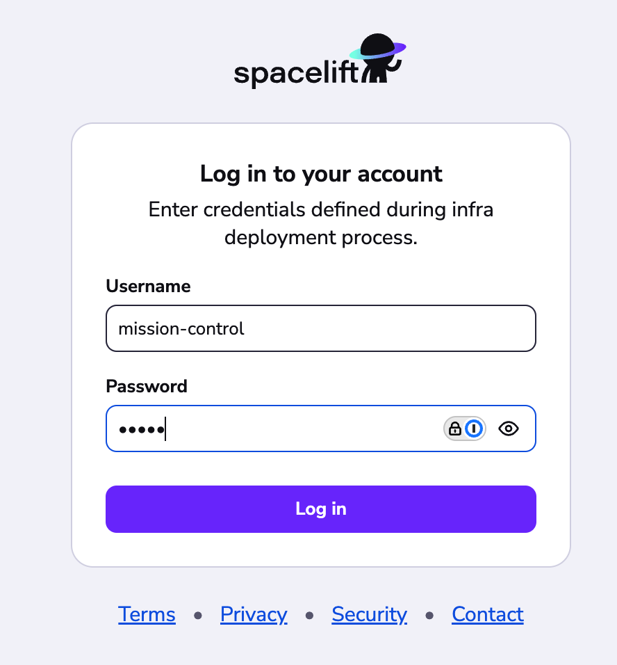
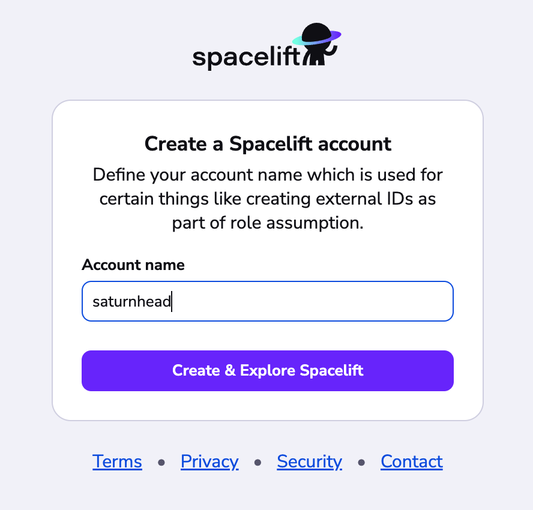
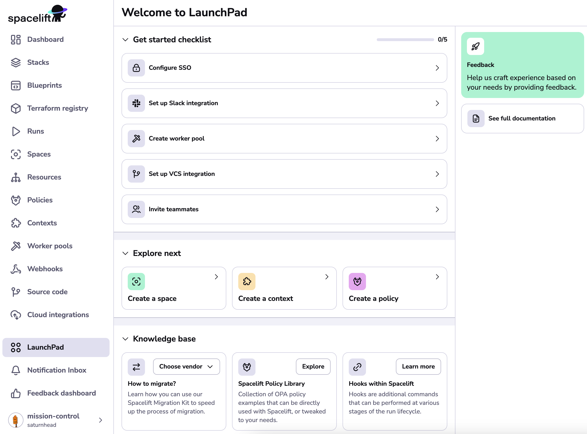

# First setup

After deploying Spacelift to your environment there are a few steps required to get you up and running:

1. [Login to your instance using admin credentials](#logging-in-using-admin-credentials).
2. [Create an account](#creating-an-account).
3. [Start configuring your account](#start-configuring-your-account).

## Logging in using admin credentials

In order to create an account you need to be able to login with admin credentials. You can find information about configuring them in the [configuration reference](../reference/general-configuration.md#admin-login).

Once admin login is enabled, go to your Spacelift installation in your browser. The URL to use is determined by the `SERVER_DOMAIN` [environment variable](../reference/general-configuration.md#basic-settings).

When the page loads you will be redirected to the admin login screen:

Enter your username and password to login.

!!! tip
    You can use the admin login page to login to your Spacelift instance even after completing setup. To do this just go to `https://${SERVER_DOMAIN}/admin-login`.

## Creating an account

After logging in, the next step is to choose a name for your account:

The account name is used for a number of purposes including but not limited to the following:

- For informational purposes in the Spacelift frontend.
- When generating the default AWS external ID and session names when performing role assumption as part of the [AWS Cloud integration](../../../integrations/cloud-providers/aws.md).
- As part of the URL when accessing [Terraform modules](../../../vendors/terraform/module-registry.md) and [providers](../../../vendors/terraform/provider-registry.md) via the Spacelift private registry.

The account name must meet the following requirements:

- It must start with an upper or lowercase letter or number.
- It must only contain upper or lowercase letters, numbers, `-` or `_`.
- It must be between 2 and 38 characters long.

!!! warning "Changing account name"

    Choose your account name carefully. While it can technically be changed after your initial configuration and deployment, changing account names can affect integrations (especially the AWS trust policy), webhooks, and other services that reference the account name when they're created.

## Start configuring your account

Congratulations! At this point your Spacelift account has been created, and you should have been redirected to the launchpad screen:

The "Get started checklist" section in the launchpad will guide you through the most important next steps to take. Certain steps like configuring SSO, setting up Slack and inviting teammates are optional, but at a minimum you will want to create your first [worker pool](../../../concepts/worker-pools/README.md) and setup a [VCS integration](../../../integrations/source-control/README.md).

## Disabling admin login

Once you have configured SSO, you may want to disable the admin login by removing the relevant [environment variables](../reference/general-configuration.md#admin-login). If you need to re-enable this in future you can simply re-add them.
