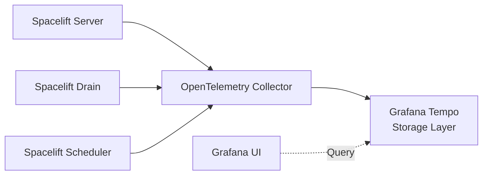

# OpenTelemetry with Grafana stack in Kubernetes

This guide provides a way to configure OpenTelemetry with Grafana stack for your Spacelift installation running in Kubernetes.

[OpenTelemetry](https://opentelemetry.io/){: rel="nofollow"} is a set of open standards and tools for collecting, processing, and exporting telemetry data such as traces and metrics. Unlike monolithic observability solutions, OpenTelemetry focuses on data collection and standardization rather than storage or visualization. This flexibility allows you to use various compatible backends and user interfaces based on your needs.

OpenTelemetry doesn't define a storage layer or user interface - instead, it provides a standardized way to collect and export telemetry data to various backends. There are many OpenTelemetry-compatible tools available, including Grafana Tempo, Jaeger, Zipkin, Prometheus, and commercial offerings like Grafana Cloud and Datadog. In this guide, we'll use Grafana Tempo as the storage backend and self-hosted Grafana as the user interface to visualize traces.

## Architecture overview

The telemetry pipeline consists of three main components:

1. **Spacelift applications** (server, drain, scheduler) - Emit trace data
2. **OpenTelemetry Collector** - Receives, processes, and forwards telemetry data
3. **Storage and visualization** - Grafana Tempo stores traces, Grafana UI queries and displays them

The OpenTelemetry Collector acts as a relay that receives traces from Spacelift applications and forwards them to the storage backend. It doesn't store any data itself - it's purely a middleware component that allows you to decouple your applications from specific backend implementations.



!!! info
    For more information about telemetry configuration options and supported backends, see the [telemetry reference documentation](../../reference/telemetry.md).

## Prerequisites

Before proceeding with the installation, ensure you have:

- A running Spacelift installation in Kubernetes.
- [kubectl](https://kubernetes.io/docs/tasks/tools/){: rel="nofollow"} configured to access your cluster.
- [Helm 3 or later](https://helm.sh/docs/intro/install){: rel="nofollow"} installed.

## Install Grafana stack: Tempo

Grafana Tempo is an open-source distributed tracing backend that serves as the storage layer for trace data. It stores traces from your distributed systems and allows you to search and retrieve them by trace ID. Think of it as a specialized database optimized for trace storage - Grafana UI will query this database to visualize request flows across your Spacelift services. Let's start by installing the storage layer.

### Add Helm repository

First, add the Grafana Helm repository and update it:

```shell
helm repo add grafana https://grafana.github.io/helm-charts
helm repo update grafana
```

### Create monitoring namespace

Create a dedicated namespace to hold all monitoring-related resources:

```shell
kubectl create namespace monitoring
```

!!! tip
    Using a dedicated namespace makes it easy to manage monitoring components. You can remove everything by simply deleting the namespace, which automatically cleans up all resources inside it.

### Install Tempo

Create a values file for Tempo configuration. Save the following as `tempo-values.yaml`:

```yaml title="tempo-values.yaml"
resources:
  requests:
    cpu: 200m
    memory: 1Gi
  limits:
    memory: 2Gi
tempo:
  reportingEnabled: false # (1)
  retention: 3h # (2)
  metricsGenerator:
    enabled: true
```

1. Disables telemetry reporting to Grafana Labs.
2. Retention period for traces. Adjust based on your needs.

Install the Tempo chart:

```shell
helm install tempo grafana/tempo -n monitoring -f tempo-values.yaml
```

### Configure storage backend

!!! warning
    [By default](https://github.com/grafana/helm-charts/blob/93a13fc80c8bbef4456072a254015add0b55d7ed/charts/tempo/values.yaml#L125){: rel="nofollow"}, Tempo uses `local` storage which is ephemeral - all traces are lost when the Tempo pod restarts. This is fine for testing and demo purposes, but not suitable for production use.

For production environments, configure an object storage backend like S3, Google Cloud Storage, or Azure Blob Storage. Here's an example configuration for AWS EKS:

<details> <!-- markdownlint-disable-line MD033 -->
<summary>Click to expand tempo-values.yaml (production with S3)</summary> <!-- markdownlint-disable-line MD033 -->

```yaml title="tempo-values.yaml (production with S3)"
tempo:
  retention: 336h # (1)
  storage:
    trace:
      backend: s3
      s3:
        bucket: <YOUR_TRACE_STORAGE_BUCKET> # (2)
  metricsGenerator:
    enabled: true
serviceAccount:
  create: true
  annotations:
    eks.amazonaws.com/role-arn: arn:aws:iam::<ACCOUNT_ID>:role/<S3_ACCESS_ROLE> # (3)
```

1. Retention period of 14 days. Adjust based on your compliance and storage requirements.
2. Replace with your actual S3 bucket name for trace storage.
3. IAM role ARN that grants the Tempo service account access to the S3 bucket.

</details>

For more details about storage configuration, see the [official Tempo storage documentation](https://grafana.com/docs/tempo/latest/configuration/hosted-storage/){: rel="nofollow"}.

### Maintenance and upgrades

The Helm chart uses the same version for the Tempo Docker image as the chart version (`Chart.AppVersion`). To upgrade to a newer version, upgrade the Helm chart itself:

```shell
helm search repo grafana/tempo --versions
```

Then upgrade to the desired version:

```shell
helm upgrade tempo grafana/tempo --version "2.9.0" --namespace monitoring -f tempo-values.yaml
```

## Install OpenTelemetry Collector

The OpenTelemetry Collector functions as a relay that receives telemetry data from your applications and forwards it to backend systems. It acts as middleware between your Spacelift services and the storage layer (Tempo), handling tasks like batching, retries, and data transformation. The Collector doesn't store any data itself - it simply processes and routes telemetry to the appropriate backends. Let's install it next.

### Add Helm repository

If you haven't already, add the OpenTelemetry Helm repository:

```shell
helm repo add open-telemetry https://open-telemetry.github.io/opentelemetry-helm-charts
helm repo update open-telemetry
```

### Configure the collector

Create a values file for the OpenTelemetry Collector. Save the following as `otel-collector-values.yaml`:

<details> <!-- markdownlint-disable-line MD033 -->
<summary>Click to expand otel-collector-values.yaml</summary> <!-- markdownlint-disable-line MD033 -->

```yaml title="otel-collector-values.yaml"
mode: deployment

image:
  repository: ghcr.io/open-telemetry/opentelemetry-collector-releases/opentelemetry-collector-k8s

command:
  name: otelcol-k8s

resources:
  requests:
    cpu: 200m
    memory: 256Mi
  limits:
    memory: 1Gi

config:
  receivers:
    jaeger: null
    prometheus: null
    zipkin: null
  exporters:
    otlp:
      endpoint: http://tempo:4317
      tls:
        insecure: true
    nop:
  service:
    pipelines:
      traces:
        receivers: [otlp]
        exporters: [otlp]
      metrics:
        receivers: [otlp]
        exporters: [nop]
      logs: null
ports:
  otlp-http:
    enabled: false
  jaeger-compact:
    enabled: false
  jaeger-thrift:
    enabled: false
  jaeger-grpc:
    enabled: false
  zipkin:
    enabled: false
```

</details>

This configuration:

- Disables all receivers except OTLP (which Spacelift uses via gRPC on port 4317)
- Configures the OTLP exporter to forward **traces** to Tempo
- Disables unnecessary listener ports for protocols we don't use
- Uses the `nop` (no-operation) exporter for **metrics** - this drops metrics data since Tempo only handles traces, not metrics. However, it's important to define a `metrics` pipeline because Spacelift applications emit both traces and metrics. Without a metrics pipeline, the collector would reject the metrics data, causing errors. If you're using a backend that supports both traces and metrics (like Jaeger, Grafana Cloud, or Datadog), you can change `exporters: [nop]` to `exporters: [otlp]` in the metrics pipeline to send metrics to the same backend.

!!! info "Traces vs Metrics"
    OpenTelemetry supports multiple types of telemetry data: **traces** (request flows across services), **metrics** (numerical measurements like queue size, visible messages in the queue, request counts, error rates, latency percentiles), and **logs** (event records). Tempo is a specialized tracing backend that only stores traces. If you need to store metrics as well, you would need to configure a separate metrics backend (like Prometheus or [Mimir](https://grafana.com/oss/mimir/){: rel="nofollow"}) and add it as an additional exporter in the collector configuration.

!!! tip "Alternative Telemetry Backends"
    While this guide uses Grafana Tempo, the OpenTelemetry Collector can export to many other backends by changing the exporter configuration. Popular alternatives include:

    - **[Jaeger](https://www.jaegertracing.io/){: rel="nofollow"}** - Open-source distributed tracing platform
    - **[Grafana Cloud](https://grafana.com/products/cloud/){: rel="nofollow"}** - Managed observability platform with traces, metrics, and logs
    - **[Zipkin](https://zipkin.io/){: rel="nofollow"}** - Distributed tracing system
    - **Commercial platforms** - Datadog, New Relic, Honeycomb, and others that support OTLP

    To use a different backend, modify the `exporters` section in `otel-collector-values.yaml` to point to your chosen platform. The OpenTelemetry Collector's flexibility allows you to switch backends without changing your application instrumentation.

The `exporters.otlp.endpoint` value points to the Tempo service. Since both the OTEL Collector and Tempo are in the same namespace (`monitoring`), we can use the short service name `tempo` with port `4317`. If they were in different namespaces, you would need the fully qualified DNS name: `{service-name}.{namespace}.svc.cluster.local:{port}`.

### Install the collector

```shell
helm install otelcol open-telemetry/opentelemetry-collector --namespace monitoring -f otel-collector-values.yaml
```

### Get the collector endpoint

To configure Spacelift to send traces to the collector, you need the collector's endpoint. First, verify the service name:

```shell
kubectl get services -n monitoring
```

Since Spacelift applications run in a different namespace (`spacelift`), you need to use the fully qualified DNS name. The endpoint will be something like:

```plaintext
http://otelcol-opentelemetry-collector.monitoring.svc.cluster.local:4317
```

!!! note
    Even though the collector uses gRPC protocol, the URL scheme must still be `http://`.

### Maintenance and upgrades

Similar to Tempo, the Helm chart version corresponds to the OTEL Collector version. To upgrade:

```shell
helm search repo open-telemetry/opentelemetry-collector --versions
```

Then upgrade to the desired version:

```shell
helm upgrade otelcol open-telemetry/opentelemetry-collector --version "0.150.0" --namespace monitoring -f otel-collector-values.yaml
```

!!! warning
    Spacelift applications maintain long-lived gRPC connections to the OTEL Collector. During a collector upgrade or configuration change, these connections may be lost. After upgrading the collector, restart the Spacelift deployments to re-establish connections:

    ```shell
    kubectl rollout restart deployment -n spacelift \
      spacelift-drain \
      spacelift-scheduler \
      spacelift-server
    ```

## Configure Spacelift

Now that the tracing infrastructure is ready, configure Spacelift to send traces to the OpenTelemetry Collector.

### Update the Spacelift environment variables

The Spacelift services need two environment variables:

- `OBSERVABILITY_VENDOR` - Set to `OpenTelemetry` to enable the OpenTelemetry backend.
- `OTEL_EXPORTER_OTLP_ENDPOINT` - The fully qualified domain name of the OTEL Collector service.

Update the `spacelift-shared` secret with these variables:

```shell
kubectl patch secret spacelift-shared -n spacelift \
  --type=merge \
  -p '{"stringData":{"OTEL_EXPORTER_OTLP_ENDPOINT":"http://otelcol-opentelemetry-collector.monitoring.svc.cluster.local:4317","OBSERVABILITY_VENDOR":"OpenTelemetry"}}'
```

!!! note
    Make sure to adjust the endpoint URL if you used different service names or namespaces.

Restart the Spacelift deployments to apply the new configuration:

```shell
kubectl rollout restart deployment -n spacelift \
  spacelift-drain \
  spacelift-scheduler \
  spacelift-server
```

### Verify the setup

Check the Spacelift logs to ensure there are no errors:

```shell
kubectl logs -n spacelift deployment/spacelift-server
```

If configured correctly, traces should start flowing to the OTEL Collector, which relays them to Tempo.

!!! info
    Even if there are errors related to the OTEL Collector, Spacelift will continue to function normally - it just won't emit traces.

## Install Grafana

Now that the storage (Tempo) and collector (OTEL Collector) are set up, install Grafana UI to visualize the traces.

### Install Grafana chart

Create a values file for Grafana. Save the following as `grafana-values.yaml`:

```yaml title="grafana-values.yaml"
resources:
  requests:
    cpu: 200m
    memory: 256Mi
  limits:
    memory: 1Gi

adminUser: admin
adminPassword: adminpw
```

!!! warning
    Change these credentials to something secure for production use.

Install the Grafana chart:

```shell
helm install grafana grafana/grafana -n monitoring -f grafana-values.yaml
```

### Access Grafana

For initial testing, use port-forwarding to access Grafana:

```shell
export POD_NAME=$(kubectl get pods --namespace monitoring -l "app.kubernetes.io/name=grafana,app.kubernetes.io/instance=grafana" -o jsonpath="{.items[0].metadata.name}")

kubectl --namespace monitoring port-forward $POD_NAME 3000
```

Open your browser and navigate to `http://localhost:3000`. Log in with the admin credentials you configured earlier.

### Configure Tempo data source

To connect Grafana to Tempo:

1. In the Grafana UI, navigate to **Connections** → **Data Sources**.
2. Click **Add data source** and select **Tempo**.
3. Set the URL to `http://tempo:3200`.
4. Do **not** enable the streaming option.
5. Click **Save & Test**.

Since Grafana and Tempo are in the same namespace, you can use the short service name `tempo` without the fully qualified DNS name.

### View traces

Navigate to the Explore tab (`http://localhost:3000/explore`) and click the refresh button (♻️) in the top right. You should start seeing traces from Spacelift services.

Another useful view is to go to **Drilldown** → **Traces** in the left sidebar. You can filter traces by service name, operation name, duration, and time range.


### Maintenance and upgrades

To upgrade Grafana to a newer version:

```shell
helm search repo grafana/grafana --versions
helm upgrade grafana grafana/grafana --version "<NEW_VERSION>" --namespace monitoring -f grafana-values.yaml
```

## Exposing Grafana UI

While port-forwarding is suitable for testing, production environments should expose Grafana via an Ingress or LoadBalancer with proper TLS termination.

<details> <!-- markdownlint-disable-line MD033 -->
<summary>Click to expand: Example for AWS EKS with ALB</summary> <!-- markdownlint-disable-line MD033 -->

Here's an example of how to expose Grafana using AWS Application Load Balancer with an ACM certificate.

First, create an IngressClass and IngressClassParams:

```yaml title="grafana-ingressclass.yaml"
apiVersion: eks.amazonaws.com/v1
kind: IngressClassParams
metadata:
  name: grafana
spec:
  scheme: internet-facing # Use 'internal' for VPC-only access
  subnets:
    ids:
      - subnet-xxxxxx1 # Replace with your public/private subnet IDs
      - subnet-xxxxxx2
      - subnet-xxxxxx3
  certificateARNs:
    - arn:aws:acm:<region>:<account-id>:certificate/<certificate-id> # Your ACM certificate ARN
---
apiVersion: networking.k8s.io/v1
kind: IngressClass
metadata:
  name: grafana
spec:
  controller: eks.amazonaws.com/alb
  parameters:
    apiGroup: eks.amazonaws.com
    kind: IngressClassParams
    name: grafana
    scope: Cluster
```

Tip: You can get the public subnet IDs from your existing Spacelift IngressClassParams:

```shell
kubectl get ingressclassparams spacelift -o yaml
```

Apply the IngressClass:

```shell
kubectl apply -f grafana-ingressclass.yaml
```

Update your grafana-values.yaml to enable the Ingress:

```yaml title="grafana-values.yaml (with Ingress)"
# ... Rest of your grafana-values.yaml
ingress:
  enabled: true
  ingressClassName: grafana
  annotations:
    alb.ingress.kubernetes.io/healthcheck-path: /api/health # IMPORTANT: The default '/' path fails
    alb.ingress.kubernetes.io/healthcheck-protocol: HTTP
  hosts:
    - grafana.spacelift.example.com # Your domain matching the ACM certificate
  path: /
  pathType: Prefix
```

Upgrade the Grafana release with the new configuration:

```shell
helm upgrade grafana grafana/grafana --namespace monitoring -f grafana-values.yaml
```

Get the load balancer DNS name:

```shell
kubectl get ingress -n monitoring
```

Finally, create a CNAME DNS record pointing to the load balancer. For example:

```zone title="DNS Record"
grafana.spacelift.example.com    300 IN  CNAME     k8s-grafana-grafana-1234567890-1234567890.eu-west-1.elb.amazonaws.com
```

</details>

## Persistent storage for Grafana

By default, Grafana stores its state (dashboards, users, folders, alert configurations) in a SQLite database file. If the container restarts and the data directory is ephemeral, you'll lose all changes including the Tempo data source configuration and custom dashboards.

To persist Grafana data, [enable persistent storage](https://grafana.com/docs/grafana/latest/setup-grafana/installation/helm#enable-persistent-storage-recommended){: rel="nofollow"} by adding the following to your `grafana-values.yaml`:

```yaml title="grafana-values.yaml (with persistence)"
# ... Rest of your grafana-values.yaml
persistence:
  enabled: true
  type: pvc
  size: 5Gi
```

Then upgrade the Grafana release:

```shell
helm upgrade grafana grafana/grafana --namespace monitoring -f grafana-values.yaml
```

## Troubleshooting

If traces aren't appearing in Grafana after configuring the Tempo data source, here are the most common causes:

- Traces aren't reaching Tempo
- The Tempo pod restarted and lost traces (when using `local` storage)
- Traces were deleted by Tempo's retention policy (if the retention period is too short)

Follow the steps below to diagnose where the issue is occurring:

### Check Spacelift logs

Spacelift applications log errors if they can't connect to the OTEL Collector. Check the logs:

```shell
kubectl logs -n spacelift deployment/spacelift-server
```

If the environment variable is properly set and there are no tracing-related errors, Spacelift is successfully sending traces to the OTEL Collector.

!!! note
    Spacelift continues to function normally even if telemetry collection fails - it just won't emit traces.

### Check OTEL Collector logs

If Spacelift isn't reporting errors, check the OTEL Collector logs:

```shell
kubectl logs -n monitoring deployment/otelcol-opentelemetry-collector
```

### Check Tempo logs

Finally, check the Tempo logs to see if it's receiving and storing traces:

```shell
kubectl logs -n monitoring deployment/tempo
```

!!! tip "Enable detailed span logging for debugging"
    If you need to verify whether Tempo is receiving traces, you can enable debug logging of all received spans. Add the following to your `tempo-values.yaml`:

    ```yaml title="tempo-values.yaml (with debug logging)"
    tempo:
      extraArgs:
        - -distributor.log_received_spans.enabled=true
    ```

    Then upgrade the Tempo release:

    ```shell
    helm upgrade tempo grafana/tempo --namespace monitoring -f tempo-values.yaml
    ```

    This will log all spans received by the distributor, helping you determine if traces are reaching Tempo. Check the logs again after enabling this option. For more details, see the [Grafana Tempo troubleshooting guide](https://grafana.com/docs/tempo/latest/troubleshooting/querying/unable-to-see-trace/){: rel="nofollow"}.

    !!! warning
        This flag generates significant log volume and should only be enabled temporarily for debugging purposes.

## Cleanup and uninstallation

If you need to remove the telemetry stack from your cluster, follow these steps to completely clean up all resources.

First, verify which releases are installed:

```shell
helm list --all-namespaces
```

Based on the output, uninstall the relevant releases:

```shell
helm uninstall grafana -n monitoring
helm uninstall tempo -n monitoring
helm uninstall otelcol -n monitoring
```

Finally, delete the monitoring namespace to remove all remaining resources:

```shell
kubectl delete namespace monitoring
```

!!! note
    If you're using persistent storage for Grafana, the PersistentVolumeClaims (PVCs) may need to be deleted separately depending on your storage class reclaim policy.

### Disable Spacelift telemetry configuration

If you've already set up the telemetry configuration in Spacelift, at this point it should throw errors since the OTEL Collector is no longer available. To fully disable telemetry in Spacelift, patch the `spacelift-shared` secret to clear the environment variables:

```shell
kubectl patch secret spacelift-shared -n spacelift \
  --type=merge \
  -p '{"stringData":{"OTEL_EXPORTER_OTLP_ENDPOINT":"","OBSERVABILITY_VENDOR":"Disabled"}}'

kubectl rollout restart deployment -n spacelift \
  spacelift-drain \
  spacelift-scheduler \
  spacelift-server
```
