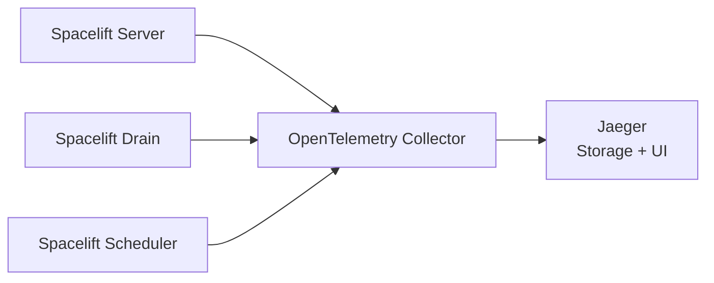

# OpenTelemetry with Jaeger in Kubernetes

This guide provides a way to configure OpenTelemetry telemetry with Jaeger for your Spacelift installation running in Kubernetes.

[OpenTelemetry](https://opentelemetry.io/){: rel="nofollow"} is a set of open standards and tools for collecting, processing, and exporting telemetry data such as traces and metrics. [Jaeger](https://www.jaegertracing.io/){: rel="nofollow"} is an open-source distributed tracing platform that serves as a backend for receiving, storing, and visualizing trace data. Unlike some tracing solutions that require separate components for storage and visualization, Jaeger combines both capabilities in a single platform with a built-in UI.

## Architecture overview

The telemetry pipeline consists of three main components:

1. **Spacelift applications** (server, drain, scheduler) - Emit trace data
2. **OpenTelemetry Collector** - Receives, processes, and forwards telemetry data
3. **Jaeger** - Stores traces and provides a web UI for visualization

The OpenTelemetry Collector acts as a relay that receives traces from Spacelift applications and forwards them to Jaeger. It doesn't store any data itself - it's purely a middleware component that allows you to decouple your applications from specific backend implementations.



!!! info
    For more information about telemetry configuration options and supported backends, see the [telemetry reference documentation](../../reference/telemetry.md).

## Prerequisites

Before proceeding with the installation, ensure you have:

- A running Spacelift installation in Kubernetes.
- [kubectl](https://kubernetes.io/docs/tasks/tools/){: rel="nofollow"} configured to access your cluster.
- [Helm 3 or later](https://helm.sh/docs/intro/install){: rel="nofollow"} installed.

## Install Jaeger

Jaeger provides an "all-in-one" deployment mode that packages all components (collector, storage, query service, and UI) into a single binary. This guide covers both in-memory storage (suitable for development, testing, and demo environments) and optional Badger persistent storage for environments requiring trace retention.

### Add Helm repository

First, add the Jaeger Helm repository and update it:

```shell
helm repo add jaegertracing https://jaegertracing.github.io/helm-charts
helm repo update jaegertracing
```

### Create monitoring namespace

Create a dedicated namespace to hold all monitoring-related resources:

```shell
kubectl create namespace monitoring
```

!!! tip
    Using a dedicated namespace makes it easy to manage monitoring components. You can remove everything by simply deleting the namespace, which automatically cleans up all resources inside it.

### Install Jaeger

Install Jaeger with in-memory storage:

```yaml title="jaeger-values.yaml"
allInOne:
  resources:
    requests:
      cpu: 200m
      memory: 512Mi
    limits:
      memory: 1Gi

storage:
  type: memory
```

Install the Jaeger chart:

```shell
helm install jaeger jaegertracing/jaeger -n monitoring -f jaeger-values.yaml
```

!!! info
    This guide uses in-memory storage, which is ephemeral - all traces are lost when the Jaeger pod restarts. This is suitable for development, testing, and demo purposes. For production environments requiring persistent trace storage, Jaeger supports backends like OpenSearch, Kafka, Prometheus, Cassandra, and others. See the [official Jaeger storage documentation](https://www.jaegertracing.io/docs/2.13/storage/){: rel="nofollow"} for more information.

### Optional: Enable Badger for persistent storage

If you need persistent trace storage without the complexity of Prometheus or Cassandra, you can use [Badger](https://github.com/dgraph-io/badger){: rel="nofollow"}, an embedded database that stores traces locally on disk. Badger is suitable for single-node deployments and provides persistence with configurable retention policies.

#### Create a PersistentVolumeClaim

First, create a PersistentVolumeClaim for Badger data storage. Save the following as `jaeger-pvc.yaml`:

```yaml title="jaeger-pvc.yaml"
apiVersion: v1
kind: PersistentVolumeClaim
metadata:
  name: jaeger-badger
  namespace: monitoring
spec:
  accessModes:
    - ReadWriteOnce
  resources:
    requests:
      storage: 1Gi # (1)
```

1. Adjust the storage size based on your trace retention needs and expected trace volume.

Apply the PVC:

```shell
kubectl apply -f jaeger-pvc.yaml
```

#### Configure Jaeger to use Badger

Create a values file for Jaeger with Badger storage. Save the following as `jaeger-values.yaml`:

```yaml title="jaeger-values.yaml (with Badger storage)"
allInOne:
  resources:
    requests:
      cpu: 200m
      memory: 512Mi
    limits:
      memory: 1Gi

storage:
  type: badger
  badger:
    ephemeral: false # (1)
    persistence:
      useExistingPvcName: jaeger-badger # (2)
```

1. Set `ephemeral` to `false` to enable persistent storage on disk.
2. Name of the `PersistentVolumeClaim` created in the previous step.

Install or upgrade Jaeger with Badger storage:

```shell
# If installing for the first time:
helm install jaeger jaegertracing/jaeger -n monitoring -f jaeger-values.yaml

# If upgrading an existing installation:
helm upgrade jaeger jaegertracing/jaeger -n monitoring -f jaeger-values.yaml
```

!!! note
    Badger stores data on the PersistentVolume, ensuring traces persist across pod restarts and rescheduling. The `useExistingPvcName` parameter tells Jaeger to mount the PVC you created for storing Badger data.

    By [default](https://github.com/jaegertracing/jaeger/blob/a5de984b734873a66915378f11f1aa0330e02da7/internal/storage/v1/badger/config.go#L17){: rel="nofollow"}, Badger retains traces for 72 hours (3 days). Older traces are automatically deleted. This retention period helps manage disk space usage while keeping recent traces available for debugging.

### Verify Jaeger installation

Check that the Jaeger pod is running:

```shell
kubectl get pods -n monitoring -l app.kubernetes.io/name=jaeger
```

Check the logs for any errors:

```shell
kubectl logs -n monitoring -l app.kubernetes.io/name=jaeger
```

### Maintenance and upgrades

To upgrade Jaeger to a newer version:

```shell
helm search repo jaegertracing/jaeger --versions
```

Then upgrade to the desired version:

```shell
helm upgrade jaeger jaegertracing/jaeger --version "<NEW_VERSION>" --namespace monitoring -f jaeger-values.yaml
```

## Install OpenTelemetry Collector

The OpenTelemetry Collector functions as a relay that receives telemetry data from your applications and forwards it to backend systems. It acts as middleware between your Spacelift services and Jaeger, handling tasks like batching, retries, and data transformation. The Collector doesn't store any data itself - it simply processes and routes telemetry to the appropriate backends.

### Add Helm repository

If you haven't already, add the OpenTelemetry Helm repository:

```shell
helm repo add open-telemetry https://open-telemetry.github.io/opentelemetry-helm-charts
helm repo update open-telemetry
```

### Configure the collector

Create a values file for the OpenTelemetry Collector. Save the following as `otel-collector-values.yaml`:

<details> <!-- markdownlint-disable-line MD033 -->
<summary>Click to expand otel-collector-values.yaml</summary> <!-- markdownlint-disable-line MD033 -->

```yaml title="otel-collector-values.yaml"
mode: deployment

image:
  repository: ghcr.io/open-telemetry/opentelemetry-collector-releases/opentelemetry-collector-k8s

command:
  name: otelcol-k8s

resources:
  requests:
    cpu: 200m
    memory: 256Mi
  limits:
    memory: 1Gi

config:
  receivers:
    jaeger: null
    prometheus: null
    zipkin: null
  exporters:
    otlp:
      endpoint: http://jaeger-collector:4317 # Service name format: {release-name}-collector
      tls:
        insecure: true
    nop:
  service:
    pipelines:
      traces:
        receivers: [otlp]
        exporters: [otlp]
      metrics:
        receivers: [otlp]
        exporters: [otlp] # Send metrics to Jaeger
      logs: null
ports:
  otlp-http:
    enabled: false
  jaeger-compact:
    enabled: false
  jaeger-thrift:
    enabled: false
  jaeger-grpc:
    enabled: false
  zipkin:
    enabled: false
```

</details>

This configuration:

- Disables all receivers except OTLP (which Spacelift uses via gRPC on port 4317)
- Configures the OTLP exporter to forward both **traces** and **metrics** to Jaeger
- Disables unnecessary listener ports for protocols we don't use

!!! info "Traces and Metrics"
    OpenTelemetry supports multiple types of telemetry data: **traces** (request flows across services), **metrics** (numerical measurements like queue size, visible messages in the queue, request counts, error rates, latency percentiles), and **logs** (event records). Jaeger can receive and process both traces and metrics via the OTLP protocol. This configuration sends both data types to Jaeger for comprehensive observability of your Spacelift installation.

The `exporters.otlp.endpoint` value points to the Jaeger collector service. Since both the OTEL Collector and Jaeger are in the same namespace (`monitoring`), we can use the short service name `jaeger-collector` with port `4317`. If they were in different namespaces, you would need the fully qualified DNS name: `{service-name}.{namespace}.svc.cluster.local:{port}`.

### Install the collector

```shell
helm install otelcol open-telemetry/opentelemetry-collector --namespace monitoring -f otel-collector-values.yaml
```

### Get the collector endpoint

To configure Spacelift to send traces to the collector, you need the collector's endpoint. First, verify the service name:

```shell
kubectl get services -n monitoring
```

Since Spacelift applications run in a different namespace (`spacelift`), you need to use the fully qualified DNS name. The endpoint will be something like:

```plaintext
http://otelcol-opentelemetry-collector.monitoring.svc.cluster.local:4317
```

!!! note
    Even though the collector uses gRPC protocol, the URL scheme must still be `http://`.

### Maintenance and upgrades

Similar to Jaeger, the Helm chart version corresponds to the OTEL Collector version. To upgrade:

```shell
helm search repo open-telemetry/opentelemetry-collector --versions
```

Then upgrade to the desired version:

```shell
helm upgrade otelcol open-telemetry/opentelemetry-collector --version "0.150.0" --namespace monitoring -f otel-collector-values.yaml
```

!!! warning
    Spacelift applications maintain long-lived gRPC connections to the OTEL Collector. During a collector upgrade or configuration change, these connections may be lost. After upgrading the collector, restart the Spacelift deployments to re-establish connections:

    ```shell
    kubectl rollout restart deployment -n spacelift \
      spacelift-drain \
      spacelift-scheduler \
      spacelift-server
    ```

## Configure Spacelift

Now that the tracing infrastructure is ready, configure Spacelift to send traces to the OpenTelemetry Collector.

### Update the Spacelift environment variables

The Spacelift services need two environment variables:

- `OBSERVABILITY_VENDOR` - Set to `OpenTelemetry` to enable the OpenTelemetry backend.
- `OTEL_EXPORTER_OTLP_ENDPOINT` - The fully qualified domain name of the OTEL Collector service.

Update the `spacelift-shared` secret with these variables:

```shell
kubectl patch secret spacelift-shared -n spacelift \
  --type=merge \
  -p '{"stringData":{"OTEL_EXPORTER_OTLP_ENDPOINT":"http://otelcol-opentelemetry-collector.monitoring.svc.cluster.local:4317","OBSERVABILITY_VENDOR":"OpenTelemetry"}}'
```

!!! note
    Make sure to adjust the endpoint URL if you used different service names or namespaces.

Restart the Spacelift deployments to apply the new configuration:

```shell
kubectl rollout restart deployment -n spacelift \
  spacelift-drain \
  spacelift-scheduler \
  spacelift-server
```

### Verify the setup

Check the Spacelift logs to ensure there are no errors:

```shell
kubectl logs -n spacelift deployment/spacelift-server
```

If configured correctly, traces should start flowing to the OTEL Collector, which relays them to Jaeger.

!!! info
    Even if there are errors related to the OTEL Collector, Spacelift will continue to function normally - it just won't emit traces.

## Access Jaeger UI

Jaeger comes with a built-in web UI for visualizing and analyzing traces.

### Port forwarding (testing)

For initial testing, use port-forwarding to access the Jaeger UI:

```shell
kubectl port-forward -n monitoring svc/jaeger-query 16686:16686
```

Open your browser and navigate to `http://localhost:16686`. You should see the Jaeger UI with traces from your Spacelift services.

!!! tip "Production Access"
    Port-forwarding is suitable for testing and development only. For production environments, expose the Jaeger UI using a Kubernetes Ingress, LoadBalancer service, or reverse proxy (such as [nginx](https://nginx.org/){: rel="nofollow"} or [Caddy](https://caddyserver.com/docs/){: rel="nofollow"}) with proper TLS termination and authentication.

### Viewing traces

In the Jaeger UI:

1. Select a **Service** from the dropdown (e.g., `server`, `drain`, or `scheduler`)
2. Click **Find Traces** to see recent traces
3. Click on any trace to see the detailed span timeline and associated metadata

The UI provides powerful filtering options to search traces by operation, tags, duration, and more.

## Troubleshooting

If traces aren't appearing in Jaeger, here are the most common causes:

- Traces aren't reaching Jaeger
- The Jaeger pod restarted and lost traces (when using in-memory storage)
- Traces were deleted by Jaeger's retention policy

Follow the steps below to diagnose where the issue is occurring:

### Check Spacelift logs

Spacelift applications log errors if they can't connect to the OTEL Collector. Check the logs:

```shell
kubectl logs -n spacelift deployment/spacelift-server
```

If the environment variable is properly set and there are no tracing-related errors, Spacelift is successfully sending traces to the OTEL Collector.

!!! note
    Spacelift continues to function normally even if telemetry collection fails - it just won't emit traces.

### Check OTEL Collector logs

If Spacelift isn't reporting errors, check the OTEL Collector logs:

```shell
kubectl logs -n monitoring deployment/otelcol-opentelemetry-collector
```

Look for errors related to exporting traces to Jaeger.

### Check Jaeger logs

Finally, check the Jaeger logs to see if it's receiving and storing traces:

```shell
kubectl logs -n monitoring -l app.kubernetes.io/name=jaeger
```

### Verify Jaeger health

You can also check Jaeger's health endpoint:

```shell
kubectl port-forward -n monitoring svc/jaeger-query 16687:16687
curl http://localhost:16687/
```

A successful response indicates that Jaeger is running properly.

### Enable debug logging

If you need more detailed information, you can enable debug logging in the OTEL Collector by adding the following to your `otel-collector-values.yaml`:

```yaml title="otel-collector-values.yaml (with debug logging)"
config:
  service:
    telemetry:
      logs:
        level: debug
```

Then upgrade the OTEL Collector:

```shell
helm upgrade otelcol open-telemetry/opentelemetry-collector --namespace monitoring -f otel-collector-values.yaml
```

!!! warning
    Debug logging generates significant log volume and should only be enabled temporarily for troubleshooting purposes.

## Cleanup and uninstallation

If you need to remove the telemetry stack from your cluster, follow these steps to completely clean up all resources.

First, verify which releases are installed:

```shell
helm list --all-namespaces
```

Based on the output, uninstall the relevant releases:

```shell
helm uninstall jaeger -n monitoring
helm uninstall otelcol -n monitoring
```

Finally, delete the monitoring namespace to remove all remaining resources:

```shell
kubectl delete namespace monitoring
```

!!! note
    If you're using persistent storage for Jaeger with Badger, the PersistentVolumeClaims (PVCs) may need to be deleted separately depending on your storage class reclaim policy.

### Disable Spacelift telemetry configuration

If you've already set up the telemetry configuration in Spacelift, at this point it should throw errors since the OTEL Collector is no longer available. To fully disable telemetry in Spacelift, patch the `spacelift-shared` secret to clear the environment variables:

```shell
kubectl patch secret spacelift-shared -n spacelift \
  --type=merge \
  -p '{"stringData":{"OTEL_EXPORTER_OTLP_ENDPOINT":"","OBSERVABILITY_VENDOR":"Disabled"}}'

kubectl rollout restart deployment -n spacelift \
  spacelift-drain \
  spacelift-scheduler \
  spacelift-server
```
