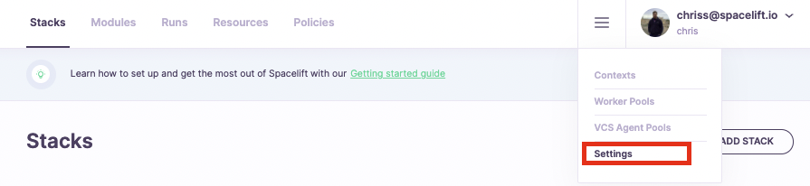
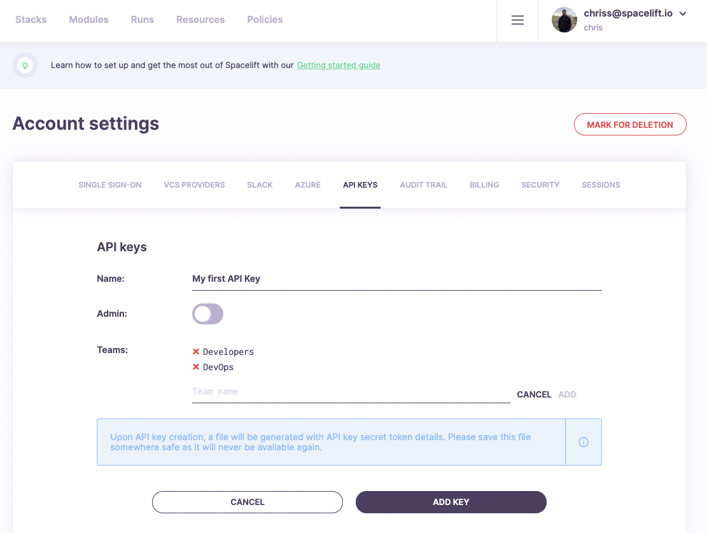
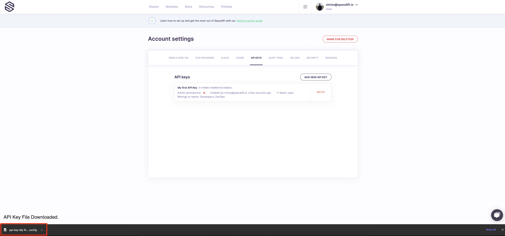

# GraphQL API

## Spacelift GraphQL API Usage Demo

The below guide walks through an example of generating your Spacelift token and using it to communicate with Spacelift.

**Pre-requisites:**

- Insomnia downloaded and installed
- Spacelift account with admin access (for ability to create API Keys)

<!-- markdownlint-disable-next-line MD033 -->
<div style="position: relative; padding-bottom: 56.25%; height: 0;"><iframe src="https://www.loom.com/embed/1cefc584b1bc41d7bc75d767afaf3916" frameborder="0" webkitallowfullscreen mozallowfullscreen allowfullscreen style="position: absolute; top: 0; left: 0; width: 100%; height: 100%;"></iframe></div>

## API Usage

Spacelift provides a GraphQL API for you to control your Spacelift account programmatically and/or through an API Client if you choose to do so. A smaller subset of this API is also used by the Spacelift [Terraform provider](../vendors/terraform/terraform-provider.md), as well as the Spacelift CLI ([spacectl](https://github.com/spacelift-io/spacectl)). The API can be accessed at the `/graphql` endpoint of your account using `POST` HTTP method.

!!! info
    For example, if your Spacelift account is called `example` you would be able to access your GraphQL by sending **POST** requests to: `https://example.app.spacelift.io/graphql`

    All requests need to be authenticated using a bearer token, which we will discuss in more detail below.

In order to use the API, you will need a **bearer token** to authenticate your requests. There are currently three ways of obtaining this token:

1. [SpaceCTL CLI > Token](api.md#spacectl-cli-greater-than-token) (easiest method)
2. [Spacelift API Key > Token](api.md#spacelift-api-key-greater-than-token)
3. [Personal GitHub Token > Token](api.md#personal-github-token-greater-than-token)

### SpaceCTL CLI > Token

One approach to generating this token is using the Spacelift [spacectl](https://github.com/spacelift-io/spacectl) CLI. We consider this the easiest method, as the heavy lifting to obtain the token is done for you.

**Steps:**

1. Follow the instructions on the `spacectl` [GitHub repository](https://github.com/spacelift-io/spacectl) to install the CLI on your machine.
2. Authenticate to your Spacelift account using `spacectl profile login`
3. Once authenticated, run `spacectl profile export-token` to receive the bearer token needed for future GraphQL queries/mutations.

### Spacelift API Key > Token

Spacelift supports creating and managing machine users with programmatic access to the Spacelift GraphQL API. These "machine users" are called API Keys and can be created by Spacelift admins through the _Settings_ panel.

In order to create a new API Key, please navigate to the _API Keys_ section of the _Account Settings_ panel in your account.



Click _API Keys._


The API key creation form will allow you to specify an arbitrary key name, along with the _Admin_ setting and the list of _teams_. If the key is given admin privileges, it has full access to the Spacelift API and won't be subject to [access policies](../concepts/policy/stack-access-policy.md).

For non-administrative keys, you may want to add a **virtual** list of teams that the key should "belong to" so that existing access policies based on [GitHub teams](source-control/github.md#team-based-access) or [SAML assertions](single-sign-on/README.md#setting-up-the-integration) can work with your API keys just as they do with regular users.

Without further ado, let's create a non-administrative API key with virtual membership in two teams: _Developers_ and _DevOps:_



Once you click the _Add Key_ button, the API Key will be generated and a file will be automatically downloaded. The file contains the API token in two forms - one to be used with our API, and the other one as a `.terraformrc` snippet to access your [private modules](../vendors/terraform/module-registry.md) outside of Spacelift:



The config file looks something like this:

```text
Please use the following API secret when communicating with Spacelift
programmatically:

SECRET_VALUE40ffc46887297384892384789239

Please add this snippet to your .terraformrc file if you want to use this API
key to access Spacelift-hosted Terraform modules outside of Spacelift:

credentials "spacelift.io" {
  token = "TOKEN_VALUEQwZmZjNDY4ODdiMjI2ZWE4NDhjMWQwNWZiMWE5MGU4NWMwZTFlY2Q4NDAxMGI2ZjA2NzkwMmI1YmVlMWNmMGE"
}
```

!!! warning
    Make sure you persist this data somewhere on your end - we don't store the token and it cannot be retrieved or recreated afterwards.

#### Using the API key

In order to use your newly generated API key in a program, you will first need to exchange it for a JWT token using a GraphQL mutation:

**Steps:**

1. Create a Spacelift API Key in your account, take note of the API Key ID (found next to the name of your API Key), and the API Key Secret (found within the file downloaded upon creation of the API Key).
2. Using your favorite API Client (e.g. [Insomnia](https://insomnia.rest/){: rel="nofollow"} or [GraphiQL](https://github.com/skevy/graphiql-app){: rel="nofollow"}). Make a GraphQL query to your account's GraphQL endpoint (example below).

**Request Details:**

**POST** to `https://example.app.spacelift.io/graphql`

!!! info
    Replace `example` with the name of your Spacelift account.

**Query:**

```graphql
mutation GetSpaceliftToken($keyId: ID!, $keySecret: String!) {
  apiKeyUser(id: $keyId, secret: $keySecret) {
    jwt
  }
}
```

!!! info
    You'll need to pass in the values of **keyId** and **keySecret** as input query variables for the above example query to work. In your API Client you should see a section called "Query Variables" where you can pass in an input variables for your query.

**Query Variables Input:**

```graphql
{
    "keyId": "PASTE_API_KEY_ID_HERE",
    "keySecret": "PASTE_API_KEY_SECRET_HERE"
}
```

Assuming all went well, the result of the above query will return your JWT token, which you will now be able to use to authenticate for other queries.

Note that the key ID is the alphanumeric identifier shown in the GUI in fixed-width font next to the key name. The key secret can be found in the file that gets automatically generated when the API key is created.

The received JWT is valid for an hour, so if you're accessing Spacelift API from a long-running process you will need to make sure that the key is recreated every time it expires. In order to help with that, you can retrieve the `validUntil` field (Unix timestamp of the expiration, in seconds) of the `apiKeyUser` along with the raw JWT.

!!! info
    API keys are in fact **virtual** **users** and are billed like regular users, too. Thus, **each API key used** (exchanged to a token) during any given billing cycle counts against the total number of users.

### Personal GitHub Token > Token

!!! info
    This option is only available to those using GitHub as their identity provider. If you have enabled any other [Single Sign-On methods](single-sign-on/README.md) on your account, this method will not work. If this applies to you, you will need to use the [Spacelift API Key > Token](api.md#spacelift-api-key-greater-than-jwt-token) method instead.

**Steps:**

1. Using a GitHub Account that has access to your Spacelift account, [create a GitHub Personal Access Token](https://docs.github.com/en/authentication/keeping-your-account-and-data-secure/creating-a-personal-access-token){: rel="nofollow"}. Copy the value of this token to a secure location, as you'll need it in the next step.
2. Using your favorite API Client (e.g. [Insomnia](https://insomnia.rest/){: rel="nofollow"} or [GraphiQL](https://github.com/skevy/graphiql-app){: rel="nofollow"}). Make a GraphQL POST request to your account's GraphQL endpoint (example below).

**Request Details:**

**POST** to `https://example.app.spacelift.io/graphql`

!!! info
    Replace "example" with the name of your Spacelift account.

**Query:**

```graphql
mutation GetSpaceliftToken($token: String!) {
  oauthUser(token: $token) {
    jwt
  }
}
```

!!! info
    You'll need to pass in **token** as a query variable for the above example query to work. When making a GraphQL query with your favorite API Client, you should see a section called GraphQL variables where you can pass in an input.

**GraphQL Variables Input:**

```graphql
{
    "token": "PASTE-TOKEN-VALUE-HERE"
}
```

Assuming all went well, the result of the above query will return your JWT bearer token, which you will now be able to use to authenticate other queries. Once acquired, ensure you use this bearer token in your requests. If you want to access the API reliably in an automated way, we suggest using the [Spacelift API Key > JWT Token](api.md#spacelift-api-key-greater-than-jwt-token) approach as Spacelift tokens expire after 1 hour.

## Viewing the GraphQL Schema

Our GraphQL schema is self-documenting. The best way to view the latest documentation is using a dedicated GraphQL client like [Insomnia](https://insomnia.rest/){: rel="nofollow"} or [GraphiQL](https://github.com/skevy/graphiql-app){: rel="nofollow"}. _Note: As of the writing of these examples, the latest version of Postman does not currently support viewing GraphQL Schemas from a URL, but does support autocompletion._

!!! warning
    Please replace the URL in the below examples with the one pointing to **your** Spacelift account.

### Insomnia Example


### GraphiQL Example

Input your GraphQL Endpoint for your Spacelift Account.


Use the Documentation Explorer within GraphiQL


