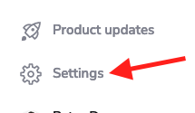
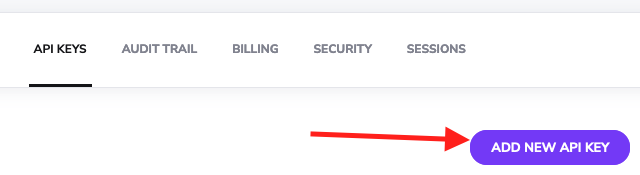
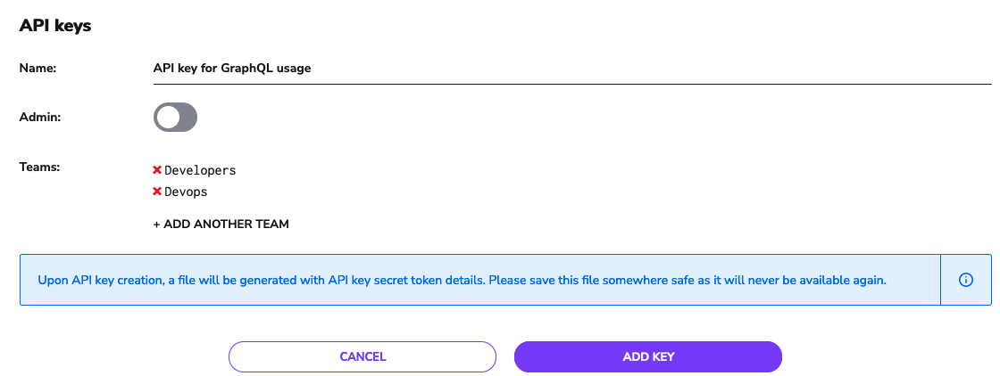
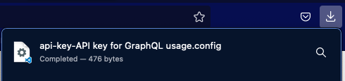
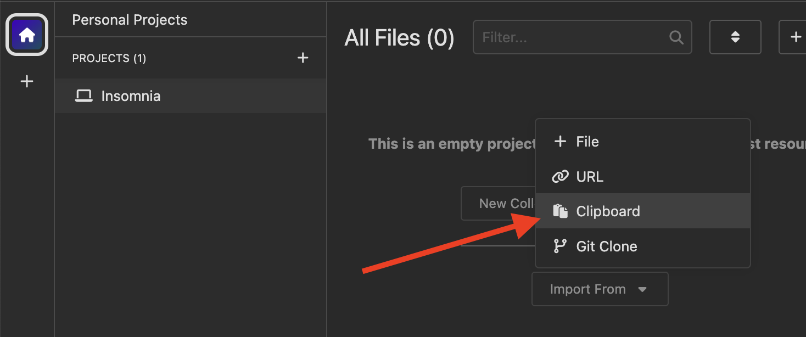
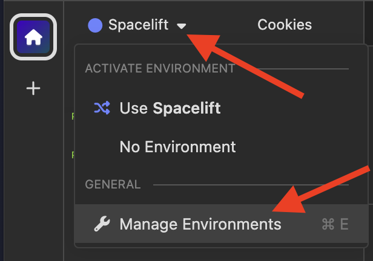
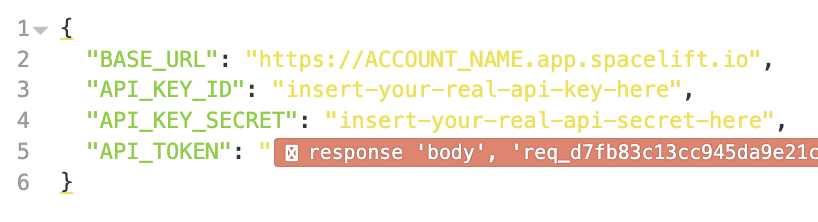
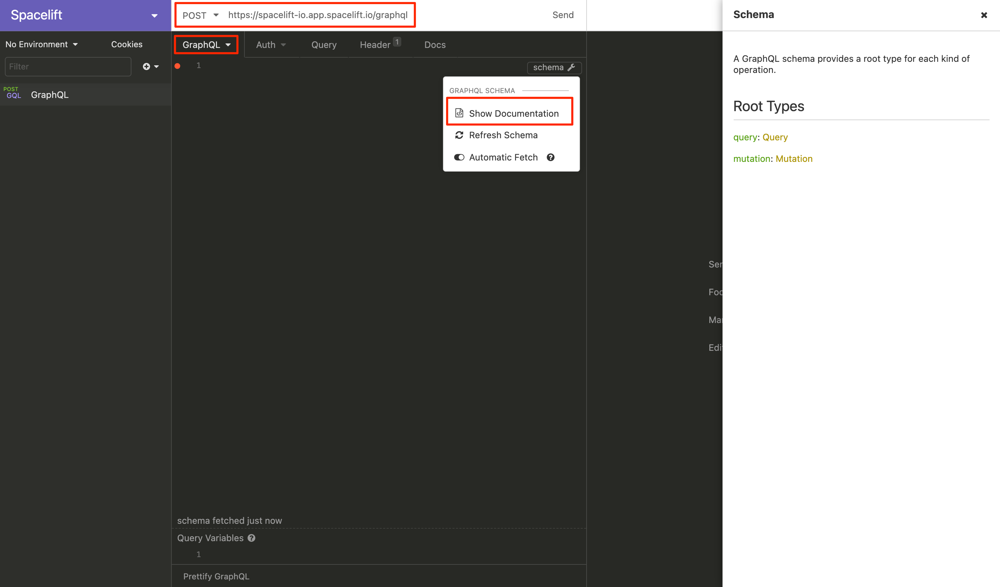
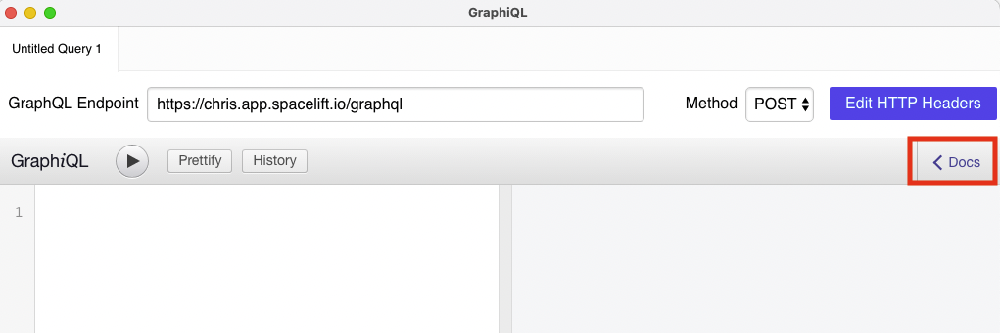
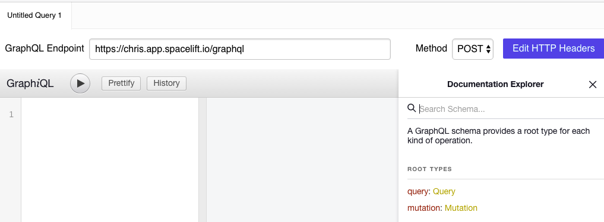

# GraphQL API

## GraphQL

> GraphQL is a query language for APIs and a runtime for fulfilling those queries with your existing data. GraphQL provides a complete and understandable description of the data in your API, gives clients the power to ask for exactly what they need and nothing more, makes it easier to evolve APIs over time, and enables powerful developer tools.

Spacelift provides a [GraphQL API](https://graphql.org/) for you to control your Spacelift account programmatically and/or through an API Client if you choose to do so. A smaller subset of this API is also used by the Spacelift [Terraform provider](../vendors/terraform/terraform-provider.md), as well as the Spacelift CLI ([spacectl](https://github.com/spacelift-io/spacectl)). The API can be accessed at the `/graphql` endpoint of your account using `POST` HTTP method.

??? note "An example of request and response"

    ```
    $ curl --request POST \
      --url http://<account-name>.app.spacelift.io/graphql \
      --header 'Authorization: Bearer <token>' \
      --header 'Content-Type: application/json' \
      --data '{"query":"{ stacks { id name, administrative, createdAt, description }}"}'
    ```

    The request body looks like this when formatted a bit nicer:

    ```graphql
    {
      stacks
      {
        id
        name,
        administrative,
        createdAt,
        description
      }
    }
    ```

    And the response looks like this:

    ```json
    {
      "data": {
        "stacks": [
          {
            "id": "my-stack-1",
            "name": "My Stack 1",
            "administrative": false,
            "createdAt": 1672916942,
            "description": "The is my first stack"
          },
          {
            "id": "my-stack-2",
            "name": "My Stack 2",
            "administrative": false,
            "createdAt": 1674218834,
            "description": "The is my second stack"
          }
        ]
      }
    }
    ```

## Recommendation

Our recommendation is to use the [Spacelift API Key](api.md#spacelift-api-key-token) to authenticate with the GraphQL API.

As of today, Postman does not support GraphQL natively, so our choice of tool is [Insomnia](https://insomnia.rest/download){: rel="nofollow"}. Insomnia is a free, open-source tool that allows you to easily create and manage API requests.

## Usage Demo

The below guide walks through an example of generating your Spacelift token with spacectl and using it to communicate with Spacelift.

**Prerequisites:**

- [Insomnia](https://insomnia.rest/download){: rel="nofollow"} downloaded and installed
- Spacelift account with admin access (for ability to create API Keys)

<!-- markdownlint-disable-next-line MD033 -->
<div style="position: relative; padding-bottom: 56.25%; height: 0;"><iframe src="https://www.loom.com/embed/1cefc584b1bc41d7bc75d767afaf3916" frameborder="0" webkitallowfullscreen mozallowfullscreen allowfullscreen style="position: absolute; top: 0; left: 0; width: 100%; height: 100%;"></iframe></div>

## API Usage with Python

Below is an example of interacting with the API using Python. There are three environment variables you will need to set.

- `SPACELIFT_KEY_ID` - This will be the ID of the [API key](#spacelift-api-key--token) you created above. It should be a 26-character ULID.
- `SPACELIFT_KEY_SECRET` - This will be found in the file downloaded when you created the [API key](#spacelift-api-key--token).
- `SPACELIFT_BASE_URL` - This will be the URL of your Spacelift account. For example, `https://my-account.app.spacelift.io/graphql`.

The Python code is below, but you can also visit the [GitHub Repo](https://github.com/spacelift-io/spacelift-api-examples){: rel="nofollow"} for other use cases and examples.

??? note "Click here to expand"



    ```python
    {
      import sys
      import requests
      import json
      import os

      # Set variables
      keyId = os.environ.get('SPACELIFT_KEY_ID')
      keySecret = os.environ.get('SPACELIFT_KEY_SECRET')
      baseURL = os.environ.get('SPACELIFT_BASE_URL')
      mutatationVariables = {'keyId': keyId, 'keySecret': keySecret}

      #The GraphQL mutation to get the Bearer Token
      mutation = """mutation GetSpaceliftToken($keyId: ID!, $keySecret: String!) {apiKeyUser(id: $keyId, secret: $keySecret) {jwt}}"""

      # ---The API call---
      # By default this will be a basic Stack query
      # unless you pass in a custom request as an argument
      query = sys.argv[1] if len(sys.argv) > 1 else """{stacks {id name space administrative state}}"""

      # function to create the jwt(spacelift token) for the header
      def getSpaceliftToken():
          request = requests.post(baseURL, json={'query': mutation, 'variables': mutatationVariables})
          response = request.json()
          token = response['data']['apiKeyUser']['jwt']
          return token

      # function to make the API call
      def runQuery(query): 
          request = requests.post(baseURL, json={'query': query}, headers=headers)
          print(json.dumps(request.json(), indent=4))

      # Execute the API call
      jwt = getSpaceliftToken()
      headers = {"Authorization": f"Bearer {jwt}"}
      runQuery(query)
    }
    ```



## Authenticating with the GraphQL API

If your Spacelift account is called `example` you would be able to access your GraphQL by sending **POST** requests to: `https://example.app.spacelift.io/graphql`

All requests need to be authenticated using a [JWT](https://jwt.io/) bearer token, which we will discuss in more detail below.

There are currently three ways of obtaining this token:

1. [Spacelift API Key > Token](api.md#spacelift-api-key-token) - for long-term usage (**recommended**)
2. [SpaceCTL CLI > Token](api.md#spacectl-cli-token) - for temporary usage
3. [Personal GitHub Token > Token](api.md#personal-github-token-token)

### Spacelift API Key > Token

Spacelift supports creating and managing machine users with programmatic access to the Spacelift GraphQL API. These "machine users" are called API Keys and can be created by Spacelift admins through the _Settings_ panel.

!!! note
    API keys are **virtual** **users** and are billed like regular users, too. Thus, **each API key used** (exchanged for a token) during any given billing cycle counts against the total number of users.

Steps to create API key in the UI:

Click on Settings in the bottom left corner of the UI

<p align="center">
  
</p>

Choose API Keys menu and click on Add new API key

<p align="center">
  
</p>

The API key creation form will allow you to specify an arbitrary key name, along with the _Admin_ setting and the list of _teams_. If the key is given admin privileges, it has full access to the Spacelift API and won't be subject to [access policies](../concepts/policy/stack-access-policy.md).

For non-administrative keys, you may want to add a **virtual** list of teams that the key should "belong to" so that existing access policies based on [GitHub teams](source-control/github.md#team-based-access) or [SAML assertions](single-sign-on/README.md#setting-up-the-integration) can work with your API keys just as they do with regular users.

Without further ado, let's create a non-administrative API key with virtual membership in two teams: _Developers_ and _DevOps:_

<p align="center">
  
</p>

Once you click the _Add Key_ button, the API Key will be generated and a file will be automatically downloaded. The file contains the API token in two forms - one to be used with our API, and the other one as a `.terraformrc` snippet to access your [private modules](../vendors/terraform/module-registry.md) outside of Spacelift:

<p align="center">
  
</p>

The config file looks something like this:

```text
Please use the following API secret when communicating with Spacelift
programmatically:

SECRET_VALUE40ffc46887297384892384789239

Please add this snippet to your .terraformrc file if you want to use this API
key to access Spacelift-hosted Terraform modules outside of Spacelift:

credentials "spacelift.io" {
  token = "TOKEN_VALUEQwZmZjNDY4ODdiMjI2ZWE4NDhjMWQwNWZiMWE5MGU4NWMwZTFlY2Q4NDAxMGI2ZjA2NzkwMmI1YmVlMWNmMGE"
}
```

!!! warning
    Make sure you persist this data somewhere on your end - we don't store the token and it cannot be retrieved or recreated afterwards.

### SpaceCTL CLI > Token

One approach to generating this token is using the Spacelift [spacectl](https://github.com/spacelift-io/spacectl) CLI. We consider this the easiest method, as the heavy lifting to obtain the token is done for you.

**Steps:**

1. Follow the instructions on the `spacectl` [GitHub repository](https://github.com/spacelift-io/spacectl) to install the CLI on your machine.
2. Authenticate to your Spacelift account using `spacectl profile login`
3. Once authenticated, run `spacectl profile export-token` to receive the bearer token needed for future GraphQL queries/mutations.

### Personal GitHub Token > Token

!!! info
    This option is only available to those using GitHub as their identity provider. If you have enabled any other [Single Sign-On methods](single-sign-on/README.md) on your account, this method will not work. If this applies to you, you will need to use the [Spacelift API Key > Token](api.md#spacelift-api-key-greater-than-jwt-token) method instead.

**Steps:**

1. Using a GitHub Account that has access to your Spacelift account, [create a GitHub Personal Access Token](https://docs.github.com/en/authentication/keeping-your-account-and-data-secure/creating-a-personal-access-token){: rel="nofollow"}. Copy the value of this token to a secure location, as you'll need it in the next step.
2. Using your favorite API Client (e.g. [Insomnia](https://insomnia.rest/){: rel="nofollow"} or [GraphiQL](https://github.com/skevy/graphiql-app){: rel="nofollow"}). Make a GraphQL POST request to your account's GraphQL endpoint (example below).

**Request Details:**

**POST** to `https://example.app.spacelift.io/graphql`

!!! info
    Replace "example" with the name of your Spacelift account.

**Query:**

```graphql
mutation GetSpaceliftToken($token: String!) {
  oauthUser(token: $token) {
    jwt
  }
}
```

!!! info
    You'll need to pass in **token** as a query variable for the above example query to work. When making a GraphQL query with your favorite API Client, you should see a section called GraphQL variables where you can pass in an input.

**GraphQL Variables Input:**

```graphql
{
    "token": "PASTE-TOKEN-VALUE-HERE"
}
```

Assuming all went well, the result of the above query will return your JWT bearer token, which you will now be able to use to authenticate other queries. Once acquired, ensure you use this bearer token in your requests. If you want to access the API reliably in an automated way, we suggest using the [Spacelift API Key > JWT Token](api.md#spacelift-api-key-greater-than-jwt-token) approach as Spacelift tokens expire after 1 hour.

## Insomnia setup

You can create request libraries in Insomnia to make it easier to work with the Spacelift API. You can also automate the JWT token generation process using the [Environment Variables](https://docs.insomnia.rest/insomnia/environment-variables){: rel="nofollow"} feature.

Copy the following JSON to your clipboard:

??? note "Click here to expand"



    ```json
    {
        "_type": "export",
        "__export_format": 4,
        "__export_date": "2023-01-23T19:49:05.605Z",
        "__export_source": "insomnia.desktop.app:v2022.7.0",
        "resources": [
      {
              "_id": "req_d7fb83c13cc945da9e21cd9b94722d3d",
              "parentId": "wrk_3b73a2a7403445a48acdc8396803c4e8",
              "modified": 1674497188638,
              "created": 1656577781496,
              "url": "{{ _.BASE_URL }}/graphql",
              "name": "Authentication - Get JWT",
              "description": "",
              "method": "POST",
              "body": {
                  "mimeType": "application/graphql",
                  "text": "{\"query\":\"mutation GetSpaceliftToken($keyId: ID!, $keySecret: String!) {\\n  apiKeyUser(id: $keyId, secret: $keySecret) {\\n    id\\n\\t\\tjwt\\n  }\\n}\",\"variables\":{\"keyId\":\"{{ _.API_KEY_ID }}\",\"keySecret\":\"{{ _.API_KEY_SECRET }}\"},\"operationName\":\"GetSpaceliftToken\"}"
              },
              "parameters": [],
              "headers": [
                  {
                      "name": "Content-Type",
                      "value": "application/json",
                      "id": "pair_85e4a9afc2e6491ca59b52f77d94e81f"
                  }
              ],
              "authentication": {},
              "metaSortKey": -1656577781496,
              "isPrivate": false,
              "settingStoreCookies": true,
              "settingSendCookies": true,
              "settingDisableRenderRequestBody": false,
              "settingEncodeUrl": true,
              "settingRebuildPath": true,
              "settingFollowRedirects": "global",
              "_type": "request"
          },
          {
              "_id": "wrk_3b73a2a7403445a48acdc8396803c4e8",
              "parentId": null,
              "modified": 1656576979763,
              "created": 1656576979763,
              "name": "Spacelift",
              "description": "",
              "scope": "collection",
              "_type": "workspace"
          },
          {
              "_id": "req_83de84158a16459fa4bfce6042859df6",
              "parentId": "wrk_3b73a2a7403445a48acdc8396803c4e8",
              "modified": 1674497166036,
              "created": 1656577541263,
              "url": "{{ _.BASE_URL }}/graphql",
              "name": "Get Stacks",
              "description": "",
              "method": "POST",
              "body": {
                  "mimeType": "application/graphql",
                  "text": "{\"query\":\"{ \\n\\tstacks\\n\\t{\\n\\t\\tid\\n\\t\\tname,\\n\\t\\tadministrative,\\n\\t\\tcreatedAt,\\n\\t\\tdescription\\n\\t}\\n}\"}"
              },
              "parameters": [],
              "headers": [
                  {
                      "name": "Content-Type",
                      "value": "application/json",
                      "id": "pair_80893dda7c0f4266b48bd09d0eaa3222"
                  }
              ],
              "authentication": {
                  "type": "bearer",
                  "token": "{{ _.API_TOKEN }}"
              },
              "metaSortKey": -1656577721437.75,
              "isPrivate": false,
              "settingStoreCookies": true,
              "settingSendCookies": true,
              "settingDisableRenderRequestBody": false,
              "settingEncodeUrl": true,
              "settingRebuildPath": true,
              "settingFollowRedirects": "global",
              "_type": "request"
          },
          {
              "_id": "env_36e5a9fc63b6443ed4d0a656800d202bcd1f5286",
              "parentId": "wrk_3b73a2a7403445a48acdc8396803c4e8",
              "modified": 1660646140956,
              "created": 1656576979773,
              "name": "Base Environment",
              "data": {},
              "dataPropertyOrder": {},
              "color": null,
              "isPrivate": false,
              "metaSortKey": 1656576979773,
              "_type": "environment"
          },
          {
              "_id": "jar_36e5a9fc63b6443ed4d0a656800d202bcd1f5286",
              "parentId": "wrk_3b73a2a7403445a48acdc8396803c4e8",
              "modified": 1656576979775,
              "created": 1656576979775,
              "name": "Default Jar",
              "cookies": [],
              "_type": "cookie_jar"
          },
          {
              "_id": "spc_dbcf993f70b44bb18eee1b2362bb5bdc",
              "parentId": "wrk_3b73a2a7403445a48acdc8396803c4e8",
              "modified": 1656576979770,
              "created": 1656576979770,
              "fileName": "Spacelift",
              "contents": "",
              "contentType": "yaml",
              "_type": "api_spec"
          },
          {
              "_id": "env_ea5c30c23af449f792c71d160678eff5",
              "parentId": "env_36e5a9fc63b6443ed4d0a656800d202bcd1f5286",
              "modified": 1669716444669,
              "created": 1669716373608,
              "name": "Spacelift",
              "data": {
                  "BASE_URL": "https://ACCOUNT_NAME.app.spacelift.io",
                  "API_KEY_ID": "insert-your-real-api-key-here",
                  "API_KEY_SECRET": "insert-your-real-api-secret-here",
                  "API_TOKEN": ""
              },
              "dataPropertyOrder": {
                  "&": [
                      "BASE_URL",
                      "API_KEY_ID",
                      "API_KEY_SECRET",
                      "API_TOKEN"
                  ]
              },
              "color": "#6b84ff",
              "isPrivate": false,
              "metaSortKey": 828288489886.5,
              "_type": "environment"
            }
        ]
    }
    ```



In the home screen of Insomnia, click on `Import From` then click on `Clipboard`.

<p align="center">
  <!-- markdownlint-disable-next-line MD044 -->
  
</p>

The `Spacelift` collection will appear. Click on it.

On the top left corner, click the `🔵 Spacelift` icon, then choose `Manage Environments`.

<p align="center">
  <!-- markdownlint-disable-next-line MD044 -->
  
</p>

Here, make sure you fill the first three variables properly:

- `BASE_URL` should be the URL of your Spacelift account. For example, `https://my-account.app.spacelift.io`
- `API_KEY_ID` is the ID of the API key you created in [the previous step](api.md#spacelift-api-key-token). It should be a 26-character [ULID](https://github.com/ulid/spec){: rel="nofollow"}.
- `API_KEY_SECRET` can be found in the file that was downloaded when you created the API key.

Don't worry about the 4th.

<p align="center">
  <!-- markdownlint-disable-next-line MD044 -->
  
</p>

That's it! Now just send an `Authentication - Get JWT` request which populates `API_TOKEN` environment variable, then send the other `Get Stacks` request to see the list of stacks in your account.

If you want to create another request, just right click on `Get Stacks` and duplicate it. Then, change the query to whatever you want.

!!! hint
    Don't forget that the JWT expires after 10 hours. Run the authentication request again to get a new one.

## Viewing the GraphQL Schema

Our GraphQL schema is self-documenting. The best way to view the latest documentation is using a dedicated GraphQL client like [Insomnia](https://insomnia.rest/){: rel="nofollow"} or [GraphiQL](https://github.com/skevy/graphiql-app){: rel="nofollow"}. _Note: As of the writing of these examples, the latest version of Postman does not currently support viewing GraphQL Schemas from a URL, but does support autocompletion._

!!! warning
    Please replace the URL in the below examples with the one pointing to **your** Spacelift account.

### Insomnia



### GraphiQL

Input your GraphQL Endpoint for your Spacelift Account.



Use the Documentation Explorer within GraphiQL


