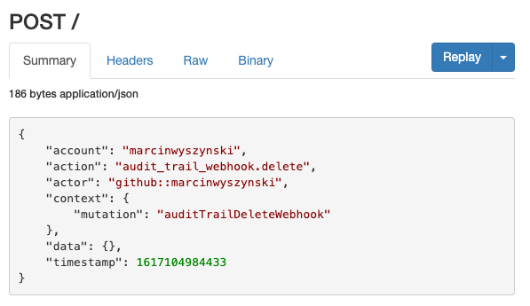

# Audit trail

Spacelift optionally supports auditing all operations that change Spacelift resources. This is handled by asynchronously sending webhooks to a user-supplied endpoint.

## Setup

In order to set up the audit trail, navigate to the Audit trail section of your account settings and click the _Set up_ button:

.png>)

You will then need to provide a webhook endpoint and an arbitrary secret that you can later use for [verifying payload](audit-trail.md#verifying-payload). Let's use ngrok for the purpose of this tutorial:

.png>)

If you choose to automatically enable the functionality, clicking the _Save_ button will verify that payloads can be delivered (the endpoint returns a 2xx status code). This gives us an opportunity to look at the payload:

...and the headers - the interesting ones are highlighted:

.png>)

## Usage

Every audit trail payload conforms to the same schema:

- `account`: name (subdomain) of the affected Spacelift account;
- `action`: name of the performed action;
- `actor`: actor performing the action - the `::` format shows both the actor identity (second element), and the source of the identity (first element)
- `context`: some contextual metadata about the request;
- `data`: action-specific payload showing arguments passed to the request. Any sensitive arguments (like secrets) are sanitized;

Below is a sample:

.png>)

## Disabling and deleting the audit trail

The audit trail can be disabled and deleted at any point, but for both events we will send the appropriate payload. We suggest that you always treat these at least as important security signals, if not alerting conditions:

.png>)

## Verifying payload

Spacelift uses the same similar verification mechanism as GitHub. With each payload we send 2 headers, `X-Signature` and `X-Signature-256`. `X-Signature` header contains the SHA1 hash of the payload, while `X-Signature-256` contains the SHA256 hash. We're using the exact same mechanism as GitHub to generate signatures, please refer to [this article](https://medium.com/@vampiire/how-to-verify-the-authenticity-of-a-github-apps-webhook-payload-8d63ccc81a24) for details.

