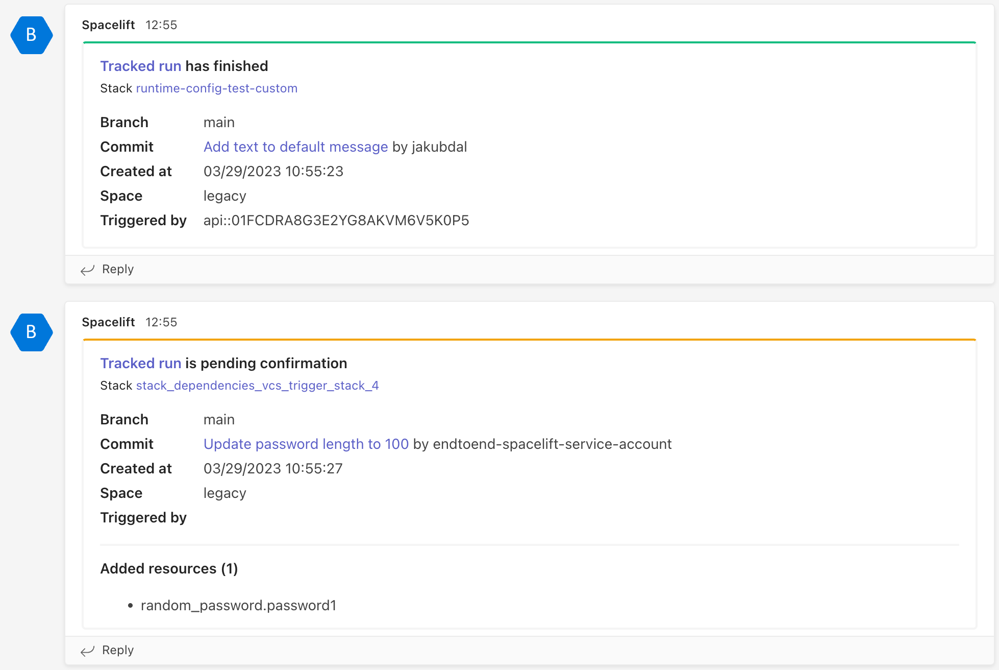
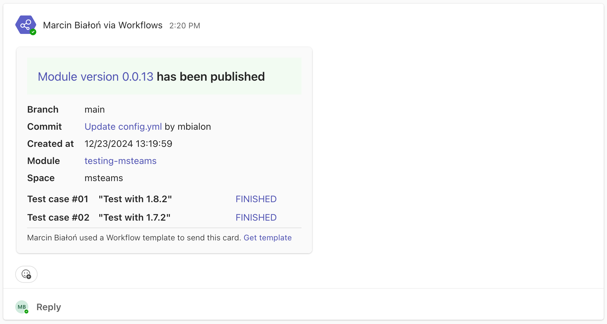

# Microsoft Teams

Microsoft Teams is a Slack alternative and a part of the Microsoft Office 365 suite. It's a chat-based workspace where teams can organize and discuss their work. Many DevOps teams use it to communicate and collaborate on infrastructure and application deployments. Hence, Spacelift has a first-class integration with Microsoft Teams.

The integration creates a [webhook](../webhooks.md) in Spacelift that will send notifications to a Microsoft Teams channel when:

- a [tracked run](../../concepts/run/tracked.md) [needs confirmation](../../concepts/run/tracked.md#unconfirmed);
- a [tracked run](../../concepts/run/tracked.md) or a [task](../../concepts/run/task.md) finishes;
- a [module version](../../vendors/terraform/module-registry.md#versions) succeeds or fails;

Based on this configuration, the module will send notifications that look like these:

## Prerequisites

In order to set up the integration, you'll to perform some manual steps in Microsoft Teams. The Spacelift end of the integration is handled programmatically, by a [Terraform module](https://registry.terraform.io/modules/spacelift-io/msteams/spacelift/latest){: rel="nofollow"}.

### In Microsoft Teams

In order to set up the integration, you'll need to create a [Microsoft Teams webhook](https://docs.microsoft.com/en-us/microsoftteams/platform/webhooks-and-connectors/how-to/add-incoming-webhook){: rel="nofollow"} and copy its URL. You can do this by following these steps:

1. Open the channel in which you want to receive notifications from Spacelift.
2. Click the ellipsis (...) next to the channel name and select **Connectors**
3. Search for **Incoming Webhook** and click **Configure**.
4. Click **Add** to create the webhook.
5. Copy the webhook URL, you'll need it in the next step.

### In Spacelift

The Teams integration is based on our [notification policy](../../concepts/policy/notification-policy.md) feature, which requires at least an active [Cloud tier](https://spacelift.io/pricing){: rel="nofollow"} subscription. While building a notification-based Teams integration from scratch is possible, we've created a [Terraform module](https://registry.terraform.io/modules/spacelift-io/msteams/spacelift/latest){: rel="nofollow"} that will set up all the necessary integration elements for you.

This module will only create Spacelift assets:

- a [notification policy](../../concepts/policy/notification-policy.md) that will send data to Microsoft Teams;
- a [webhook endpoint](../webhooks.md) that serve as a notification target for the policy;

## Monitoring and troubleshooting

Once the integration is set up, you can monitor the notifications in the `My channel` channel in Microsoft Teams. You can also monitor the notifications in the corresponding [notification policy](../../concepts/policy/notification-policy.md) and its [webhook endpoint](../webhooks.md) in Spacelift.
