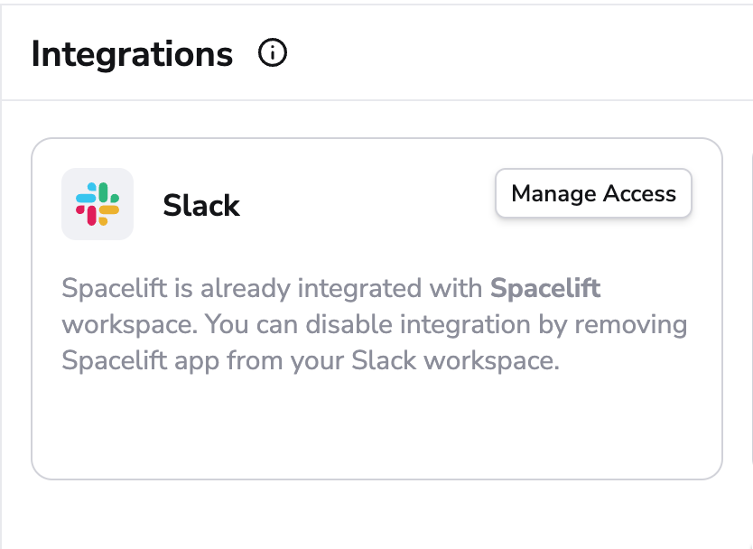
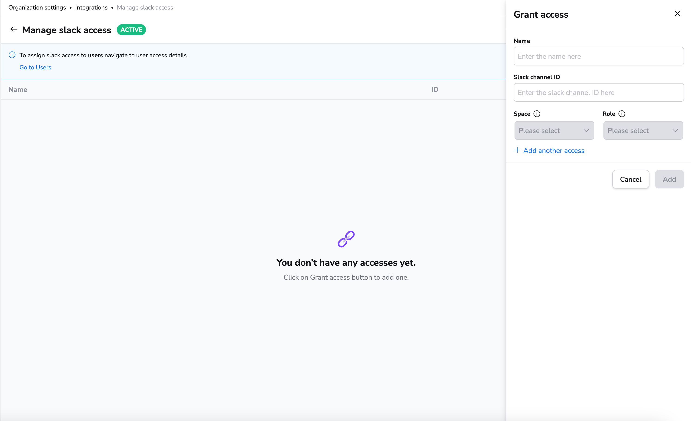

# Slack

At Spacelift, we're using Slack for internal communication. And we know that other tech companies do the same, so we've created a first-class integration that we ourselves enjoy using.

Here are examples of messages the Spacelift application sends to Slack;


## Linking your Spacelift account to the Slack workspace

As a Spacelift and Slack admin, you can link your Spacelift account to the Slack workspace by going to the _Integrations_ section of the _Organization settings_ screen.

The Slack integration is an OAuth2 exchange which installs Slack Spacelift app in your workspace.

Once you install the Spacelift app, the account-level integration is finished and the _Slack_ of the _Integrations_ screen informs you that the two are talking to one another:



Installing the Slack app doesn't automatically cause Spacelift to flood your Slack channels with torrents of notifications. These are set up on a per-stack basis using [Slack commands](slack.md#available-commands) and the management uses the Slack interface.

Though before that happens, you need to allow requests coming from Slack to access Spacelift stacks.

## Managing access to Stacks

Our Slack integration allows users in the Slack workspace to interact with stacks by adding the ability
to change their run state or view changes that are planned or were applied.

### Available actions

Currently, we allow:

- Confirming and discarding tracked runs.
- Viewing planned and actual changes.

Both of these actions require specific permissions to be configured using the login policy or granted via Slack manage access view.
Confirming or discarding runs requires _Write_ level permissions while viewing changes requires _Read_ level permissions. The documentation sections about policies below describe how to setup and manage these permissions.

!!! info
    The default login policy decision for Slack requests is to deny all access.

### Login policy

Using [login policies](../../concepts/policy/login-policy.md) is the first way to control access for the Slack integration. Using them you can control who can access stacks which are in a specific [Space](../../concepts/spaces/README.md).

They allow for granular space access control using the provided policy data such as slack workspace details, Slack team information and user which interacted with the message data. Using the Login policy you can define rules which
would allow to have _Read_ or _Write_ level permissions for certain actions.

Login policies also don't need to be attached to a specific stack in order to work but are instead
evaluated during every stack mutation or read attempt from the integration.

!!! warning
    It's important to know that if you have multiple login policies, failing to evaluate one of them or
    having at least one of them result in a deny decision after the evaluation is done, will result in the
    overall decision being a `deny all`.

Here is an example of data which the login policy receives when evaluating stack access for the integration:

```json
{
  "request": {
    "timestamp_ns": "<int> - a unix timestamp for when this request happened"
  },
  "slack": {
    "channel": {
      "id": "<string> - a channel ID, example: C042YPN0000",
      "name": "<string> - a channel name, example: spc-finished"
    },
    "command": "<string>",
    "team": {
      "id": "<string> - a team ID for which this user belongs, example: T0431750000",
      "name": "<string> - a team name represented as string, example: slack-workspace-name"
    },
    "user": {
      "deleted": "<boolean>",
      "display_name": "<string>",
      "enterprise": {
        "enterprise_id": "<string>",
        "enterprise_name": "<string>",
        "id": "<string>",
        "is_admin": "<boolean>",
        "is_owner": "<boolean>",
      },
      "teams": {
         "id": "<string>",
         "name": "<string>"
      },
      "id": "<string> - a user which initially request ID, example: C042YPN1111",
      "is_admin": "<boolean> - is the user an admin",
      "is_owner": "<boolean> - is the workspace owner",
      "is_primary_owner": "<boolean>",
      "is_restricted": "<boolean>",
      "is_stranger": "<boolean>",
      "is_ultra_restricted": "<boolean>",
      "has_2fa": "<boolean>"
      "real_name": "<string>",
      "tz": "<string>"
    }
  },
  "spaces": [{
    "id": "<string> - an ID for a Space in spacelift",
    "labels": "<stringArray> - a list of labels attached to this space",
    "name": "<string> - name for a Space in spacelift"
  }, {
    "id": "<string>",
    "labels": "<stringArray>",
    "name": "<string>"
  }]
}
```

!!! info
    The `slack` object in the policy input data is built using Slack provided data. See [their official documentation](https://api.slack.com/types/user){: rel="nofollow"} for always up-to-date and full explanation of the `slack` object fields.

Using the above data we can write policies which only allow for a specific user or slack team to access specific spaces in which your stacks reside.

For example here is a policy which would allow anyone from a specific slack team to alter stacks in a particular space:

```opa
package spacelift

# Allow access for anyone in team X
allow {
  input.slack.team.id == "X"
}

# Deny access for everyone except team X
deny {
  input.slack.team.id != ""
  input.slack.team.id != "X"
}

# Grant write access to stacks in Space Y for anyone in team X
space_write["Y"] {
  input.slack.team.id == "X"
}
```

### Manage Slack access page

Using Manage Slack access page is another way to control access for the Slack integration. Using this method you can control who can access stacks which are in a specific [Space](../../concepts/spaces/README.md) and based that access on specific Slack channel.

!!! warning
    It's important to know that all access rules assigned won’t work until you [change user management strategy](../../concepts/user-management/README.md#migrating-from-login-policy) from login policy to user management.

To manage slack access as account admin you should go to _Organization Settings_ _Integrations_ section and click on _Manage access_ button on _Slack_ card.

You can than add new access rule by clicking _Grant access_ button and filling out the form.



## Available slash commands

!!! warning
    It's recommended to instead use the [notification policy](../../concepts/policy/notification-policy.md) in order to
    manage slack messages received from Spacelift. These slash commands are **deprecated**.

    
    Also, please note that slash commands only work if your Spacelift instance is publicly accessible by Slack. If your Spacelift installation uses an internal load balancer, for example, slash commands will not work.
    

Three slash commands are currently available:

- `/spacelift subscribe $stackId` - subscribes a particular Slack channel to run state changes for a given Stack - requires ;
- `/spacelift unsubscribe $stackId` - unsubscribes a particular Slack channel from run state changes for a given Stack;
- `/spacelift trigger $stackId` - triggers a tracked run for the specified Stack;
