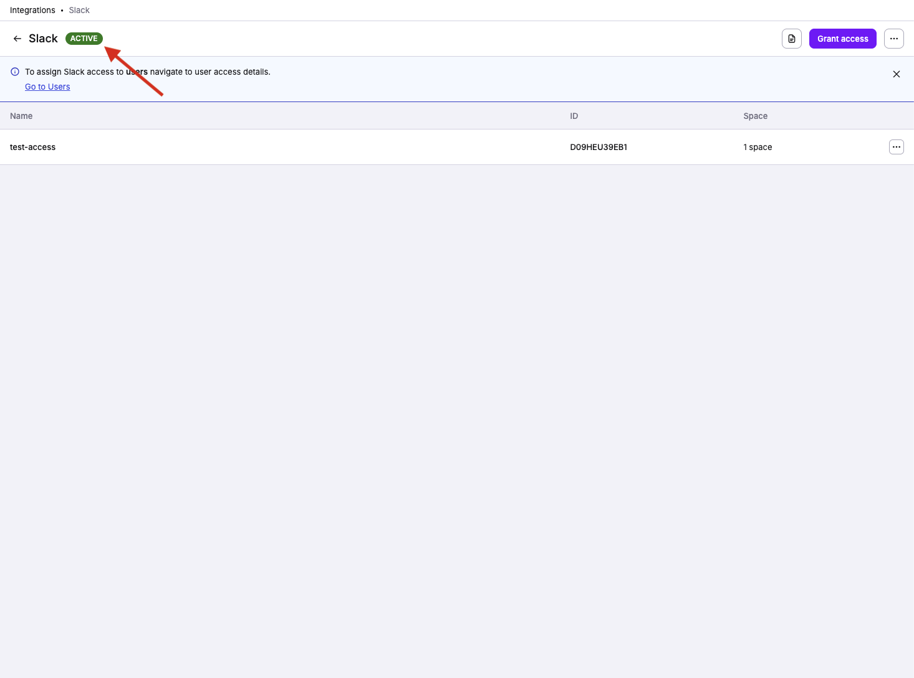

# Slack

At Spacelift, we're using Slack for internal communication. And we know that other tech companies do the same, so we've created a first-class integration that we ourselves enjoy using.

Here are examples of messages the Spacelift application sends to Slack;




## Configuring a Slack app

In a Self-Hosted installation, you need to create your own Slack app to allow Spacelift to integrate with your Slack workspace. This Slack app provides credentials needed by Spacelift to communicate with Slack, and also contains configuration information like the webhooks URL that Slack should send requests to.

There are two options for configuring the Slack app:

1. Via environment variables.
2. Dynamically via the Spacelift frontend.

This section walks you through the steps to create and configure the Slack app dynamically via the Spacelift frontend. If you want to configure it via the environment please see our [configuration reference](../../installing-spacelift/reference-architecture/reference/slack.md).

### Create Slack app

To start the process, go to _Integrations > Slack_, and choose the _Set up_ option next to the Slack integration:


The side bar is split into two sections. The top section contains the manifest you should use when creating your Slack app, and the bottom section contains fields to enter the credentials for your Slack app.

Copy the app manifest then click on the _Create Slack app_ button. This will take you to Slack and start the app creation process. Choose the _From a manifest_ option when the dialog appears:


On the next step, choose the Slack workspace you want to connect Spacelift to:


Next, paste the manifest that your copied from the Spacelift frontend:


Finally, click _Create_ on the summary page to create your app:


### Add Slack app details to Spacelift

Once your app has been created, go to its _Basic Information_ configuration section and find the _Client ID_, _Client Secret_ and _Signing Secret_:


Enter these details into Spacelift and click the _Save & Connect_ button to continue:


You will now be redirected to Slack, and asked to grant the app you just created access to your Slack workspace. Click on _Allow_ to continue:


You should now be redirected to Spacelift, and the status of your integration should be marked as active:



At this point you can skip the next section and go straight to finding out how to [manage access to Stacks](#managing-access-to-stacks-with-policies).



## Connecting your Spacelift account to the Slack workspace

As a Spacelift and Slack admin, you can connect your Spacelift account to the Slack workspace via the _Integrations > Slack_ page:


When you click on _Connect_, it performs an OAuth2 exchange which installs Slack Spacelift app in your workspace.

Once the connection is complete, the Slack integration should be marked as active:


Installing the Slack app doesn't automatically cause Spacelift to flood your Slack channels with torrents of notifications. These are set up on a per-stack basis using [Notification policies](https://docs.spacelift.io/concepts/policy/notification-policy#slack-messages).

Though before that happens, you need to allow requests coming from Slack to access Spacelift stacks.

## Managing access to Stacks with policies

Our Slack integration allows users in the Slack workspace to interact with stacks by adding the ability
to change their run state or view changes that are planned or were applied.

Similar to regular requests to our HTTP APIs, requests and actions coming from Slack are subject to the policy-based access validation. If you haven't had a chance to review the [policy](../../concepts/policy/README.md) and [Spaces](../../concepts/spaces/README.md) documentation yet, please do it now before proceeding any further - you're risking a chance of getting lost.

### Available actions

Currently, we allow:

- Confirming and discarding tracked runs.
- Viewing planned and actual changes.

Both of these actions require specific permissions to be configured using the login policy.
Confirming or discarding runs requires _Write_ level permissions while viewing changes requires _Read_ level permissions. The documentation sections about policies below describe how to setup and manage these permissions.

!!! info
    The default login policy decision for Slack requests is to deny all access.

### Login policy

Using [login policies](../../concepts/policy/login-policy.md) is the preferred way to control access for the Slack integration. Using them you can control who can access stacks which are in a specific [Space](../../concepts/spaces/README.md).

They allow for granular space access control using the provided policy data such as slack workspace details, Slack team information and user which interacted with the message data. Using the Login policy you can define rules which
would allow to have _Read_ or _Write_ level permissions for certain actions.

Login policies also don't need to be attached to a specific stack in order to work but are instead
evaluated during every stack mutation or read attempt from the integration.

!!! warning
    It's important to know that if you have multiple login policies, failing to evaluate one of them or
    having at least one of them result in a deny decision after the evaluation is done, will result in the
    overall decision being a `deny all`.

Here is an example of data which the login policy receives when evaluating stack access for the integration:

```json
{
  "request": {
    "timestamp_ns": "<int> - a unix timestamp for when this request happened"
  },
  "slack": {
    "channel": {
      "id": "<string> - a channel ID, example: C042YPN0000",
      "name": "<string> - a channel name, example: spc-finished"
    },
    "command": "<string>",
    "team": {
      "id": "<string> - the workspace ID for which this user belongs, example: T0431750000",
      "name": "<string> - the workspace name represented as string, example: slack-workspace-name"
    },
    "user": {
      "deleted": "<boolean>",
      "display_name": "<string>",
      "enterprise": {
        "enterprise_id": "<string>",
        "enterprise_name": "<string>",
        "id": "<string>",
        "is_admin": "<boolean>",
        "is_owner": "<boolean>",
      },
      "teams": {
         "id": "<string>",
         "name": "<string>"
      },
      "id": "<string> - a user which initially request ID, example: C042YPN1111",
      "is_admin": "<boolean> - is the user an admin",
      "is_owner": "<boolean> - is the workspace owner",
      "is_primary_owner": "<boolean>",
      "is_restricted": "<boolean>",
      "is_stranger": "<boolean>",
      "is_ultra_restricted": "<boolean>",
      "has_2fa": "<boolean>"
      "real_name": "<string>",
      "tz": "<string>"
    }
  },
  "spaces": [{
    "id": "<string> - an ID for a Space in spacelift",
    "labels": "<stringArray> - a list of labels attached to this space",
    "name": "<string> - name for a Space in spacelift"
  }, {
    "id": "<string>",
    "labels": "<stringArray>",
    "name": "<string>"
  }]
}
```

!!! info
    The `slack` object in the policy input data is built using Slack provided data. For example, "team" is the term that is used by Space for a workspace - so it is kept as this in the input data for the sake of clarity and consistency with their API. See [their official documentation](https://api.slack.com/types/user){: rel="nofollow"} for always up-to-date and full explanation of the `slack` object fields.

Using the above data we can write policies which only allow for a specific user or slack team to access specific spaces in which your stacks reside.

For example here is a policy which would allow anyone from a specific slack team to alter stacks in a particular space:

```opa
package spacelift

# Allow access for anyone in team X
allow {
  input.slack.team.id == "X"
}

# Deny access for everyone except team X
deny {
  input.slack.team.id != ""
  input.slack.team.id != "X"
}

# Grant write access to stacks in Space Y for anyone in team X
space_write["Y"] {
  input.slack.team.id == "X"
}
```
