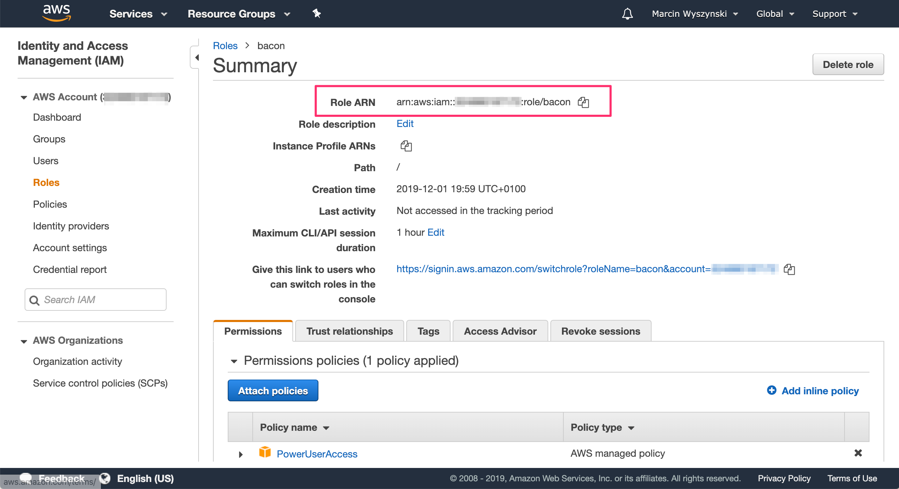
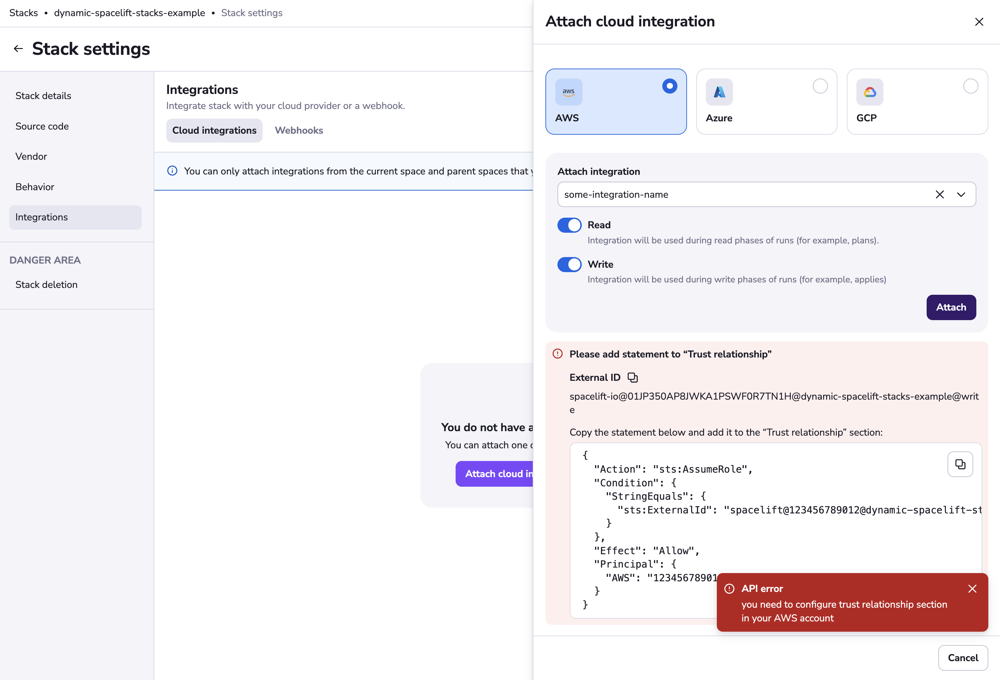
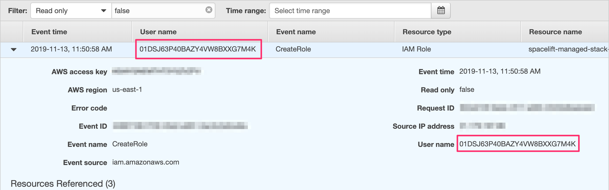

# Amazon Web Services (AWS)

## Let's Explain

The AWS integration allows either Spacelift [runs](../../concepts/run/README.md) or [tasks](../../concepts/run/task.md) to automatically [assume an IAM role](https://docs.aws.amazon.com/IAM/latest/UserGuide/id_roles_use.html){: rel="nofollow"} in your AWS account, and in the process, generate a set of **temporary credentials.** These credentials are then exposed as [computed environment variables](../../concepts/configuration/environment.md#computed-values) during the run/task that takes place on the particular Spacelift stack that the integration is attached to.

- `AWS_ACCESS_KEY_ID`
- `AWS_SECRET_ACCESS_KEY`
- `AWS_SECURITY_TOKEN`
- `AWS_SESSION_TOKEN`

This is enough for both the [AWS OpenTofu/Terraform provider](https://search.opentofu.org/provider/hashicorp/aws/latest#environment-variables){: rel="nofollow"} and/or [Amazon S3 state backend](https://opentofu.org/docs/language/settings/backends/s3/){: rel="nofollow"} to generate a fully authenticated AWS session without further configuration. However, you will likely need to select one of the available regions with the former.

### Usage

To utilize the AWS integration, you need to set up at least one cloud integration, and then attach that integration to any stacks that need it. Please follow the [Setup Guide](#setup-guide) for more information on this process.

## Trust Policy

When setting up a Spacelift AWS Cloud Integration you need to specify the ARN of an IAM Role to use. The Trust Policy for this role must be configured to allow Spacelift to assume the role and generate temporary credentials.

When completing the role assumption, Spacelift will pass extra information in the `ExternalId` attribute, allowing you to optionally add additional layers of security to your role.

**External ID Format:** `<spacelift-account-name>@<integration-id>@<stack-slug>@<read|write>`

- `<spacelift-account-name>`: the name of the Spacelift account that initiated the role assumption.
- `<integration-id>`: the ID of the AWS Cloud Integration that initiated the role assumption.
- `<stack-slug>`: the slug of the stack that the AWS Cloud Integration is attached to, that initiated the role assumption.
- `<read|write>`: set to either `read` or `write` based upon the event occurring that has initiated the role assumption. The [Planning phase](../../concepts/run/proposed.md#planning) utilizes `read` while the [Applying phase](../../concepts/run/tracked.md#applying) utilizes `write`.

## Setup Guide

Prerequisites:

- The ability to create IAM Roles in your AWS account.
- Admin access to your Spacelift account.

### Setup a Role in AWS

Before creating the Spacelift AWS integration, you need to have an [AWS IAM Role](https://docs.aws.amazon.com/IAM/latest/UserGuide/id_roles.html){: rel="nofollow"} within your AWS account that the cloud integration will use.

Within your AWS account, navigate to AWS IAM and click the **Create role** button.


!!! hint
    To allow this integration to access multiple AWS accounts, you can extend this role to have cross-account permissions to the target accounts. See [AWS documentation](https://docs.aws.amazon.com/IAM/latest/UserGuide/tutorial_cross-account-with-roles.html){: rel="nofollow"} for more details.

#### Configure Trust Policy

Next, we want to configure the [Trust Policy](https://docs.aws.amazon.com/IAM/latest/UserGuide/id_roles_create_for-custom.html){: rel="nofollow"} for the role to allow Spacelift to assume the role.

Here's an example trust policy statement you can use, that allows any stack within your Spacelift account to use this IAM Role:

```json
{
  "Version": "2012-10-17",
  "Statement": [
          {
            "Action": "sts:AssumeRole",
            "Condition": {
              "StringLike": {
                "sts:ExternalId": "yourSpaceliftAccountName@*"
              }
            },
            "Effect": "Allow",
            "Principal": {
              "AWS": "<principal>"
            }
          }
  ]
}
```

!!! info
    Be sure to replace **yourSpaceliftAccountName** in the example above with your actual Spacelift account name.


!!! info
    Ensure you replace `<principal>` based on your environment.

    - for [spacelift.io](https://spacelift.io), use `324880187172`.
    - for [us.spacelift.io](https://us.spacelift.io), use `577638371743`.


#### Optionally Configure Further Constraints on the Trust Policy

!!! info
    By default, Spacelift passes the `ExternalId` value in this format: `<spacelift-account-name>@<integration-id>@<stack-slug>@<read|write>`

Knowing the format of the External ID passed by Spacelift, you can further secure your IAM Role trust policies if you desire a deeper level of granular security.

For example, you may wish to lock down an IAM Role so that it can only be used by a specific stack. The following example shows how to lock down an IAM Role so that it can only be assumed by the stack `stack-a` in a Spacelift account called `example`:

```json
{
  "Version": "2012-10-17",
  "Statement": [
          {
            "Action": "sts:AssumeRole",
            "Condition": {
              "StringLike": {
                "sts:ExternalId": "example@*@stack-a@*"
              }
            },
            "Effect": "Allow",
            "Principal": {
              "AWS": "<principal>"
            }
          }
  ]
}
```

!!! info
    Ensure you replace `<principal>` based on your environment.

    - for [spacelift.io](https://spacelift.io), use `324880187172`.
    - for [us.spacelift.io](https://us.spacelift.io), use `577638371743`.

#### Configure Role Permissions

Next, you need to attach at least one IAM Policy to your IAM Role to provide it with sufficient permissions to deploy any resources that your IaC code defines.

!!! info
    For OpenTofu/Terraform users that are managing their own state file, don't forget to give your role sufficient permissions to access your state (OpenTofu documents the permissions required for S3-managed state [here](https://opentofu.org/docs/language/settings/backends/s3/#s3-bucket-permissions){: rel="nofollow"}, and for DynamoDB state locking [here](https://opentofu.org/docs/language/settings/backends/s3/#dynamodb-table-permissions){: rel="nofollow"}).

#### Create IAM Role

Once you have your IAM Role's trust policy and IAM Policies configured, you can finish creating the role. Take a note of the IAM Role ARN, as you'll need this when setting up the integration in Spacelift in the next section.



### Navigate to Cloud Integrations

Now that you have an IAM Role created, navigate to the _Cloud Integrations_ page from the Spacelift navigation sidebar.


### Create an Integration

Click on the **Set up integration** button and select **AWS** in the drop-down menu to start configuring your integration:


When creating an integration, you will immediately notice that you need to specify two required fields: **Name** and **Role ARN.** Give the integration a name of your choosing, and paste in the ARN of the IAM Role that you just created.

If you enable the **assume role on worker** option, the role assumption will be performed on your private worker rather than at Spacelift's end. When role assumption on the worker is enabled, you can also optionally specify a custom External ID to use during role assumption.

!!! info
    **When creating your role in AWS, you need to ensure the role has a trust policy that allows Spacelift to assume the role to generate temporary credentials for runs.** Assuming you are following this guide, you should have configured this in the [previous section](#configure-trust-policy). For troubleshooting, refer to the [Troubleshooting Trust Relationship Issues](#troubleshooting-trust-relationship-issues) section.

### Using the Integration

Now that the integration has been created, you need to attach it to one or more stacks. To do this, navigate to a stack that you want to attach your integration to:


Next, go to the stack's settings:


Choose the integrations tab:


Click **Attach cloud integration** button, then select the **AWS** option, choose your integration, and select whether it should be used for read, write or both read and write phases:


#### Read vs Write

You can attach an AWS integration as read, write or read-write, and you can attach at most two integrations to any single stack. **Read** indicates that this integration will be used during read phases of runs (for example, plans), and **Write** indicates that this integration will be used during write phases of runs (for example, applies).

#### Role Assumption Verification

If the Cloud Integration has the "Assume Role on Worker" setting disabled, Spacelift will verify the role assumption as soon as you click the attach button. If role assumption succeeds, it will try to assume the role **without the unique external ID**, and this time it **expects to fail**. If Spacelift fails the latter check, we consider the integration is safely configured.

!!! success
    This somewhat counterintuitive extra check is to prevent against malicious takeover of your account by someone who happens to know your AWS account ID, which isn't all that secret, really. The security vulnerability we're addressing here is known as the [_confused deputy problem_](https://en.wikipedia.org/wiki/Confused_deputy_problem){: rel="nofollow"}.

### Troubleshooting Trust Relationship Issues

If you get the error `you need to configure trust relationship section in your AWS account` when attaching a cloud integration to a stack:



There are a couple of common causes to check.

#### Incorrect or Missing Trust Relationship Policy

The error message in the UI includes a tailored trust relationship policy example. This policy allows Spacelift to assume the IAM role and must be added to the **Trust relationships** section of your role in AWS IAM. Check [previous section](#configure-trust-policy) for more information on how to configure the trust policy.

#### STS (Security Token Service) Not Enabled


This error can occur if the [AWS STS (Security Token Service)](https://spacelift.io/blog/aws-sts) is not enabled in your account.

Make sure STS is enabled in the following regions:

- **eu-west-1**
- **eu-central-1** (used for disaster recovery failover)

You can enable STS by following [this AWS guide](https://docs.aws.amazon.com/IAM/latest/UserGuide/id_credentials_temp_enable-regions.html#sts-regions-activate-deactivate){: rel="nofollow"}.



This error can be caused by STS not being enabled in the AWS region where your Spacelift instance is deployed. Check your region settings and ensure STS is active. Learn more about [AWS STS here](https://spacelift.io/blog/aws-sts).


## Programmatic Setup

You can also use the [Spacelift OpenTofu/Terraform provider](../../vendors/terraform/terraform-provider.md) in order to create an AWS Cloud integration from an [administrative stack](../../concepts/stack/stack-settings.md#administrative), including the trust relationship. Note that in order to do that, your administrative stack will require AWS credentials itself, and ones powerful enough to be able to deal with IAM.

Here's a little example of what that might look like to create a Cloud Integration programmatically:

```terraform
data "aws_caller_identity" "current" {}

locals {
  role_name = "example-role"
  role_arn  = "arn:aws:iam::${data.aws_caller_identity.current.account_id}:role/${local.role_name}"
}

resource "spacelift_stack" "this" {
  name         = "Example Stack"
  repository   = "your-awesome-repo"
  branch       = "main"
}

resource "spacelift_aws_integration" "this" {
  name = local.role_name

  # We need to set this manually rather than referencing the role to avoid a circular dependency
  role_arn                       = local.role_arn
  generate_credentials_in_worker = false
}

# The spacelift_aws_integration_attachment_external_id data source is used to help generate a trust policy for the integration
data "spacelift_aws_integration_attachment_external_id" "this" {
  integration_id = spacelift_aws_integration.this.id
  stack_id       = spacelift_stack.this.id
  read           = true
  write          = true
}

resource "aws_iam_role" "this" {
  name = local.role_name

  assume_role_policy = jsonencode({
    Version = "2012-10-17"
    Statement = [
      jsondecode(data.spacelift_aws_integration_attachment_external_id.this.assume_role_policy_statement),
    ]
  })
}

resource "aws_iam_role_policy_attachment" "this" {
  policy_arn = "arn:aws:iam::aws:policy/PowerUserAccess"
  role       = aws_iam_role.this.name
}

resource "spacelift_aws_integration_attachment" "this" {
  integration_id = spacelift_aws_integration.this.id
  stack_id       = spacelift_stack.this.id
  read           = true
  write          = true

  # The role needs to exist before we attach since we test role assumption during attachment.
  depends_on = [
    aws_iam_role.this
  ]
}
```

!!! info
    Please always refer to the [provider documentation](https://github.com/spacelift-io/terraform-provider-spacelift){: rel="nofollow"} for the most up-to-date documentation.

### Attaching a Role to Multiple Stacks

The previous example explained how to use the `spacelift_aws_integration_attachment_external_id` data-source to generate the assume role policy for using the integration with a single stack, but what if you want to attach the integration to multiple stacks? The simplest option would be to create multiple instances of the data-source - one for each stack - but you can also use a OpenTofu/Terraform `for_each` condition to reduce the amount of code required:

```terraform
locals {
  role_name        = "multi-stack-integration"
  role_arn         = "arn:aws:iam::${data.aws_caller_identity.current.account_id}:role/${local.role_name}"

  # Define the stacks we want to attach the integration to
  stacks_to_attach = ["stack-1", "stack-2", "stack-3"]
}

data "aws_caller_identity" "current" {}
data "spacelift_account" "current" {}

resource "spacelift_aws_integration" "integration" {
  name = local.role_name
  role_arn                       = local.role_arn
  generate_credentials_in_worker = false
}

# Generate the External IDs required for creating our AssumeRole policy
data "spacelift_aws_integration_attachment_external_id" "integration" {
  for_each = toset(local.stacks_to_attach)

  integration_id = spacelift_aws_integration.integration.id
  stack_id       = each.key
  read           = true
  write          = true
}

resource "aws_iam_role" "role" {
  name = local.role_name

  assume_role_policy = jsonencode({
    Version = "2012-10-17"
    Statement = [
      {
        Effect = "Allow",
        "Principal" = {
          "AWS" : data.spacelift_account.current.aws_account_id
        },
        "Action" = "sts:AssumeRole",
        "Condition" = {
          "StringEquals" = {
            # Allow the external ID for any of the stacks to assume our role
            "sts:ExternalId" = [for i in values(data.spacelift_aws_integration_attachment_external_id.integration) : i.external_id],
          }
        }
      }
    ],
  })
}
```

This will generate a trust relationship that looks something like this:

```json
{
    "Version": "2012-10-17",
    "Statement": [
        {
            "Effect": "Allow",
            "Principal": {
                "AWS": "arn:aws:iam::<principal>:root"
            },
            "Action": "sts:AssumeRole",
            "Condition": {
                "StringEquals": {
                    "sts:ExternalId": [
                        "spacelifter@01GE7K9SR2DQBCRQ90DH70JF6Y@stack-1@write",
                        "spacelifter@01GE7K9SR2DQBCRQ90DH70JF6Y@stack-2@write",
                        "spacelifter@01GE7K9SR2DQBCRQ90DH70JF6Y@stack-3@write"
                    ]
                }
            }
        }
    ]
}
```

!!! info
    The value of `<principal>` will be based on your environment.

    - for [spacelift.io](https://spacelift.io), it will be `324880187172`.
    - for [us.spacelift.io](https://us.spacelift.io), it will be `577638371743`.

## Is it safe?

Assuming roles and generating credentials **on the private worker** is **perfectly safe**. Those credentials are never leaked to us in any shape or form. Hence, the rest of this section discusses the trust relationship established between the Spacelift account and your AWS account for the purpose of dynamically generating short-lived credentials. So, how safe is that?

Probably safer than storing static credentials in your stack environment. Unlike user keys that you'd normally have to use, role credentials are dynamically created and short-lived. We use the default expiration which is **1 hour**, and do not store them anywhere. Leaking them **accidentally** through the logs is not an option either because we mask AWS credentials.

The most tangible safety feature of the AWS integration is the breadcrumb trail it leaves in [CloudTrail](https://aws.amazon.com/cloudtrail/){: rel="nofollow"}. Every resource change can be mapped to an individual OpenTofu/Terraform [run](../../concepts/run/README.md) or [task](../../concepts/run/task.md) whose ID automatically becomes the username as the [`sts:AssumeRole`](https://docs.aws.amazon.com/STS/latest/APIReference/API_AssumeRole.html){: rel="nofollow"} API call with that ID as `RoleSessionName`. In conjunction with AWS tools like [Config](https://aws.amazon.com/config/){: rel="nofollow"}, it can be a very powerful compliance tool.

Let's have a look at a CloudTrail event showing an IAM role being created by what seems to be a Spacelift run:



`01DSJ63P40BAZY4VW8BXXG7M4K` is indeed a run ID we can then trace back even further.

## Roles assuming other roles

OK, we get it. Using everyone's favorite Inception meme:


Indeed, the AWS OpenTofu/Terraform provider allows you to [assume an IAM role during setup](https://search.opentofu.org/provider/hashicorp/aws/latest#assume_role-configuration-block){: rel="nofollow"}, effectively doing the same thing over again. This approach is especially useful if you want to control resources in multiple AWS accounts from a single Spacelift stack. This is totally fine - in IAM, roles can assume other roles, though what you need to do on your end is set up the trust relationship between the role you have Spacelift assume and the role for each provider instance to assume. But let's face it - at this level of sophistication, you sure know what you're doing.

One bit you might not want to miss though, is the guaranteed ability to map the change to a particular [run](../../concepts/run/README.md) or [task](../../concepts/run/task.md) that we described in the [previous section](#is-it-safe). One way of fixing that would be to use the `TF_VAR_spacelift_run_id` [computed environment variable](../../concepts/configuration/environment.md#computed-values) available to each Spacelift workflow. Conveniently, it's already a [OpenTofu/Terraform variable](https://opentofu.org/docs/language/values/variables/#environment-variables){: rel="nofollow"}, so a setup like this should do the trick:

```terraform
variable "spacelift_run_id" {}

# That's our default provider with credentials generated by Spacelift.
provider "aws" {}

# That's where OpenTofu/Terraform needs to run sts:AssumeRole with your
# Spacelift-generated credentials to obtain ones for the second account.
provider "aws" {
  alias = "second-account"

  assume_role {
    role_arn     = "<up-to-you>"
    session_name = var.spacelift_run_id
    external_id  = "<up-to-you>"
  }
}
```
