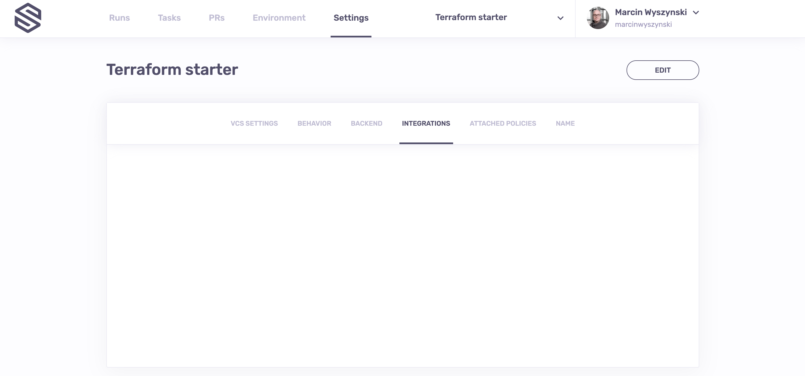
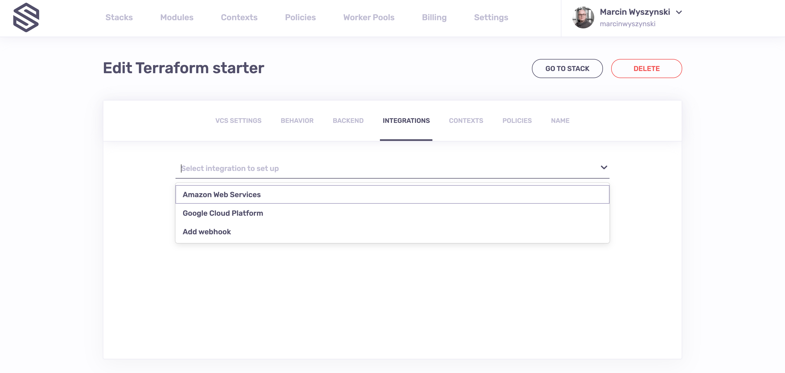
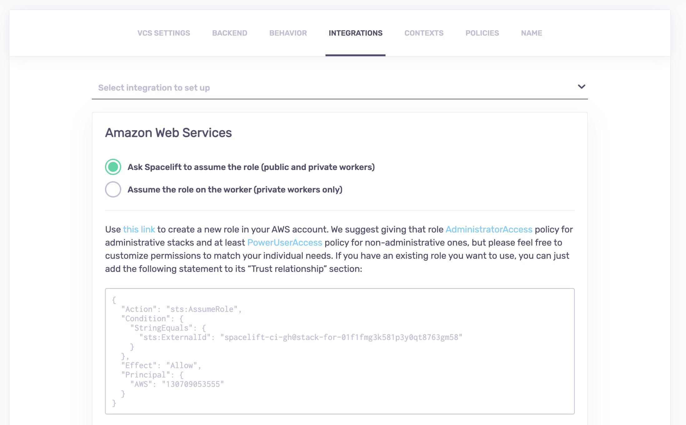
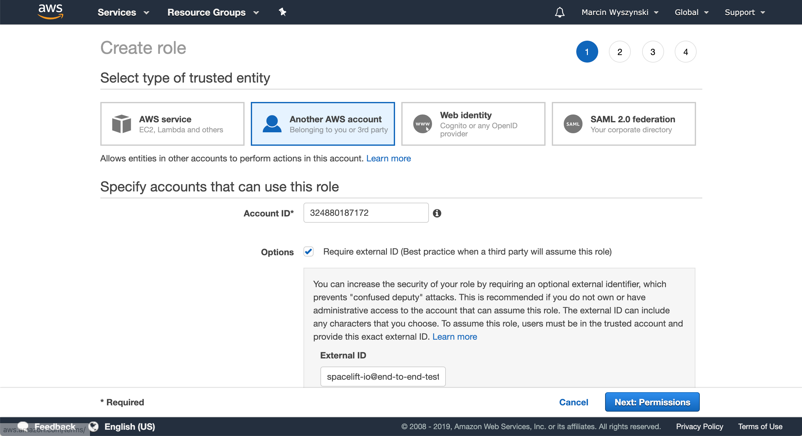

# AWS

## About the integration

The AWS integration allows either Spacelift or a private worker controlled by you to [assume an IAM role](https://docs.aws.amazon.com/IAM/latest/UserGuide/id_roles_use.html) in your AWS account and thus generate a set of temporary credentials that are then exposed to your [run](../../concepts/run/README.md) or [task](../../concepts/run/task.md) as the following [computed environment variables](../../concepts/configuration/environment.md#computed-values):

- `AWS_ACCESS_KEY_ID`
- `AWS_SECRET_ACCESS_KEY`
- `AWS_SECURITY_TOKEN`
- `AWS_SESSION_TOKEN`

This is enough for both the [AWS Terraform provider](https://www.terraform.io/docs/providers/aws/index.html#environment-variables){: rel="nofollow"} and/or [S3 state backend](https://www.terraform.io/docs/backends/types/s3.html){: rel="nofollow"} to generate a fully authenticated AWS session without further configuration. However, you will likely need to select one of the available regions with the former.

## Setting up the AWS integration

Setting up the AWS integration is available to organization administrators through the _Integrations_ tab in the stack management view:



By clicking on the _Edit Integrations_ button, you can switch to editing mode and choose AWS from the list of available integrations:



Once selected, the AWS integration setup screen will look like this:



Note how you have 2 options for the integration. One is to have Spacelift assume the role and pass the temporary credentials to the worker. This is mostly designed for users of shared, public workers.

The second option is to have the private worker assume an IAM role based on its own credentials (e.g., from an EC2 instance profile) before passing it to the job container's environment. This is exclusively designed for private, self-hosted workers as the public ones have no identity of their own.

### Assume the role on the worker

When assuming the role on the private workers, the process is straightforward: you provide the IAM role to assume, and, optionally, an external ID.

The latter is not very important when no trust relationship with a third party is involved, but we still pre-populate it for you as a best practice.

.png>)

Note that we have no way of validating whether your worker has the ability to assume the said role. You will need to trigger a job to verify that.

### Ask Spacelift to assume the role

!!! info
    This feature is mostly designed for clients using the shared public worker pool. When hosting Spacelift workers on your infrastructure you can use your cloud providers' ambient credentials (e.g., from an EC2 instance role or ECS task role on AWS).

If you want credentials to be generated by Spacelift, in most cases, what you just need is to click the highlighted link to create a new role. If you want to use an existing role, please [skip to this section](aws.md#using-an-existing-role). The link takes you to an IAM role creation form, partially filled in with some details, in particular, the [external ID](https://docs.aws.amazon.com/IAM/latest/UserGuide/id_roles_create_for-user_externalid.html){: rel="nofollow"} unique to your stack:



!!! info
    Make sure you're currently logged into the correct AWS account for the magic link to work.

Fast forward a few steps, and here's what you get at the checkout:

.png>)

Give your role an informative name (something with Spacelift and stack name, maybe?) and create the role.

!!! warning
    By default, Spacelift suggests attaching [PowerUserAccess](https://console.aws.amazon.com/iam/home#/policies/arn:aws:iam::aws:policy/PowerUserAccess$serviceLevelSummary){: rel="nofollow"} policy, which provides full access to AWS services and resources, but does not allow management of Users and groups. This is a powerful but still reasonably safe option. You can choose a different policy or create a completely custom policy for your role in the second step of the above wizard.

Once the role is created, find it in the IAM console and copy its full ARN to the Spacelift form field. Here's where to find the full role ARN…

.png>)

…and here's where to paste it:

.png>)

Once you click the _Save_ button, Spacelift will verify the integration. First, it will try to assume the role with the unique external ID and expect to succeed. If it succeeds, it will try to assume the role **without the unique external ID**, and this time it **expects to fail**. If Spacelift fails the latter check, we consider the integration is safely configured.

!!! success
    This somewhat counterintuitive extra check is to prevent against malicious takeover of your account by someone who happens to know your AWS account ID, which isn't all that secret, really. The security vulnerability we're addressing here is known as the [_confused deputy problem_](https://en.wikipedia.org/wiki/Confused_deputy_problem){: rel="nofollow"}.

#### Using an existing role

Instead of creating a new, separate role for each stack which we generally advise for housekeeping and security purposes, you can add a trust relationship to an existing role. The form provides a statement that you can to the IAM role's _Trust relationship_ section:

.png>)

.png>)

### Programmatic setup

You can use the [Spacelift Terraform provider](../../vendors/terraform/terraform-provider.md) in order to set up the AWS integration programmatically from an [administrative stack](../../concepts/stack/README.md#administrative), including the trust relationship. Note that in order to do that, your administrative stack will require AWS credentials itself, and ones powerful enough to be able to deal with IAM.

Here's a little example of what that might look like:

```terraform title="stack.tf"
# Creating a Spacelift stack.
resource "spacelift_stack" "managed-stack" {
  name        = "Stack managed by Spacelift"
  repository  = "my-awesome-repo"
  branch      = "master"
}

# Creating an IAM role.
resource "aws_iam_role" "managed-stack-role" {
  name = "spacelift-managed-stack-role"

  # Setting up the trust relationship.
  assume_role_policy = jsonencode({
    Version = "2012-10-17"
    Statement = [
      jsondecode(
        spacelift_stack.managed-stack.aws_assume_role_policy_statement
      )
    ]
  })
}

# Attaching a powerful administrative policy to the stack role.
resource "aws_iam_role_policy_attachment" "managed-stack-role" {
  role       = aws_iam_role.managed-stack-role.name
  policy_arn = "arn:aws:iam::aws:policy/PowerUserAccess"
}

# Linking AWS role to the Spacelift stack.
resource "spacelift_aws_role" "managed-stack-role" {
  stack_id = spacelift_stack.managed-stack.id
  role_arn = aws_iam_role.managed-stack-role.arn
}
```

!!! info
    Please always refer to the [provider documentation](https://github.com/spacelift-io/terraform-provider-spacelift) for the most up-to-date documentation.

## Is it safe?

Assuming role and generating credentials **on the private worker** is **perfectly safe**. Those credentials are never leaked to us in any shape or form. Hence, the rest of this section discusses the trust relationship established between the Spacelift account and your AWS account for the purpose of dynamically generating short-lived credentials. So, how safe is that?

Probably safer than storing static credentials in your stack environment. Unlike user keys that you'd normally have to use, role credentials are dynamically created and short-lived. We use the default expiration which is **1 hour**, and do not store them anywhere. Leaking them **accidentally** through the logs is not an option either because we mask AWS credentials.

The most tangible safety feature of the AWS integration is the breadcrumb trail it leaves in [CloudTrail](https://aws.amazon.com/cloudtrail/){: rel="nofollow"}. Every resource change can be mapped to an individual Terraform [run](../../concepts/run/README.md) or [task](../../concepts/run/task.md) whose ID automatically becomes the username as the [`sts:AssumeRole`](https://docs.aws.amazon.com/STS/latest/APIReference/API_AssumeRole.html){: rel="nofollow"} API call with that ID as `RoleSessionName`. In conjunction with AWS tools like [Config](https://aws.amazon.com/config/){: rel="nofollow"}, it can be a very powerful compliance tool.

Let's have a look at a CloudTrail event showing an IAM role being created by what seems to be a Spacelift run:


`01DSJ63P40BAZY4VW8BXXG7M4K` is indeed a run ID we can then trace back even further:


## Roles assuming other roles

OK, we get it. Using everyone's favorite Inception meme:


Indeed, AWS Terraform provider allows you to [assume an IAM role during setup](https://www.terraform.io/docs/providers/aws/index.html#assume-role){: rel="nofollow"}, effectively doing the same thing over again. This approach is especially useful if you want to control resources in multiple AWS accounts from a single Spacelift stack. This is totally fine - in IAM, roles can assume other roles, though what you need to do on your end is set up the trust relationship between the role you have Spacelift assume and the role for each provider instance to assume. But let's face it - at this level of sophistication, you sure know what you're doing.

One bit you might not want to miss though, is the guaranteed ability to map the change to a particular [run](../../concepts/run/README.md) or [task](../../concepts/run/task.md) that we described in the [previous section](aws.md#is-it-safe). One way of fixing that would be to use the `TF_VAR_spacelift_run_id` [computed environment variable](../../concepts/configuration/environment.md#computed-values) available to each Spacelift workflow. Conveniently, it's already a [Terraform variable](https://www.terraform.io/docs/configuration/variables.html#environment-variables){: rel="nofollow"}, so a setup like this should do the trick:

```terraform title="aws.tf"
variable "spacelift_run_id" {}

# That's our default provider with credentials generated by Spacelift.
provider "aws" {}

# That's where Terraform needs to run sts:AssumeRole with your
# Spacelift-generated credentials to obtain ones for the second account.
provider "aws" {
  alias = "second-account"

  assume_role {
    role_arn     = "<up-to-you>"
    session_name = var.spacelift_run_id
    external_id  = "<up-to-you>"
  }
}
```
