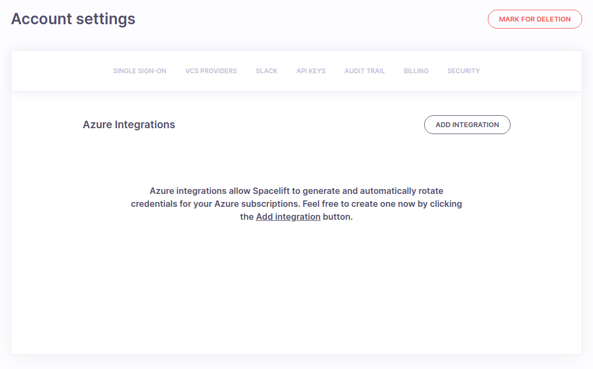
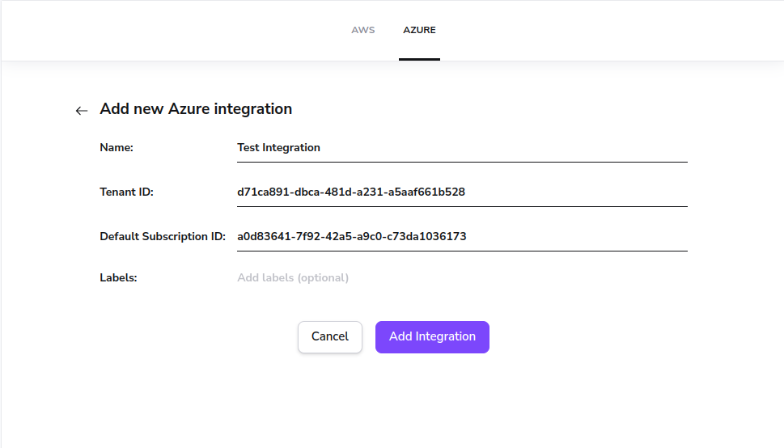
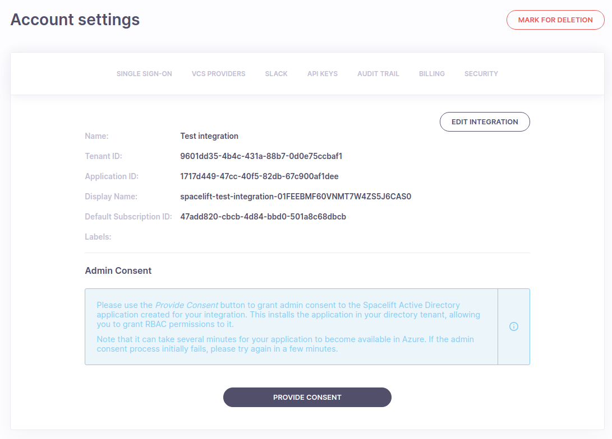
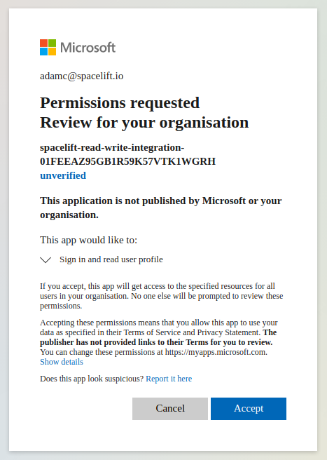
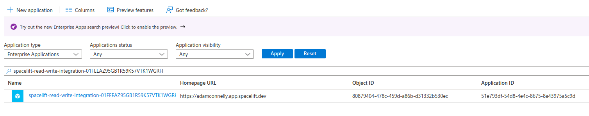
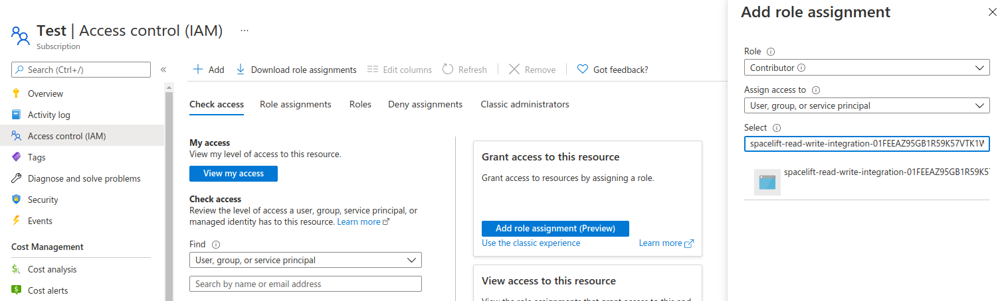
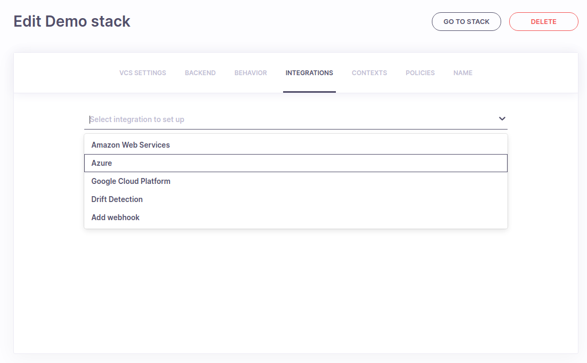
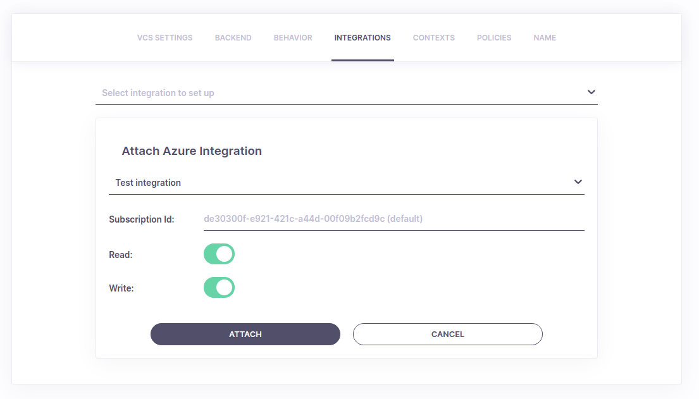
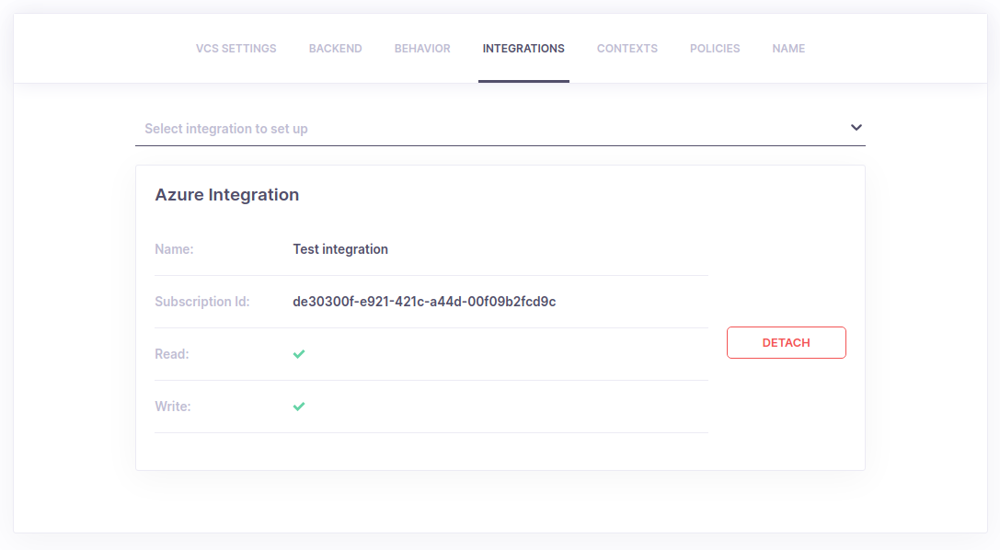
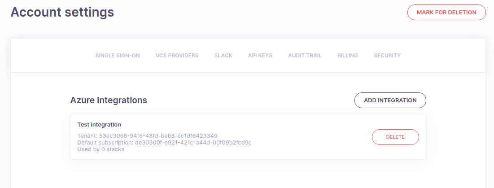

# Microsoft Azure

## About the integration

Spacelift provides support for managing Azure resources via the Terraform [Azure Provider](https://registry.terraform.io/providers/hashicorp/azurerm/latest/docs){: rel="nofollow"}. The documentation for the Azure Provider outlines the different authentication methods it supports, and it should always be considered the ultimate source of truth.

This page explains how to configure the following authentication methods in Spacelift:

- [Spacelift Managed Integration](azure.md#spacelift-managed-integration) - the simplest way to get up and running. Handles automatic secret creation and rotation.
- [Static Credentials](azure.md#static-credentials) - useful when using the public worker pool, or workers that are not hosted in Azure. Simple to setup, but requires you to manually manage secret rotation.
- [Managed Service Identities](azure.md#managed-service-identities) - ideal when using [private workers](../../concepts/worker-pools.md) hosted in Azure. Requires managing your own workers, but secret rotation is handled automatically by Azure.

!!! info
    This guide explains how to configure the Azure provider using environment variables. Although you can add these environment variables directly to individual stacks, it may be worth creating a [Spacelift Context](../../concepts/configuration/context.md) to store your Azure credentials. This allows you to easily add the same credentials to any stack that requires them.

## Spacelift Managed Integration

The Spacelift managed integration is great for situations where you want to get up and running quickly, and where you want the reassurance that the credentials for accessing your Azure account will be automatically rotated and stored securely. If you are not comfortable with Spacelift managing your Azure credentials, we would suggest that you use a private worker configured with a [Managed Identity](azure.md#managed-identities) for the most control and security.

### Credential storage and rotation

When an Azure integration is created, an associated Azure AD Application is created within Azure. We automatically create a client secret for that application, and rotate it roughly once every 24 hours. The secret is stored securely, encrypted using AWS [Key Management Service](https://aws.amazon.com/kms/){: rel="nofollow"}.

### Creating an integration

To add a new integration, go to the _Cloud Integrations_ section of your account. When you go there for the first time, the page will be empty, but will prompt you to add an integration:



Click on the _Add your first integration_ button to start configuring your integration:



Give your integration a name, and enter your Active Directory Tenant ID. You can specify a default subscription ID if you want to attach your integration to multiple stacks that are all going to use the same Azure subscription.

!!! info
    You can find your Tenant ID by going to the [Azure Active Directory](https://portal.azure.com/#blade/Microsoft_AAD_IAM/ActiveDirectoryMenuBlade/Overview){: rel="nofollow"} section of the Azure portal. You can also find your Azure subscriptions by going to the [Subscriptions](https://portal.azure.com/#blade/Microsoft_Azure_Billing/SubscriptionsBlade){: rel="nofollow"} section of the Azure portal.

### Providing admin consent

Once your integration has been created successfully, you will be taken to the integration details. It should look something like this:



To install the Azure AD application for your Spacelift integration into your Azure account, click on the _Provide Consent_ button, which will redirect you to Azure. After logging into your Azure account, you should see a permissions screen like the following:



Click on the Accept button to complete the admin consent process, at which point you should be redirected to your integration settings.

!!! info
    The admin consent process requires at least one permission to be requested in order to work. Although the application requests the “Sign in and read user profile” permission, it never signs in as any users in your account or accesses their information.

!!! warning
    Azure AD uses eventual consistency to replicate new Azure applications globally. Because of this you might see the following error message if you try to grant admin consent very quickly after the integration was created:

    

    This isn’t a problem. Just wait a few minutes and try again.

### Configuring Azure permissions

Now that you have granted admin consent, a new Enterprise Application will be created for your integration in Azure. You can view this in the [Enterprise Applications](https://portal.azure.com/#blade/Microsoft_AAD_IAM/StartboardApplicationsMenuBlade/AllApps/menuId/){: rel="nofollow"} section of Azure Active Directory:



If you go to the Access Control (IAM) section of the Azure subscription or resource group you want the integration to have access to, you should be able to add a new role assignment for the integration:



!!! info
    The integration has no access to any of your Azure infrastructure unless you explicitly grant it the appropriate permissions.

### Attaching to a stack

To attach an integration to a Stack, edit the _Integrations_ settings for your stack, and choose the Azure option from the list:



Choose the integration you want to attach, specify a subscription ID if the integration you’ve chosen doesn’t have a default or you want to override the default, and specify whether the integration should be used for read, write or read and write operations:



Click on the Attach button to add the integration to your stack.

### Detaching from a stack

If you want to detach an integration from a stack, just click the Detach button next to the integration:



### Deleting an integration

You can delete an Azure integration if you don’t need it anymore. To do that, go to the Azure Integrations settings screen, and click the Delete button next to the integration you want to remove:



!!! info
    You can only delete an integration if it is not being used by any stacks, so you may have to detach the integration from any stacks it is attached to first.

#### Deleting the Enterprise Application

Deleting the integration does not remove the Enterprise Application that was added to your Azure AD account via the admin consent process. You need to do that yourself manually after deleting the integration.

## Static credentials

To use static credentials, you need to create an Azure Service Principal, grant it access to your Azure subscription, and then configure the Azure Provider to use the Service Principal via environment variables.

If you already understand how to create and manage Service Principals, feel free to skip to the [configuring via environment](azure.md#configuring-via-environment) section.

### Create a service principal

Create a Service Principal using the following command, substituting`<subscription-id>` with your own subscription ID:

```bash
az ad sp create-for-rbac --name spacelift-sp --role="Contributor" --scopes="/subscriptions/<subscription-id>"
```

This will output something like the following:

```bash
Changing "spacelift-sp" to a valid URI of "http://spacelift-sp", which is the required format used for service principal names
Creating 'Contributor' role assignment under scope '/subscriptions/458fd769-5a4c-4df2-a339-8981094d8899'
The output includes credentials that you must protect. Be sure that you do not include these credentials in your code or check the credentials into your source control. For more information, see Create an Azure service principal with the Azure CLI.
{
  "appId": "5ffa3670-74db-4a9d-b213-179d2d315888",
  "displayName": "spacelift-sp",
  "name": "http://spacelift-sp",
  "password": "A4xFo3z-Hv9BMOFlmHfXP2ESXugHMdaike",
  "tenant": "d3fe1fdc-160d-4f06-a5c0-f1485b1b0366"
}
```

The command creates a new Service Principal called `spacelift-sp`, and grants it the _Contributor_ role on your subscription. It also outputs the `appId`, `password` and `tenant` for the Service Principal. Make a note of these because you'll need them later.

!!! info
    If you would rather assign permissions separately, you can run the following command to create a Service Principal with no role assignments:

    ```bash
    az ad sp create-for-rbac --name spacelift-sp --skip-assignment
    ```

### Configuring via environment

Azure provides two options for authenticating Service Principals:

- Client secrets - a randomly generated string.
- Client certificates - an x509 certificate.

Either option can be used depending on your requirements, and the configuration required for both is very similar.

#### Authenticating with a client secret

To configure the Azure provider using a client secret, add the following [environment variables](../../concepts/configuration/environment.md#environment-variables) to your stack:

- `ARM_CLIENT_ID` - the `appId` returned when you created your Service Principal. This is known as the _Application ID_ or _Client ID_ within Azure.
- `ARM_CLIENT_SECRET` - the `password` returned when you created your Service Principal.
- `ARM_SUBSCRIPTION_ID` - your subscription ID.
- `ARM_TENANT_ID` - the `tenant` returned when you created your Service Principal.

Once finished, your environment should look something like this:

.png>)

#### Authenticating with a client certificate

To configure the Azure provider using a client certificate, first add your PFX as a [mounted file](../../concepts/configuration/environment.md#mounted-files) to your environment:

.png>)

!!! warning
    You should treat this certificate like any other credential, and mark it as a _secret._

Next, add the following [environment variables](../../concepts/configuration/environment.md#environment-variables) to your stack:

- `ARM_CLIENT_ID` - the `appId` returned when you created your Service Principal. This is known as the _Application ID_ or _Client ID_ within Azure.
- `ARM_CLIENT_CERTIFICATE_PATH` - the path to the certificate you uploaded in the previous step.
- `ARM_CLIENT_CERTIFICATE_PASSWORD` - the password for your certificate.
- `ARM_SUBSCRIPTION_ID` - your subscription ID.
- `ARM_TENANT_ID` - the `tenant` returned when you created your Service Principal.

Once finished, your environment should look something like this:

.png>)

### Credential expiry and rotation

When using static credentials, you are in charge of managing credential rotation. When using the `az ad sp create-for-rbac` command, the client secret returned by the command will expire in 1 year. At that point, any stacks using that client secret will stop working until a new one is added and the Spacelift environment updated.

## Managed identities

Azure [Managed Identities](https://docs.microsoft.com/en-us/azure/active-directory/managed-identities-azure-resources/){: rel="nofollow"} allow you to assign an identity to an Azure virtual machine, and then use that identity for role assignment. This means that you can grant your Spacelift private workers permission to manage your Azure resources,without having to store any credentials in Spacelift, or deal with credential rotation.

To use a managed identity, you need to take the following steps:

- Follow the [instructions](../../concepts/worker-pools.md) to setup a private worker pool.
- Create an Azure VM with a managed identity, and install the worker binary on it.
- Configure the [Azure provider](https://registry.terraform.io/providers/hashicorp/azurerm/latest/docs/guides/managed_service_identity#configuring-terraform-to-use-a-managed-identity){: rel="nofollow"} to use the managed identity for authentication.

To configure the Azure provider to use the managed identity, add the following environment variables to your stack:

- `ARM_USE_MSI` - set to `true` to indicate you want to use a managed identity.
- `ARM_SUBSCRIPTION_ID` - your subscription ID.
- `ARM_TENANT_ID` - your Azure AD tenant.

In addition, if using a user-assigned identity, add the following variable to your stack:

- `ARM_CLIENT_ID` - the client ID of your user-assigned identity.

Once finished, your environment should look something like this:

.png>)
