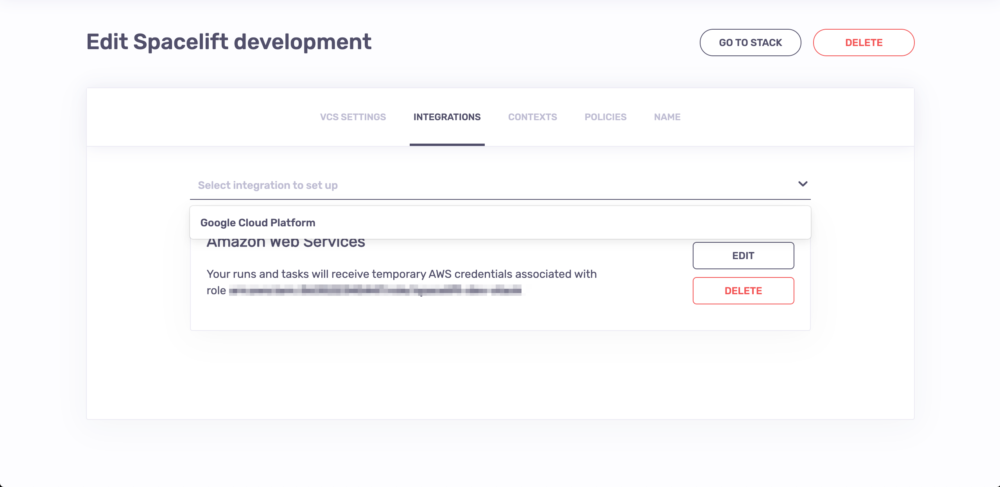
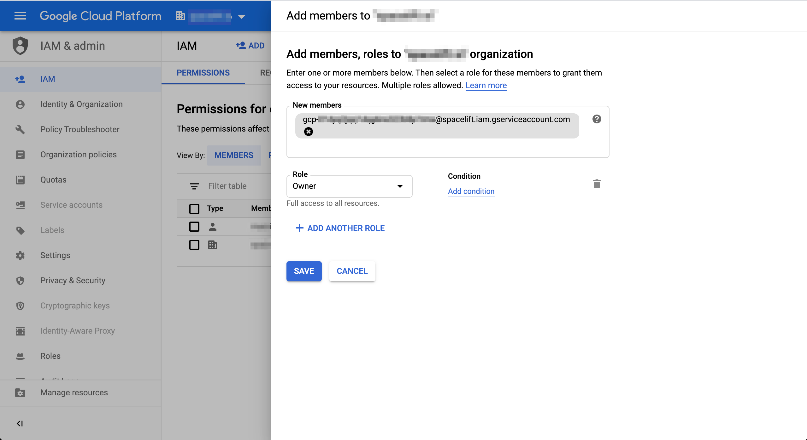

# Google Cloud Platform (GCP)

!!! info
    Please note that for GCP integration, we recommend using [OIDC](oidc/README.md)

## About the integration

Spacelift GCP integration allows Spacelift to manage your Google Cloud resources without the need for long-lived static credentials. In order to achieve that Spacelift create a [service account](https://cloud.google.com/iam/docs/service-accounts){: rel="nofollow"} inside our project dedicated for your Stack. We show you the globally unique email of this service account, which you can add to your GCP organizations and/or projects with the right level of access.

With the service account already created, we generate temporary OAuth token for this service account and put it as a `GOOGLE_OAUTH_ACCESS_TOKEN` variable in the environment of your [Runs](../../concepts/run/README.md) and [Tasks](../../concepts/run/task.md). This is [one of the configuration options](https://www.terraform.io/docs/providers/google/guides/provider_reference.html#access_token-1){: rel="nofollow"} for the Google Terraform provider, so you can define it like this:

```terraform
provider "google" {}
```

!!! info
    Note that a lot of GCP resources require [`project`](https://www.terraform.io/docs/providers/google/guides/provider_reference.html#project-1){: rel="nofollow"}identifier too, so if you don't specify a default in your provider, you will need to pass it to each individual resource that requires it.

You can customize the list of [OAuth scopes](https://developers.google.com/identity/protocols/googlescopes){: rel="nofollow"} that the token is granted when it's generated. When you're setting up your GCP integration through the web UI, we suggest the following list of scopes:

- `https://www.googleapis.com/auth/compute`
- `https://www.googleapis.com/auth/cloud-platform`
- `https://www.googleapis.com/auth/ndev.clouddns.readwrite`
- `https://www.googleapis.com/auth/devstorage.full_control`
- `https://www.googleapis.com/auth/userinfo.email`

This list is consistent with the [defaults requested by the Terraform provider](https://www.terraform.io/docs/providers/google/guides/provider_reference.html#scopes-1){: rel="nofollow"}.

## Setting up in Spacelift

If you're setting up the integration through the web UI, please go to the _Integrations_ tab in the stack management view and choose Google Cloud Platform from the list of available integrations:



Once there, you'll be presented with a form allowing you to customize the list of OAuth scopes for the temporary token we'll generate for each [Run](../../concepts/run/README.md) and [Task](../../concepts/run/task.md):

.png>)

Once you click _Save_, the account is generated for you and we display its globally unique email. You'll need this email when [setting up access on the GCP end](gcp.md#setting-up-access-in-gcp).

.png>)

### Using Terraform

If you're using Spacelift Terraform provider to create the integration programmatically, you can do the following:

```terraform
resource "spacelift_gcp_service_account" "gcp-integration" {
  stack_id = spacelift_stack.your-stack.id

  token_scopes = [
    "https://www.googleapis.com/auth/compute",
    "https://www.googleapis.com/auth/cloud-platform",
    "https://www.googleapis.com/auth/ndev.clouddns.readwrite",
    "https://www.googleapis.com/auth/devstorage.full_control",
    "https://www.googleapis.com/auth/userinfo.email",
  ]
}
```

If the service account linked to your administrative stack has sufficient privileges on the GCP organization,  you can even programmatically create a dedicated GCP project and set up the integration from the Google side of things:

```terraform
resource "google_project" "k8s-core" {
  name       = "Kubernetes core"
  project_id = "unicorn-k8s-core"
  org_id     = var.gcp_organization_id
}

resource "google_project_iam_member" "k8s-core" {
  project = google_project.k8s-core.id
  role    = "roles/owner"
  member  = "serviceAccount:${spacelift_stack_gcp_service_account.gcp-integration.service_account_email}"
}
```

## Setting up access in GCP

In order to make the integration work, you'll have to make the dedicated service account a member of your organization and/or project, with an appropriate level of access. This is done in the [IAM & Admin](https://console.cloud.google.com/iam-admin/iam){: rel="nofollow"} view of GCP's web UI. First, let's show an example of adding a service account as a member on the organization level:



!!! info
    In the above example, we made the service account an owner of the organization, giving it full access to all resources. Depending on your use case, this may or may not be what you want.

We can do the same on the project level, too. In fact, the process looks absolutely identical except that projects are represented by a different icon in the dropdown. Go figure:


It can take up to a minute for the membership data to propagate but once it does, your Spacelift-GCP integration should Just Work™.
