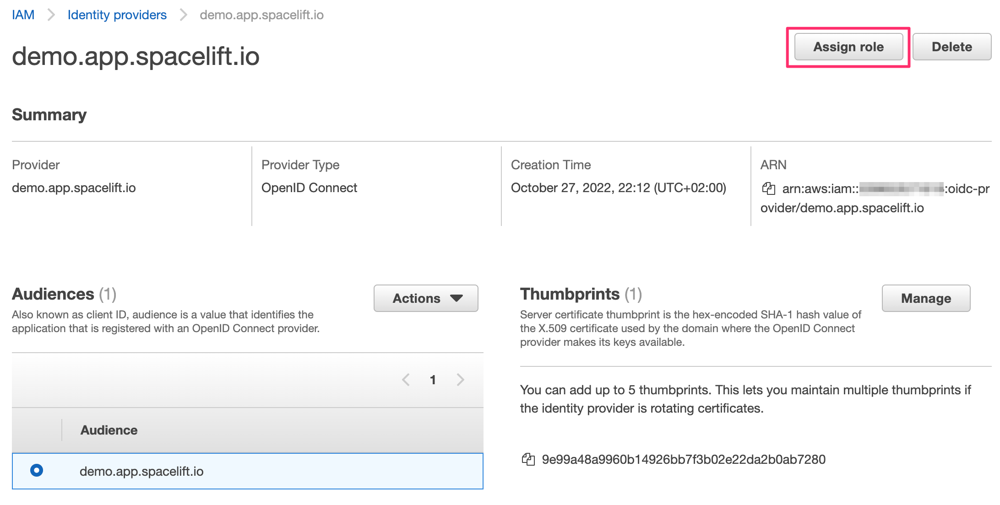

# OpenID Connect (OIDC)

!!! hint
    This feature is only available to paid Spacelift accounts. Please check out our [pricing page](https://spacelift.io/pricing) for more information.

OpenID Connect is a federated identity technology that allows you to exchange short-lived Spacelift credentials for temporary credentials valid for external service providers like AWS, GCP, Azure, HashiCorp Vault etc. This allows you to use Spacelift to manage your infrastructure on these cloud providers without the need of using static credentials.

OIDC is also an attractive alternative to our native [AWS](aws.md), [Azure](azure.md) and [GCP](gcp.md) integrations in that it implements a common protocol, requires no additional configuration on the Spacelift side, supports a wider range of external service providers and empowers the user to construct more sophisticated access policies based on JWT claims.

It is not the purpose of this document to explain the details of the OpenID Connect protocol. If you are not familiar with it, we recommend you read the [OpenID Connect specification](https://openid.net/specs/openid-connect-core-1_0.html) or GitHub's excellent introduction to [security hardening with OpenID Connect](https://docs.github.com/en/actions/deployment/security-hardening-your-deployments/about-security-hardening-with-openid-connect).

## About the Spacelift OIDC token

The Spacelift OIDC token is a [JSON Web Token](https://jwt.io/) that is signed by Spacelift and contains a set of claims that can be used to construct a set of temporary credentials for the external service provider. The token is valid for an hour and is available to every run in any paid Spacelift account. The token is available in the `SPACELIFT_OIDC_TOKEN` environment variable and in the `/mnt/workspace/spacelift.oidc` file. 

### Standard claims

The token contains the following standard claims:

- `iss` - the issuer of the token - the URL of your Spacelift account, for example `https://demo.app.spacelift.io`. This is unique for each Spacelift account;
- `sub` - the subject of the token - some information about the Spacelift run that generated this token. The subject claim is constructed as follows: `space:<space_id>:(stack|module):<stack_id|module_id>:run_type:<run_type>:scope:<read|write>`. For example, `space:legacy:stack:infra:run_type:TRACKED:scope:write`. Individual values are also available as separate custom claims - see [below](#custom-claims);
- `aud` - the audience of the token - the hostname of your Spacelift account. For example, `demo.app.spacelift.io`. This is unique for each Spacelift account;
- `exp` - the expiration time of the token - the time at which the token will expire, in seconds since the Unix epoch. The token is valid for one hour;
- `iat` - the time at which the token was issued, in seconds since the Unix epoch;
- `jti` - the unique identifier of the token;
- `nbf` - the time before which the token is not valid, in seconds since the Unix epoch. This is always set to the same value as `iat`;

### Custom claims

The token also contains the following custom claims:

- `spaceId` - the ID of the space in which the run that owns the token was executed;
- `callerType` - the type of the caller, ie. the entity that owns the run - either [`stack`](../../concepts/stack/README.md) or [`module`](../../vendors/terraform/module-registry.md);
- `callerId` - the ID of the caller, ie. the [stack](../../concepts/stack/README.md) or [module](../../vendors/terraform/module-registry.md) that generated the run;
- `runType` - the type of the run ([`PROPOSED`](../../concepts/run/proposed.md), [`TRACKED`](../../concepts/run/tracked.md), [`TASK`](../../concepts/run/task.md), [`TESTING`](../../concepts/run/test-case.md) or [`DESTROY`](../../concepts/run/test-case.md);
- `runId` - the ID of the run that owns the token;
- `scope` - the scope of the token - either `read` or `write`.

### About scopes

Whether the token is given `read` or `write` scope depends on the type of the run that generated the token. [Proposed](../../concepts/run/proposed.md) runs get a `read` scope, while [tracked](../../concepts/run/tracked.md), [testing](../../concepts/run/test-case.md) and [destroy](../../concepts/run/test-case.md) runs as well as [tasks](../../concepts/run/task.md) get a `write` scope. The only exception to that rule are tracked runs whose stack is not set to [autodeploy](../../concepts/run/tracked.md#approval-flow). In that case, the token will have a `read` scope during the planning phase, and a `write` scope during the apply phase. This is because we know in advance that the tracked run requiring a manual approval should not perform write operations before human confirmation.

Note that the scope claim, as well as other claims presented by the Spacelift token are merely advisory. It depends on you whether you want to control access to your external service provider based on the scope of the token or on some other claim like space, caller or run type. In other words, Spacelift just gives you the data and it's up to you to decide whether and how to use it.

## Using the Spacelift OIDC token

In this section we will show you how to use the Spacelift OIDC token to authenticate with [AWS](#aws), [GCP](#gcp), [Azure](#azure), and [HashiCorp Vault](#vault). In particular, we will focus on setting up the integration and using it from these services' respective Terraform providers

### AWS

Once the Spacelift-AWS OIDC integration is set up, the provider can be configured without the need for any static credentials. The `aws_role_arn` variable should be set to the ARN of the role that you want to assume:

```hcl
provider "aws" {
  assume_role_with_web_identity {
    role_arn = var.aws_role_arn
    web_identity_token_file = "/mnt/workspace/spacelift.oidc"
  }
}
```

In order to be able to do that, you will need to set up Spacelift as a valid identity provider for your AWS account. This is done by creating an [OpenID Connect identity provider
](https://docs.aws.amazon.com/IAM/latest/UserGuide/id_roles_providers_create_oidc.html). You can do it declaratively using any of the IaC providers, programmatically using the [AWS CLI](https://aws.amazon.com/cli/) or simply use the console. For illustrative purposes, we will use the console:

1. Go to the [AWS console](https://console.aws.amazon.com/iam/home#/home) and select the IAM service;

1. Click on the "Identity providers" link in the left-hand menu;

1. Click on the "Add provider" button in the top bar 

1. Select "OpenID Connect" as the provider type 

1. Make sure to get the host thumbprint by clicking the "Get thumbprint" button. This is required by AWS and protects you from a certain class of MitM attacks.

Once created, the identity provider will be listed in the "Identity providers" table. You can click on the provider name to see the details. From here, you will also be able to assign an IAM role to this new identity provider:



A dialog will pop up, asking you to select whether you want to create a new role or use an existing one. Let's create a brand new role. The most important thing for us is to select the right trusted entity - the new Spacelift OIDC provider. Make sure you select the audience from the dropdown - there should be just one option to choose from:


The rest of the process is the same as for any other role creation. You will be asked to select the policies that you want to attach to the role. You can also add tags and a description. Once you're done, click the "Create role" button.

If you go to your new role's details page, in the _Trust relationships_ section you will notice that it is now associated with the Spacelift OIDC provider:


This trust relationship is very relaxed and will allow any stack or module in the `demo` Spacelift account to assume this role. If you want to be more restrictive, you will want to add more conditions. For example, we can restrict the role to be only assumable by stacks in the `production` space by adding the following condition:

```json
"StringLike": {
  "demo.app.spacelift.io:sub": "space:production:*"
}
```

!!! hint
    You will need to replace `demo.app.spacelift.io` with the hostname of your Spacelift account.

You can also restrict the role to be assumable only by a specific stack by matching on the stack ID:

```json
"StringLike": {
  "demo.app.spacelift.io:sub": "*:stack:oidc-is-awesome:*"
}
```

You can mix and match these to get the exact constraints you need. It is not the purpose of this guide to go into the intricacies of AWS IAM conditions - you can learn all about these in the [official doc](https://docs.aws.amazon.com/IAM/latest/UserGuide/reference_policies_elements_condition.html). One important thing to remember though is that AWS does not seem to support custom claims so you will need to use the standard ones to do the matching - primarily `sub`, as shown above.

### GCP

Once the Spacelift-GCP OIDC integration is set up, the [Google Cloud Terraform provider](https://registry.terraform.io/providers/hashicorp/google/latest/docs) can be configured without the need for any static credentials. You will however want to provide a configuration file telling the provider how to authenticate. The configuration file can be created manually or generated by the [`gcloud` utility](https://cloud.google.com/sdk/gcloud/reference/iam/workload-identity-pools/create-cred-config) and would look like this:

```json
{
  "type": "external_account",
  "audience": "//iam.googleapis.com/projects/${PROJECT_ID}/locations/global/workloadIdentityPools/${WORKER_POOL_ID}/providers/${IDENTITY_PROVIDER_ID}",
  "subject_token_type": "urn:ietf:params:oauth:token-type:jwt",
  "token_url": "https://sts.googleapis.com/v1/token",
  "credential_source": {
    "file": "/mnt/workspace/spacelift.oidc"
  },
  "service_account_impersonation_url": "https://iamcredentials.googleapis.com/v1/projects/-/serviceAccounts/${SERVICE_ACCOUNT_EMAIL}:generateAccessToken",
  "service_account_impersonation": {
    "token_lifetime_seconds": 3600
  }
}
```

Your Spacelift run needs to have access to this file, so you can check it in (there's nothing secret here), [mount it](../../concepts/configuration/environment.md#mounted-files) on a stack or mount it in a [context](../../concepts/configuration/context.md) that is then attached to the stack. Note that you will also need to tell the provider how to find this configuration file. This bit is nicely documented in the [Google Cloud Terraform provider docs](https://registry.terraform.io/providers/hashicorp/google/latest/docs/guides/provider_reference#credentials). And here is an example of us using a Spacelift [context](../../concepts/configuration/context.md) to mount the file and configure the provider to be attached to an arbitrary number of stacks:


In order for that to work, you will need to do a few things in GCP:

- create a [workload identity pool](https://cloud.google.com/iam/docs/configuring-workload-identity-federation#oidc) and set up the Spacelift OIDC provider as an identity provider for it;
- create a [service account](https://cloud.google.com/iam/docs/service-accounts) that will be used by Spacelift;
- connect the service account to the workload identity pool;

Let's go through these steps one by one. First, you will want to go to the [GCP console](https://console.cloud.google.com/) and select the IAM service, then click on the "Workload Identity Federation" link in the left-hand menu:


There, you will want to click on the _Create pool_ button, which will take you to the pool creation form. First, give your new identity pool a name and optionally set a description. The next step is more interesting - you will need to set up an identity provider. The name is pretty much arbitrary but the rest of the fields are important to get right. The Issuer URL needs to be set to the URL of your Spacelift account (including the scheme). You will want to manually specify allowed audiences. There's just one you need - the hostname of your Spacelift account. Here is what a properly filled out form would look like:


In the last step, you will need to configure a mapping between provider Spacelift token claims (assertions) and Google attributes. `google.subject` is a required mapping and should generally map to `assertion.sub`. [Custom claims](#custom-claims) can be mapped to custom attributes, which need to start with the `attribute.` prefix. In the below example, we are also mapping Spacelift's `spaceId` claim to GCP's custom `space` attribute:


To restrict which identities can authenticate using your workload identity pool you can specify extra [conditions](https://cloud.google.com/iam/docs/workload-identity-federation#conditions) using Google's [Common Expression Language](https://github.com/google/cel-spec).

Last but not least, we will want to grant the workload identity pool the ability to impersonate the [service account](https://cloud.google.com/iam/docs/service-accounts) we will be using. Assuming we already have a service account, let's allow any token claiming to originate from the `production` space in our Spacelift account to impersonate it:


### Azure

_TODO_

### Vault

_TODO_
