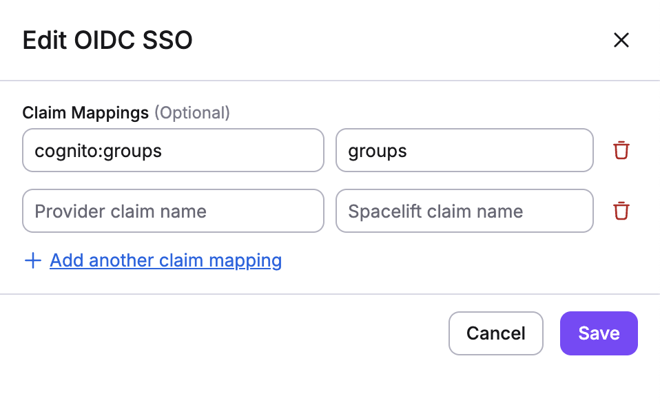

# OpenID Connect (OIDC)


!!! hint
    This feature is only available to paid Spacelift accounts. Please check out our [pricing page](https://spacelift.io/pricing){: rel="nofollow"} for more information.


OpenID Connect is a federated identity technology that allows you to exchange short-lived Spacelift credentials for temporary credentials valid for external service providers like AWS, GCP, Azure, HashiCorp Vault etc. With OIDC, Spacelift can manage your infrastructure on these cloud providers without static credentials.


OIDC is also an attractive alternative to our native [AWS](../aws.md), [Azure](../azure.md) and [GCP](../gcp.md) integrations in that it implements a common protocol, requires no additional configuration on the Spacelift side, supports a wider range of external service providers and empowers the user to construct more sophisticated access policies based on JWT claims.

OIDC is also an attractive alternative to our native [AWS](../aws.md) integration in that it implements a common protocol, requires no additional configuration on the Spacelift side, supports a wider range of external service providers and empowers the user to construct more sophisticated access policies based on JWT claims.


It is not the purpose of this document to explain the details of the OpenID Connect protocol. If you are not familiar with it, we recommend you read the [OpenID Connect specification](https://openid.net/specs/openid-connect-core-1_0.html){: rel="nofollow"} or GitHub's excellent introduction to [security hardening with OpenID Connect](https://docs.github.com/en/actions/deployment/security-hardening-your-deployments/about-security-hardening-with-openid-connect){: rel="nofollow"}.



## Considerations when self-hosting

For this feature to work, the service you are integrating with needs to be able to verify that tokens issued by Spacelift are valid by accessing the JWKs used by Spacelift.

The simplest option is allowing the service you are integrating with to access your Spacelift server directly. In this case it will access the `/.well-known/openid-configuration` and `/.well-known/jwks` endpoints on your Spacelift server during the token exchange.

Another option is to manually upload the JWKs (that you can get from the `/.well-known/jwks` endpoint on your Spacelift server) to the service you are integrating with if they support doing so.

### Overriding issuer and JWKS endpoints (Self-Hosted)

For Self-Hosted installations, you can override the `issuer` and `jwks_uri` values in the OpenID Connect Discovery Document by adding the following environment variables to your deployment:

```bash
FEDERATION_CUSTOM_ISSUER=https://id.example.com
FEDERATION_CUSTOM_JWKS_URI=https://id.example.com/.well-known/jwks.json
```

Alternatively, if you use CloudFormation, you can use the following configuration values:

```json
{
  "federation_config": {
    "issuer": "https://id.example.com",
    "jwks_uri": "https://id.example.com/.well-known/jwks.json"
  }
}
```

The behavior follows this precedence:

- **If only the issuer is provided** → `jwks_uri` is automatically derived from it
- **If both are provided** → both override values are used
- **If neither is provided** → fallback to current behavior (account URL)

!!! warning
    The `issuer` value must exactly match the `iss` claim in the tokens for proper validation.



## About the Spacelift OIDC token

The Spacelift OIDC token is a [JSON Web Token](https://jwt.io/){: rel="nofollow"} that is signed by Spacelift and contains a set of claims that can be used to construct a set of temporary credentials for the external service provider. The token is valid for an hour and is available to every run in any paid Spacelift account. The token is available in the `SPACELIFT_OIDC_TOKEN` environment variable and in the `/mnt/workspace/spacelift.oidc` file.

### Standard claims

The token contains the following standard claims:

- `iss`: The issuer of the token. This is the URL of your Spacelift account, for example `https://demo.app.spacelift.io`, and is unique for each Spacelift account.
- `sub`: The subject of the token, which includes some information about the Spacelift run that generated this token.
    - The subject claim is constructed as follows: `space:<space_id>:(stack|module):<stack_id|module_id>:run_type:<run_type>:scope:<read|write>`. For example, `space:legacy:stack:infra:run_type:TRACKED:scope:write`. Individual values are also available as separate [custom claims](#custom-claims).
- `aud`: The audience of the token. This is the hostname of your Spacelift account, for example `demo.app.spacelift.io`, and is unique for each Spacelift account.
- `exp`: The expiration time of the token, in seconds since the Unix epoch. The token is valid for one hour.
- `iat`: The time at which the token was issued, in seconds since the Unix epoch.
- `jti`: The unique identifier of the token.
- `nbf`: The time before which the token is not valid, in seconds since the Unix epoch. This is always set to the same value as `iat`.

### Custom claims

The token also contains the following custom claims:

- `spaceId`: The ID of the space in which the run that owns the token was executed.
- `callerType`: The type of the caller, i.e. the entity that owns the run, either [`stack`](../../../concepts/stack/README.md) or [`module`](../../../vendors/terraform/module-registry.md).
- `callerId`: The ID of the caller, i.e. the [stack](../../../concepts/stack/README.md) or [module](../../../vendors/terraform/module-registry.md) that generated the run.
- `runType`: The type of the run, such as [`PROPOSED`](../../../concepts/run/proposed.md), [`TRACKED`](../../../concepts/run/tracked.md), [`TASK`](../../../concepts/run/task.md), [`TESTING`](../../../concepts/run/test-case.md) or [`DESTROY`](../../../concepts/run/test-case.md).
- `runId`: The ID of the run that owns the token.
- `scope`: The scope of the token, either `read` or `write`.

### About scopes

Whether the token is given `read` or `write` scope depends on the type of the run that generated the token:

- `read`: [Proposed](../../../concepts/run/proposed.md) runs.
- `write`: [Tracked](../../../concepts/run/tracked.md), [testing](../../../concepts/run/test-case.md), and [destroy](../../../concepts/run/test-case.md) runs as well as [tasks](../../../concepts/run/task.md).

The only exceptions are tracked runs whose stack is not set to [autodeploy](../../../concepts/run/tracked.md#approval-flow). In that case, the token will have a `read` scope during the planning phase, and a `write` scope during the apply phase. This is because a tracked run requiring a manual approval should not perform write operations before human confirmation.

The scope claim, as well as other claims presented by the Spacelift token, are merely advisory. It depends on you whether you want to control access to your external service provider based on the scope of the token or on some other claim like space, caller, or run type. In other words, Spacelift gives you the data and it's up to you to decide how to use it.

## Custom Claims Mapping for Groups

Some identity providers use non-standard claim names for user group membership. For example:

- **AWS Cognito** uses `cognito:groups` instead of the standard `groups` claim
- **Google Workspace** does not include group membership in OIDC tokens by default

Spacelift allows you to map custom claims from your identity provider to the standard `groups` claim that Spacelift expects. This enables group-based access control even when your IdP doesn't follow the standard OIDC groups claim convention.

### Configuring Custom Claims Mapping

To configure custom claims mapping:

1. Navigate to **Organization settings** → **Single Sign-On**
2. In your OIDC configuration, look for the **Custom claims mapping** section
3. Add a mapping for the `groups` claim:
   - **Claim name in IdP**: Enter the custom claim name from your identity provider (e.g., `cognito:groups`)
   - **Claim name in Spacelift**: Enter `groups`



## Use the Spacelift OIDC token

You can follow our guidelines to see how to use the Spacelift OIDC token to authenticate with:

- [AWS](./aws-oidc.md)
- [GCP](./gcp-oidc.md)
- [Azure](./azure-oidc.md)
- [HashiCorp Vault](./vault-oidc.md)

In particular, we will focus on setting up the integration and using it from these services' respective Terraform providers.
