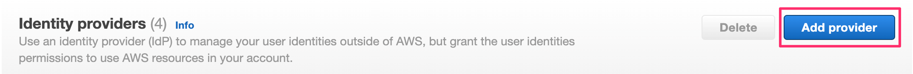
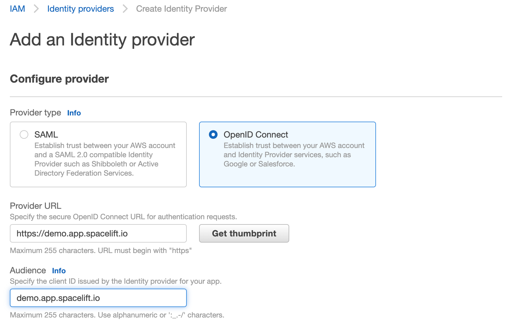
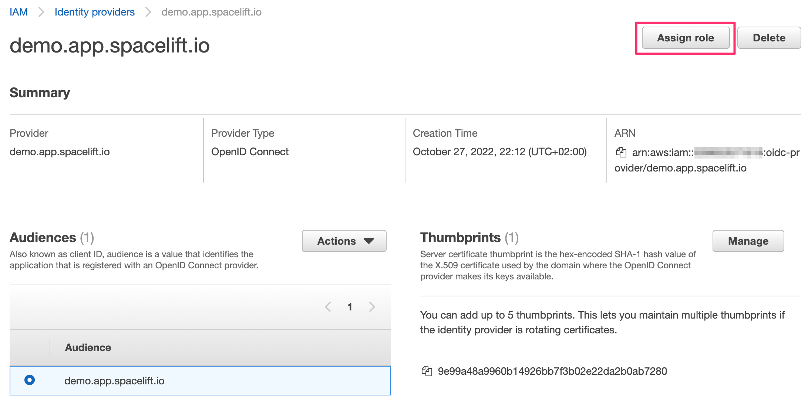
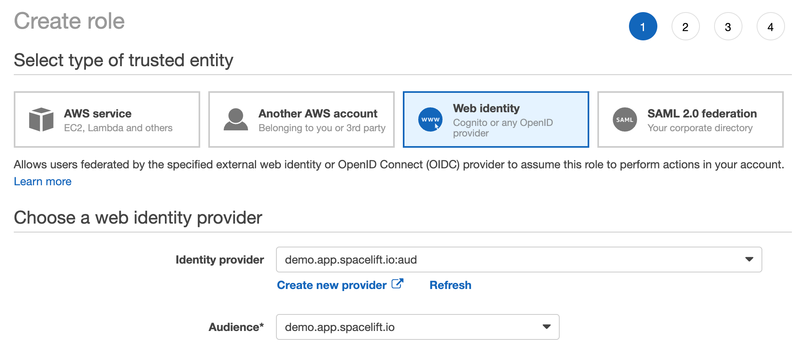
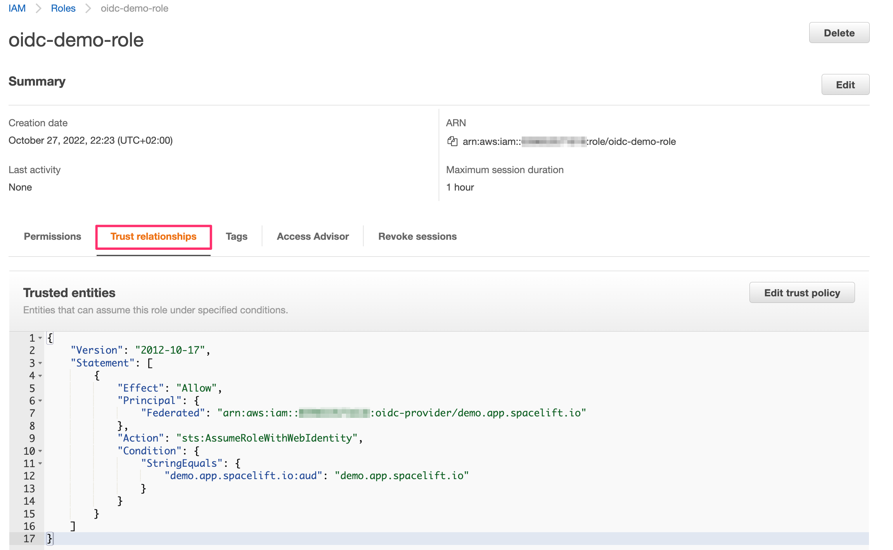

# Amazon Web Services (AWS)

!!! hint
    This feature is only available to paid Spacelift accounts. Please check out our [pricing page](https://spacelift.io/pricing){: rel="nofollow"} for more information.

## Configuring Spacelift as an Identity Provider

In order to be able to do that, you will need to set up Spacelift as a valid identity provider for your AWS account. This is done by creating an [OpenID Connect identity provider
](https://docs.aws.amazon.com/IAM/latest/UserGuide/id_roles_providers_create_oidc.html){: rel="nofollow"}. You can do it declaratively using any of the IaC providers, programmatically using the [AWS CLI](https://aws.amazon.com/cli/){: rel="nofollow"} or simply use the console. For illustrative purposes, we will use the console:

1. Go to the [AWS console](https://console.aws.amazon.com/iam/home#/home){: rel="nofollow"} and select the IAM service;
2. Click on the "Identity providers" link in the left-hand menu;
3. Click on the "Add provider" button in the top bar 
4. Select "OpenID Connect" as the provider type 
5. Make sure to get the host thumbprint by clicking the "Get thumbprint" button. This is required by AWS and protects you from a certain class of MitM attacks.

!!! hint
    You will need to add [iss](README.md#standard-claims) to _Provider URL_ and you will need to add [aud](README.md#standard-claims) to _Audience_.
    You will need to replace `demo.app.spacelift.io` with the hostname of your Spacelift account.

Once created, the identity provider will be listed in the "Identity providers" table. You can click on the provider name to see the details. From here, you will also be able to assign an IAM role to this new identity provider:



A dialog will pop up, asking you to select whether you want to create a new role or use an existing one. Let's create a brand new role. The most important thing for us is to select the right trusted entity - the new Spacelift OIDC provider. Make sure you select the audience from the dropdown - there should be just one option to choose from:



The rest of the process is the same as for any other role creation. You will be asked to select the policies that you want to attach to the role. You can also add tags and a description. Once you're done, click the "Create role" button.

If you go to your new role's details page, in the _Trust relationships_ section you will notice that it is now associated with the Spacelift OIDC provider:



This trust relationship is very relaxed and will allow any stack or module in the `demo` Spacelift account to assume this role. If you want to be more restrictive, you will want to add more conditions. For example, we can restrict the role to be only assumable by stacks in the `production` space by adding the following condition:

```json
"StringLike": {
  "demo.app.spacelift.io:sub": "space:production:*"
}
```

!!! hint
    You will need to replace `demo.app.spacelift.io` with the hostname of your Spacelift account.

You can also restrict the role to be assumable only by a specific stack by matching on the stack ID:

```json
"StringLike": {
  "demo.app.spacelift.io:sub": "*:stack:oidc-is-awesome:*"
}
```

You can mix and match these to get the exact constraints you need. It is not the purpose of this guide to go into the intricacies of AWS IAM conditions - you can learn all about these in the [official doc](https://docs.aws.amazon.com/IAM/latest/UserGuide/reference_policies_elements_condition.html){: rel="nofollow"}. One important thing to remember though is that AWS does not seem to support custom claims so you will need to use the standard ones to do the matching - primarily `sub`, as shown above.

## Configuring the OpenTofu/Terraform Provider

Once the Spacelift-AWS OIDC integration is set up, the provider can be configured without the need for any static credentials. The `aws_role_arn` variable should be set to the ARN of the role that you want to assume:

```hcl
provider "aws" {
  assume_role_with_web_identity {
    role_arn = var.aws_role_arn
    web_identity_token_file = "/mnt/workspace/spacelift.oidc"
  }
}
```
