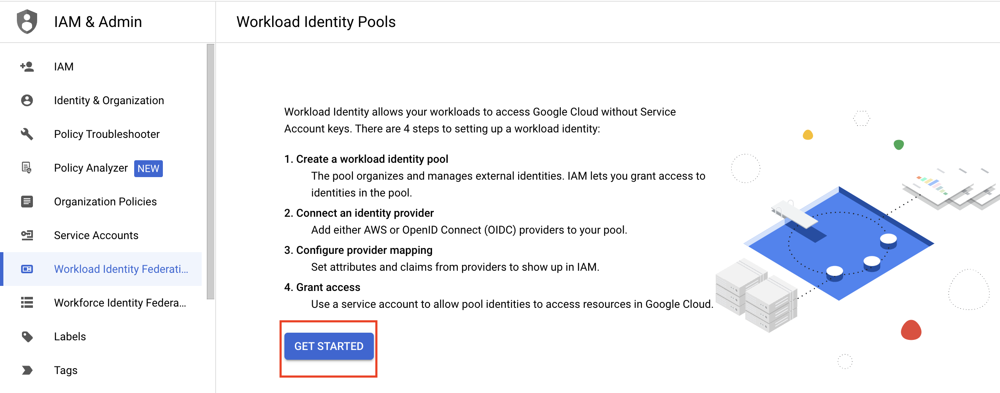
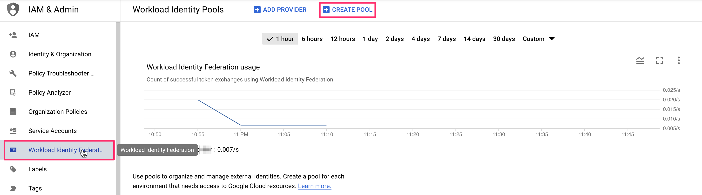
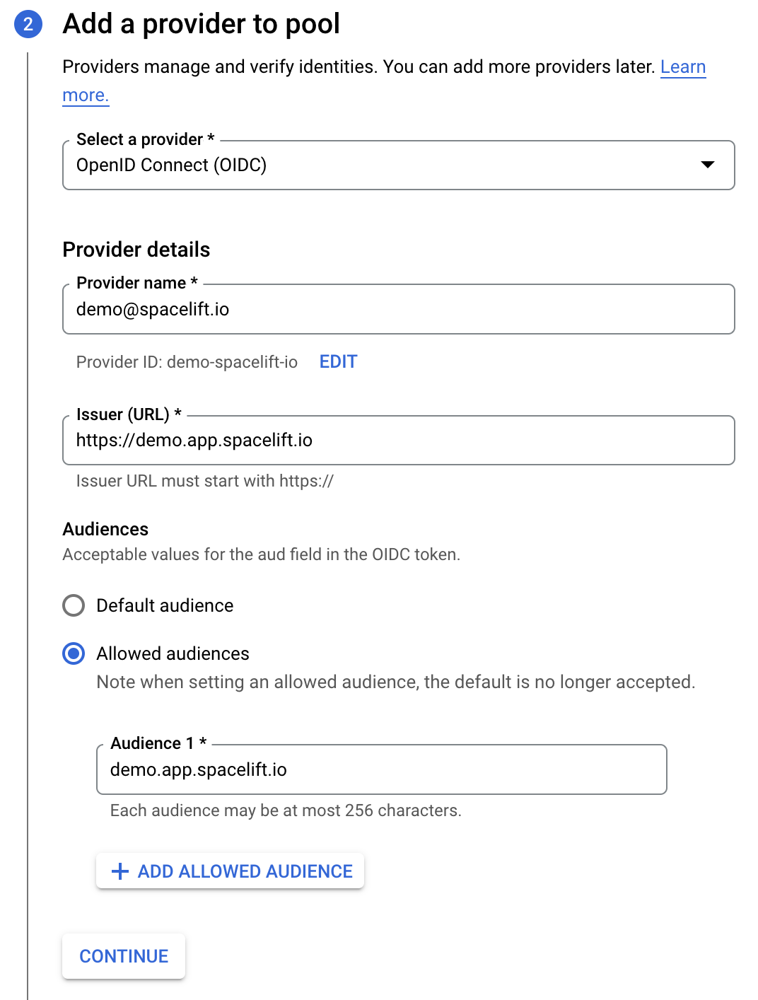
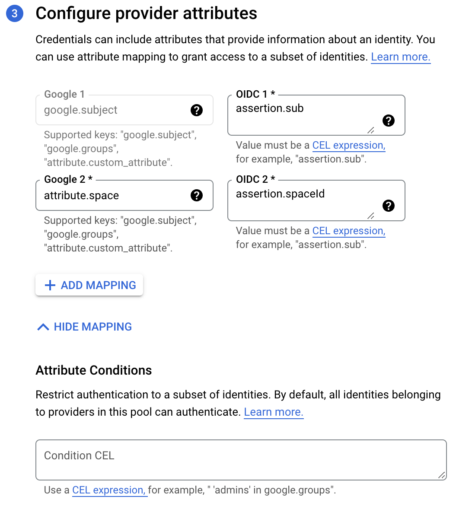
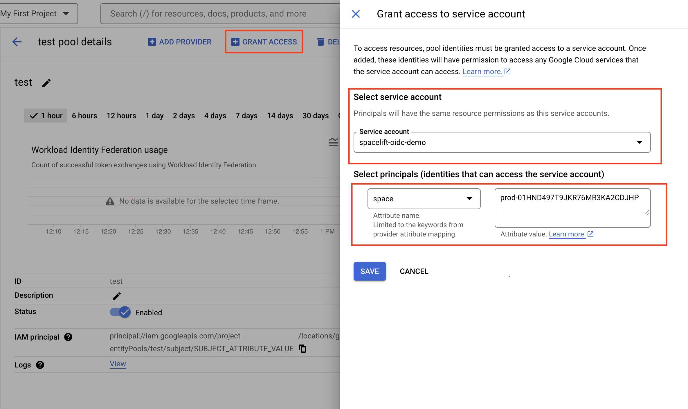
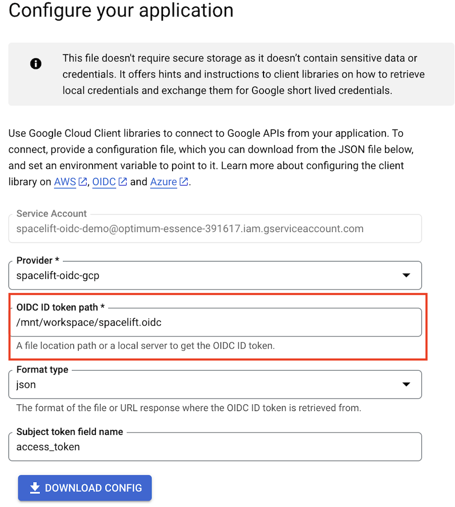
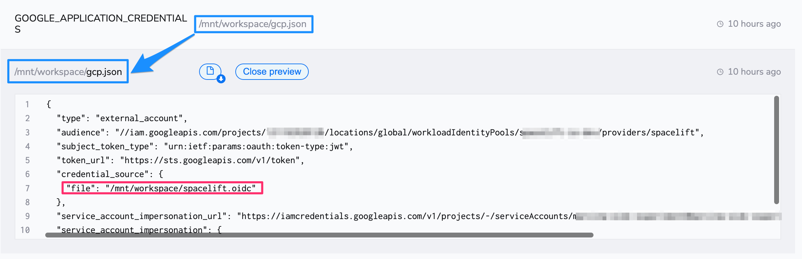
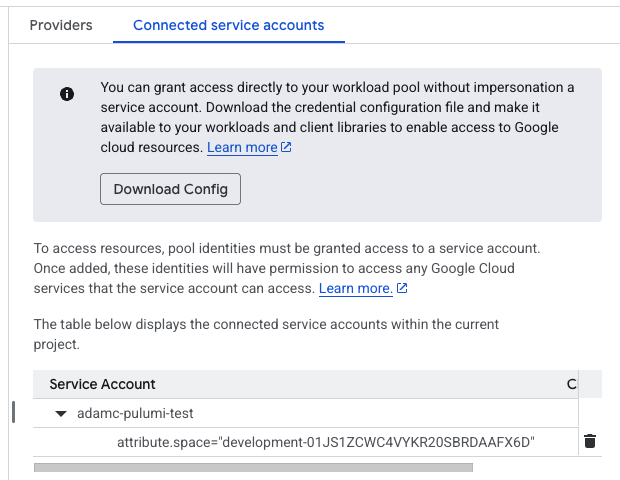

# Google Cloud Platform (GCP)

## Configuring Workload Identity

In order to enable Spacelift runs to access GCP resources, you need to set up Spacelift as a valid identity provider for your account.
To do this you need to perform a number of steps within GCP:

- Create a [workload identity pool](https://cloud.google.com/iam/docs/configuring-workload-identity-federation#oidc){: rel="nofollow"} and set up the Spacelift OIDC provider as an identity provider for it;
- Create a [service account](https://cloud.google.com/iam/docs/service-accounts){: rel="nofollow"} that will be used by Spacelift;
- Connect the service account to the workload identity pool;

Let's go through these steps one by one. First, you will want to go to the [GCP console](https://console.cloud.google.com/){: rel="nofollow"} and select the IAM service, then click on the "Workload Identity Federation" link in the left-hand menu:

If this is your first time creating a Workload Identity Pools, you will click on the _Get Started_ button.



If you have created a Workload Identity Pool before, your screen should look like:



From there, you will want to click on the _Create pool_ button, which will take you to the pool creation form. First, give your new identity pool a name and optionally set a description. The next step is more interesting - you will need to set up an identity provider. The name is pretty much arbitrary but the rest of the fields are important to get right. The Issuer URL needs to be set to the URL of your Spacelift account (including the scheme). You will want to manually specify allowed audiences. There's just one you need - the hostname of your Spacelift account. Here is what a properly filled out form would look like:



!!! hint
    You will need to add [iss](README.md#standard-claims) to _Issuer (URL)_ and you will need to add [aud](README.md#standard-claims) to _Audience_.
    You will need to replace `demo.app.spacelift.io` and `demo@spacelift.io` with the hostname of your Spacelift account.

In the last step, you will need to configure a mapping between provider Spacelift token claims (assertions) and Google attributes. `google.subject` is a required mapping and should generally map to `assertion.sub`. [Custom claims](README.md#custom-claims) can be mapped to custom attributes, which need to start with the `attribute.` prefix. In the below example, we are also mapping Spacelift's `spaceId` claim to GCP's custom `space` attribute:



To restrict which identities can authenticate using your workload identity pool you can specify extra [conditions](https://cloud.google.com/iam/docs/workload-identity-federation#conditions){: rel="nofollow"} using Google's [Common Expression Language](https://github.com/google/cel-spec){: rel="nofollow"}.

!!! warning
    If your Stack ID is too long, it may exceed the threshold set by Google for the `google.subject` mapping. In that case, you can use a different [Custom claim](README.md#custom-claims) to create the mapping.

Last but not least, we will want to grant the workload identity pool the ability to impersonate the [service account](https://cloud.google.com/iam/docs/service-accounts){: rel="nofollow"} we will be using. **Assuming we already have a service account**, let's allow any token claiming to originate from the `prod` space in our Spacelift account to impersonate it:



Make sure you use the full space id and not the space name.

## Downloading the Configuration File

After clicking save on the previous screen, you will be brought to download the configuration file. Here, you will need to change the OIDC ID token path to `/mnt/workspace/spacelift.oidc` and change the format to json.



The file that is downloaded will include the format type in the credentials source. You can remove this so you credentials section just contains:

```json
 "credential_source": {
    "file": "/mnt/workspace/spacelift.oidc"
  }
```

## Configuring the Terraform Provider

Once the Spacelift-GCP OIDC integration is set up, the [Google Cloud Terraform provider](https://registry.terraform.io/providers/hashicorp/google/latest/docs){: rel="nofollow"} can be configured without the need for any static credentials. You will however want to provide a configuration file telling the provider how to authenticate. The configuration file can be created manually or generated by the [`gcloud` utility](https://cloud.google.com/sdk/gcloud/reference/iam/workload-identity-pools/create-cred-config){: rel="nofollow"} and would look like this:

```json
{
  "type": "external_account",
  "audience": "//iam.googleapis.com/projects/${PROJECT_NUMBER}/locations/global/workloadIdentityPools/${WORKER_POOL_ID}/providers/${IDENTITY_PROVIDER_ID}",
  "subject_token_type": "urn:ietf:params:oauth:token-type:jwt",
  "token_url": "https://sts.googleapis.com/v1/token",
  "credential_source": {
    "file": "/mnt/workspace/spacelift.oidc"
  },
  "service_account_impersonation_url": "https://iamcredentials.googleapis.com/v1/projects/-/serviceAccounts/${SERVICE_ACCOUNT_EMAIL}:generateAccessToken",
  "service_account_impersonation": {
    "token_lifetime_seconds": 3600
  }
}
```

Your Spacelift run needs to have access to this file, so you can check it in (there's nothing secret here), [mount it](../../../concepts/configuration/environment.md#mounted-files) on a stack or mount it in a [context](../../../concepts/configuration/context.md) that is then attached to the stack.

Note that you will also need to tell the provider how to find this configuration file. You can do this by creating a `GOOGLE_APPLICATION_CREDENTIALS` environment variable, and setting it to the path to your credentials file.

Here is an example of us using a Spacelift [context](../../../concepts/configuration/context.md) to mount the file and configure the provider to be attached to an arbitrary number of stacks:



For more information about configuring the Terraform provider, please see the [Google Cloud Terraform provider docs](https://registry.terraform.io/providers/hashicorp/google/latest/docs/guides/provider_reference#credentials){: rel="nofollow"}.

## Configuring the Pulumi GCP Provider

To configure the Pulumi [GCP provider](https://www.pulumi.com/registry/packages/gcp/api-docs/provider/){: rel="nofollow"} follow the same steps as for the [Terraform provider](#configuring-the-terraform-provider).

## Troubleshooting

### iam.serviceAccounts.getAccessToken PERMISSION_DENIED

If your Spacelift stack does not have permission to impersonate your Service Account, you may receive an error message in your run logs like the following:

```shell
"error": {
  "code": 403,
  "message": "Permission 'iam.serviceAccounts.getAccessToken' denied on resource (or it may not exist).",
  "status": "PERMISSION_DENIED",
  "details": [
    {
      "@type": "type.googleapis.com/google.rpc.ErrorInfo",
      "reason": "IAM_PERMISSION_DENIED",
      "domain": "iam.googleapis.com",
      "metadata": {
        "permission": "iam.serviceAccounts.getAccessToken"
      }
    }
  ]
}
```

If this happens, check the `service_account_impersonation_url` property in your configuration file and make sure it points at the service account you are trying to use. For example if you are trying to use a service account called `spacelift@my-gcp-org.iam.gserviceaccount.com`, you should have a value like the following:

```text
https://iamcredentials.googleapis.com/v1/projects/-/serviceAccounts/spacelift@my-gcp-org.iam.gserviceaccount.com:generateAccessToken
```

Next, check the conditions about who is allowed to impersonate your service account in your workflow identity pool. For example, in the following screenshot, only stacks in the `development-01JS1ZCWC4VYKR20SBRDAAFX6D` space are allowed to impersonate your service account:


