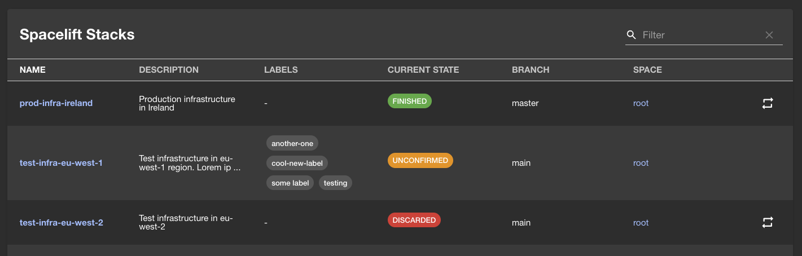

# Backstage

!!! warning
    This feature is still in beta testing.

## About the integration

The Backstage integration with Spacelift creates a bridge between your infrastructure as code workflows and Backstage.
This integration allows Backstage to check the current status of your team's stacks and execute actions on them.

### Benefits

- **Unified visibility**: View the status of all your Spacelift stacks directly within your Backstage developer portal
- **Operational efficiency**: Trigger stack runs without leaving Backstage
- **Streamlined workflows**: Integrate infrastructure management into your developer portal experience

## Setup Guide

### Create an API key in Spacelift

To handle the communication between Spacelift and Backstage, we will use a Spacelift API key.

1. Navigate to **Organization settings > API Keys**
2. Click on **Create API key**
3. Select type `Secret`
4. Select the **Space and Role** of the API key.
5. Click **Create**

A file with the API secret will be downloaded automatically.

!!! warning
    Note that the Space and Role access provided to the API key will determine the level of access to your Spacelift resources. Use this to limit the resources that a user can access in Backstage.

### Install the Backstage plugins

To install the Backstage plugins, follow the instructions that you will find in our [plugins repository](https://github.com/spacelift-io/backstage-plugins). The README files contain detailed steps to install each plugin. Here's an overview of the steps you have to take:

!!! info
    These plugins are compatible with Backstage v1.17.0 and above. For older versions, please check the plugin repository for specific compatibility information.

1. From the root of your project, install the Backend and Frontend plugins:

    ```sh
        yarn --cwd packages/backend add @spacelift-io/backstage-integration-backend
        yarn --cwd packages/app add @spacelift-io/backstage-integration-frontend
    ```

2. Create your environment variables in `app-config.yaml`

    You will have to provide the following variables:

    

    ```yaml
        spacelift:
          hostUrl: 'https://<your-subdomain>.app.spacelift.io' # Your Spacelift instance URL
          apiKey: ${SPACELIFT_API_KEY} # Your Spacelift API Key ID
          apiSecret: ${SPACELIFT_API_SECRET} # Your Spacelift API Key Secret
    ```

    
    

    ```yaml
        spacelift:
          hostUrl: 'https://<your-selfhosted-spacelift-domain>' # Your Spacelift instance URL
          apiKey: ${SPACELIFT_API_KEY} # Your Spacelift API Key ID
          apiSecret: ${SPACELIFT_API_SECRET} # Your Spacelift API Key Secret
    ```

    

    !!! tip "Setting environment variables"
        For production environments, we recommend using appropriate secrets management solutions to securely provide these environment variables to your Backstage instance. For local development, you can add the values to `app-config.local.yaml`, to override production values.

3. Connect the Backend and Frontend plugins to your Backstage code.
    You can find more details on how to do that in our [Backend README](https://github.com/spacelift-io/backstage-plugins/blob/main/packages/spacelift-io-backend/README.md) and [Frontend README](https://github.com/spacelift-io/backstage-plugins/blob/main/packages/spacelift-io-frontend/README.md) files.

4. Run your Backstage instance and check that everything is working as expected.

## Important note on security and permissions

The plugins operate using the permissions granted to the Spacelift API Key configured in Spacelift. They do not implement any additional user-level permission handling within Backstage.

It is the responsibility of the Backstage instance administrator to ensure that appropriate Backstage permissions are configured to control access to the Spacelift plugin pages and features, thereby preventing unauthorized actions or information exposure.

We recommend allowing the API key to have **Write** access to the top level Space that the Backstage users will be able to see, limiting access within Backstage to any users that lack the appropriated permissions to trigger runs on the associated subspaces.

## Integration Capabilities

### Stacks list

The plugin will show a list of all the stacks visible based on the API key Space and Role. It will display the status of the stacks and allow users to trigger a rerun when the stack allows it.



## Troubleshooting

### Common issues

1. **Plugin not appearing in Backstage**: Ensure you've correctly configured the plugin in your `app-config.yaml` and properly imported and registered the plugin in your Backstage app.

2. **Authentication errors**: Verify your API key has the correct permissions and that your `apiKey` and `apiSecret` environment variables are properly set.

3. **Stack listing is empty**: Check that the API key has access to the appropriate spaces containing your stacks.

If you encounter issues not covered here, please check our [GitHub repository issues](https://github.com/spacelift-io/backstage-plugins/issues) or contact our support.

## Removing Integration

To remove the integration, you need to delete the API key associated with it.

1. Go to **Organization settings > API Keys**
2. Find the API key used to integrate with Backstage
3. From the three dots menu, select **Delete**

After deleting the API key, the integration won't be able to access Spacelift resources any more.
You can safely uninstall the packages and remove the code associated to them.

```sh
    yarn --cwd packages/backend remove @spacelift-io/backstage-integration-backend
    yarn --cwd packages/app remove @spacelift-io/backstage-integration-frontend
```
