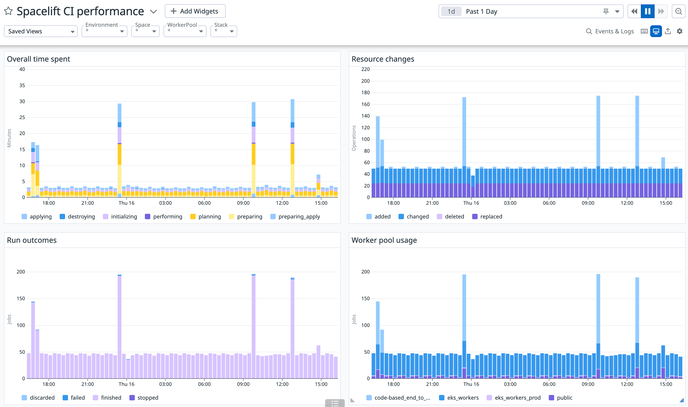

# Datadog integration

Spacelift can send data to Datadog to help you monitor your infrastructure and Spacelift stacks using Datadog's excellent monitoring and analytics tools. Our integration with Datadog focuses primarily on runs and lets you create dashboards and alerts to answer questions like:

- How many runs are failing?
- Which stacks see the most activity?
- How long does it take to plan a given stack?
- How long does it take to apply a stack?
- What is the load on my Spacelift private workers?
- How many resources am I changing?
- ...and many more!

Here's a very simple dashboard we've created based on this integration that shows the performance of our continuous regression tests:

## Prerequisites

The Datadog integration is based on our [notification policy](../../concepts/policy/notification-policy.md) feature, which requires at least an active [Cloud tier](https://spacelift.io/pricing){: rel="nofollow"} subscription. While building a notification-based Datadog integration from scratch is possible, we've created a [Terraform module](https://registry.terraform.io/modules/spacelift-io/datadog/spacelift/latest){: rel="nofollow"} that will set up all the necessary integration elements for you.

This module will only create Spacelift assets:

- a [notification policy](../../concepts/policy/notification-policy.md) that will send data to Datadog;
- a [webhook endpoint](../webhooks.md) that serve as a notification target for the policy;
- a webhook secret header that will securely authenticate the payload with Datadog;

## Setting up the integration

To set up the integration, you'll need to have a [Datadog account](https://www.datadoghq.com/){: rel="nofollow"} and a [Datadog API key](https://docs.datadoghq.com/account_management/api-app-keys/#api-keys){: rel="nofollow"}. If you don't have a an administrative stack declaratively manage your Spacelift resources, we suggest you create one, and add module instantiation to it according to its usage instructions. We suggest that you pass the Datadog API key as a [stack secret](../../concepts/configuration/environment.md#environment-variables), or - even better - retrieve it from a remote secret store (eg. AWS Parameter Store) using Terraform.

If you intend to monitor your entire account (our suggested approach), we suggest that the module is installed in the [root space](../../concepts/spaces/access-control.md) of your Spacelift account. If you only want to monitor a subset of your stacks, you can install the module in their respective space.

## Metrics

The following metrics are sent:

- `spacelift.integration.run.count` (counter) - a simple count of runs;
- `spacelift.integration.run.timing` (counter, nanoseconds) - the duration of different run states. In addition to [common tags](#common-tags), this metric is also tagged with the state name, eg. `state:planning`, `state:applying`, etc.;
- `spacelift.integration.run.resources` (counter) - the resources affected by a run. In addition to [common tags](#common-tags), this metric is also tagged with the change type, eg. `change_type:added`, `change_type:changed`, etc.;

## Common tags

Common tags for all metrics are the following:

- `account` (string) : name of the Spacelift account generating the metric;
- `branch` (string): name of the Git branch the run was triggered from;
- `drift_detection` (boolean): whether the run was triggered by drift detection;
- `run_type` (string): type of a run, eg. "tracked", "proposed", etc.;
- `final_state` (string): the terminal state of the run, eg. "finished", "failed", etc.;
- `space` (string): name of the Spacelift space the run belongs to;
- `stack` (string): name of the Spacelift stack the run belongs to;
- `worker_pool` (string): name of the Spacelift worker pool the run was executed on - for the public worker pool this value is always `public`;

## Extending the integration

The benefit of building this integration on top of a notification policy is that you can easily extend it to send additional data to Datadog, change the naming of your metrics, change the tags, etc. To do so, you'll need to edit the policy body generated by the module. You can do so by editing the policy in the Spacelift UI, or by forking the module and editing the policy body in the module's source code.

Note that this is an advanced feature, and we recommend that you only do so if you're already familiar with Spacelift's notification policy feature and Datadog's API, or are willing to learn about them.
