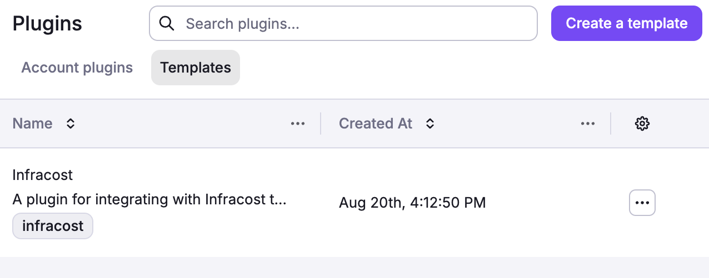
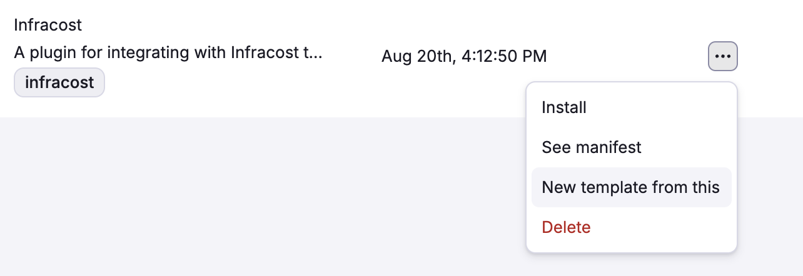
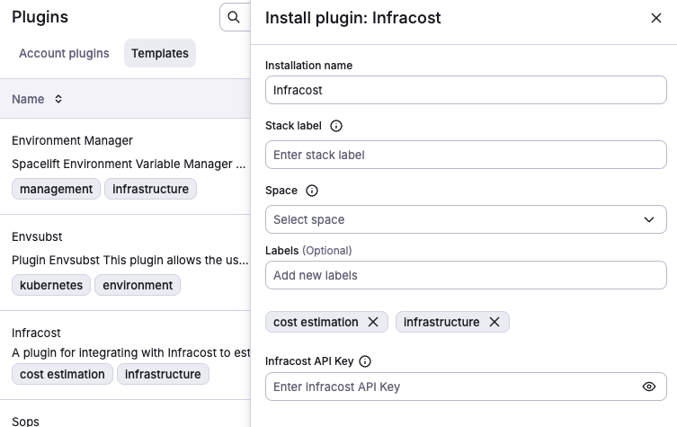
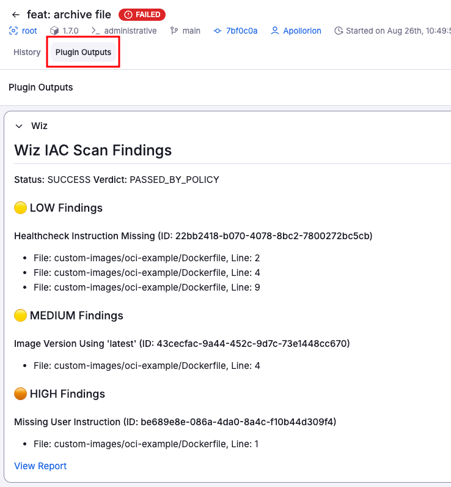

# Plugins

Plugins are a way to extend the functionality of Spacelift.
They allow you to integrate with third-party services, automate tasks, and enhance your workflows.
Spacelift supports a variety of plugins, which can be used to perform actions such as sending notifications, managing resources, or integrating with external systems.
You can also develop your own custom plugins using our plugin SDK [spaceforge](https://github.com/spacelift-io/plugins)

## Available Plugins

Browse and install plugins from the **Plugins → Templates** section in the Spacelift UI. You can also create custom plugins using the `Create Template` button.

The following plugins are available in the [Spacelift plugin repository](https://github.com/spacelift-io/plugins){: rel="nofollow"}:

- **[Infracost](https://www.infracost.io/){: rel="nofollow"}** - Estimate infrastructure costs before deployment
- **[SOPS](https://sops.github.io/){: rel="nofollow"}** - Decrypt secrets using cloud KMS services (AWS KMS, Azure Key Vault, GCP KMS)
- **[Wiz](https://www.wiz.io/){: rel="nofollow"}** - Cloud security scanning and compliance reporting
- **[Checkov](https://www.checkov.io/){: rel="nofollow"}** - Static security analysis for IaC files
- **[Terrascan](https://runterrascan.io/){: rel="nofollow"}** - Detect compliance and security violations
- **[Trivy](https://trivy.dev/){: rel="nofollow"}** - Comprehensive vulnerability and misconfiguration scanner
- **[TruffleHog](https://trufflesecurity.com/trufflehog){: rel="nofollow"}** - Secret and credential detection (800+ types)
- **Environment Manager** - Centralized environment variable management across stacks via YAML
- **Envsubst** - Environment variable substitution for Kubernetes manifests
- **OpenTofu Tracing** - OpenTelemetry tracing for OpenTofu operations

For detailed plugin documentation, configuration examples, and source code, visit the [plugin repository](https://github.com/spacelift-io/plugins){: rel="nofollow"}. Contributions are welcome! If you've built a plugin that could benefit the community, consider submitting it to the repository.

### Changing the plugin template

Some plugin templates come with default values that you might want to change.
Note that when a template is installed, the resulting policies, webhooks, contexts, etc will be locked in the UI.
Management of these resources is done via the plugins screen.

So to change a plugin template, you can click the "..." button next to the plugin template and select "New template from this".

After that, you can create a new template with the desired changes and install that into your account.

## Installing Plugins

To install a plugin, navigate to the Plugins -> Templates section in the Spacelift UI and click "..." -> Install.
When installing a plugin you will be provided a number of options.

- `Installation Name` is the name of the plugin installation. This is used to identify the plugin in the Spacelift UI.
- `Stack Label` is the `autoattach` label that will be used to automatically attach the plugin to stacks.
- `Space` is the space where the plugin will be installed. This is used to scope the plugin to a specific space.
- `labels` are arbitrary labels that can be used to filter in the Spacelift UI.

Below the options, you will see dynamically configured options that are pulled in from the template.
For instance, the Infracost plugin template has the `Infracost API Key` option, which is required to use the plugin.
If you need more information about what a specific paramenter is doing hover over the information icon.

After a plugin is installed, it will move to the `Account Plugins` tab where you can see details about that specific plugin.

## Using a plugin

Using a plugin is very simple, plugins can **only** attach via the `autoattach` label.
The value you provided in the `Stack Label` field will be used as the `autoattach` label.
If you installed Infracost with the `infracost` stack label, you can attach it to a stack by adding the `infracost` label to the stack.
You can also use the `*` wildcard in the stack label to attach the plugin to all stacks in a space.

## Plugin Outputs

Plugins may output information that is useful for you to see. If a plugin produces outputs, they will be visible in the `Plugin Outputs` tab of the run details page.
An example of the `Wiz` plugin output is shown below:

## Plugin Development

### Getting Started with Custom Plugins

Custom plugins allow you to extend Spacelift's functionality to meet your specific needs. The [spaceforge](https://github.com/spacelift-io/plugins) SDK provides templates and tools for creating, testing, and publishing plugins.

### Plugin Architecture

Spacelift plugins are packaged as yaml files. Each plugin defines:

- **Execution phases**: When the plugin runs (e.g., before_init, after_plan, after_apply)
- **Input parameters**: Configuration options exposed during installation
- **Output artifacts**: Files, logs, or data produced by the plugin
- **Dependencies**: Required tools, libraries, or external services

### Plugin Lifecycle

1. **Installation**: Plugin template is installed into your account with specific configuration
2. **Attachment**: Plugin automatically attaches to stacks via autoattach labels
3. **Execution**: Plugin runs during appropriate run phases based on its configuration
4. **Output**: Plugin generates logs, artifacts, or external integrations
5. **Cleanup**: Temporary resources are cleaned up after execution

### Contributing to the Plugin Ecosystem

#### Community Contributions

The Spacelift plugin ecosystem thrives on community contributions. Here's how you can get involved:

**Plugin Templates:**

- Contribute new plugin templates to the [spaceforge repository](https://github.com/spacelift-io/plugins)
- Improve existing plugin documentation and examples
- Submit bug fixes and feature enhancements

**Contribution Process:**

1. **Fork the repository**: Create your own fork of the spaceforge repo
2. **Create feature branch**: `git checkout -b feature/my-awesome-plugin`
3. **Develop and test**: Follow the development guidelines and test thoroughly
4. **Submit pull request**: Include clear description and test results
5. **Review process**: Core maintainers will review and provide feedback

#### Plugin Submission Guidelines

**Quality Standards:**

- **Documentation**: Comprehensive README with setup instructions
- **Security**: Follow security best practices, no hardcoded secrets
- **Compatibility**: Test with supported Spacelift features and IaC tool versions

#### Plugin Categories

**Popular Plugin Categories:**

- **Security & Compliance**: Vulnerability scanning, policy enforcement, compliance reporting
- **Cost Management**: Cost estimation, budget alerts, resource optimization
- **Notifications**: Slack, Discord, email, webhooks for run status updates
- **Monitoring & Observability**: Metrics collection, log aggregation, alerting
- **CI/CD Integration**: GitHub Actions, GitLab CI, Jenkins pipeline triggers
- **Cloud Services**: Provider-specific integrations and automation
- **Testing**: Infrastructure testing, compliance validation, performance testing
