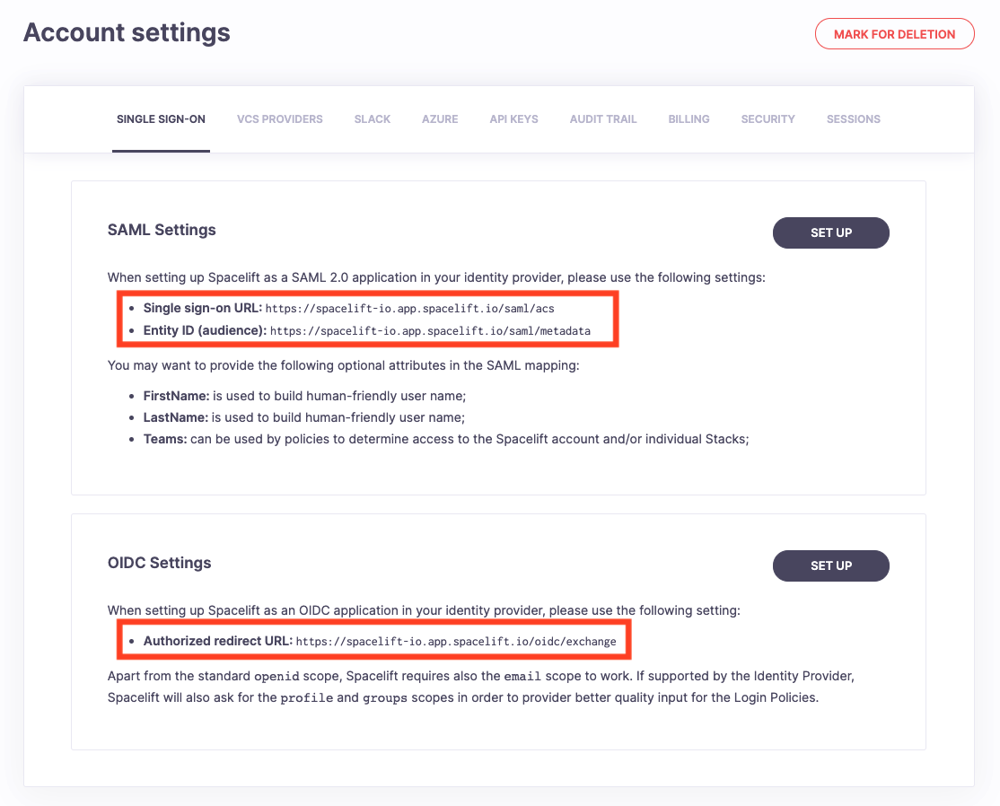
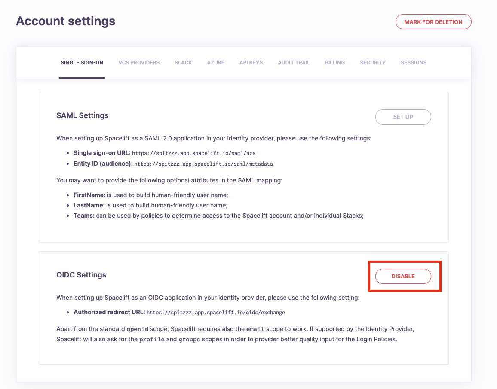

# Single Sign-On

By default, Spacelift supports logging in using GitHub, GitLab, or Google. Some organizations however prefer a Single Sign-On approach, where access to resources is centralized. To accommodate this use-case, Spacelift supports Single Sign-On using [SAML 2.0](#setting-up-saml) or [OIDC](#setting-up-oidc).

## Managed Identity Provider vs SSO

!!! tip
    The SSO integration can only be configured once the [Spacelift account has been created using one of the supported Identity Providers](../../getting-started.md#step-1-create-your-spacelift-account).

To create a Spacelift account, a user needs to choose one of the supported managed identity providers. That user then becomes the "Managed IdP Admin".

If SSO is configured, the managed identity provider used to create the account and the associated admin are disabled and the first user to successfully log in becomes the "SSO Admin".

Login policies are not evaluated for Managed IdP and SSO admins so that they cannot lock themselves out. As a side effect, there won’t be any [Login policy samples](../../concepts/policy/README.md#sampling-policy-inputs) for them in the [Policy Workbench](../../concepts/policy/README.md#policy-workbench-in-practice).

If SSO is disabled later, the managed identity provider and associated admin are re-enabled automatically.

## Managing integrations

In order to manage Single Sign-On integrations on your Spacelift account, please go to the _Settings_ section of your account view. Next, navigate to the _Single Sign-On_ tab. If SSO is not enabled for your account, all you're going to see is instructions on how to get started. The first steps are always taken in your identity provider (Google Workspace, Okta, Auth0, ActiveDirectory, etc.). Navigate to your identity provider and create a dedicated SSO application filled with appropriate URLs taken from the Spacelift settings page presented below.

## Setting up SAML

When setting up Spacelift on your identity provider, you may want to add three attribute mappings:

- `FirstName` is used to build human-friendly user name;
- `LastName` is used to build human-friendly user name;
- `Teams` can be used by [login](../../concepts/policy/login-policy.md) and [stack access](../../concepts/policy/stack-access-policy.md) policies to determine the level access to the Spacelift account and/or individual Stacks;

Depending on your identity provider and your use case, your mapping may be different. Especially with regards to `Teams`, some identity providers (eg. [Okta](https://www.okta.com/){: rel="nofollow"}) will support an arbitrary list of memberships similar to GitHub teams out of the box, some will need extra customizations like (eg. [Google Workspace](https://support.google.com/a/answer/6327792?hl=en){: rel="nofollow"}) and as a courtesy, we will flush your login history.

Some identity providers (eg. [Okta](https://www.okta.com/){: rel="nofollow"}) will allow you to provide a custom per-user SAML 2.0 _Subject_ for SAML assertions. You could use this feature to map GitHub usernames to your identity provider users and thus get the exact same experience as when using GitHub as your identity provider.

!!! warning
    When setting up SSO without this GitHub mapping, your future logins will appear as new users since Spacelift has no way of mapping those without your assistance. New users will count against your seat quota and you may run out of seats. If you run into this problem, you can [contact us](https://spacelift.io/contact).

!!! info
    Spacelift uses both HTTP-Redirect and HTTP-POST bindings for SAML 2.0. Most of the IdPs enable both by default, but if you run into any issues, please check your application settings.

### NameID format

The NameID format specifies the format that Spacelift requests user identifiers from your identity provider. The user identifier is used as the Spacelift login, and each unique identifier will count against your seat quota. Some identity providers allow you to configure this format, but certain providers (eg. Azure AD) do not.

If your identity provider does not allow the NameID format to be configured at their end, you can choose from one of the following options:

- Transient - an opaque identifier that is not guaranteed to remain the same between logins.
- Email Address - an email address.
- Persistent - an opaque identifier that remains the same between logins.

### SAML Setup Guides

The following are links to example implementations you can use as a reference/guide for setting up your own SAML integration.

- [AWS IAM Identity Center](./aws-iam-identity-saml-setup-guide.md) (formerly known as AWS SSO)

If you can't find your SAML provider in the list above, don't worry - we do support all SAML 2.0 providers.

## Setting up OIDC

When setting up Spacelift on your identity provider, you must make sure it supports the `email` scope and returns the corresponding `email`

### Additional claims

Spacelift dynamically checks integrated Identity Provider's Well-Known OpenID configuration for a list of supported scopes and, optionally, asks for `profile` and `groups` scopes if those are available.

!!! warning
    In order to populate the `input.session.teams` value in the Login Policies Spacelift tries to fetch the `groups` claim. For many Identity Providers, this claim has to be manually set and configured. Bear in mind that some providers such as Google Workspace do not support retrieving groups of given users.

### OIDC Setup Guides

The following are links to example implementations you can use as a reference/guide for setting up your own OIDC integration.

- [GitLab](./gitlab-oidc-setup-guide.md)
- [Okta](./okta-oidc-setup-guide.md)
- [OneLogin](./onelogin-oidc-setup-guide.md)
- [Azure AD](./azure-ad-oidc-setup-guide.md)

If you can't find your OIDC provider in the list above, don't worry - we do support all OIDC providers as long as they support the email scope and return the user's email. Fortunately, most OIDC providers do.

## IdP-initiated SSO

While certainly more convenient, IdP-initiated SSO lacks some of the protections awarded by SP-initiated SSO and is thus inherently less safe. Since Spacelift manages some of your most valuable resources, we decided against supporting this feature.

If our server detects an IdP-initiated SSO session, it simply redirects the browser using [_303 See other_](https://en.wikipedia.org/wiki/HTTP_303){: rel="nofollow"} HTTP status code to the endpoint that triggers a regular SP-initiated SSO flow. As a result, you can still access Spacelift by clicking on the link in your IdP catalog, but are not exposed to the vulnerabilities of the IdP-initiated SSO.

## Disabling SSO

In order to disable SSO integration for your Spacelift account, or change the IdP provider, please click the _Disable_ button to delete the integration. This change takes effect immediately for new logins, and will invalidate existing sessions. New sessions will be created using the new SSO identity provider or - if none is set up - Spacelift will utilize the default identity provider that was used to create the account originally.

!!! warning
    Again, please note that new usernames will occupy new seats, even if they're the same users registered with a different identity provider.

