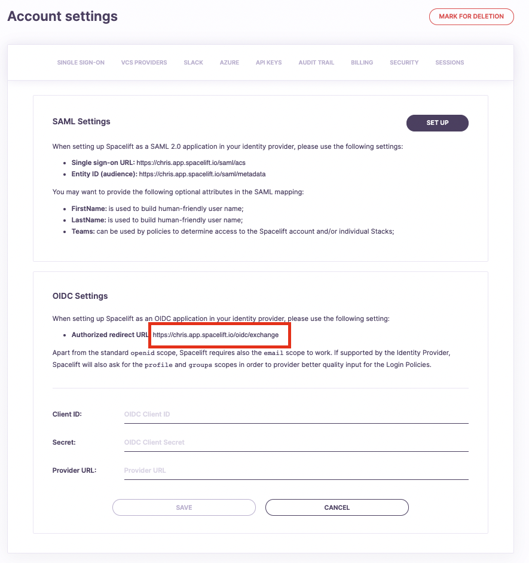
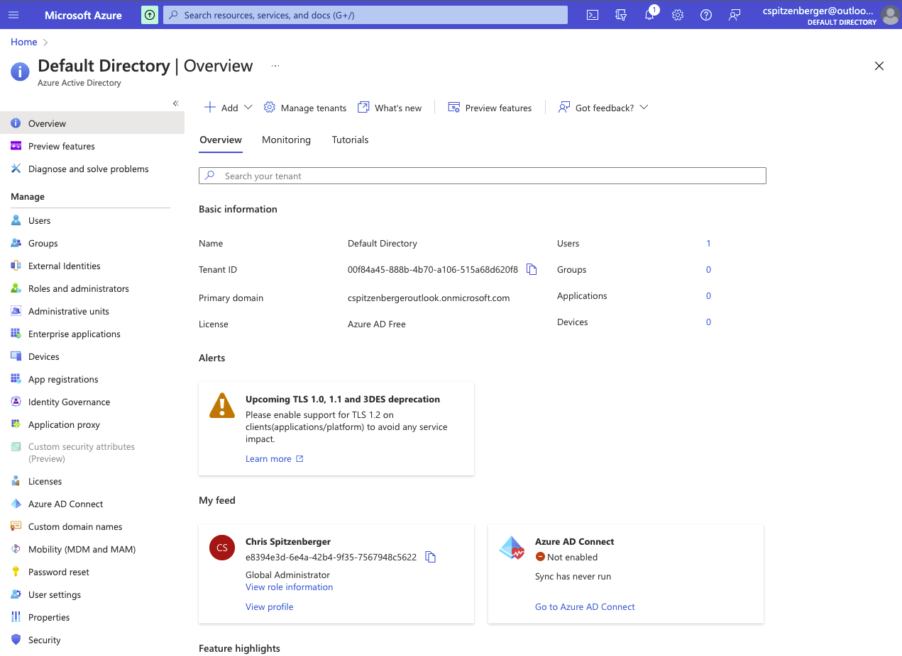
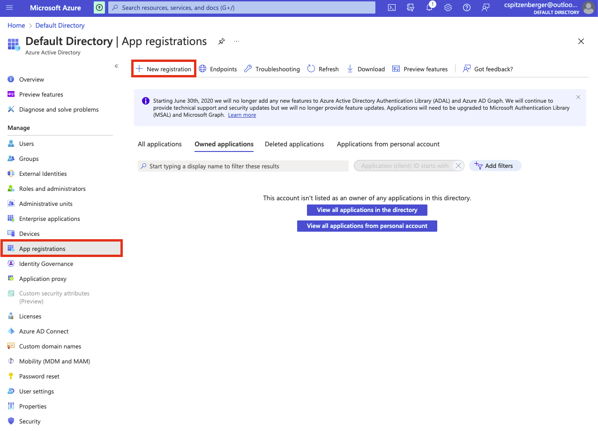
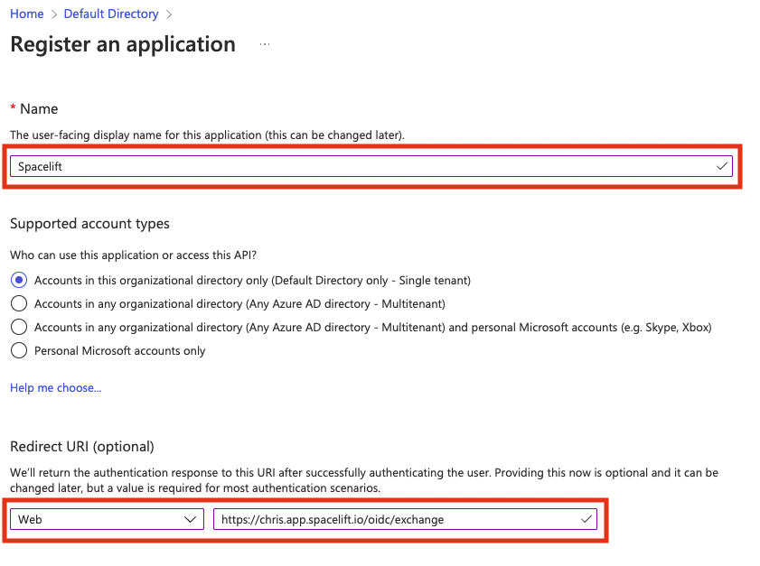
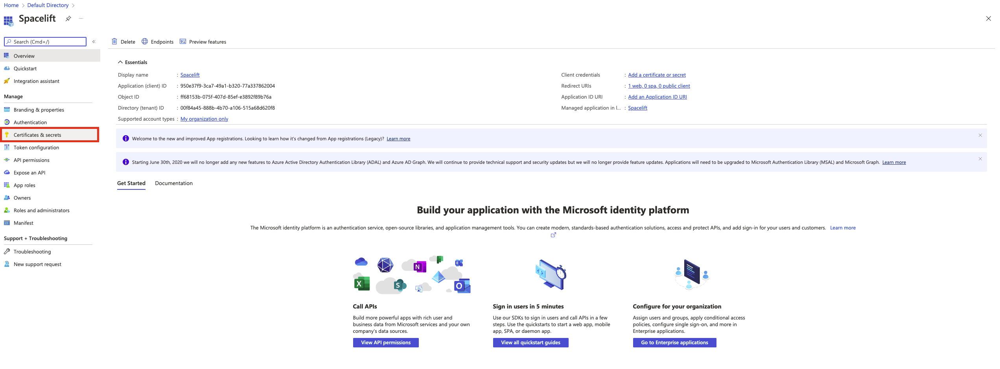
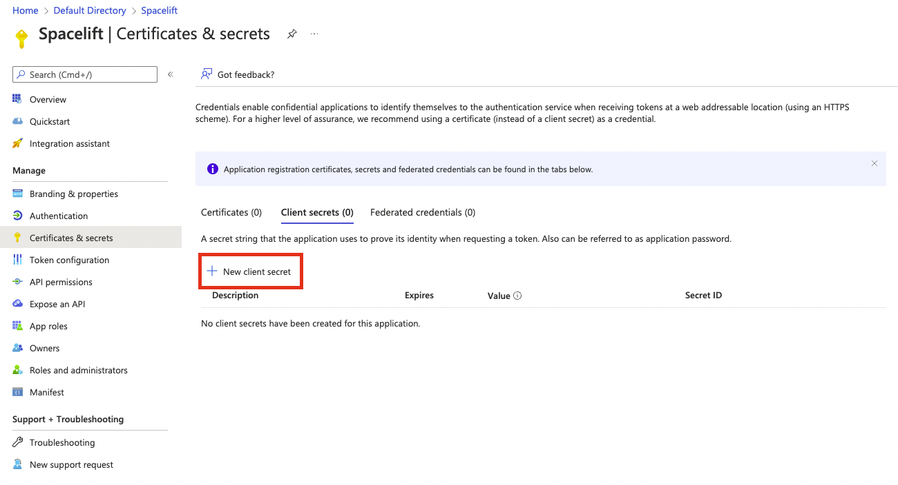
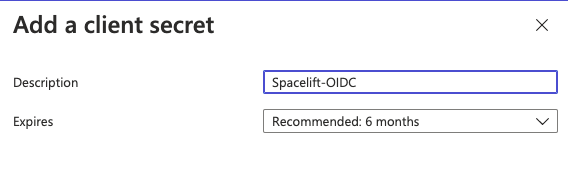
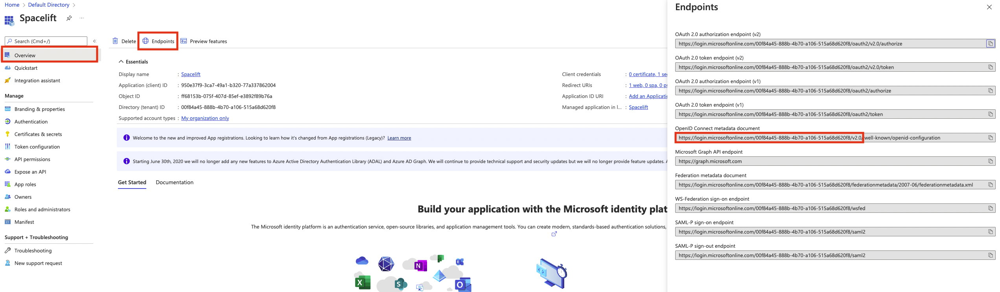

# Azure AD OIDC Setup Guide

If you'd like to set up the ability to sign in to your Spacelift account using an OIDC integration with Azure AD, you've come to the right place. This example will walk you through the steps to get this setup, and you'll have Single Sign-On running in no time!

## Pre-requisites

- Spacelift account, with access to admin permissions
- Azure account, with an existing Azure Active Directory
- You'll need permissions to create an **App Registration** within your Azure AD

## Configure Account Settings

You'll need to visit the Spacelift account settings page to set up this integration, from the account menu, select "Settings."

## Setup OIDC

Next, you'll want to click the Set Up box underneath the "OIDC Settings" section. This will expand some configuration we will need to fill out in a few minutes, which we will be obtaining from Azure. For now, **copy the authorized redirect URL** as we will need to provide Azure this URL when configuring our Azure App Registration within your Azure AD.

## Azure Portal: Navigate to Azure Active Directory

Within your Azure Account, navigate to your Azure Active Directory where you'd like to setup the OIDC integration for. In this guide, we are using a Default Directory for example purposes.

## Azure AD: Create an App Registration

While you are within your Active Directory's settings, click on **App registrations** from the navigation, and then select **New registration**.

## Azure AD: App Registration Configuration

Give your application a name - Spacelift sounds like a good one :clap:

Configure your supported account types as per your login requirements. In this example, we are allowing Accounts in this organizational directory access to Spacelift.

Remember the **authorized redirect URL** we copied earlier from Spacelift? We'll need that in this step. You'll want to paste that URL into the **Redirect URI** input as shown. Make sure you select **Web** for the type.

Click **Register**.

## Azure AD: Add UPN Claim

Start by navigating to the **Token configuration** section of your application.

.png>)

Click the **Add optional claim** button, choose the **ID** token type, and select the **upn** claim:

 (1).png>)

Click the **Add** button, making sure to enable the **Turn on the Microsoft Graph profile permission** checkbox on the popup that appears:

.png>)

## Azure AD: Configure App Credentials

Navigate to the **Certificates & secrets** section of your application.

Click the **New client secret** button.

Give your secret a **Description**.

Define an **Expires** duration**.**

!!! info
    In this example, we are using 6 months for **Expires.** This means you will need to generate a new client secret in 6 months for your OIDC integration.

Click **Add.**

Now that we have the Client secret setup for our application, we'll need to take the **Value** and copy this into our Spacelift OIDC settings within the **Secret** input. **Value** within Azure AD = Spacelift's **Secret** input.

!!! info
    Don't click Save in Spacelift just yet, we still need to get the Client ID and Provider URL for your application.

The best way we've found to obtain the Client ID and Provider URL is to perform the following steps:

Click on **Overview** within your Azure App.

On this page **Application (client) ID.** Copy this value to Spacelift as the Client ID

Next, Click **Endpoints** which should expand a page with the endpoints for your App.

Copy the portion of the **OpenID Connect metadata document** URL that is highlighted as shown in the screenshot.

!!! info
    You should remove the **/.well-known/openid-configuration** suffix from the URL and paste this over to the Provider URL within Spacelift. **IMPORTANT:** Ensure that the you do not have a trailing / at the end of your URL when the value is copied into Spacelift.

The result should look something like this in Spacelift:

.png>)

Click **Save.**

## Azure AD OIDC Setup Completed

That's it! Your OIDC integration with Azure AD should now be configured (as per this example). Feel free to make any changes to your liking within your Azure AD App Registration configuration for the app that you just created.
