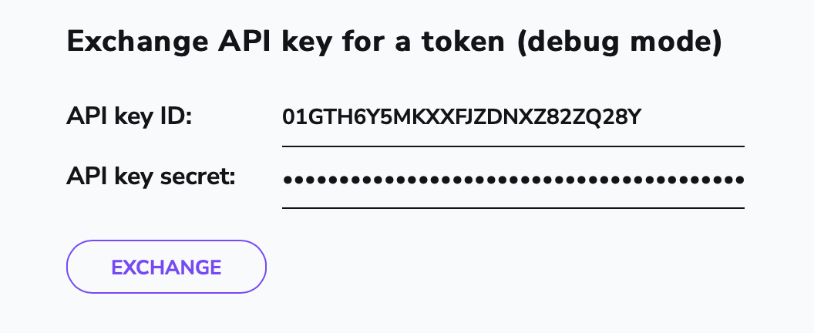

# Backup Credentials

Spacelift is SSO-first. This means that you can only create a Spacelift account using one of the supported identity providers, and can then further configure custom SAML or OIDC integrations.

However, usually you'd also like to set up a set of backup credentials that can be safely stored, in case you ever need to access Spacelift without going through your SSO provider. This might be useful in situations such as accidentally misconfiguring the SSO provider and locking oneself out, or the SSO provider having an outage.

## Creating Backup Credentials
In order to create a set of backup credentials, just create an API Key with admin permissions, as described in [Spacelift API Key > Token](../api.md#spacelift-api-key-token). Then, securely store the API Key ID, as well as the first secret token in the downloaded secret file, the one right after `Please use the following API secret when communicating with Spacelift programmatically:`.

## Logging in with Backup Credentials
In order to log in using an API Key open `https://<your-account>.app.spacelift.io/apikeytoken`. There, you'll be able to provide the previously stored API key ID and secret.

  

After clicking **EXCHANGE**, you'll be logged into the Spacelift UI.

## Additional Use-Cases
Since API Keys go through the login policy and you can specify the teams an API Key should be on, you can use the above functionality with a non-admin key to easily debug how other users see your account, for the purposes of i.e. debugging your login policy.
