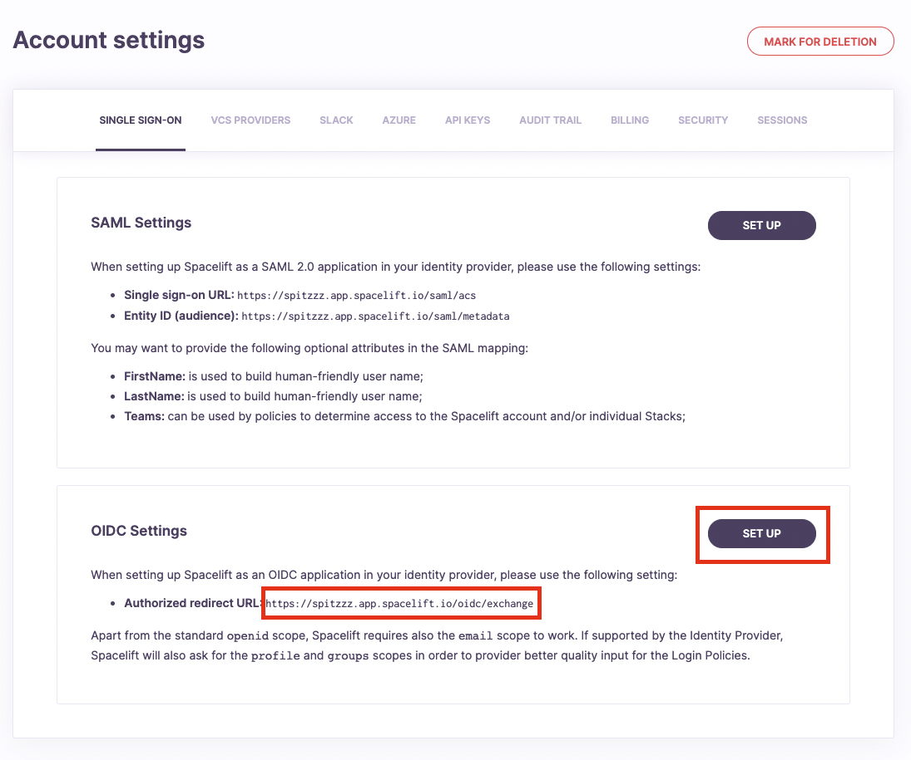
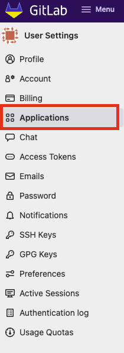
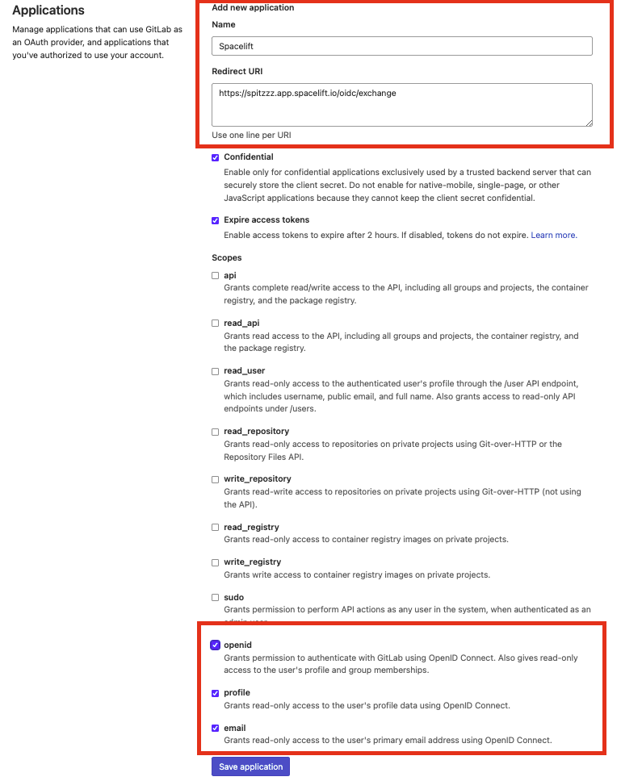
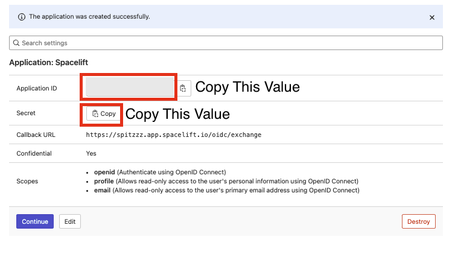

# GitLab OIDC Setup Guide

If you'd like to set up the ability to sign in to your Spacelift account using an OIDC integration with GitLab, you've come to the right place. This example will walk you through the steps to get this setup, and you'll have single sign-on running in no time!

### Pre-requisites

* Spacelift account, with access to admin permissions
* GitLab account, with permission to create GitLab Applications

### Configure Account Settings

You'll need to visit the Spacelift account settings page to set up this integration, from the account menu, select "Settings."

### Setup OIDC

Next, you'll want to click the Set Up box underneath the "OIDC Settings" section. This will expand some configuration we will need to fill out in a few minutes, which we will be obtaining from GitLab. For now **copy the authorized redirect URL** as we will need to provide GitLab this URL when configuring our GitLab application.

### GitLab: Create GitLab Application

Within your GitLab account, visit the **Applications** section of your account.

Create your GitLab Application as shown, the application's **Name** can be whatever you'd like. Spacelift sounds like a great name to use though :clap:.

Remember the **authorized redirect URL** we copied earlier from Spacelift? We'll need that in this step. You'll want to paste that URL into the **Redirect URI** input as shown.

Ensure that the **openId**, **profile** and **email** scopes are check'd.

Click **Save Application**.

### Configure OIDC Settings

Now that we have the GitLab Application setup, we'll need to take the **Application ID** and **Secret** to configure the Spacelift OIDC Settings.&#x20;

**Application ID** = Spacelift's **Client ID**

**Secret** = Spacelift's Secret

In Spacelift, the **Provider URL** depends on where you are using GitLab, if you are using **GitLab.com** this value can be set as **https://gitlab.com**


When setting your Provider URL within Spacelift, **do not include a trailing slash** "/" at the end of your URL or you may receive an error.


### GitLab OIDC Setup Completed 

That's it! Your OIDC integration with GitLab should now be fully configured.&#x20;

