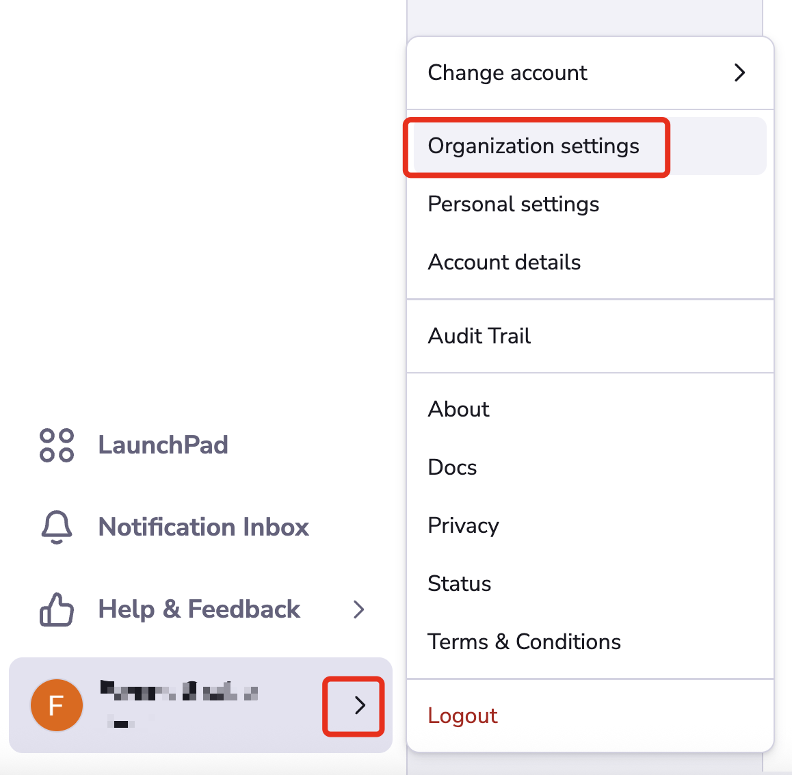
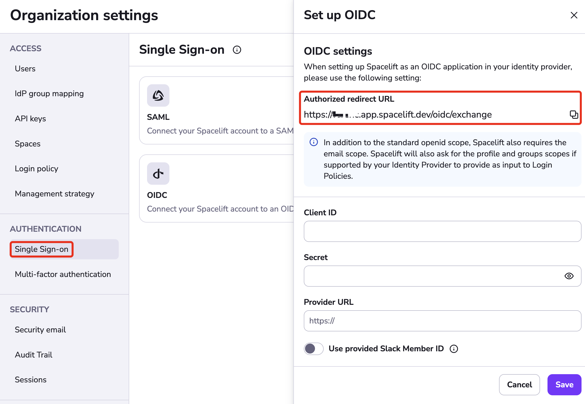

# GitLab OIDC Setup Guide

If you'd like to set up the ability to sign in to your Spacelift account using an OIDC integration with GitLab, you've come to the right place. This example will walk you through the steps to get this setup, and you'll have Single Sign-On running in no time!

!!! warning
    Before setting up SSO, it's recommended to create backup credentials for your Spacelift account for use in case of SSO misconfiguration, or for other break-glass procedures. You can find more about this in the [Backup Credentials](./backup-credentials.md) section.

## Pre-requisites

- Spacelift account, with access to admin permissions
- GitLab account, with permission to create GitLab Applications

!!! info
    Please note you'll need to be an admin on the Spacelift account to access the account settings to configure Single Sign-On.

## Configure Account Settings

Open **Organization settings** for your Spacelift account.
You can find this panel at the bottom left by clicking the arrow next to your name.

## Setup OIDC

Select **Single Sign-On** under **Authorization**. Click **Set up** under the OIDC section.

The drawer that opens contains the **Authorized redirect URL**, which you will need to copy for your login provider.
The input fields will be filled later with information from your provider.

## GitLab: Create GitLab Application

Within your GitLab account, visit the **Applications** section of your account.

Create your GitLab Application as shown, the application's **Name** can be whatever you'd like. Spacelift sounds like a great name to use though.

Remember the **authorized redirect URL** we copied earlier from Spacelift? We'll need that in this step. You'll want to paste that URL into the **Redirect URI** input as shown.

Ensure that the **openId**, **profile** and **email** scopes are check'd.

Click **Save Application**.

## Configure OIDC Settings

Now that we have the GitLab Application setup, we'll need to take the **Application ID** and **Secret** to configure the Spacelift OIDC Settings.

**Application ID** = Spacelift's **Client ID**

**Secret** = Spacelift's Secret

In Spacelift, the **Provider URL** depends on where you are using GitLab, if you are using **GitLab.com** this value can be set as `https://gitlab.com`

!!! info
    When setting your Provider URL within Spacelift, **do not include a trailing slash** "/" at the end of your URL or you may receive an error.

### GitLab OIDC Setup Completed

That's it! Your OIDC integration with GitLab should now be fully configured.
