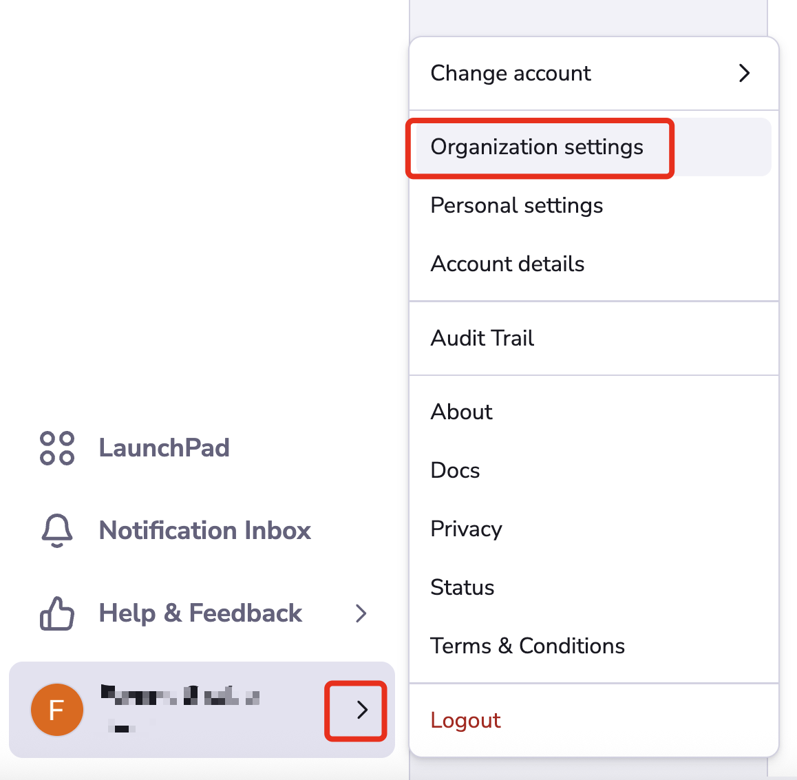
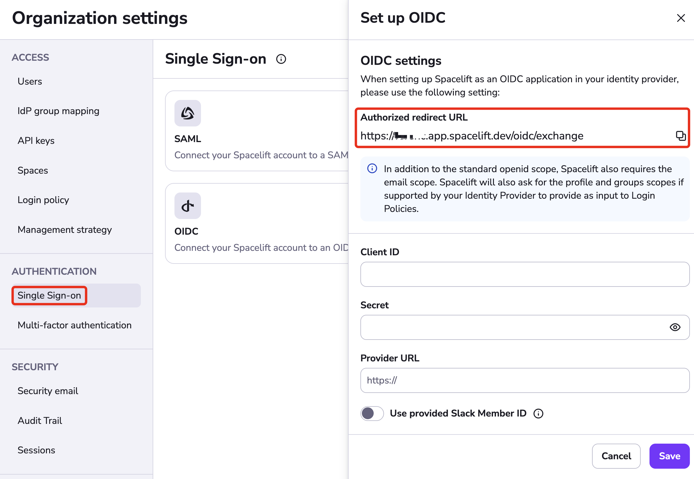
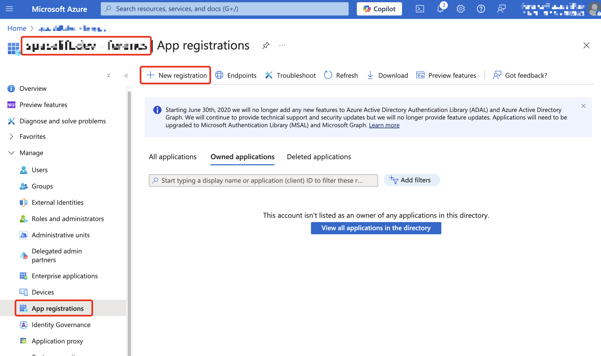
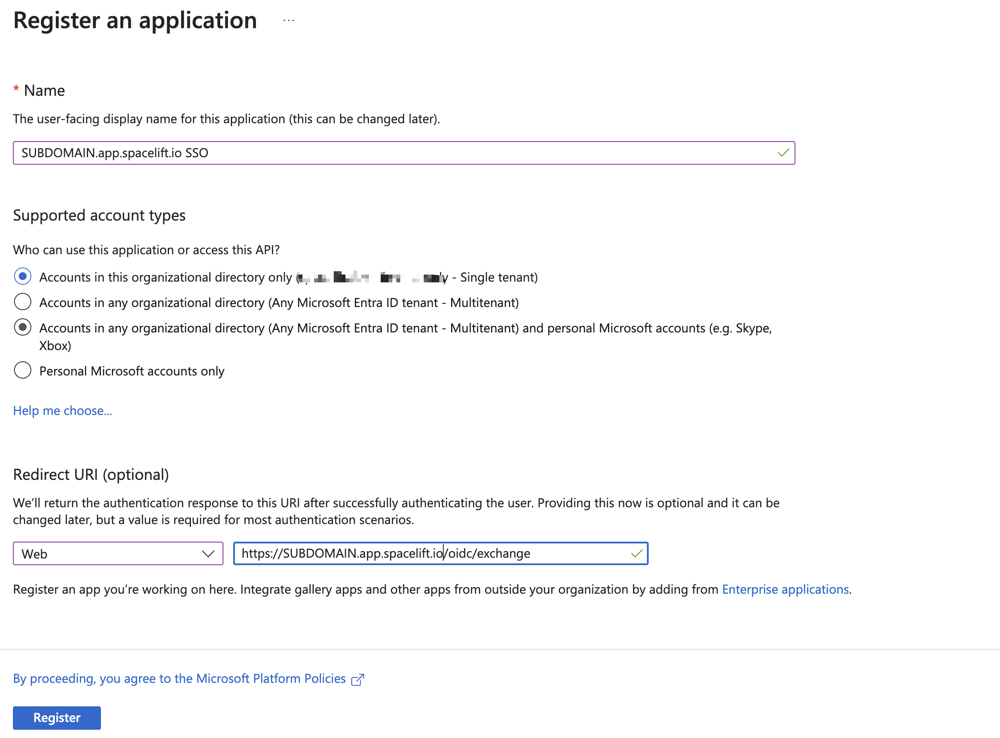
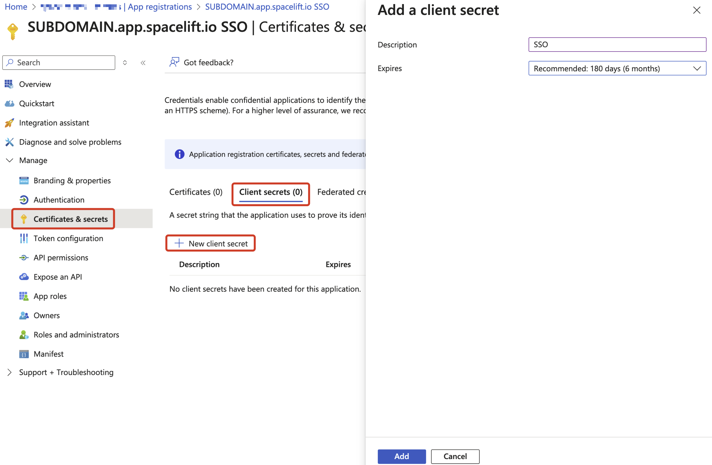
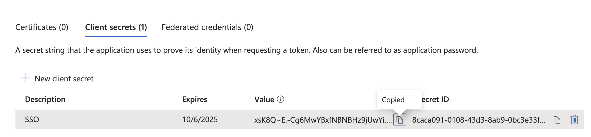
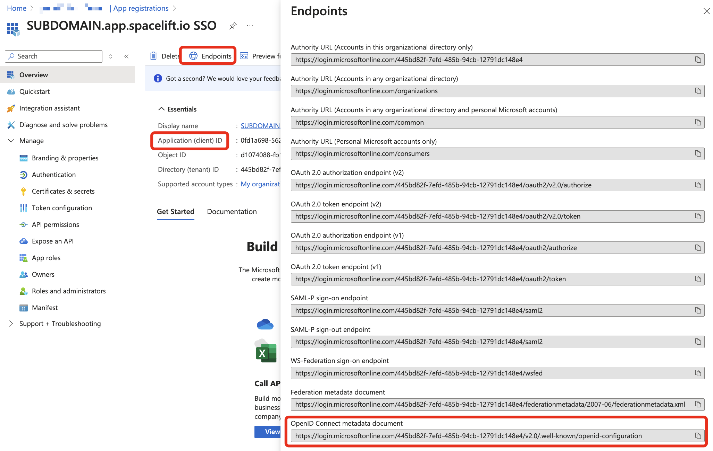
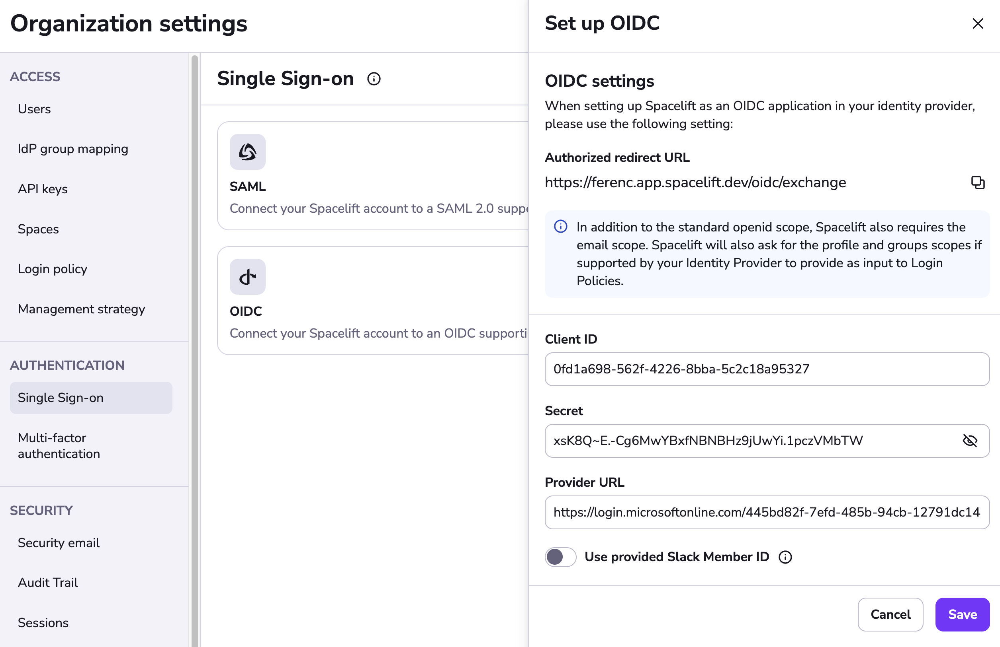
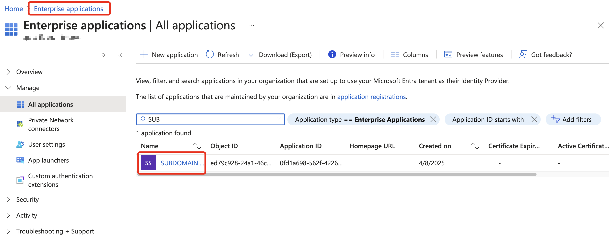
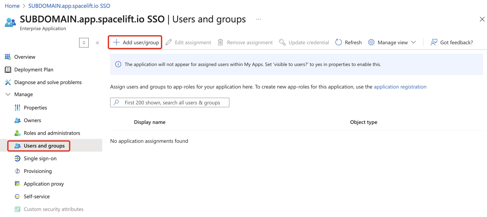

# Microsoft Entra ID OIDC Setup Guide

This guide provides step-by-step instructions to set up Single Sign-On (SSO) with Microsoft Entra ID (formerly Azure
Active Directory) for Spacelift. The process includes creating an app registration in Azure, configuring token claims,
and finalizing the setup within Spacelift.

!!! warning
    Before setting up SSO, it's recommended to create backup credentials for your Spacelift account. These can be used
    in case of SSO misconfiguration or for other break-glass procedures. You can find more details in the
    [Backup Credentials](./backup-credentials.md) section.

## Pre-requisites

- Spacelift account with admin permissions
- Azure account with permissions to create an "App registration" within Microsoft Entra ID

## Configure Account Settings

Open **Organization settings** for your Spacelift account.
You can find this panel at the bottom left by clicking the arrow next to your name.

## Setup OIDC

Select **Single Sign-On** under **Authorization**. Click **Set up** under the OIDC section.

The drawer that opens contains the **Authorized redirect URL**, which you will need to copy for your login provider.
The input fields will be filled later with information from your provider.

## Azure: Navigate to Microsoft Entra ID

In Microsoft Entra ID, make sure you are in the directory where you want to set up the application.
Select **App registrations** from the left side panel, then click **New registration**.

## Azure: Register the Application

The **application name** is for your reference only — pick something that fits your organization.
For **supported account types**, choose either single-tenant or multi-tenant, depending on your organization's setup.
Select "Web" as the type for the **redirect URL**, and paste the **Authorized redirect URL** you copied from Spacelift.

Click **Register**.

## Azure: Add UPN Claim

Under the newly created application, go to **Token configuration** and add the `upn` optional claim to the ID token.
Click the **Add** button and make sure the **Turn on the Microsoft Graph profile permission** checkbox is selected in
the popup.

## Azure: Add Groups Claim

This step is not strictly required, but you will likely want to send user group information to Spacelift.
This allows you to assign permissions to user groups in Spacelift using the **IdP Group Mapping** feature.
To enable this, add the `groups` optional claim to the ID token.
Most likely, you will want to choose **Security** or **Groups assigned to the application**.

!!! warning
    The number of groups in the ID token cannot exceed 200 (Azure limit related to HTTP header size).
    You may want to utilize **Application Groups** to avoid hitting the limit.
    That requires a paid Microsoft Entra ID plan and will be discussed later.

## Azure: Configure Application Credentials

Create a new **Client secret** and copy it into Spacelift's OIDC setup panel, within the **Secret** input.

!!! warning
    You will need to generate a new client secret before it expires.

!!! info
    Don't click Save in Spacelift just yet, we still need to get the Client ID and Provider URL for your application.

## Azure: Client ID and Provider URL

To complete your configuration, you need two more pieces of information.
You can find both in the application's **Overview** section.

- Copy the **Application (client) ID** into the **Client ID** field in Spacelift.
- Under **Endpoints**, copy the **OpenID Connect metadata document** URL into the **Provider URL** field.

Your Spacelift OIDC configuration should now look similar to the example below. Click **Save** to continue — this will
redirect you to perform the first login. If the login succeeds, SSO will become active.

If you selected **Application Groups** for the `groups` claim, consider completing the next optional section.
Otherwise, you are done.

## Azure: Assign Application Groups (optional)

If you are part of a large organization where users may belong to more than 200 groups, the group list will not fit
into the ID token. Fortunately, Microsoft Entra ID provides an option to assign ("bind") groups to an application.

If you previously configured the `groups` claim to include only assigned application groups, all that remains is to
complete the group assignment. The ID token will then contain only the intersection of the user's groups and the
application's assigned groups. This way, you have the option to send only relevant groups to Spacelift.

Go to the **Enterprise Applications** service in the Azure portal and find your application. From there, complete the
group assignment.

