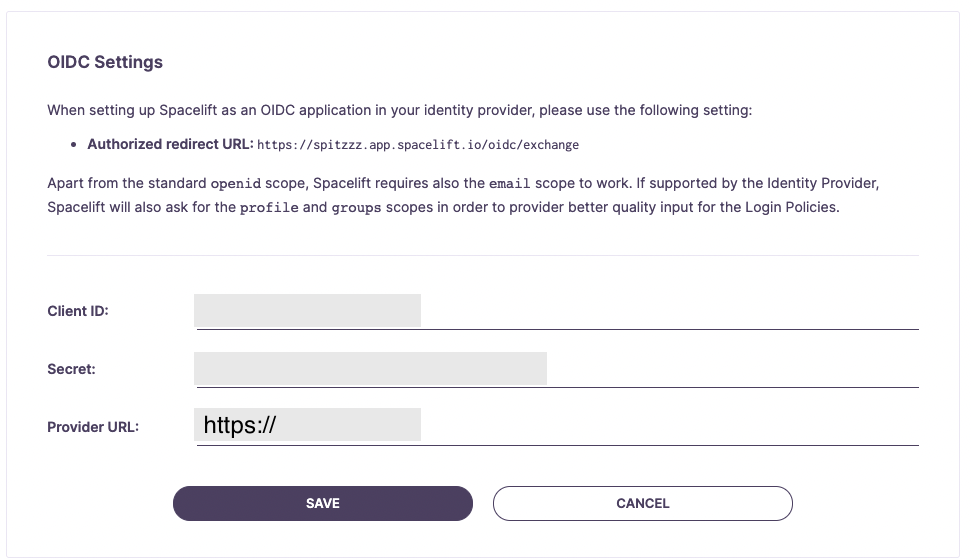

# OneLogin OIDC Setup Guide

If you'd like to set up the ability to sign in to your Spacelift account using an OIDC integration with OneLogin, you've come to the right place. This example will walk you through the steps to get this setup, and you'll have Single Sign-On running in no time!

!!! warning
    Before setting up SSO, it's recommended to create backup credentials for your Spacelift account for use in case of SSO misconfiguration, or for other break-glass procedures. You can find more about this in the [Backup Credentials](./backup-credentials.md) section.

## Pre-requisites

- Spacelift account, with access to admin permissions
- OneLogin account, with permission to create OneLogin Applications

!!! info
    Please note you'll need to be an admin on the Spacelift account to access the account settings to configure Single Sign-On.

## Configure Account Settings

You'll need to visit the Spacelift account settings page to set up this integration, from the navigation side bar menu, select "Settings."

.png)

## Setup OIDC

Next, you'll want to click the Set Up box underneath the "OIDC Settings" section. This will expand some configuration we will need to fill out in a few minutes, which we will be obtaining from OneLogin. For now **copy the authorized redirect URL** as we will need to provide OneLogin this URL when configuring our OneLogin application.

## OneLogin: Select Applications

In a new browser tab, open your OneLogin account and visit the **Administration** page. Select the **Applications** link from the navigation.

## OneLogin: Add Application

Click the **Add App** button.

Search for **OpenId Connect** and select the result as shown.

Give your new OneLogin App a name, Spacelift sounds like a good one.

In regards to "Visible in portal" this is a OneLogin configuration decision that's up to you. In this example, we are enabled this value.

In the app navigation, navigate to the **Configuration** section. Input your **Login URL** for example "https://AccountName.app.spacelift.io" Make sure to replace AccountName with your actual account name.

Next, paste the previously copied **authorized redirect URL** into the **Redirect URI's** input field. Once done, remember to click on the **Save** button.

In the app navigation, click on the **SSO** section. Now that we have the OneLogin App setup, we'll need to take the **Client ID**, **Client Secret**, and **Issuer URL**, to configure the Spacelift OIDC Settings

!!! info
    **Important:** You'll need to ensure your OneLogin user has access to the OneLogin App you just created, or else you will receive an unauthorized error when clicking save.

### OneLogin OIDC Setup Completed

That's it! OIDC integration with OneLogin should now be fully configured. Feel free to make any changes to your liking within your OneLogin App configuration.

You'll of course need to configure any users/groups within your OneLogin account to have access to this newly created app.
