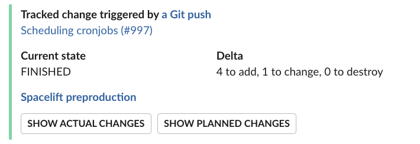
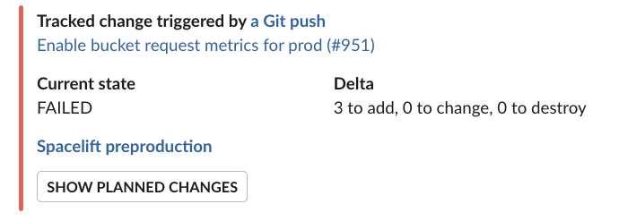
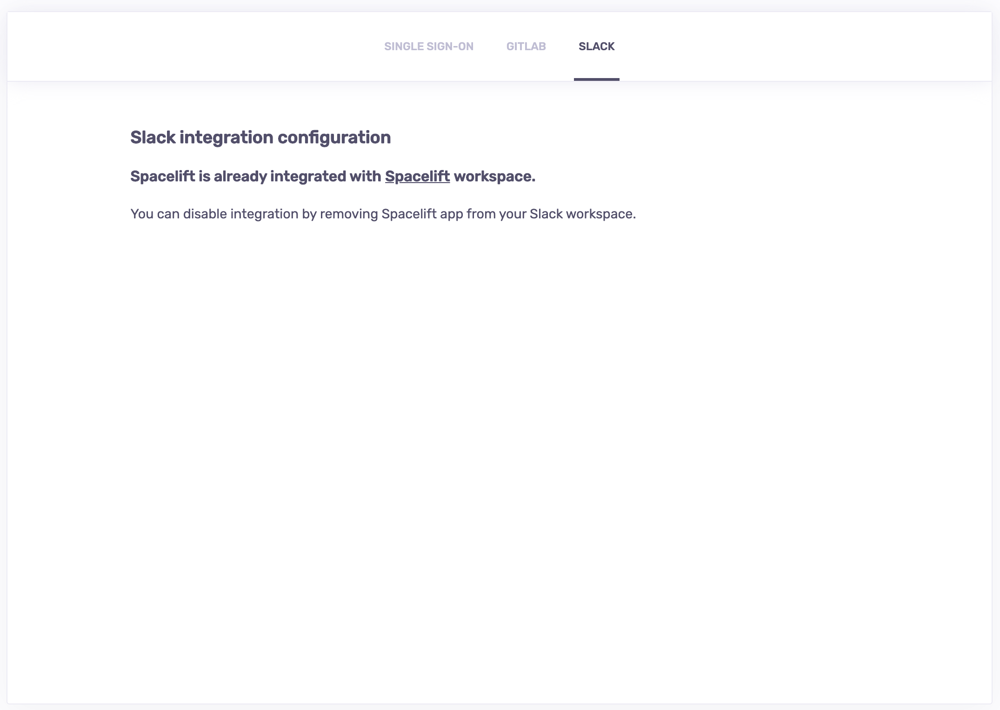
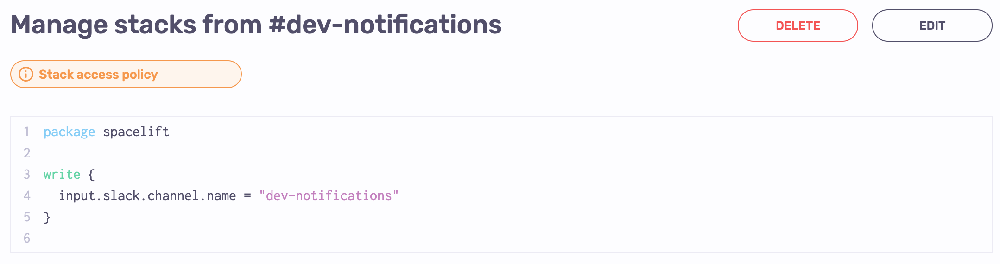

# Slack

At Spacelift, we're using Slack for internal communication. And we know that other tech companies do the same, so we've created a first-class integration that we ourselves enjoy using.

Here are examples of messages the Spacelift application sends to Slack;





## Linking your Spacelift account to the Slack workspace

As a Spacelift and Slack admin, you can link your Spacelift account to the Slack workspace by going to the _Slack_ section of the _Settings_ screen.

The integration is an OAuth2 exchange which installs Slack Spacelift app in your workspace.

Once you install the Spacelift app, the account-level integration is finished and the _Slack_ section of the _Settings_ screen informs you that the two are talking to one another:



Installing the Slack app doesn't automatically cause Spacelift to flood your Slack channels with torrents of notifications. These are set up on a per-stack basis using [Slack commands](slack.md#available-commands) and the management uses the Slack interface.

Though before that happens, you need to allow requests coming from Slack to access Spacelift stacks.

## Managing access to Stacks with policies

Similar to regular requests to our HTTP APIs, requests and actions coming from Slack are subject to the policy-based access validation. In this case, we're using [stack access policies](../concepts/policy/stack-access-policy.md). If you haven't had a chance to review the relevant documentation yet, please do it now before proceeding any further - you're risking a chance of getting lost.

!!! info
    The default stack access policy for Slack requests is to deny all access.

Unlike HTTP requests, policy inputs representing Slack interactions replace `"request"` and `"session"` sections with a single `"slack"` section, containing the following payload:

```json
{
  "command": "<string> - command received, if any",
  "user": {
    "id": "<string> - Slack user ID who generated the request",
    "deleted": "<bool> - is the user deleted",
    "display_name": "<string> - user display name",
    "has_2fa": "<bool> - does the user has 2FA enabled",
    "is_admin": "<bool> - is the user a workspace admin",
    "is_owner": "<bool> - is the user a workspace owner",
    "is_primary_owner": "<bool> - is the Slack user a workspace primary owner",
    "is_restricted": "<bool> - is this a guest user",
    "is_ultra_restricted": "<bool> - is this a single-channel guest",
    "is_stranger": "<bool> - does the belong to a different workspace",
    "real_name": "<string> - user real name",
    "tz": "<string> - user timezone",
    "enterprise": {
      "id": "<string> - Slack enterprise user ID, may be different from user.id",
      "enterprise_id": "<string> - unique ID for the Enterprise Grid organization this user belongs to",
      "enterprise_name": "<string> - display name for the Enterprise Grid organization",
      "is_admin": "<bool> - is the user user an Admin of the Enterprise Grid organization",
      "is_owner": "<bool> - is the user user an Owner of the Enterprise Grid organization",
      "teams": "<list<string> - an array of workspace IDs that are in the Enterprise Grid organization"
    }
  },
  "team": {
    "id": "<string> ID of the Slack team that generated the request",
    "name": "<string> Name of the Slack team"
  },
  "channel": {
    "id": "<string> ID of the Slack channel that generated the request",
    "name": "<string> Name of the Slack channel"
  }
}
```

!!! info
    For the most up-to-date explanation of Slack user intricacies, please always refer to [Slack's own documentation](https://api.slack.com/types/user){: rel="nofollow"}.

As you can see, that's quite a bit of data you can base your decisions on. For example, you can map some Slack channels as having certain level of access to certain Stacks - just make sure to keep these Slack channels private / invite-only. Here's an example stack access policy allowing Write level of access to requests coming from Slack's _#dev-notifications_ channel:



Any Stack with this policy attached will be accessible for writing from this Slack channel - but no other!

!!! info
    Note that different commands may have different required levels of access, so you can create a more granular policies - for example giving a `#devops` channel _Write_ access, while giving only _Read_ access to various "notifications" channels.

## Available slash commands

Three slash commands are currently available:

- `/spacelift subscribe $stackId` - subscribes a particular Slack channel to run state changes for a given Stack - requires ;
- `/spacelift unsubscribe $stackId` - unsubscribes a particular Slack channel from run state changes for a given Stack;
- `/spacelift trigger $stackId` - triggers a tracked run for the specified Stack;

## Available actions

Currently confirming and discarding tracked runs is available through the Slack interface. The ability to trigger those actions is subject to a [stack access policy](../concepts/policy/stack-access-policy.md) check with a _Write_ level on the user Slack info.
