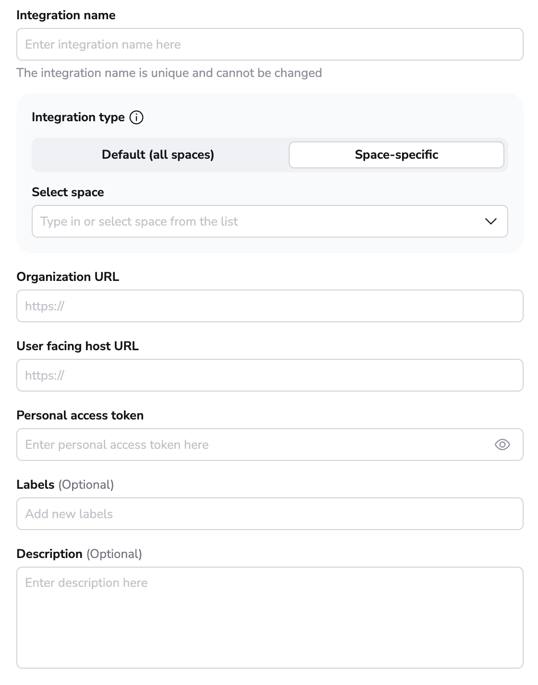
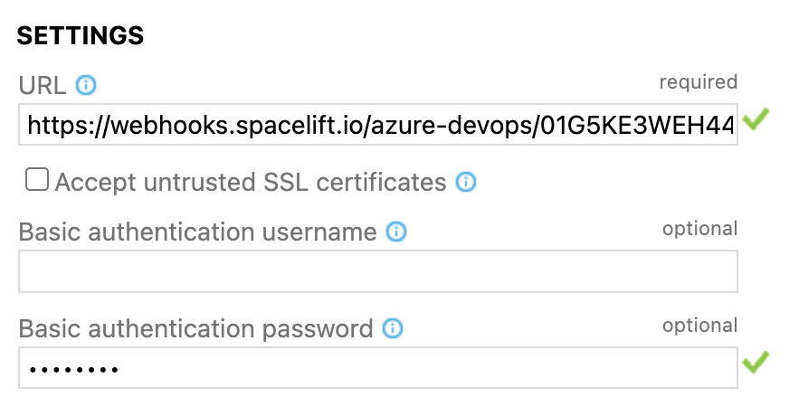

# Azure DevOps

Spacelift supports using Azure DevOps as the source of code for your [stacks](../../concepts/stack/README.md) and [modules](../../vendors/terraform/module-registry.md). You can set up multiple Space-level and one default Azure DevOps integration per account.

## Setting up the integration

In order to set up the integration from the Spacelift side, please navigate to the **Source code** page, click on the **Set up integration** button in the top right corner and choose Azure DevOps.

This form will appear:

  

Explanation of the fields:

- **Integration name** - the friendly name of the integration. The name cannot be changed after the integration is created. That is because the Spacelift webhook endpoints are generated based on the integration name.
- **Integration type** - either default or [Space](../../concepts/spaces/README.md)-specific. The default integration is available to **all** stacks and modules. There can be only one default integration per VCS provider. Space-level integrations however are only available to those stacks and modules that are in the same Space as the integration (or [inherit](../../concepts/spaces/access-control.md#inheritance) permissions through a parent Space). For example if your integration is in `ParentSpace` and your stack is in `ChildSpace` with inheritance enabled, you'll be able to attach the integration to that stack. Refer to the [Spaces documentation](../../concepts/spaces/access-control.md) to learn more about Space access controls and inheritance.
- **Organization URL** - the URL of your Azure DevOps organization. See [below](#finding-your-organization-url) for more details.
- **User facing host URL** - friendly URL of your Azure DevOps organization. This is the URL that will be displayed in the Spacelift UI. Typically, this is the same as the Organization URL unless you are using [VCS Agents](../../concepts/vcs-agent-pools.md): in that case, the **Organization URL** will look like `private://vcs-agent-pool-name/<azure-organization-name>`, but the **User facing host URL** can look more friendly (for example `https://vcs-agent-pool.mycompany.com/`) since it isn't actually being used by Spacelift.
- **Personal access token** - the [Personal access token](https://docs.microsoft.com/en-us/azure/devops/organizations/accounts/use-personal-access-tokens-to-authenticate){: rel="nofollow"} that Spacelift will use to access your Azure DevOps organization. See [below](#creating-a-personal-access-token) for more details.
- **Labels** - a set of labels to help you organize integrations.
- **Description** - a markdown-formatted free-form text field that can be used to describe the integration.

Let's collect these details.

### Finding your Organization URL

Now you'll have to fill in the Organization URL, which is the main URL of your Azure DevOps organization.

The Azure DevOps Organization URL usually has the following format:

- `https://dev.azure.com/{my-organization-name}`

Depending on when your Azure DevOps organization was created, it may use a different format, for example:

- `https://{my-organization-name}.visualstudio.com`

You can find out more about Azure DevOps URLs [here](https://docs.microsoft.com/en-us/azure/devops/release-notes/2018/sep-10-azure-devops-launch#administration){: rel="nofollow"}.

### Creating a Personal Access Token

In order to create a [Personal access token](https://docs.microsoft.com/en-us/azure/devops/organizations/accounts/use-personal-access-tokens-to-authenticate){: rel="nofollow"} you need to:

1\. Go to **User settings** -> **Personal access tokens** (in the top right section of the Azure DevOps page)

2\. On the **Personal Access Tokens** page click **+ New Token**

3\. Create a new personal access token. There, you will need to set the name of your token, expiration and scope. For Spacelift give it **Code** _(Source code, repositories, pull requests and notifications)_ **Read & write** access.

4\. Once the token is created, put it into the **Personal access token** field on the Spacelift Azure DevOps setup form.

### Creating the Integration

Once you have entered this data, the form will look like this:

  

If all the data is correct, click **Set up** in the bottom right corner.

### Configuring Webhooks

In order for Spacelift to be notified of any changes made in your repositories, you need to setup webhooks in Azure DevOps. You can find your **webhook endpoint** and **webhook secret** after clicking the 3 dots next to the integration name on the **Source code** page, and then clicking **See details**.

!!! note
    Space-level integrations will be listed to users with **read** access to the integration Space. Integration details however contain sensitive information (such as webhook secret) so they are only visible to those with **admin** access. On the other hand, default integrations are visible to all users of the account, but only **root** Space admins can see the details of them.

  

You'll need the **Webhook secret** and the **Webhook endpoint** in the next step.

For each Azure DevOps project you want to use with this integration, you now have to go into its **Project settings -> Service hooks -> Create subscription**. Within the services list choose **Web Hooks** and click **Next**.

You will need to create a Web Hooks Service Hook for the following events:

- Code pushed.
- Pull request created.
- Pull request merge attempted.
- Pull request updated.
- Pull request commented on.

Let's first create the **Code pushed** webhook.

Once on the **Trigger** page of _New Service Hooks Subscription_ window, select **Code pushed** in the _Trigger on this type of event_ dropdown and click **Next**.

After clicking **Next** you should see the Action page. Under the **Settings** section fill in the Spacelift **Webhook endpoint** URL. Leave _Basic authentication username_ empty and put the **Webhook secret** under _Basic authentication password_ and click **Finish**.

Once done you should see the list of configured Service Hooks. Repeat the same process for the others. Afterwards you should see the configured webhooks on the Service Hooks settings page.

 (1).png>)

## Using the Integration

When creating a Stack, you will now be able to choose the Azure DevOps provider and a repository inside of it:

  

### Using Spacelift checks to protect branches

You can use commit statuses to protect your branches tracked by Spacelift stacks by ensuring that _proposed_ runs succeed before merging their Pull Requests.

#### Aggregated checks

If you have multiple stacks tracking the same repository, you can enable the _Aggregate VCS checks_ feature in the integration's settings.
This will group all the checks from the same commit into a predefined set of checks, making it easier to see the overall status of the commit.

When the aggregated option is enabled, Spacelift will post the following checks:

- **spacelift/tracked** - groups all checks from tracked runs
- **spacelift/proposed** - groups all checks from proposed runs
- **spacelift/modules** - groups all checks from module runs

Here's how the summary looks like:

## Deleting the Integration

If you no longer need the integration, you can delete it by clicking the 3 dots next to the integration name on the **Source code page**, and then clicking **Delete**. You need **admin** access to the integration Space to be able to delete it.

  

!!! warning
    Please note that you can delete integrations **while stacks are still using them**. See the next section for more details.

### Consequences

When a stack has a detached integration, it will no longer be able to receive webhooks from Azure DevOps and you won't be able to trigger runs manually either.

You'll need to open the stack, go to the **Settings** tab and choose a new integration.

!!! tip
    You can save a little time if you create the new integration with the exact same name as the old one. This way, the webhook URL will remain the same and you won't have to update it in Azure DevOps. You will still need to update the webhook secret though.
