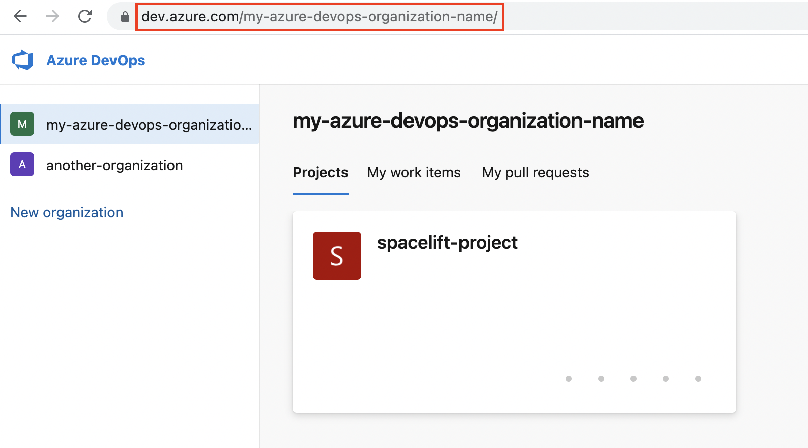

# Azure DevOps

Spacelift supports using Azure DevOps as the source of code for your [stacks](../../concepts/stack/README.md) and [modules](../../vendors/terraform/module-registry.md).

## Setting up the integration

In order to set up the integration from the Spacelift side, please navigate to the VCS providers section of the admin Settings page, find the Azure DevOps integration and click the _Set up_ button:

.png>)

This should open a form like this one:

.png>)

### Finding your Organization URL

Now you'll have to fill in the Organization URL, which is the main URL of your Azure DevOps organization.

!!! info
    The Azure DevOps Organization URL usually has the following format:

    * `https://dev.azure.com/{my-organization-name}`

    Depending on when your Azure DevOps organization was created, it may use a different format, for example:

    * `https://{my-organization-name}.visualstudio.com`

    You can find out more about Azure DevOps URLs [here](https://docs.microsoft.com/en-us/azure/devops/release-notes/2018/sep-10-azure-devops-launch#administration){: rel="nofollow"}.

### Creating a Personal Access Token

In order to create a [Personal access token](https://docs.microsoft.com/en-us/azure/devops/organizations/accounts/use-personal-access-tokens-to-authenticate){: rel="nofollow"} you need to:

1\. Go to **User settings** -> **Personal access tokens** (in the top right section of the Azure DevOps page)

2\. On the **Personal Access Tokens** page click **+ New Token**

3\. Create a new personal access token. There, you will need to set the name of your token, expiration and scope. For Spacelift give it **Code** _(Source code, repositories, pull requests and notifications)_ **Read & write** access.

4\. Once the token is created, put it into the **Personal access token** field on the Spacelift Azure DevOps setup form.

### Creating the Integration

After doing all this you should have all fields filled in.

If all the data is correct, after saving you should see two notifications in the bottom right part of Spacelift: _New integration was created;_ and _Connecting to Azure DevOps succeeded_.

### Configuring Webhooks

In order for Spacelift to be notified of any changes made in your Azure DevOps repos, you need to setup webhooks in Azure DevOps. You can find your **webhook endpoint** and **webhook password** under the Azure DevOps VCS integration section:

.png>)

For each Azure DevOps project you want to use with Spacelift, you now have to go into its **Project settings -> Service hooks -> Create subscription**. Within the services list choose **Webhook** and click **Next**.

We will need to create multiple integrations: **Code pushed,** **Pull request created, Pull request merge attempted** and **Pull request updated**. Let's first create **Code pushed** integration.

Once on the **Trigger** page of _New Service Hooks Subscription_ window, select **Code pushed** in the _Trigger on this type of event_ dropdown and click **Next**.

After clicking **Next** you should see the Action page. Under the **Settings** section fill in the Spacelift **Webhook endpoint** URL**.** Leave _Basic authentication username_ empty and put the **Webhook password** under _Basic authentication password_ and click **Finish**.

Once done you should see the list of configured Service Hooks. Repeat the same process for the others. Afterwards you should see the configured webhooks on the Service Hooks settings page.

 (1).png>)

## Using the Integration

When creating a Stack, you will now be able to choose the Azure DevOps provider and a repository inside of it:

.png>)

## Unlinking the Integration

If you no longer need the integration, you can remove it via the _Unlink_ button on the VCS settings page.

.png>)

Please also remember to remove any Spacelift webhooks from your repositories.
