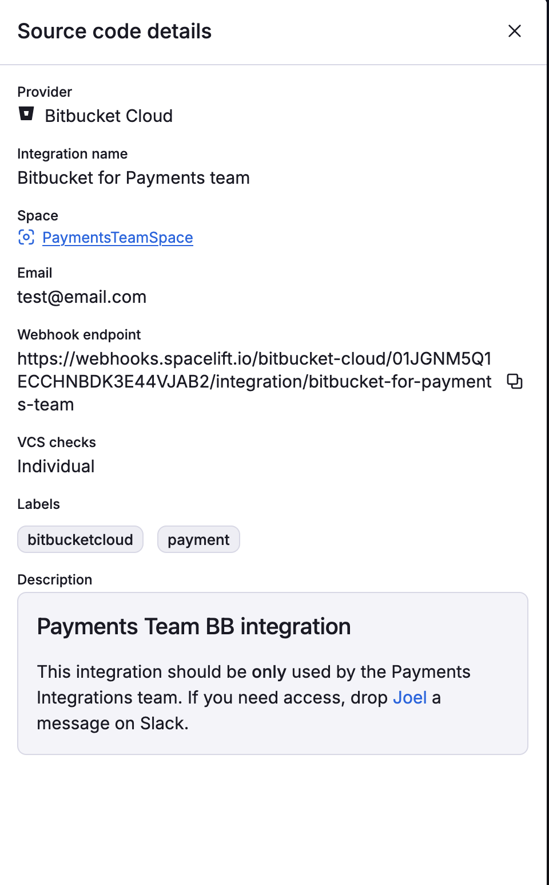

# Bitbucket Cloud

 Spacelift supports using Bitbucket Cloud as the source of code for your [stacks](../../concepts/stack/README.md) and [modules](../../vendors/terraform/module-registry.md). You can set up multiple Space-level and one default Bitbucket Cloud integration per account.

## Setting up the integration

In order to set up the integration from the Spacelift side, please navigate to the **Source code** page, click on the **Set up integration** button in the top right corner and choose Bitbucket Cloud.

This form will appear:

<p align="center">
  
</p>

Explanation of the fields:

- **Integration name** - the friendly name of the integration. The name cannot be changed after the integration is created. That is because the Spacelift webhook endpoints are generated based on the integration name.
- **Integration type** - either default or [Space](../../concepts/spaces/README.md)-specific. The default integration is available to **all** stacks and modules. There can be only one default integration per VCS provider. Space-level integrations however are only available to those stacks and modules that are in the same Space as the integration (or [inherit](../../concepts/spaces/access-control.md#inheritance) permissions through a parent Space). For example if your integration is in `ParentSpace` and your stack is in `ChildSpace` with inheritance enabled, you'll be able to attach the integration to that stack. Refer to the [Spaces documentation](../../concepts/spaces/access-control.md) to learn more about Space access controls and inheritance.
- **Email** - an email of your Bitbucket account.
- **API token** - API tokens are user-based access tokens for scripting tasks and integrating tools. You can find a little how-to below: [Creating an API Token](#creating-an-api-token).
- **Labels** - a set of labels to help you organize integrations.
- **Description** - a markdown-formatted free-form text field that can be used to describe the integration.

### Choosing the right Integration type

Space-level integrations will be listed to users with **read** access to the integration Space. Integration details however contain sensitive information so they are only visible to those with **admin** access. On the other hand, default integrations are visible to all users of the account, but only **root** Space admins can see the details of them. Visit the [Spaces](../../concepts/spaces/README.md) documentation to learn more about access controls.

### Creating an API Token

In order to get the API token you'll need to go to Bitbucket Cloud and navigate to **Atlassian account settings** -> **Security** -> **Create API token with scopes**. In the form, you will need to:

1. Choose a name for your API token
2. Set an expiration date
3. Select **Bitbucket** as the app

    

4. Select read permissions for:
    - Repository
    - Pull requests

    

This will generate an API token which you can put into the **API Token** field in the integration configuration.

### Finishing the setup

After doing all this you should have all fields filled in.

<p align="center">
  
</p>

Once you've finished saving the form, you can find your **webhook endpoint** after clicking the 3 dots next to the integration name on the **Source code** page, and then clicking **See details**.

<p align="center">
  
</p>

For each repository you want to use with Spacelift, you now have to go into its **Repository settings -> Webhooks -> Add webhook**, and configure the webhook accordingly, by activating the following events:

- Repository > Push
- Pull Request > Created
- Pull Request > Updated
- Pull Request > Approved
- Pull Request > Approval removed
- Pull Request > Merged
- Pull Request > Comment created

It should look something like the following:


The last step is to install the **Pull Request Commit Links** app to be able to use [this](https://developer.atlassian.com/bitbucket/api/2/reference/resource/repositories/%7Bworkspace%7D/%7Brepo_slug%7D/commit/%7Bcommit%7D/pullrequests){: rel="nofollow"} API. This is done automatically when you go to the commit's details and then click "Pull requests" link.


When creating a Stack, you will now be able to choose the Bitbucket Cloud provider and a repository inside of it:


### Troubleshooting

Getting a [401 error](https://confluence.atlassian.com/bitbucketserverkb/bitbucket-server-backup-client-401-unauthorized-779171351.html)? Use this to check the username and password:

```bash
curl -v -u your_username:some_app_password "https://api.bitbucket.org/2.0/workspaces/workspace_id"
```

And this to check if some repositories may not be showing up:

```bash
curl -s -u your_username:some_app_password "https://api.bitbucket.org/2.0/repositories" | jq
```

## Using Spacelift checks to protect branches

You can use commit statuses to protect your branches tracked by Spacelift stacks by ensuring that _proposed_ runs succeed before merging their Pull Requests.

### Aggregated checks


!!! info
    This feature is only available to Business plan and above. Please check out our [pricing page](https://spacelift.io/pricing){: rel="nofollow"} for more information.


If you have multiple stacks tracking the same repository, you can enable the _Aggregate VCS checks_ feature in the integration's settings.
This will group all the checks from the same commit into a predefined set of checks, making it easier to see the overall status of the commit.


When the aggregated option is enabled, Spacelift will post the following checks:

- **spacelift/tracked** - groups all checks from tracked runs
- **spacelift/proposed** - groups all checks from proposed runs
- **spacelift/modules** - groups all checks from module runs

Here's how the summary looks like:


## Deleting the Integration

If you no longer need the integration, you can delete it by clicking the 3 dots next to the integration name on the **Source code** page, and then clicking **Delete**. You need **admin** access to the integration Space to be able to delete it.

<p align="center">
  
</p>

!!! warning
    Please note that you can delete source code integrations while stacks are still using them. See the next section for more details.

### Consequences

When a stack has a detached integration, it will no longer be able to receive webhooks from Bitbucket and you won't be able to trigger runs manually either.

You'll need to open the stack, go to the **Settings** tab and choose a new integration.

!!! tip
    You can save a little time if you create the new integration with the exact same name as the old one. This way, the webhook URL will remain the same and you won't have to update it in Bitbucket.
