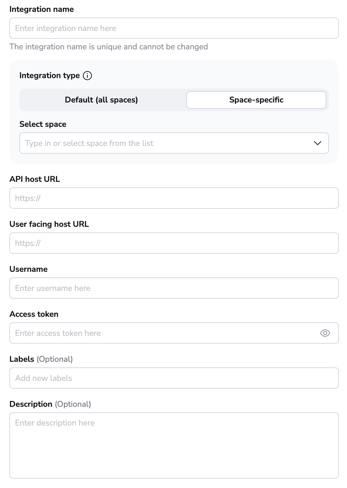
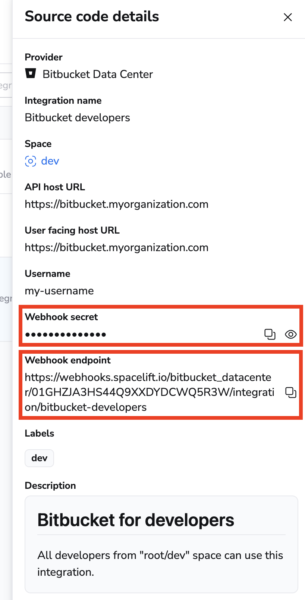

# Bitbucket Datacenter/Server

Spacelift supports using an on-premises Bitbucket installation as the source of code for your [stacks](../../concepts/stack/README.md) and [modules](../../vendors/terraform/module-registry.md). You can set up multiple Space-level and one default Bitbucket Data Center integration per account.

## Setting up the integration

### Creating the integration

In order to set up the integration from the Spacelift side, please navigate to the **Source code** page of Spacelift, click on the **Set up integration** button in the top right corner and choose Bitbucket Data Center

 

This should open a form like this one:

Explanation of the fields:

- **Integration name** - the friendly name of the integration. The name cannot be changed after the integration is created. That is because the Spacelift webhook endpoints are generated based on the integration name.
- **Integration type** - either default or [Space](../../concepts/spaces/README.md)-specific. The default integration is available to **all** stacks and modules. There can be only one default integration per VCS provider. Space-level integrations however are only available to those stacks and modules that are in the same Space as the integration (or [inherit](../../concepts/spaces/access-control.md#inheritance) permissions through a parent Space). For example if your integration is in `ParentSpace` and your stack is in `ChildSpace` with inheritance enabled, you'll be able to attach the integration to that stack. Refer to the [Spaces documentation](../../concepts/spaces/access-control.md) to learn more about Space access controls and inheritance.
- **API host URL** - the URL of your Bitbucket server.
- **User facing host URL** - friendly URL of your Bitbucket server. This is the URL that will be displayed in the Spacelift UI. Typically, this is the same as the API host URL unless you are using [VCS Agents](../../concepts/vcs-agent-pools.md): in that case, the **API host URL** will look like `private://vcs-agent-pool-name`, but the **User facing host URL** can look more friendly (for example `https://vcs-agent-pool.mycompany.com`) since it isn't actually being used by Spacelift.
- **Username** -  the user name that Spacelift will use to access your Bitbucket.
- **Access token** - the access token that Spacelift will use to access your Bitbucket. See [below](#creating-an-access-token) for more details.
- **Labels** - a set of labels to help you organize integrations.
- **Description** - a markdown-formatted free-form text field that can be used to describe the integration.

Let's collect these details.

### Creating an access token

In order to use the integration, you need a user account for Spacelift to use, and you need to generate an access token for that account. The user account requires the following access:

- _Read_ access to any projects Spacelift needs to be able to access.
- _Read_ access to the repositories within those projects that Spacelift should have access to.

Once you have a user account created, login as that user and go to **Manage account -> Personal access tokens -> create**. There, you will need to give your new access token a name and give it read access to repositories:

.png>)

This will give you an access token which you can put into the **Access token** field in the integration configuration.

.png>)

### Saving the integration

Once you have your access token, enter it into Spacelift. At this point all the fields should be filled out:

You can now save the integration.

### Configuring webhooks

In order for Spacelift to be notified of any changes made in your repositories, you need to setup webhooks in Bitbucket Data Center. You can find your **webhook endpoint** and **webhook secret** after clicking the 3 dots next to the integration name on the **Source code** page, and then clicking **See details**.

!!! note
    Space-level integrations will be listed to users with **read** access to the integration Space. Integration details however contain sensitive information (such as webhook secret) so they are only visible to those with **admin** access. On the other hand, default integrations are visible to all users of the account, but only **root** Space admins can see the details of them.

  

For each repository you want to use with Spacelift, you need to go into its **Repository settings -> Webhooks -> Create webhook**, and configure the webhooks accordingly, by activating the following events:

- Repository > Push
- Pull Request > Opened
- Pull Request > Source branch updated
- Pull Request > Modified
- Pull Request > Approved
- Pull Request > Unapproved
- Pull Request > Merged
- Pull Request > Comment added

It should look something like this:

!!! warning
    Don't forget to enter a secret when configuring your webhook. Bitbucket will allow you to create your webhook with no secret specified, but any webhook requests to Spacelift will fail without one configured.

## Using the integration

When creating a Stack, you will now be able to choose the Bitbucket Data Center provider and a repository inside of it:

## Deleting the Integration

If you no longer need the integration, you can delete it by clicking the 3 dots next to the integration name on the **Source code** page, and then clicking **Delete**. You need **admin** access to the integration Space to be able to delete it.

  

!!! warning
    Please note that you can delete integrations **while stacks are still using them**. See the next section for more details.

### Consequences

When a stack has a detached integration, it will no longer be able to receive webhooks from Bitbucket Data Center and you won't be able to trigger runs manually either.

  

You'll need to open the stack, go to the **Settings** tab and choose a new integration.

!!! tip
    You can save a little time if you create the new integration with the exact same name as the old one. This way, the webhook URL will remain the same and you won't have to update it in Bitbucket Data Center. You will still need to update the webhook secret though.
