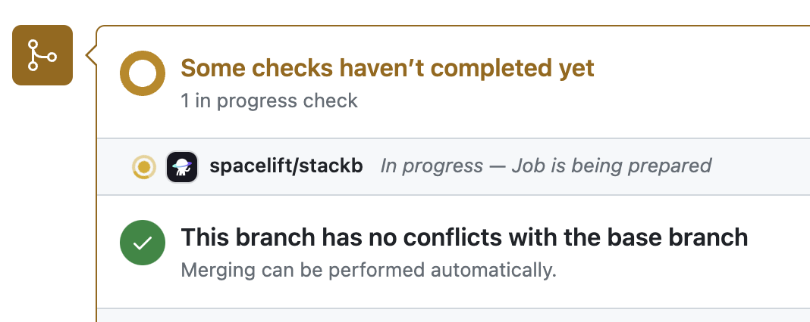

# GitHub

One of the things we're most proud of at Spacelift is the deep integration with everyone's favorite version control system - GitHub. This integration is typically setup automatically for users who have selected GitHub as their login source, but if you are logging into Spacelift using a different identity provider (e.g. Google, GitLab, or another SSO provider), and do not have GitHub configured as a VCS Provider, see the following section on [setting up the integration](github.md#setting-up-the-integration). This is also applicable for users who want to connect Spacelift to their GitHub Enterprise instance.

## Setting up the integration

In order to set up the integration from the Spacelift side, navigate to the VCS Providers section of the Account Settings page in your Spacelift account, then click the _Set up_ button next to the GitHub (custom App) option:


This should open a form like this one:


### Create a GitHub App

Before you can complete this step you need to create a GitHub App within GitHub. Start by navigating to the _GitHub Apps_ page in the _Developer Settings_ for your account/organization, and clicking on _New GitHub App._

You will need the Webhook endpoint and Webhook secret while creating your App, so take a note of them.

You can either create the App in an individual user account or within an organization account_:_

.png>)

Give your app a name and homepage URL (these are only used for informational purposes within GitHub):

.png>)

Enter your Webhook URL and secret:

.png>)

**Set the following Repository permissions:**

| Permission      | Access       |
| --------------- | ------------ |
| Checks          | Read & write |
| Contents        | Read-only    |
| Deployments     | Read & write |
| Metadata        | Read-only    |
| Pull requests   | Read & write |
| Webhooks        | Read & write |
| Commit statuses | Read & write |

**Set the following Organization permissions:**

| Permission | Access    |
| ---------- | --------- |
| Members    | Read-only |

**Subscribe to the following events:**

- Organization
- Pull request
- Push
- Repository

Finally, choose whether you want to allow the App to be installed on any account or only on the account it is being created in and click on _Create GitHub App:_

.png>)

Once your App has been created, make a note of the _App ID_ in the _About_ section:

.png>)

Now scroll down to the _Private keys_ section __ of the page and click on _Generate a private key:_

.png>)

This will download a file onto your machine containing the private key for your GitHub app. The file will be named `<app-name>.<date>.private-key.pem`, for example `spacelift.2021-05-11.private-key.pem`.

Now that your GitHub App has been created, go back to the integration configuration screen in Spacelift, and enter your _API host URL_ (the URL to your GitHub server), the _App ID_, and paste the contents of your private key file into the Private key box:

!!! info
    If you are using github.com set your API host URL as:  [https://api.github.com](https://api.github.com){: rel="nofollow"}


Click on the Save button to save your integration settings.

### Installing your GitHub App

Now that you've created a GitHub App and configured it in Spacelift, the last step is to install your App in one or more accounts in your GitHub account. To do this, go back to GitHub, find your App in the GitHub Apps page in your account settings, and click on the _Edit_ button next to it:

.png>)

Go to the _Install App_ section, and click on the _Install_ button next to the account your want Spacelift to access:

.png>)

Choose whether you want to allow Spacelift access to all the repositories in the account, or only certain ones:

.png>)

Congrats, you've just linked your GitHub account to Spacelift!

## Unlinking the Integration

If you no-longer need the integration, you can remove it via the _Unlink_ button on the VCS Providers page:


Please note that unlinking the integration in Spacelift will not remove the GitHub App or its permissions from within GitHub. You will need to do that yourself

## Using GitHub with stacks and modules

If your Spacelift account is integrated with GitHub, the stack or module creation and editing forms will show a dropdown from which you can choose the VCS provider to use. GitHub will always come first, assuming that you've integrated it with Spacelift for a good reason:


The rest of the process is exactly the same as with [creating a GitHub-backed stack](../../concepts/stack/creating-a-stack.md#integrate-vcs) or module, so we won't go into further details.

## Team-based access

In order to spare you the need to separately manage access to Spacelift, you can reuse GitHub's native teams. If you're using GitHub as your identity provider (which is the default), upon login, Spacelift uses GitHub API to determine organization membership level and team membership within an organization and persists it in the session token which is valid for one hour. Based on that you can set up [login policies](../../concepts/policy/login-policy.md) to determine who can log in to your Spacelift account, and [stack access policies](../../concepts/policy/stack-access-policy.md) that can grant an appropriate level of access to individual [Stacks](../../concepts/stack/).

!!! info
    The list of teams is empty for individual/private GitHub accounts.

## Notifications

### Commit status notifications

Commit status notifications are triggered for [_proposed_ runs](../../concepts/run/proposed.md) to provide feedback on the proposed changes to your stack - running a preview command (eg. `terraform plan` for Terraform) with the source code of a short-lived feature branch with the state and config of the stack that's pointing to another, long-lived branch. Here's what such a notification looks like:

...when the run is in progress ([initializing](../../concepts/run/#initializing)):



...when it succeeds _without changes_:

.png>)

...when it succeeds _with changes_:

.png>)

...and when it fails:

.png>)

In each case, clicking on the _Details_ link will take you to the GitHub check view showing more details about the run:

.png>)

The Check view provides high-level information about the changes introduced by the push, including the list of changing resources, including cost data if [Infracost](../../vendors/terraform/infracost.md) is set up.

From this view you can also perform two types of Spacelift actions:

- **Preview** - execute a [proposed run](../../concepts/run/proposed.md) against the tested commit;
- **Deploy** - execute a tracked run against the tested commit;

#### PR (Pre-merge) Deployments

The _Deploy_ functionality has been introduced in response to customers used to the Atlantis approach, where the deployment happens from within a Pull Request itself rather than on merge, which we see as the default and most typical workflow.

If you want to prevent users from deploying directly from GitHub, you can add a simple [push policy](../../concepts/policy/git-push-policy.md) to that effect, based on the fact that the run trigger always indicates GitHub as the source (the exact format is `github/$username`).

```opa
package spacelift

deny["Do not deploy from GitHub"] {
  input.spacelift.run.type == "TRACKED"
  startswith(input.spacelift.run.triggered_by, "github/")
}
```

The effect is as follows:


#### Using Spacelift checks to protect branches

You can use commit statuses to protect your branches tracked by Spacelift stacks by ensuring that _proposed_ runs succeed before merging their Pull Requests:

.png>)

This is is an important part of our proposed workflow - please refer to [this section](github.md#proposed-workflow) for more details.

### Deployment status notifications

[Deployments](https://developer.github.com/v3/guides/delivering-deployments/){: rel="nofollow"} and their associated statuses are created by tracked runs to indicate that changes are being made to the Terraform state. A GitHub deployment is created and marked as _Pending_ when the [planning](../../concepts/run/proposed.md#planning) phase detects changes and a [tracked run](../../concepts/run/tracked.md) either transitions to [Unconfirmed](../../concepts/run/tracked.md#unconfirmed) state or automatically starts [applying](../../concepts/run/tracked.md#applying) the diff:

.png>)

If the user does not like the proposed changes during the manual review and [discards](../../concepts/run/#discarded) the [tracked run](../../concepts/run/tracked.md), its associated GitHub deployment is immediately marked as a _Failure_. Same happens when the user [confirms](../../concepts/run/#confirmed) the [tracked run](../../concepts/run/tracked.md) but the [Applying](../../concepts/run/tracked.md#applying) phase fails:

.png>)

If the [Applying](../../concepts/run/tracked.md#applying) phase succeeds (fingers crossed!), the deployment is marked as _Active_:


The whole deployment history broken down by stack can be accessed from your repo's _Environments_ section - a previously obscure feature that's recently getting more and more love from GitHub:


That's what it looks like for our test repo, with just a singe stack pointing at it:

.png>)

!!! info
    The _Deployed_ links lead to their corresponding Spacelift [tracked runs](../../concepts/run/tracked.md).

## Pull Requests

In order to help you keep track of all the pending changes to your infrastructure, Spacelift also has a PRs tab that lists all the active Pull Request against your tracked branch. Each of the entries shows the current status of the change as determined by Spacelift, and a link to the most recent Run responsible for determining that status:


Note that this view is read-only - you can't change a Pull Request through here, but clicking on the name will take you to GitHub where you can make changes.

Once a Pull Request is closed, whether with or merging or without merging, it disappears from this list.

## Proposed workflow

In this section, we'd like to propose a workflow that has worked for us and many other DevOps professionals working with infrastructure-as-code. Its simplest version is based on a single stack tracking a long-lived branch like _main_, and short-lived feature branches temporarily captured in Pull Requests. A more sophisticated version can involve multiple stacks and a process like [GitFlow](https://datasift.github.io/gitflow/IntroducingGitFlow.html){: rel="nofollow"}.

!!! info
    These are mere suggestions and Spacelift will fit pretty much any Git workflow. If you find a different process or a distinct variation of one of the described approaches works better for you, please [let us know](https://forms.gle/eFEcsLr5gaiWxSE5A){: rel="nofollow"}.

### Single stack version

Let's say you have a single stack called _Infra_. Let's have it track the default `master` branch in the repository called... `infra`. Let's say you want to introduce some changes - define an S3 bucket, for example. What we suggest is opening a short-lived feature branch, making your change there, and opening a Pull Request from that branch to `master`.

At this point, a proposed run is triggered by the push notification, and the result of running `terraform plan` with the new code but existing state and config is reported to the Pull Request. First, we should ensure that the Pull Request does not get merged to master without a successful run, so we'd protect the branch by **requiring a successful status check** from your stack.

Second, we can decide whether we just need a tick from Spacelift, or we'd rather **require a manual review**. We generally believe that more eyes is always better, but sometimes that's not practicable. Still, it's possible to protect the tracked branch in a way that requires manual Pull Request approval before merging.

We're almost there, but let's also consider a scenario where our coworkers are also busy modifying the same stack. One way of preventing snafus as a team and get meaningful feedback from Spacelift is to **require that branches are up to date before merging**. If the current feature branch is behind the PR target branch, it needs to be rebased, which triggers a fresh Spacelift run that will ultimately produce the newest and most relevant commit status.

### Multi-stack version

One frequent type of setup involves two similar or even identical environments - for example, _staging_ and _production_. One approach would be to have them in a single repository but in different directories, setting [`project_root`](../../concepts/configuration/runtime-configuration/#project_root-setting) runtime configuration accordingly. This approach means changing the _staging_ directory a lot and using as much or as little duplication as necessary to keep things moving, and a lot of commits will necessarily be no-ops for the _production_ stack. This is a very flexible approach, and we generally like it, but it leaves Git history pretty messy and some people really don't like that.

If you're in that group, you can create two long-lived Git branches, each linked to a different stack - the default `staging` branch linked to the _staging_ stack, and a `production` branch linked to the _production_ stack. Most development thus occurs on the staging branch and once the code is perfected there over a few iterations, a Pull Request can be opened from the `staging` to `production` branch, incorporating all the changes. That's essentially how we've seen most teams implement [GitFlow](https://datasift.github.io/gitflow/IntroducingGitFlow.html){: rel="nofollow"}. This approach keeps the history of the `production` branch clear and allows plenty of experimentation in the `staging` branch.

With the above GitFlow-like setup, we propose protecting both `staging` and `production` branches in GitHub. To maximize flexibility, `staging` branch may require a green commit status from its associated stack but not necessarily a manual review. In the meantime, `production` branch should probably require both a manual approval and a green commit status from its associated stack.

## Webhook integrations

Below is the list of some of the GitHub webhooks we subscribe to with a brief explanation of what we do with those.

### Push events

Any time we receive a repository code push notification, we match it against Spacelift repositories and - if necessary - [create runs](../../concepts/run/#where-do-runs-come-from). We'll also _stop proposed runs_ that have been superseded by a newer commit on their branch.

### App installation created or deleted

When the Spacelift GitHub app is installed on an account, we create a corresponding Spacelift account. When the installation is deleted, we deleted the corresponding Spacelift account and all its data.

### Organization renamed

If a GitHub organization name is changed, we change the name of the corresponding account in Spacelift.

!!! warning
    This is only applicable for accounts that were created using GitHub originally.

### Pull Request events

Whenever a Pull Request is opened or reopened, we generate a record in our database to show it on the Stack's _PRs_ page. When it's closed, we delete that record. When it's synchronized (eg. new push) or renamed, we update the record accordingly. This way, what you see in Spacelift should be consistent with what you see in GitHub.

### Repository renamed

If a GitHub repository is renamed, we update its name in all the [stacks](../../concepts/stack/#repository-and-branch) pointing to it.
