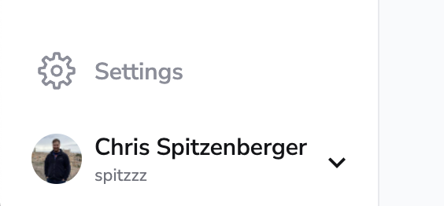
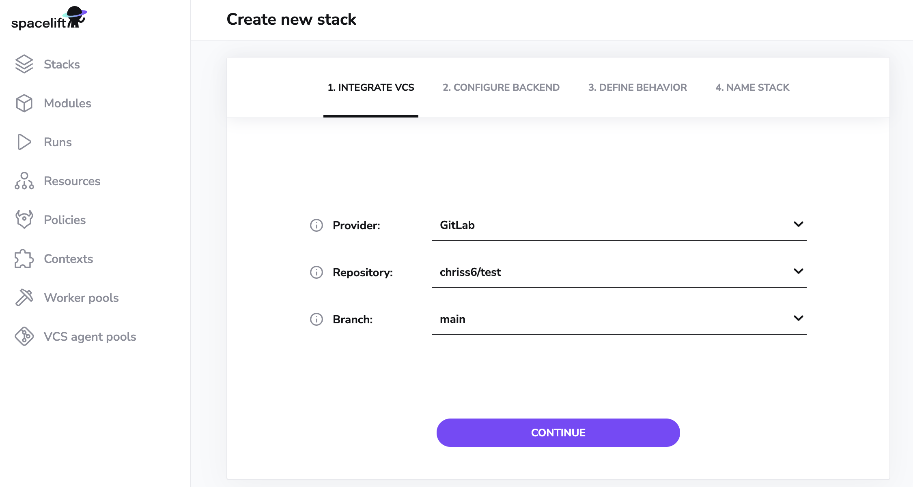
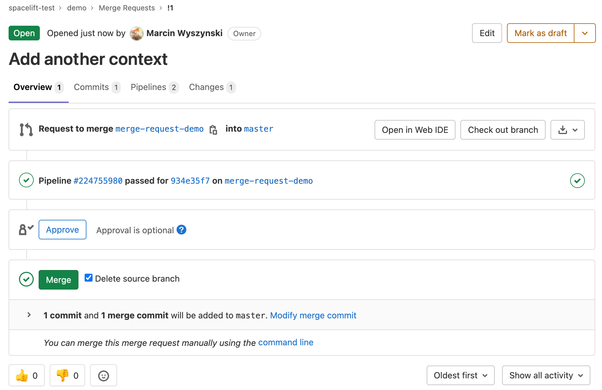
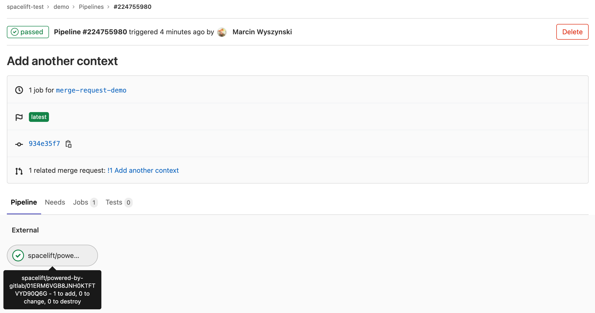
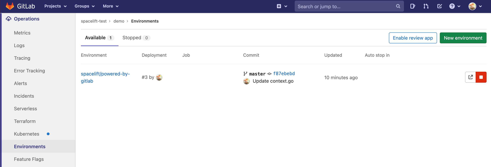
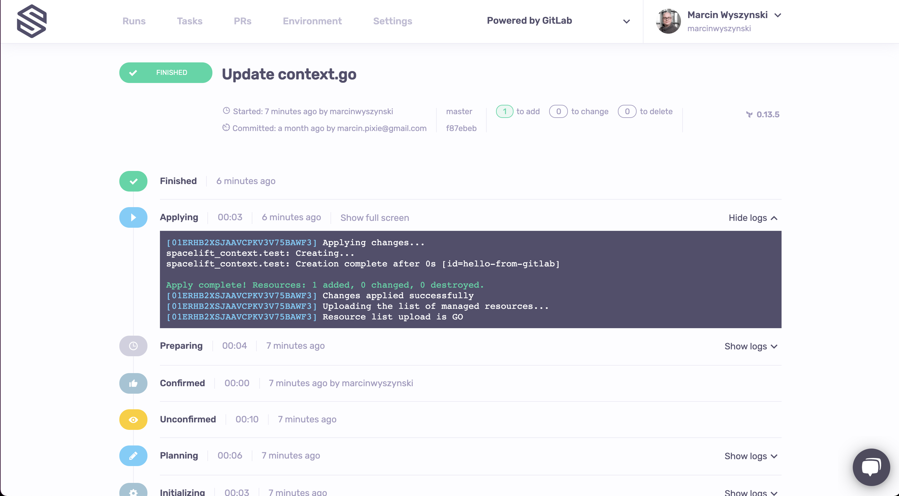

# GitLab

Spacelift supports using GitLab as the source of code for your [stacks](../../concepts/stack/README.md) and [modules](../../vendors/terraform/module-registry.md). While we support both managed (`gitlab.com`) and self-hosted GitLab installations just the same, only one GitLab server and its associated token can be used by a single Spacelift account.

## Setup Guide

In order to set up the GitLab integration from the Spacelift side, please navigate to the VCS Providers section of the Spacelift Account Settings page and click the _Set up_ button next to the GitLab:

 .png)

This should open a form like this one:

.png)

In this step you will need to provide the API host URL of your GitLab server, and an API token generated for Spacelift to communicate with the GitLab API. Let's assume we don't have token handy, so let's navigate to our GitLab server (we'll just use `gitlab.com`) to create one from the Access Tokens section of your User Settings page:

Please give the personal access token a descriptive name and grant it `api` scope. Note that while we will only **write** commit statuses, merge request comments and environment deployments, GitLab's permissions are coarse enough to require us to take _write_ on the whole thing.

!!! warning
    Please note, when creating tokens bound to a GitLab user, the user is required to have "Maintainer" level access to any projects you require Spacelift to be able to access.

Once you've created your personal API token, please pass it - along with the server API host - to the integration form in Spacelift and click the Save button:

.png>)

Congrats, you've just linked your GitLab account to Spacelift. You should be taken to the integration settings page where you can retrieve the webhook data - secret and endpoint - which you will need to [integrate Spacelift stacks with GitLab projects](gitlab.md#using-gitlab-with-stacks-and-modules). Don't worry, this data will be accessible again to Spacelift admins, so there's no need to persist it separately:

.png>)

!!! warning
    Unlike GitHub credentials which are specific to an organization rather than an individual, the GitLab integration uses personal credentials, which makes it more fragile in situations where an individual leaves the organization and deletes the access token.

    Thus, it may be a good idea to create "virtual" (machine) users in GitLab as a source of more stable credentials. Note however that this is a general concern, not one specific to Spacelift.

## Using GitLab with stacks and modules

If your Spacelift account is integrated with GitLab, the stack or module creation and editing forms will show a dropdown from which you can choose the VCS provider to use. GitLab will always come first, assuming that you've integrated it with Spacelift for a good reason:

The rest of the process is exactly the same as with [creating a GitHub-backed stack](../../concepts/stack/README.md#integrate-vcs) or module, so we won't be going into further details. An important thing though is that for every GitLab project that's being used by a Spacelift project (stack or module), you will need to set up a webhook to notify Spacelift about the project changes. That's where you will use the webhooks data from the previous step - the URL and webhook secret.

Spacelift is interested in pushes, tags and merge requests, so make sure you add triggers for all these types of events:

If that sounds like hassle (it sure does to us), you can do the same thing automatically using [GitLab's Terraform provider](https://registry.terraform.io/providers/gitlabhq/gitlab/latest/docs/resources/project_hook){: rel="nofollow"}.

!!! warning
    Note that you only need to set it up one hook for each repo used by Spacelift, regardless of how many stacks it is used by. Setting up multiple hooks for a single repo may lead to unintended behavior.

Regardless of whether you've created it manually or programmatically, once your project webhook is set up, your GitLab-powered stack or module is ready to use.

### Namespaces

When utilizing the Terraform provider to provision Spacelift Stacks for GitLab, you are required to specify a `namespace`.

The `namespace` value should be set to the the grouping mechanism that your project (repository) is within. For example, if you are simply referencing a project (repository) within your GitLab account, that is not within any group, then the namespace value should be set to your GitLab username.

If your project lives within a group, then the namespace should be set to the group slug that the project is within. For example, if you have `project-a` within `group-1` the namespace would be `group-1`. When using subgroups, you will also need to include these within your namespace references.

GitLab provides a [Namespaces API](https://docs.gitlab.com/ee/api/namespaces.html)which you can use to find information about your project's namespace. The `full_url` attribute value is what you'll want to reference as this namespace for a given project.

## Spacelift in GitLab

Spacelift provides feedback to GitLab in a number of ways.

### Commits and merge requests

When a webhook containing a push or tag event is received by Spacelift, it may trigger a [test run](../../concepts/run/README.md). Test runs provide feedback though GitLab's [pipeline](https://docs.gitlab.com/ee/ci/pipelines/){: rel="nofollow"} functionality. When viewed from a merge request, the pipeline looks like this:

You can see all the Spacelift jobs executed as part of this pipeline by clicking through to its dedicated view:

As you can see, the test job passed and gave some brief information about the proposed change - that - if applied - it would add a single resource.

Also, for every merge request affected by the commit there will be a comment showing the exact change:

.png>)

### Environments

Each Spacelift stack creates an [Environment](https://docs.gitlab.com/ee/ci/environments/){: rel="nofollow"} in GitLab where we report the status of each [tracked run](../../concepts/run/README.md):

For example, this successful run:

...is thus reflected in its respective GitLab environment:

.png>)

This functionality allows you to track Spacelift history directly from GitLab.
