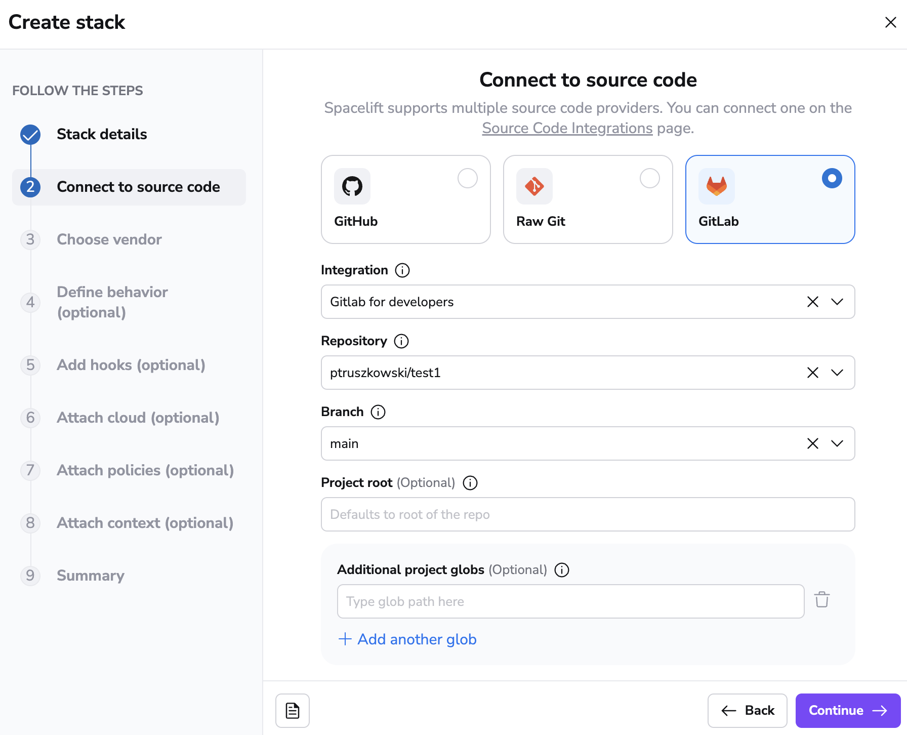

# GitLab

Spacelift supports using GitLab as the source of code for your [stacks](../../concepts/stack/README.md) and [modules](../../vendors/terraform/module-registry.md). You can set up multiple Space-level and one default GitLab integration per account. While we support both managed (`gitlab.com`) and self-hosted GitLab installations just the same.

## Setup Guide

In order to set up the GitLab integration from the Spacelift side, please navigate to the VCS management page of Spacelift, click on the **Set up integration** button in the top right corner and choose GitLab.

 

This should open a form like this one:

Explanation of the fields:

- **Integration name** - the friendly name of the integration. The name cannot be changed after the integration is created. That is because the Spacelift webhooks endpoints are generated based on the integration name.
- **Integration type** - either default or [Space](../../concepts/spaces/README.md)-specific. The default integration is available to **all** stacks and modules. There can be only one default integration per VCS provider. Space-level integrations however are only available to those stacks and modules that are in the same Space as the integration (or [inherit](../../concepts/spaces/access-control.md#inheritance) permissions from a parent Space). For example if your integration is in `ParentSpace` and your stack is in `ChildSpace` with inheritance enabled, you'll be able to attach the integration to that stack. Refer to the [Spaces documentation](../../concepts/spaces/access-control.md) to learn more about Space access controls and inheritance.
- **API host URL** - the URL of your GitLab server.
- **User facing host URL** - friendly URL of your GitLab server. This is the URL that will be displayed in the Spacelift UI. Typically, this is the same as the API host URL unless you are using [VCS Agents](../../concepts/vcs-agent-pools.md): in that case, the **API host URL** will look like `private://vcs-agent-pool-name`, but the **User facing host URL** can look more friendly (for example `https://vcs-agent-pool.mycompany.com`) since it isn't actually being used by Spacelift.
- **API token** - the access token that Spacelift will use to access your GitLab. See [below](#creating-an-access-token) for more details.
- **Labels** - a set of labels to help you organize integrations.
- **Description** - a markdown-formatted free-form text field that can be used to describe the integration.

Let's collect these details.

### Creating an Access Token

Let's assume we don't have token handy, so let's navigate to our GitLab server (we'll just use `gitlab.com`) to create one from the Access Tokens section of your User Settings page:

Please give the personal access token a descriptive name and grant it `api` scope. Note that while we will only **write** commit statuses, merge request comments and environment deployments, GitLab's permissions are coarse enough to require us to take _write_ on the whole thing.

!!! warning
    Please note, when creating tokens bound to a GitLab user, the user is required to have "Maintainer" level access to any projects you require Spacelift to be able to access.

### Enabling the Integration

Once you've created your personal API token, please pass it - along with the server API host - to the integration form in Spacelift and click the **Set up** button in the bottom right corner.

Congrats, you've just linked your GitLab account to Spacelift. You should be taken to the integration settings page where you can retrieve the webhook data - secret and endpoint - which you will need to [integrate Spacelift stacks with GitLab projects](gitlab.md#using-gitlab-with-stacks-and-modules). Don't worry, this data will be accessible again to Spacelift admins, so there's no need to persist it separately:

!!! warning
    Unlike GitHub credentials which are specific to an organization rather than an individual, the GitLab integration uses personal credentials, which makes it more fragile in situations where an individual leaves the organization and deletes the access token.

    Thus, it may be a good idea to create "virtual" (machine) users in GitLab as a source of more stable credentials. Note however that this is a general concern, not one specific to Spacelift.

## Using GitLab with stacks and modules

If your Spacelift account is integrated with GitLab, the stack or module creation and editing forms will show a dropdown from which you can choose the VCS integration to use. GitLab will always come first, assuming that you've integrated it with Spacelift for a good reason:

The rest of the process is exactly the same as with [creating a GitHub-backed stack](../../concepts/stack/creating-a-stack.md#integrate-vcs) or module, so we won't be going into further details.

### Setting up Webhooks

An important thing though is that for every GitLab project that's being used by a Spacelift project (stack or module), you will need to set up a webhook to notify Spacelift about the project changes. You can find yout **webhook endpoint** and **webhook secret** after clicking the 3 dots next to the integration name on the VCS providers page, and then clicking **See details**.

!!! note
    Space-level integrations will be listed to users with **read** access to the integration Space. Integration details however contain sensitive information (such as webhook secret) so they are only visible to those with **admin** access. On the other hand, default integrations are visible to all users of the account, but only **root** Space admins can see the details of them.

Spacelift is interested in pushes, tags and merge requests, so make sure you add triggers for all these types of events:

If that sounds like hassle (it sure does to us), you can do the same thing automatically using [GitLab's Terraform provider](https://registry.terraform.io/providers/gitlabhq/gitlab/latest/docs/resources/project_hook){: rel="nofollow"}.

!!! warning
    Note that you only need to set it up one hook for each repo used by Spacelift, regardless of how many stacks it is used by. Setting up multiple hooks for a single repo may lead to unintended behavior.

Regardless of whether you've created it manually or programmatically, once your project webhook is set up, your GitLab-powered stack or module is ready to use.

### Namespaces

When utilizing the Terraform provider to provision Spacelift Stacks for GitLab, you are required to specify a `namespace`.

The `namespace` value should be set to the the grouping mechanism that your project (repository) is within. For example, if you are simply referencing a project (repository) within your GitLab account, that is not within any group, then the namespace value should be set to your GitLab username.

If your project lives within a group, then the namespace should be set to the group slug that the project is within. For example, if you have `project-a` within `group-1` the namespace would be `group-1`. When using subgroups, you will also need to include these within your namespace references.

GitLab provides a [Namespaces API](https://docs.gitlab.com/ee/api/namespaces.html){: rel="nofollow"} which you can use to find information about your project's namespace. The `full_url` attribute value is what you'll want to reference as this namespace for a given project.

## Spacelift in GitLab

Spacelift provides feedback to GitLab in a number of ways.

### Commits and merge requests

When a webhook containing a push or tag event is received by Spacelift, it may trigger a [test run](../../concepts/run/README.md). Test runs provide feedback though GitLab's [pipeline](https://docs.gitlab.com/ee/ci/pipelines/){: rel="nofollow"} functionality. When viewed from a merge request, the pipeline looks like this:

You can see all the Spacelift jobs executed as part of this pipeline by clicking through to its dedicated view:

As you can see, the test job passed and gave some brief information about the proposed change - that - if applied - it would add a single resource.

Also, for every merge request affected by the commit there will be a comment showing the exact change:

### Environments

Each Spacelift stack creates an [Environment](https://docs.gitlab.com/ee/ci/environments/){: rel="nofollow"} in GitLab where we report the status of each [tracked run](../../concepts/run/README.md):

For example, this successful run:

...is thus reflected in its respective GitLab environment:

This functionality allows you to track Spacelift history directly from GitLab.

## Deleting the Integration

If you no longer need the integration, you can delete it by clicking the 3 dots next tozs the integration name on the VCS providers page, and then clicking **Delete**. You need **admin** access to the integration Space to be able to delete it.

!!! warning
    Please note that you can delete integrations **while stacks are still using them**. See the next section for more details.

### Consequences

When a stack has a detached integration, it will no longer be able to receive webhooks from GitLab and you won't be able to trigger runs manually either.

You'll need to open the stack, go to the **Settings** tab and choose a new integration.

!!! tip
    You can save a little time if you create the new integration with the exact same name as the old one. This way, the webhook URL will remain the same and you won't have to update it in GitLab. You will still need to update the webhook secret though.
