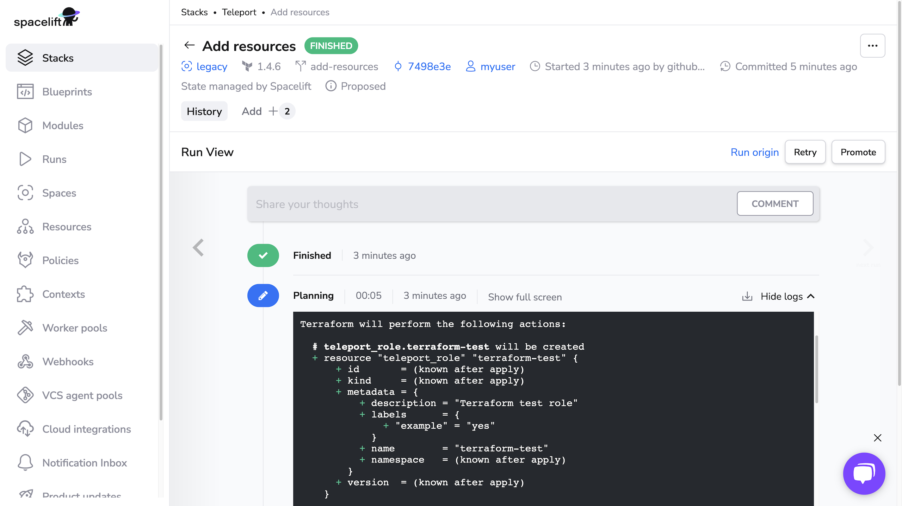
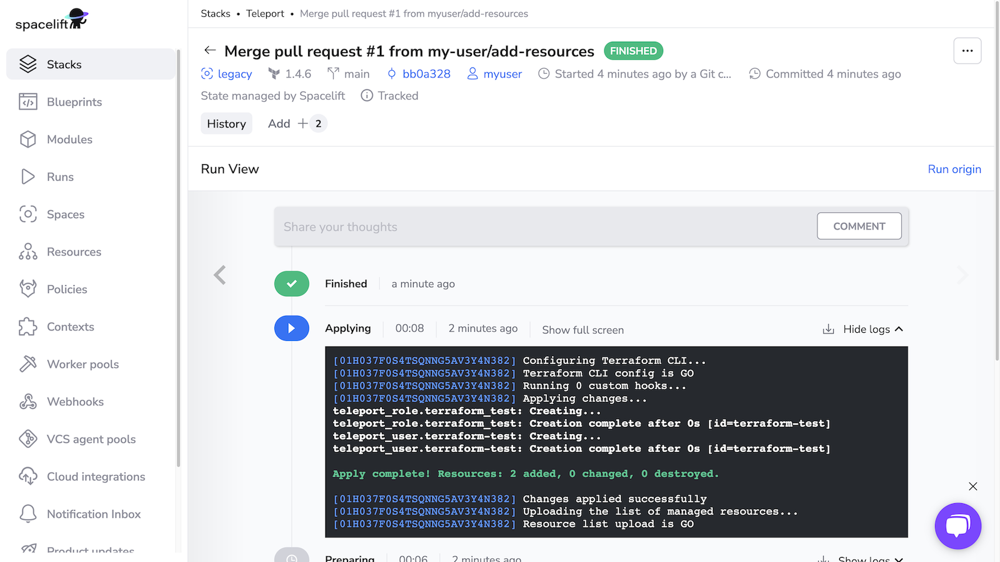

# Teleport

> Teleport is a global provider of modern access platforms for infrastructure, improving efficiency of engineering
teams, fortifying infrastructure against bad actors or error, and simplifying compliance and audit reporting. The
Teleport Access Platform delivers on-demand, least privileged access to infrastructure on a foundation of cryptographic
identity and zero trust, with built-in identity security and policy governance.

You can use Spacelift with the [Teleport](https://goteleport.com) Terraform provider to manage dynamic configuration
resources via GitOps and infrastructure as code. This gives you an audit trail of changes to your Teleport configuration
and a single source of truth for operators to examine.

This guide shows you how to use the Machine ID agent, `tbot`, to allow the
Teleport Terraform provider running in a Spacelift stack to configure your
Teleport cluster.

In this setup, `tbot` proves its identity to the Teleport Auth Service by
presenting an ID token signed by Spacelift. This allows `tbot` to authenticate
with the Teleport cluster without the need for a long-lived shared secret.

While following this guide, you will create a Teleport user and role with no
privileges in order to show you how to use Spacelift to create dynamic
resources.

## Prerequisites

- Access to an Enterprise edition of Teleport running in your environment.

- The Enterprise `tctl` admin tool and `tsh` client tool version >= 15.1.3.
  
    You can verify the tools you have installed by running the following commands:

    ```code
    $ tctl version
    # Teleport Enterprise v15.1.3 git:v15.1.3-0-gc9d69ba go1.21.8
    
    $ tsh version
    # Teleport v15.1.3 git:v15.1.3-0-gc9d69ba go1.21.8
    ```

    You can download these tools by following the appropriate [installation
    instructions](https://goteleport.com/docs/installation/) for your environment and Teleport edition.

- To check that you can connect to your Teleport cluster, sign in with `tsh login`, then
  verify that you can run `tctl` commands using your current credentials.
  `tctl` is supported on macOS and Linux machines.

    For example:

    ```code
    $ tsh login --proxy=name="teleport.example.com" --user=name="email@example.com"
    $ tctl status
    # Cluster  teleport.example.com
    # Version  15.1.3
    # CA pin   sha256:abdc1245efgh5678abdc1245efgh5678abdc1245efgh5678abdc1245efgh5678
    ```

    If you can connect to the cluster and run the `tctl status` command, you can use your
    current credentials to run subsequent `tctl` commands from your workstation.
    If you host your own Teleport cluster, you can also run `tctl` commands on the computer that
    hosts the Teleport Auth Service for full permissions.

- A GitHub repository where you will store your Terraform configuration and a
  Spacelift stack linked to this repository.
- A paid Spacelift account. This is required to use the `spacelift` join method.
- Your Teleport user should have the privileges to create token resources.

## Step 1/3. Create a join token for Spacelift

In order to allow your Spacelift stack to authenticate with your Teleport
cluster, you'll first need to create a join token. A join token sets out
criteria by which the Teleport Auth Service decides whether to allow a bot or
node to join a cluster.

In this example, you will create a join token that grants access to any
execution within a specific Spacelift stack.

Create a file named `bot-token.yaml`:

```yaml
kind: token
version: v2
metadata:
  name: example-bot
spec:
  # The Bot role indicates that this token grants access to a bot user, rather
  # than allowing a node to join. This role is built in to Teleport.
  roles: [Bot]
  join_method: spacelift
  # The bot_name indicates which bot user this token grants access to. This
  # should match the name of the bot that you will create in the next step.
  bot_name: example
  spacelift:
    # hostname should be the hostname of your Spacelift tenant.
    hostname: example.app.spacelift.io
    # allow specifies rules that control which Spacelift executions will be
    # granted access. Those not matching any allow rule will be denied.
    allow:
    # space_id identifies the space that the module or stack resides within.
    - space_id: root
      # caller_type is the type of caller_id. This must be `stack` or `module`.
      caller_type: stack
      # caller_id is the id of the caller. e.g the name of the stack or module.
      caller_id: my-stack
```

Replace:

- `example.app.spacelift.io` with the hostname of your Spacelift tenant.
- `my-stack` with the name of the Spacelift stack.
- `root` with the ID of the space that the stack resides within. The
  "space details" panel on the "Spaces" page of the Spacelift UI shows the ID.

Once the resource file has been written, create the token with `tctl`:

```shell
$ tctl create -f bot-token.yaml
# token "example-bot" has been created
```

Check that token `example-bot` has been created with the following
command:

```shell
$ tctl tokens ls
Token       Type Labels Expiry Time (UTC)
----------- ---- ------ ----------------------------------------------
example-bot Bot
```

## Step 2/3. Create a role and Machine ID bot

Create `example-bot-role.yaml`, which declares a Teleport role that we will
assign to the bot user for Spacelift. `tbot` generates short-lived credentials
that grant the user access to this role, allowing Spacelift to manage dynamic
Teleport resources using Terraform:

```yaml
kind: role
version: v5
metadata:
  name: example-bot
spec:
  allow:
    rules:
    - resources:
      - app
      - cluster_auth_preference
      - cluster_networking_config
      - db
      - device
      - github
      - login_rule
      - oidc
      - okta_import_rule
      - role
      - saml
      - session_recording_config
      - token
      - trusted_cluster
      - user
      verbs:
      - create
      - read
      - update
      - delete
      - list
  deny: {}
  options: {}
```

This role grants access to create, update, delete, and list a number of Teleport
resources. You may wish to remove resources that you do not intend to configure
with Terraform from this list to reduce blast radius. See the [Teleport Role
Reference](https://goteleport.com/docs/reference/access-controls/roles/#rbac-for-dynamic-teleport-resources)
for the dynamic resources you can grant access to in a Teleport role.

Create this role by applying the manifest:

```shell
$ tctl create -f example-bot-role.yaml
# role "example-bot" has been created
```

Create the bot, specifying the role and token that you have created:

```shell
$ tctl bots add example --roles=example-bot --token=example-bot
# bot "example" has been created
```

## Step 3/3. Configure your Spacelift stack

While following this step, you will modify your git repo to:

- Configure Spacelift to authenticate the Teleport Terraform provider as a bot
  user using credentials generated by Machine ID.
- Create dynamic Teleport resources using your git repo.

Before continuing, clone your GitHub repository. In the clone, check out a
branch from your main branch.

### Configure Spacelift to authenticate as a bot user

Now that the bot has been successfully created, you now need to configure your
Spacelift stack to authenticate as this bot using `tbot` and then configure
the Terraform provider to use the credentials produced by `tbot`.

To help with this, Teleport publishes a custom Spacelift container image. This
image is based on the default image provided by Spacelift but additionally
includes `tbot`.

Within the repository linked to your Spacelift stack, create
`.spacelift/config.yaml` to specify the `teleport-spacelift-runner` image and to
include a `before_init` step that invokes `tbot` to produce credentials:

```yaml
version: "1"
stack_defaults:
  runner_image: public.ecr.aws/gravitational/teleport-spacelift-runner:(=teleport.version=)
  before_init:
  - |-
    tbot start --oneshot \
      --data-dir=memory:// \
      --auth-server teleport.example.com:443 \
      --join-method spacelift \
      --token example-bot \
      --destination-dir=/mnt/workspace/tbot-output
```

Replace:

- `teleport.example.com:443` with the address of your Teleport cluster.
- `example-bot` with the name of the token you created in the first step.

#### Using multiple stacks in one repository?

If you have multiple Spacelift stacks within a single repository, you should
note that using `stack_defaults` will apply this configuration to all the
stacks within the repository.

To avoid this, you can use the `stacks` key instead of `stack_defaults` to
configure a specific stack. See the
[Spacelift Runtime configuration documentation](https://docs.spacelift.io/concepts/configuration/runtime-configuration/)
for more information.

### Declare configuration resources

Add the following to a file called `main.tf` to configure the Teleport Terraform
provider and declare two dynamic resources, a user and role:

```hcl
terraform {
  required_providers {
    teleport = {
      source  = "terraform.releases.teleport.dev/gravitational/teleport"
      version = ">= (=teleport.plugin.version=)"
    }
  }
}

provider "teleport" {
  addr               = "teleport.example.com:443"
  identity_file_path = "/mnt/workspace/tbot-output/identity"
}

resource "teleport_role" "terraform_test" {
  version = "v7"
  metadata = {
    name        = "terraform-test"
    description = "Terraform test role"
    labels = {
      test = "true"
    }
  }
}

resource "teleport_user" "terraform-test" {
  metadata = {
    name        = "terraform-test"
    description = "Terraform test user"

    labels = {
      test = "true"
    }
  }

  spec = {
    roles = [teleport_role.terraform_test.id]
  }
}
```

In the `provider` block, change `teleport.example.com:443` to the host and HTTPS
port of your Teleport Proxy Service.

Commit your changes and push the branch to GitHub, then open a pull request
against the `main` branch. (Do not merge it just yet.)

### Verify that the setup is working

In the Spacelift UI, navigate to your stack, then to **PRs**. Click the name of
the PR you opened.

You should see a Terraform plan that includes the user and role you defined
earlier:

!<p align="center">
  
</p>

When running `terraform plan`, Spacelift uses the identity file generated by
`tbot` to authenticate to Teleport.

Merge the PR, then navigate to your stack and click **Runs**. Click the status
of the first run, which corresponds to merging your PR, to visit the page for
the run. Click **Confirm** to begin applying your Terraform plan.

You should see output indicating success:

<p align="center">
  
</p>

Verify that Spacelift has created the new user and role by running the following
commands, which should return YAML data for each resource:

```code
$ tctl get roles/terraform-test
# ---
# kind: role
# metadata:
    name: terraform-test
# ...

$ tctl get users/terraform-test
# ---
# kind: user
# metadata:
    name: terraform-test
# ...
```
