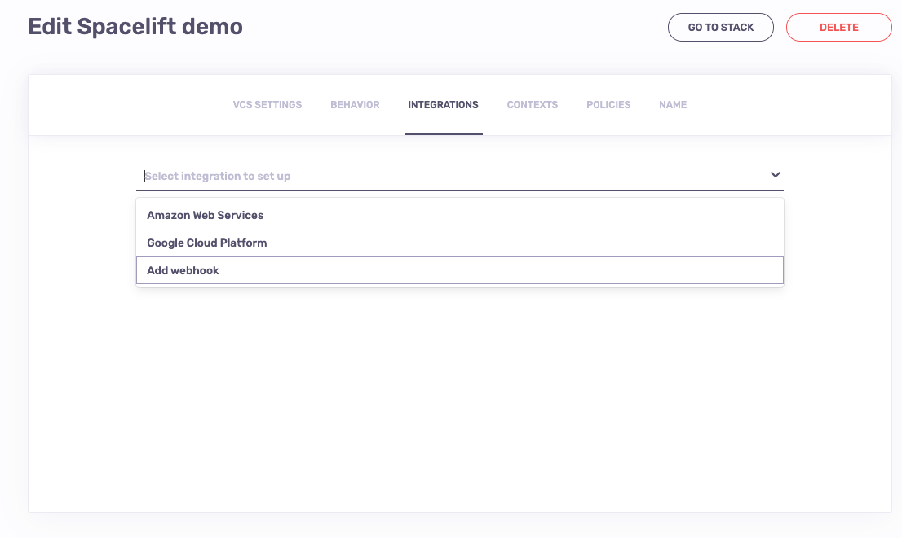
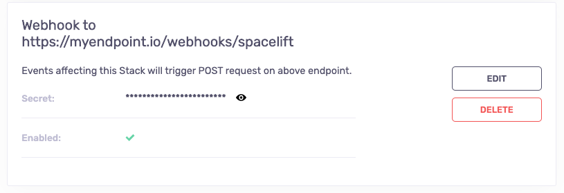

# Webhooks

Spacelift can optionally be set to send webhooks - POST requests about run state changes - to an HTTP endpoint of your choice.

## Setting up webhooks 

### TO BE ADDED...

## Interpreting webhook payload

#### Run events 

Here's an example of the default webhook payload for a notification about a manually triggered run having finished:

```json
{
    "account": "spacelift-io",
    "state": "FINISHED",
    "stateVersion": 4,
    "timestamp": 1596979684,
    "run": {
        "id": "01EF9PFPNFFM2MQXTJKHK1B869",
        "branch": "master",
        "commit": {
            "authorLogin": "marcinwyszynski",
            "authorName": "Marcin Wyszynski",
            "hash": "0ee3a3b7266daf5a1d44a193a0f48ce995fa75eb",
            "message": "Update demo.tf",
            "timestamp": 1596705932,
            "url": "https://github.com/spacelift-io/demo/commit/0ee3a3b7266daf5a1d44a193a0f48ce995fa75eb"
        },
        "createdAt": 1596979665,
        "delta": {
            "added": 0,
            "changed": 0,
            "deleted": 0,
            "resources": 1
        },
        "triggeredBy": "marcinw@spacelift.io",
        "type": "TRACKED"
    },
    "stack": {
        "id": "spacelift-demo",
        "name": "Spacelift demo",
        "description": "",
        "labels": []
    }
}
```

The payload consists of a few fields:

- `account` is the name (subdomain) of the account generating the webhook - useful in case you're pointing webhooks from various accounts at the same endpoint;
- `state` is a string representation of the run state at the time of the notification being triggered;
- `stateVersion` is the ordinal number of the state, which can be used to ensure that notifications that may be sent or received out-of-order are correctly processed;
- `timestamp` is the unix timestamp of the state transition;
- `run` contains information about the run, its associated commit and delta (if any);
- stack contains some basic information about the parent [Stack](../concepts/stack/README.md) of the `run`;

#### Internal error events 

```json
{
  "title":"Invalid Stack Slug Triggered",
  "body":"policy tried to trigger Stack 'this-is-not-a-stack' which either doesn't exist or this policy doesn't have access to",
  "error":"policy triggered for Stack that doesn't exist",
  "severity":"ERROR",
  "account":"spacelift-io"
}
```

Internal errors will always have the same fields set and some of them will be static for an event:

- `title` is the title (summary) of the error that happened.
- `body` is the is the full explation of what went wrong. 
- `error` is a static field for each error and should not change between errors of the same type. 
- `severity` can be one of three different constants: `INFO`, `WARNING`, `ERROR`.
- `account` is the account for which the error happened. 

## Validating payload

In order to validate the incoming payload, you will need to have the secret handy - the one you've generated yourself when creating or updating the webhook.

Every webhook payload comes with two signature headers generated from the combination of the secret and payload. `X-Signature` header contains the SHA1 hash of the payload, while `X-Signature-256` contains the SHA256 hash. We're using the exact same mechanism as GitHub to generate signatures, please refer to [this article](https://medium.com/@vampiire/how-to-verify-the-authenticity-of-a-github-apps-webhook-payload-8d63ccc81a24){: rel="nofollow"} for details.

## Attaching webhooks to stacks

!!! warning
    It's recomended to instead use the [notification policy](../concepts/policy/notification-policy.md) in order to
    consumer webhook data received from Spacelift.

Webhooks can be set up by Spacelift administrators on per-stack basis. In order to do that, navigate to the _Integrations_ section of the stack settings view. From the list of available integrations, select the _Add webhook_ option:



!!! info
    You can set up as many webhooks for a Stack as you need, though each one _must_ have a unique endpoint.

You will be presented with a simple setup form that requires you to provide and endpoint to which the payload is sent, and an _optional_ secret that you can use to [validate](webhooks.md#validating-payload) that the incoming requests are indeed coming from Spacelift:

.png>)

Please note that it's up to you to come up with a reasonably non-obvious secret.

Once saved, the webhook will appear on the list of integrations:



!!! info
    Unlike some other secrets in Spacelift, the webhook secret can be viewed by anyone with read access to the stack. If you suspect foul play, consider regenerating your secret.

### Enabling and disabling webhooks

By default webhooks are enabled which means that they are triggered every time there's a run state change event on the Stack they're attached to. If you want to temporarily disable some of the endpoints, you can do that without having to delete the whole integration.

To do that, just click on the Edit button on the desired webhook integration section:

.png>)

...and click on the Enabled toggle to see it going _gray_:

.png>)

Reversing this action is equally simple - just follow the same steps making sure that the toggle goes _green_:

.png>)
