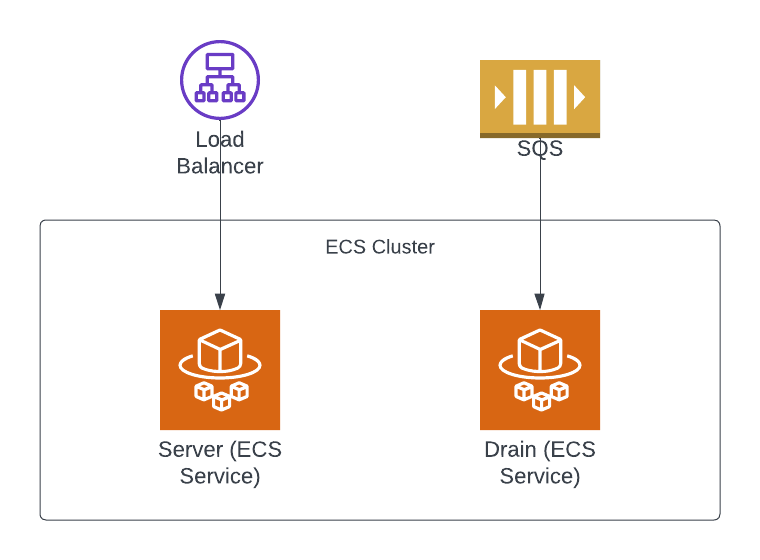
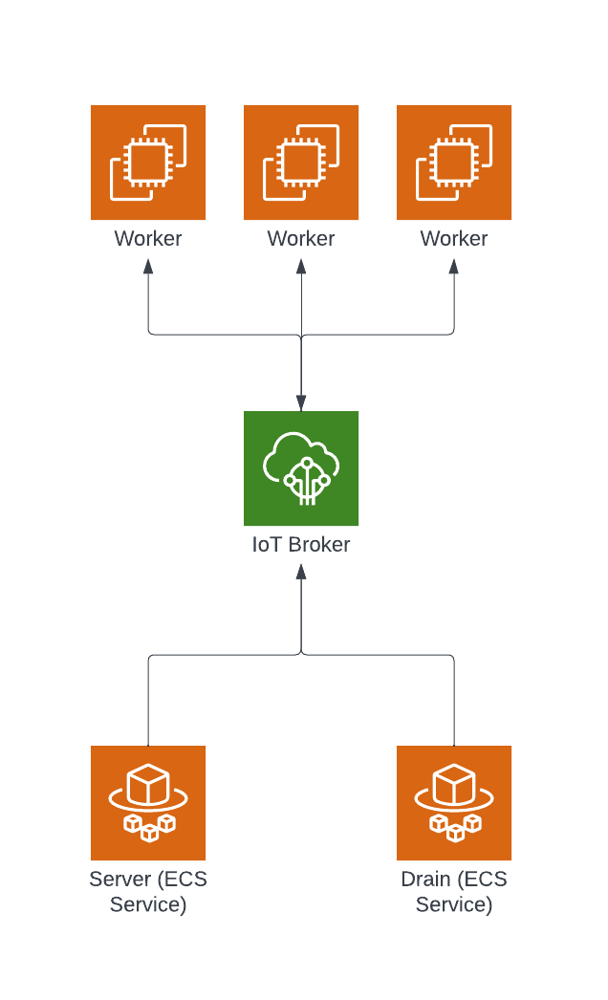
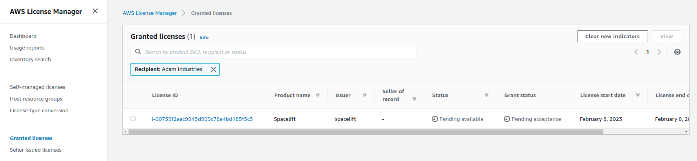
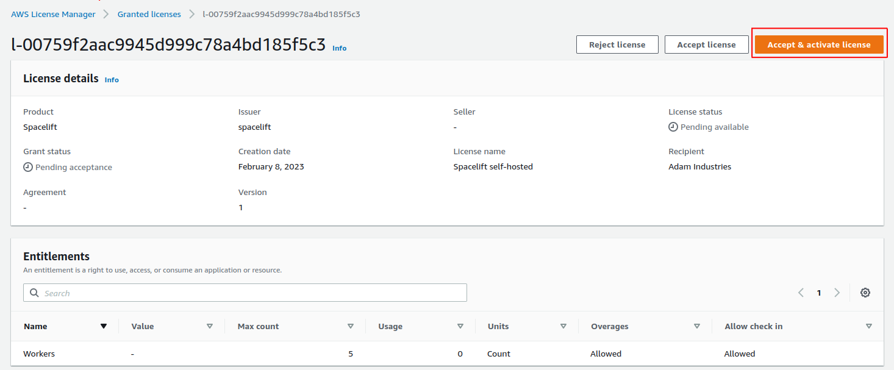
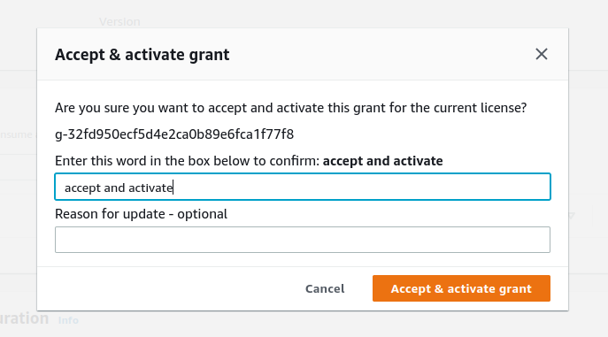
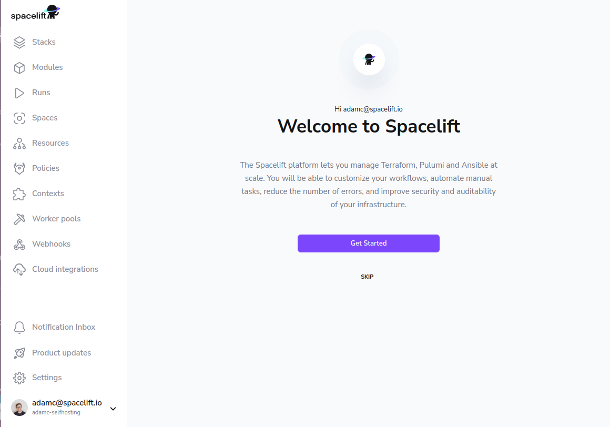

# Installation Guide

This guide contains instructions on installing a self-hosted copy of Spacelift in an AWS account you control.

## Pre-requisites

Before proceeding with the installation, you need to satisfy the following pre-requisites:

- You need access to an AWS account you wish to install Spacelift into.
- You need to choose a hostname that you wish to use for your Spacelift installation, for example `spacelift.example.com`. This needs to be on a domain that you control and can add DNS records to.
- You need to create an ACM certificate for your chosen domain in the same account that you want to install Spacelift in.

## Requirements

The installation process requires the following tools:

- A Mac or Linux machine to run the installation script from.
- A copy of the [AWS CLI v2](https://docs.aws.amazon.com/cli/latest/userguide/getting-started-install.html), configured to access the account you wish to install Spacelift into.
- [jq](https://stedolan.github.io/jq/) version 1.6.
- Standard unix utilities including bash, base64, cat, read, openssl.
- [Docker](https://www.docker.com/).

## Spacelift infrastructure

### Server and drain

The Spacelift infrastructure has two core parts: the server and the drain. The server is a web application that provides a GraphQL API that serves frontend and every HTTPS request in general. The drain is a worker that processes all asynchronous tasks such as VCS webhooks, run scheduling, worker handling, etc. The drain consumes messages from several SQS queues. The server serves requests through a load balancer.

As of today, both the server and the drain are ECS services running on Fargate. We have autoscaling set up for the server so ideally you don't need to worry about scaling it.



### Worker pool infrastructure

A worker pool is a group of workers that can be used to run workloads. During the startup the worker will attempt to connect to the regional AWS IoT Core broker endpoint and register itself. The drain and the server will then be able to communicate with the worker via AWS IoT Core, specifically via MQTT.



## Installation

This section explains the installation process for Spacelift. You may also be interested in the following pages that explain how to configure the Slack integration as well as advanced installations:

- [Slack integration setup](./slack-integration-setup.md) - explains how to configure the Slack integration for your Spacelift instance.
- [Advanced installations](./advanced-installations.md) - explains how to configure advanced options like providing a custom VPC configuration, or specifying HTTP proxy settings.

### AWS Requirements

Before you start the installation process, make sure the following requirements are met:

- The region that you wish to install self-hosting in has at least 3 EIPs available. The [default quota](https://docs.aws.amazon.com/AWSEC2/latest/UserGuide/elastic-ip-addresses-eip.html#using-instance-addressing-limit) per region in an AWS account only allows 5 EIPs to be created, so you may need to choose another region or ask for an increase. These EIPs are used as part of NAT Gateways to allow outbound traffic from Spacelift. If you want full control over your networking setup, please see [advanced installations](./advanced-installations.md).

### Accepting your License

When you sign up for self-hosting, a license will be issued to your AWS account via AWS License Manager. Before you can use your license, you need to accept it.

Navigate to AWS License Manager in your AWS Console, and go to _Granted licenses_:



**Note:** if this is your first time accessing License Manager, you may need to grant permissions to AWS before you can use it. If this is the case you will automatically be prompted to grant permission.

Click on your license ID, and then choose the _Accept & activate license_ option on the license page:



Follow the instructions on the popup that appears to activate your license:



That’s it - you’re now ready to proceed with the rest of the installation!

### Release Archive

Spacelift self-hosted is distributed as an archive containing everything needed to install Spacelift into your AWS account. The archive has the following structure:

- `config.json` - the configuration file containing all necessary configuration options. Some options come prepopulated with default values.
- `bin` - contains binaries including a copy of the launcher built for self-hosting.
- `cloudformation` - contains CloudFormation templates used to deploy Spacelift.
- `container-images` - contains container images for running the Spacelift backend as well as a launcher image.
- `install.sh` - the installation script.
- `uninstall.sh` - the uninstallation script.
- `scripts` - contains other scripts called by the installation script.
- `version` - contains the version number.

### Signature Validation

Along with the release archive, we also provide a SHA-256 checksum of the archive as well as a GPG signature. The fingerprint of our GPG key is `380BD7699053035B71D027B173EBA0CF3B3F4A46`, and you can import it using the following command:

```shell
gpg --recv-keys 380BD7699053035B71D027B173EBA0CF3B3F4A46
```

You can verify the integrity of the release archive using the following command:

```shell
sha256sum -c self-hosted-<version>.tar.gz_SHA256SUMS
```

And you can verify the authenticity using the following command:

```shell
gpg --verify self-hosted-<version>.tar.gz_SHA256SUMS.sig
```

### Extraction

First, extract the release artifacts and move to the extracted directory (replacing `<version>` with the version you are installing):

```shell
tar -zxf self-hosted-<version>.tar.gz
cd self-hosted-<version>
```

### Configuration

The included `config.json` file provides an easy way to provide additional and required configuration for the resources created during the deployment.

The mandatory fields are:

- `account_name` - the name of your Spacelift account. Note: the URL of your Spacelift installation doesn't neccessarily need to match this name but the account name affects the URL of the [module registry](https://docs.spacelift.io/vendors/terraform/module-registry.html).
- `aws_region` - the AWS region you wish to install Spacelift into.
- `load_balancer.certificate_arn` - the ARN of the ACM certificate you created in the pre-requisites.
- `spacelift_hostname` - the hostname you wish to use for your Spacelift installation without the protocol or trailing slash, for example `spacelift.mycorp.com`.
- `sso_config.admin_login` - the email address of the user you wish to use as the initial admin user for your Spacelift installation.
- `sso_config.sso_type` - the type of SSO you wish to use. Valid values are `OIDC` and `SAML`.
- `sso_config.oidc_args` - if `sso_type` is `OIDC`, all fields are mandatory:
    - `client_id` - the OIDC client ID.
    - `client_credentials` - the OIDC client secret.
    - `identity_provider_host` - the OIDC identity provider host with protocol. Example: `"https://mycorp.okta.com"`.
- `sso_config.saml_args` - if `sso_type` is `SAML`, `dynamic` and `metadata` fields are mandatory:
    - `dynamic` - `true` or `false`. if `true` then `metadata` must be a URL to the SAML IDP metadata. If `false` then `metadata` must be the SAML IDP metadata.
    - `metadata` - either the full SAML IDP metadata or the URL to the SAML IDP metadata.
    - `name_id_format` - [SAML name identifier format](https://docs.spacelift.io/integrations/single-sign-on/#nameid-format), can be left empty. Valid values are `TRANSIENT`, `EMAIL_ADDRESS` or `PERMANENT`. Defaults to `TRANSIENT`.

**NOTE:** we recommend that you store your config.json file so that you can reuse it when upgrading to newer Spacelift versions.

#### Optional configuration options

##### Load balancer

Load balancer configuration has a mix of required and optional fields alongside some which
should already be prefilled. The object itself looks like this:

```json
"load_balancer": {
    "certificate_arn": "",
    "scheme": "internet-facing",
    "ssl_policy": "ELBSecurityPolicy-TLS-1-2-2017-01",
    "tag": {
        "key": "",
        "value": ""
    }
}
```

The prefilled fields are valid defaults and can be left unchanged, while the `certificate_arn` field is required and must be set, and the `tag` object is optional and can be used to set a custom tag against the load balancer resource.

The `scheme` can be either `internet-facing` or `internal` and defaults to `internet-facing`: internal load balancers can only route requests from clients with access to the VPC for the load balancer, while internet-facing load balancers can route requests from clients over the internet.

`ssl_policy` is the name of the security policy that defines ciphers and protocols. The default value is `ELBSecurityPolicy-TLS-1-2-2017-01` which is the most recent security policy that supports TLS 1.2. For more information, see [Security policies](https://docs.aws.amazon.com/elasticloadbalancing/latest/application/create-https-listener.html#describe-ssl-policies).

##### Database

You can configure the following options for the Spacelift Postgres database:

- `database.delete_protection_enabled` - whether to enable deletion protection for the database (defaults to `true`). Note: `uninstall.sh` script will disable this option before deleting the database.
- `database.instance_class` - the instance class of the database (defaults to `db.t4g.large`).

##### Monitoring & Alerting

As part of the self-hosting installation, we deploy a monitoring dashboard to help you monitor the health of your Spacelift installation. It is accessible via the CloudWatch UI.

Additionally, we can also create a few preconfigured alerts for you. You can configure the following options for the CloudWatch alarms:

```json
"alerting": {
    "sns_topic_arn": ""
}
```

If an SNS topic ARN is configured, we'll create an SNS subscription for each alarm. If left empty, we won't create any alarms, only the monitoring dashboard.

Important! Your SNS topic's [access policy](https://docs.aws.amazon.com/sns/latest/dg/sns-access-policy-use-cases.html) must allow the `cloudwatch.amazonaws.com` service principal to publish to the topic. An example access policy:

```json
{
  "Sid": "Allow_Publish_Alarms",
  "Effect": "Allow",
  "Principal": {
    "Service": "cloudwatch.amazonaws.com"
  },
  "Action": "sns:Publish",
  "Resource": "<sns-topic-arn>"
}
```

##### Global tags

You can add additional tags to all the resources created by the installer by adding
your desired tags to the `global_resources_tags` array in the _config.json_:

```json
"global_resource_tags": [
    {
        "key": "selfhost",
        "value": "spacelift"
    }
]
```

#### Identity Provider

##### URLs

You may need certain URLs when configuring an application in your identity provider. For SAML, use the following URLs:

- Single Sign-On URL: `https://<spacelift-hostname>/saml/acs`
- Entity ID (audience): `https://<spacelift-hostname>/saml/metadata`

For OIDC, use the following URL:

- Authorized redirect URL: `https://<spacelift-hostname>/oidc/exchange`

**NOTE:** please make sure to substitute `<spacelift-hostname>` with the hostname you plan to use for your Spacelift install.

##### SAML Metadata

If you are using non-dynamic SAML metadata rather than using a dynamic metadata URL, you need to ensure that the metadata provided is a valid JSON-escaped string. One way to do this is to use `jq` to escape your metadata. For example, if your metadata was contained in a file called _metadata.xml_, you could run the following command:

```shell
cat metadata.xml| jq -R -s '.'
```

You would then enter the escaped string into your _config.json_ file:

```json
"saml_args": {
    "metadata": "<?xml version=\"1.0\" encoding=\"utf-8\"?><EntityDescriptor ID=\"_90756ab2...",
    "dynamic": false,
    "name_id_format": "EMAIL_ADDRESS"
}
```

### Running the installer

This section covers simple installations using a Spacelift-created VPC and a public facing HTTP load balancer. For information about using an existing VPC please see [advanced installations](./advanced-installations.md).

To run the installer, pass in the path of the configuration file:

```shell
./install.sh [-c "<configuration file>"]
```

The `-c` flag is optional, it defaults to `config.json` if not specified.

When the installer starts, it will check it can connect to your AWS account, and will ask for confirmation to continue. Please check the AWS account ID is correct, and if so enter `yes`:

```shell
./install.sh
[2023-01-24T12:17:52+0000] INFO: installing version v0.0.6 of Spacelift into AWS account 123456789012

Are you sure you want to continue? Only 'yes' will be accepted: yes
```

Please note, the installation process can take between 10 and 20 minutes to create all of the required infrastructure for Spacelift.

#### Troubleshooting

If you see the following error message indicating that the account could not be found, please check the credentials for your AWS CLI are correctly configured:

```shell
ERROR: could not find AWS account ID. Cannot continue with Spacelift install.
```

This error message can also be displayed if your AWS credentials are connected to a GovCloud account but a non-GovCloud region has been specified in the `aws_region` configuration option.

### Setting up DNS entries

Once the installer has completed, you should see output similar to the following, providing you with the DNS address of the load balancer along with the Launcher container image URL:

```shell
Installation info:

  * Load balancer DNS: spacelift-server-1234567890.eu-west-1.elb.amazonaws.com
  * Launcher container image: 123456789012.dkr.ecr.eu-west-1.amazonaws.com/spacelift-launcher:v0.0.6

[2023-01-24T11:30:59+0000] INFO: Spacelift version v0.0.6 has been successfully installed!
```

Please use the _Load balancer DNS_ to setup a CNAME entry or an A record using an alias if using a hosted zone in the same AWS account as your Spacelift installation. This entry should point from the hostname you want to use for Spacelift (e.g. `spacelift.saturnhead.io`) to the Spacelift Load Balancer.

Once your DNS changes propagate, you should be able to login to your instance by navigating to its hostname (for example `https://spacelift.saturnhead.io`). Assuming everything has been successful, you should see a welcome screen similar to the following:



### Creating your first worker pool

Before you can create stacks or trigger any runs, you need a worker pool. Please follow the instructions [here](./worker-pools.md) to create your first pool.

## Updating existing SSO configuration

If you already have an existing SSO configuration and want to update it, you need to update the `sso_config` section of the configuration file and run the update script:

```shell
./scripts/update-sso-settings.sh [-c "<configuration file>"]
```

It will run the ECS task that will update the SSO configuration.

## Upgrading

To upgrade to the latest version of self-hosting, follow these steps:

1. Make sure your config.json file is fully configured to match your existing installation. Ideally you should use the config file from your previous installation.
2. Run `./install.sh`.
3. Restart any workers connected to your Spacelift installation to make sure they're running the latest version.

## Uninstalling

If you want to completely uninstall Spacelift, you can use the `uninstall.sh` script. By default, the script will retain S3 buckets, database and KMS keys so that they can be restored later.

To run the uninstall script, use the following command, specifying your AWS region:

```shell
./uninstall.sh [-c <config-file>] [-f | -n | -h]
```

Flags:

- `-c <config-file>`: path to the config file (default: `config.json`)
- `-f`: force uninstallation, do not prompt for confirmation
- `-n`: do not retain S3 buckets, database or KMS keys. complete uninstallation.
- `-h`: show help

For example:

```shell
./uninstall.sh
```
