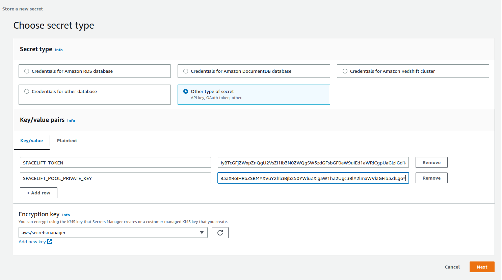
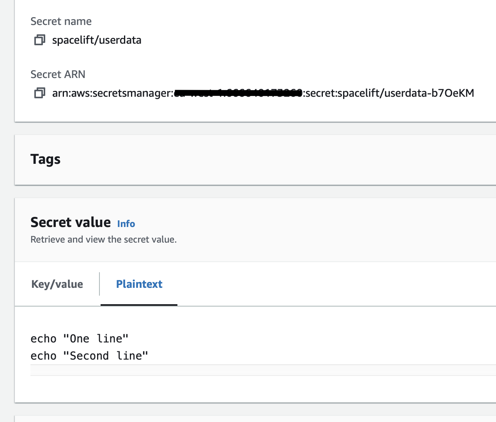

# Worker Pools

Before your Spacelift installation can perform any runs, it needs at least one worker pool. You can follow the instructions in our [worker pool](https://docs.spacelift.io/concepts/worker-pools) documentation on how to setup and configure your pool.

Please note there are a few things to be aware of when using a self-hosted install rather than Spacelift's SaaS offering. The following sections explain everything you need to know.

## Launcher Binary

The self-hosting release archive contains a copy of the Spacelift launcher binary built specifically for your version of self-hosting. You can find this at `bin/spacelift-launcher`. You should use this binary instead of the one mentioned in our worker pool documentation.

## CloudFormation Template

The easiest way to deploy workers for self-hosting is to deploy the CloudFormation template found in `cloudformation/workerpool.yaml`. Before you can deploy the template, you need to create your worker pool as described in the [worker pool](https://docs.spacelift.io/concepts/worker-pools) documentation so that you have a private key as well as a worker pool config file containing your token.

### Create a secret

Once you have these, create a new secret in SecretsManager, and add your token and the base64-encoded value of your private key, using the key `SPACELIFT_TOKEN` for your token and `SPACELIFT_POOL_PRIVATE_KEY` for the private key. It should look something like this:



Give your secret a name and create it. It doesn't matter what this name is, but you'll need it when deploying the CloudFormation stack.

### Get the downloads bucket name

The downloads bucket name is output at the end of the installation process. If you don't have a note of it, you can also get it from the outputs of the _spacelift-infra-s3_ stack in CloudFormation:


### AMI

You can use your own custom-built AMI for your workers, or you can use one of the pre-built images we provide. For a list of the correct AMI to use for the region you want to deploy your worker to, see the [spacelift-worker-image releases page](https://github.com/spacelift-io/spacelift-worker-image/releases).

**Note:** please make sure to choose the `x86_64` version of the AMI.

### Subnets and Security Group

You will need to have an existing VPC to deploy your pool into, and will need to provide a list of subnet IDs and a security groups to match your requirements.

<!-- TODO: add some information here about the networking requirements of workers. We can maybe base it on the docs on the worker pools page (https://docs.spacelift.io/concepts/worker-pools#network-security), but it'll have to be a self-hosting specific version of that information since some of it is specific to SaaS. -->

### Using a custom IAM role

By default we will create the instance role for the EC2 ASG as part of the worker pool stack, but you can also provide your own custom role via the `InstanceRoleName` parameter. This allows you to grant permissions to additional AWS resources that your workers need access to. A great example of this is allowing access to a private ECR in order to use a custom runner image.

At a minimum, your role must fulfil the following requirements:

- It must have a trust relationship that allows role assumption by EC2.
- It needs to have the following managed policies attached:
  - `AutoScalingReadOnlyAccess`.
  - `CloudWatchAgentServerPolicy`.
  - `AmazonSSMManagedInstanceCore`.

### Injecting custom commands during instance startup

You have the option to inject custom commands into the EC2 user data. This can be useful if you want to install additional software on your workers, or if you want to run a custom script during instance startup, or just add some additional environment variables.

The script must be a valid shell script and should be put into Secrets Manager. Then you can provide the name of the secret as `CustomUserDataSecretName` when deploying the stack.

Example:



In the example above, we used `spacelift/userdata` as a secret name so the parameter will look like this:

```shell
  [...]
  --parameter-overrides \
    CustomUserDataSecretName="spacelift/userdata" \
  [...]
```

### Granting access to a private ECR

To allow your worker role to access a private ECR, you can attach a policy similar to the following to your instance role (replacing `<repository-arn>` with the ARN of your ECR repository):

```json
{
    "Version": "2012-10-17",
    "Statement": [
        {
            "Effect": "Allow",
            "Action": [
                "ecr:GetDownloadUrlForLayer",
                "ecr:BatchGetImage",
                "ecr:BatchCheckLayerAvailability"
            ],
            "Resource": "<repository-arn>"
        },
        {
            "Effect": "Allow",
            "Action": [
                "ecr:GetAuthorizationToken"
            ],
            "Resource": "*"
        }
    ]
}
```

NOTE: repository ARNs are in the format `arn:<partition>:ecr:<region>:<account-id>:repository/<repository-name>`.

### Deploying the Template

To deploy your worker pool stack, you can use the following command:

```shell
aws cloudformation deploy --no-cli-pager \
  --stack-name spacelift-default-worker-pool \
  --template-file "cloudformation/workerpool.yaml" \
  --region "<region>" \
  --parameter-overrides \
    BinariesBucket="<binaries-bucket>" \
    SecretName="<secret-name>" \
    SecurityGroups="<security-groups>" \
    Subnets="<subnets>" \
    ImageId="<ami-id>" \
  --capabilities "CAPABILITY_NAMED_IAM"
```

For example, to deploy to `eu-west-1` you might use something like this:

```shell
aws cloudformation deploy --no-cli-pager \
  --stack-name spacelift-default-worker-pool \
  --template-file "cloudformation/workerpool.yaml" \
  --region "eu-west-1" \
  --parameter-overrides \
    BinariesBucket="012345678901-spacelift-infra-spacelift-downloads" \
    SecretName="spacelift/default-worker-pool-credentials" \
    SecurityGroups="sg-0d1e157a19ba2106f" \
    Subnets="subnet-44ca1b771ca7bcc1a,subnet-6b61ec08772f47ba2" \
    ImageId="ami-0ead0234bef4f51b0" \
  --capabilities "CAPABILITY_NAMED_IAM"
```

To use a custom instance role, you might use something like this:

```shell
aws cloudformation deploy --no-cli-pager \
  --stack-name spacelift-default-worker-pool \
  --template-file "cloudformation/workerpool.yaml" \
  --region "eu-west-1" \
  --parameter-overrides \
    BinariesBucket="012345678901-spacelift-infra-spacelift-downloads" \
    SecretName="spacelift/default-worker-pool-credentials" \
    SecurityGroups="sg-0d1e157a19ba2106f" \
    Subnets="subnet-44ca1b771ca7bcc1a,subnet-6b61ec08772f47ba2" \
    ImageId="ami-0ead0234bef4f51b0" \
    InstanceRoleName="default-worker-role" \
  --capabilities "CAPABILITY_NAMED_IAM"
```

### Proxy Configuration

If you need to use an HTTP proxy for internet access, you can provide the proxy configuration using the following CloudFormation parameters:

- `HttpProxyConfig`.
- `HttpsProxyConfig`.
- `NoProxyConfig`.

For example, you could use the following command to deploy a worker with a proxy configuration:

```shell
aws cloudformation deploy --no-cli-pager \
  --stack-name spacelift-default-worker-pool \
  --template-file "cloudformation/workerpool.yaml" \
  --region "eu-west-1" \
  --parameter-overrides \
    BinariesBucket="012345678901-spacelift-infra-spacelift-downloads" \
    SecretName="spacelift/default-worker-pool-credentials" \
    SecurityGroups="sg-0d1e157a19ba2106f" \
    Subnets="subnet-44ca1b771ca7bcc1a,subnet-6b61ec08772f47ba2" \
    ImageId="ami-0ead0234bef4f51b0" \
    HttpProxyConfig="http://proxy.example.com:1234" \
    HttpsProxyConfig="https://proxy.example.com:4321" \
    NoProxyConfig="some.domain,another.domain" \
  --capabilities "CAPABILITY_NAMED_IAM"
```

### Using custom CA certificates

If you use a custom certificate authority to issue TLS certs for components that Spacelift will communicate with, for example your VCS system, you need to provide your custom CA certificates to the worker. You do this by creating a secret in SecretsManager containing a base64 encoded JSON string.

The format of the JSON object is as follows:

```json
{"caCertificates": ["<base64-encoded-cert-1>", "<base64-encoded-cert-2>", "<base64-encoded-cert-N>"]}
```

For example, if you had a file called ca-certs.json containing the following content:

```json
{
  "caCertificates": [
    "LS0tLS1CRUdJTiBDRVJUSUZJQ0FURS0tLS0tCk1JSUZzVENDQTVtZ0F3SUJBZ0lVREQvNFZCZkx4NUsvdEFZK1Nja0gwNVRKOGk4d0RRWUpLb1pJaHZjTkFRRUwKQlFBd2FERUxNQWtHQTFVRUJoTUNSMEl4RVRBUEJnTlZCQWdNQ0ZOamIzUnNZVzVrTVJBd0RnWURWUVFIREFkSApiR0Z6WjI5M01Sa3dGd1lEVlFRS0RCQkJaR0Z0SUVNZ1VtOXZkQ0JEUVNBeE1Sa3dGd1lEVlFRRERCQkJaR0Z0CklFTWdVbTl2ZENCRFFTQXhNQjRYRFRJek1ETXhNekV4TXpZeE1Wb1hEVEkxTVRJek1URXhNell4TVZvd2FERUwKTUFrR0ExVUVCaE1DUjBJeEVUQVBCZ05WQkFnTUNGTmpiM1JzWVc1a01SQXdEZ1lEVlFRSERBZEhiR0Z6WjI5MwpNUmt3RndZRFZRUUtEQkJCWkdGdElFTWdVbTl2ZENCRFFTQXhNUmt3RndZRFZRUUREQkJCWkdGdElFTWdVbTl2CmRDQkRRU0F4TUlJQ0lqQU5CZ2txaGtpRzl3MEJBUUVGQUFPQ0FnOEFNSUlDQ2dLQ0FnRUF4anYvK3NJblhpUSsKMkZiK2l0RjhuZGxwbW1ZVW9ad1lONGR4KzJ3cmNiT1ZuZ1R2eTRzRSszM25HQnpINHZ0NHBPaEtUV3dhWVhGSQowQ3pxb0lvYXppOFpsMG1lZHlyd3RJVURaMXBOY1Z1Z2I0S0FGYjlKYnE0MElrM3hHNnQxNm1heFFKR1RpQUcyCi94VnRzdVlkaG5CR3gvLzYxU0ViRXdTcFIxNDUvUWYxY2JhOFJsUlFNejRRVVdOZThYWG8zU1lhWDJreGl3MlYKMU9wK2ZReGcyamYxQXl6UVhYMWNoMWp5RzVSTEVTUFVNRmtCaVF3aTdMT1NDYWF2ZkpFVXp3cWVvT1JnZDdUaQp1eU1WKzRHc2IxWEFuSzdLWFl3aXNHZVA1L1FORlBBQnlmQWRQalIyMHJNWVlIZnhxRUR0aDROYWpqbXUvaXlGClBHazRDb2JSaGl0VHRKWFQvUXhXY3Z0clJ1MUJDVm5lZHlFU015aXlhNFE5ZG4yN3JGampnM1pBUnFXT1poeXEKT1RXSG8ybU8yRnpFSnV4aHZZTmUyaVlWcDJzOHdNVEIwMm5QM3dwV29Zd2plMnlEd2Nqa0lsOHVYS3pFWjlHZgpGQVRKYUNMb084bzVKMkhYc2dPSXFYbHB6VTl0VXRFZXcveFR6WnFYNUEzNG84LytOZ1V0bTBGN2pvV2E1bURDClFCN0w4Y0tmQUN5ZGZwZWtKeC9nRlVHU3kvNXZkZkJ6T2N6YzZCbWg2NnlIUEJSRGNneURGbm54MzRtL1hWUWEKckJ3d0lERGJxdTNzc2NkT2dtOXY4Y3NDSmQwWWxYR2IveDRvQUE2MUlJVG5zTmQ5TkN3MEdKSXF1U0VjWWlDRQpBMFlyUVRLVmZSQVh1aFNaMVZQSXV4WGlGMkszWFRNQ0F3RUFBYU5UTUZFd0hRWURWUjBPQkJZRUZENTVSNG10CjBoTk9KVWdQTDBKQktaQjFqeWJTTUI4R0ExVWRJd1FZTUJhQUZENTVSNG10MGhOT0pVZ1BMMEpCS1pCMWp5YlMKTUE4R0ExVWRFd0VCL3dRRk1BTUJBZjh3RFFZSktvWklodmNOQVFFTEJRQURnZ0lCQUhlY1ZqTWtsVGtTMlB5NQpYTnBKOWNkekc2Nkd1UER3OGFRWkl1bnJ4cVl1ZDc0Q0ExWTBLMjZreURKa0xuV3pWYTduVCtGMGQ4UW4zdG92CnZGd0kzeHk1bCs0dXBtdVozdTFqRkVNaVNrOEMyRlBvaExEbkRvM3J3RVVDR3ZKNmE0R2FzN1l5SFBHTDNEckoKMGRjdTl3c1g5Y1lCMllKMjdRb3NaNXM2em1tVXZCR1RJMzBKTnZQblNvQzdrenFEM0FyeHZURVc5V2FVcW9KdAo4OGxzTW5uNitwczlBNmV4Yi9mSzkwOVpXYUVKV1JkOWNkTUVUMGZuYTdFaGhrTytDcXo0MTVSZ014bEs3Z2dUCjk3Q3ZranZ2TE5lRlQ1bmFIYnpVQU5xZk1WUlJjVWFQM1BqVEM5ejVjRG85Q2FQYUZqVi8rVXhheDJtQWxBUmsKZnFZeVdvcXZaSDkwY3pwdkZHMWpVbzZQNE5weXhaUzhsYXlKd0QyNHFYK0VPTjQzV1lBcExzbC9qRTJBL0ptUQpNZGdXTmhPeTRIUDhVOCthQU5yMEV2N2dXV05pNlZjUjhUNlBUL3JiQUdqblBtVm1vWjRyYzdDZG9TOFpRWkpoCks4RUxBMTcrcG5NVGdvN3d4ZkFScUwrcCttcWd0VXhSYmlXaXRldjhGMmhVVkIvU3dQOGhwY0dyZGhURU43dGQKcFNXMXlrUGVHSkZLU0JvNVFIYW5xcVBGQ3pxdEZlb0w5RGhZeDUveEU2RnBLTUxnM3ZWY0ZzSHU2Z2xTOGlNVgo0SHZiMmZYdWhYeExUQkNiRDErNWxMUC9iSFhvZ1FLbXAySDZPajBlNldCbVEweHFHb3U0SWw2YmF2c1pDeDJ2CkFEV3ZsdWU1alhkTnU1eFBaZHNOVk5BbHVBbmUKLS0tLS1FTkQgQ0VSVElGSUNBVEUtLS0tLQo="
  ]
}
```

You could then encode it to base64 using `base64 -w0 < ca-certs.json` (or `base64 -b 0 < ca-certs.json` on a Mac), resulting in the following string:

```text
ewogICJjYUNlcnRpZmljYXRlcyI6IFsKICAgICJMUzB0TFMxQ1JVZEpUaUJEUlZKVVNVWkpRMEZVUlMwdExTMHRDazFKU1VaelZFTkRRVFZ0WjBGM1NVSkJaMGxWUkVRdk5GWkNaa3g0TlVzdmRFRlpLMU5qYTBnd05WUktPR2s0ZDBSUldVcExiMXBKYUhaalRrRlJSVXdLUWxGQmQyRkVSVXhOUVd0SFFURlZSVUpvVFVOU01FbDRSVlJCVUVKblRsWkNRV2ROUTBaT2FtSXpVbk5aVnpWclRWSkJkMFJuV1VSV1VWRklSRUZrU0FwaVIwWjZXakk1TTAxU2EzZEdkMWxFVmxGUlMwUkNRa0phUjBaMFNVVk5aMVZ0T1haa1EwSkVVVk5CZUUxU2EzZEdkMWxFVmxGUlJFUkNRa0phUjBaMENrbEZUV2RWYlRsMlpFTkNSRkZUUVhoTlFqUllSRlJKZWsxRVRYaE5la1Y0VFhwWmVFMVdiMWhFVkVreFRWUkplazFVUlhoTmVsbDRUVlp2ZDJGRVJVd0tUVUZyUjBFeFZVVkNhRTFEVWpCSmVFVlVRVkJDWjA1V1FrRm5UVU5HVG1waU0xSnpXVmMxYTAxU1FYZEVaMWxFVmxGUlNFUkJaRWhpUjBaNldqSTVNd3BOVW10M1JuZFpSRlpSVVV0RVFrSkNXa2RHZEVsRlRXZFZiVGwyWkVOQ1JGRlRRWGhOVW10M1JuZFpSRlpSVVVSRVFrSkNXa2RHZEVsRlRXZFZiVGwyQ21SRFFrUlJVMEY0VFVsSlEwbHFRVTVDWjJ0eGFHdHBSemwzTUVKQlVVVkdRVUZQUTBGbk9FRk5TVWxEUTJkTFEwRm5SVUY0YW5ZdkszTkpibGhwVVNzS01rWmlLMmwwUmpodVpHeHdiVzFaVlc5YWQxbE9OR1I0S3pKM2NtTmlUMVp1WjFSMmVUUnpSU3N6TTI1SFFucElOSFowTkhCUGFFdFVWM2RoV1ZoR1NRb3dRM3B4YjBsdllYcHBPRnBzTUcxbFpIbHlkM1JKVlVSYU1YQk9ZMVoxWjJJMFMwRkdZamxLWW5FME1FbHJNM2hITm5ReE5tMWhlRkZLUjFScFFVY3lDaTk0Vm5SemRWbGthRzVDUjNndkx6WXhVMFZpUlhkVGNGSXhORFV2VVdZeFkySmhPRkpzVWxGTmVqUlJWVmRPWlRoWVdHOHpVMWxoV0RKcmVHbDNNbFlLTVU5d0syWlJlR2N5YW1ZeFFYbDZVVmhZTVdOb01XcDVSelZTVEVWVFVGVk5SbXRDYVZGM2FUZE1UMU5EWVdGMlprcEZWWHAzY1dWdlQxSm5aRGRVYVFwMWVVMVdLelJIYzJJeFdFRnVTemRMV0ZsM2FYTkhaVkExTDFGT1JsQkJRbmxtUVdSUWFsSXlNSEpOV1ZsSVpuaHhSVVIwYURST1lXcHFiWFV2YVhsR0NsQkhhelJEYjJKU2FHbDBWSFJLV0ZRdlVYaFhZM1owY2xKMU1VSkRWbTVsWkhsRlUwMTVhWGxoTkZFNVpHNHlOM0pHYW1wbk0xcEJVbkZYVDFwb2VYRUtUMVJYU0c4eWJVOHlSbnBGU25WNGFIWlpUbVV5YVZsV2NESnpPSGROVkVJd01tNVFNM2R3VjI5WmQycGxNbmxFZDJOcWEwbHNPSFZZUzNwRldqbEhaZ3BHUVZSS1lVTk1iMDg0YnpWS01raFljMmRQU1hGWWJIQjZWVGwwVlhSRlpYY3ZlRlI2V25GWU5VRXpORzg0THl0T1oxVjBiVEJHTjJwdlYyRTFiVVJEQ2xGQ04wdzRZMHRtUVVONVpHWndaV3RLZUM5blJsVkhVM2t2Tlhaa1prSjZUMk42WXpaQ2JXZzJObmxJVUVKU1JHTm5lVVJHYm01NE16UnRMMWhXVVdFS2NrSjNkMGxFUkdKeGRUTnpjMk5rVDJkdE9YWTRZM05EU21Rd1dXeFlSMkl2ZURSdlFVRTJNVWxKVkc1elRtUTVUa04zTUVkS1NYRjFVMFZqV1dsRFJRcEJNRmx5VVZSTFZtWlNRVmgxYUZOYU1WWlFTWFY0V0dsR01rc3pXRlJOUTBGM1JVRkJZVTVVVFVaRmQwaFJXVVJXVWpCUFFrSlpSVVpFTlRWU05HMTBDakJvVGs5S1ZXZFFUREJLUWt0YVFqRnFlV0pUVFVJNFIwRXhWV1JKZDFGWlRVSmhRVVpFTlRWU05HMTBNR2hPVDBwVloxQk1NRXBDUzFwQ01XcDVZbE1LVFVFNFIwRXhWV1JGZDBWQ0wzZFJSazFCVFVKQlpqaDNSRkZaU2t0dldrbG9kbU5PUVZGRlRFSlJRVVJuWjBsQ1FVaGxZMVpxVFd0c1ZHdFRNbEI1TlFwWVRuQktPV05rZWtjMk5rZDFVRVIzT0dGUldrbDFibko0Y1ZsMVpEYzBRMEV4V1RCTE1qWnJlVVJLYTB4dVYzcFdZVGR1VkN0R01HUTRVVzR6ZEc5MkNuWkdkMGt6ZUhrMWJDczBkWEJ0ZFZvemRURnFSa1ZOYVZOck9FTXlSbEJ2YUV4RWJrUnZNM0ozUlZWRFIzWktObUUwUjJGek4xbDVTRkJIVERORWNrb0tNR1JqZFRsM2MxZzVZMWxDTWxsS01qZFJiM05hTlhNMmVtMXRWWFpDUjFSSk16QktUblpRYmxOdlF6ZHJlbkZFTTBGeWVIWlVSVmM1VjJGVmNXOUtkQW80T0d4elRXNXVOaXR3Y3psQk5tVjRZaTltU3prd09WcFhZVVZLVjFKa09XTmtUVVZVTUdadVlUZEZhR2hyVHl0RGNYbzBNVFZTWjAxNGJFczNaMmRVQ2prM1EzWnJhbloyVEU1bFJsUTFibUZJWW5wVlFVNXhaazFXVWxKalZXRlFNMUJxVkVNNWVqVmpSRzg1UTJGUVlVWnFWaThyVlhoaGVESnRRV3hCVW1zS1puRlplVmR2Y1haYVNEa3dZM3B3ZGtaSE1XcFZielpRTkU1d2VYaGFVemhzWVhsS2QwUXlOSEZZSzBWUFRqUXpWMWxCY0V4emJDOXFSVEpCTDBwdFVRcE5aR2RYVG1oUGVUUklVRGhWT0N0aFFVNXlNRVYyTjJkWFYwNXBObFpqVWpoVU5sQlVMM0ppUVVkcWJsQnRWbTF2V2pSeVl6ZERaRzlUT0ZwUldrcG9Da3M0UlV4Qk1UY3JjRzVOVkdkdk4zZDRaa0ZTY1V3cmNDdHRjV2QwVlhoU1ltbFhhWFJsZGpoR01taFZWa0l2VTNkUU9HaHdZMGR5WkdoVVJVNDNkR1FLY0ZOWE1YbHJVR1ZIU2taTFUwSnZOVkZJWVc1eGNWQkdRM3B4ZEVabGIwdzVSR2haZURVdmVFVTJSbkJMVFV4bk0zWldZMFp6U0hVMloyeFRPR2xOVmdvMFNIWmlNbVpZZFdoWWVFeFVRa05pUkRFck5XeE1VQzlpU0ZodloxRkxiWEF5U0RaUGFqQmxObGRDYlZFd2VIRkhiM1UwU1d3MlltRjJjMXBEZURKMkNrRkVWM1pzZFdVMWFsaGtUblUxZUZCYVpITk9WazVCYkhWQmJtVUtMUzB0TFMxRlRrUWdRMFZTVkVsR1NVTkJWRVV0TFMwdExRbz0iCiAgXQp9Cg==
```

You would then create a secret in SecretsManager, and deploy the worker pool using the following command (replacing `<ca-cert-secret-name>` with the name of your secret):

```shell
aws cloudformation deploy --no-cli-pager \
  --stack-name spacelift-default-worker-pool \
  --template-file "cloudformation/workerpool.yaml" \
  --region "eu-west-1" \
  --parameter-overrides \
    BinariesBucket="012345678901-spacelift-infra-spacelift-downloads" \
    SecretName="spacelift/default-worker-pool-credentials" \
    SecurityGroups="sg-0d1e157a19ba2106f" \
    Subnets="subnet-44ca1b771ca7bcc1a,subnet-6b61ec08772f47ba2" \
    ImageId="ami-0ead0234bef4f51b0" \
    AdditionalRootCAsSecretName="<ca-cert-secret-name>" \
  --capabilities "CAPABILITY_NAMED_IAM"
```

## Terraform Modules

Our public [AWS](https://github.com/spacelift-io/terraform-aws-spacelift-workerpool-on-ec2), [Azure](https://github.com/spacelift-io/terraform-azure-spacelift-workerpool) and [GCP](https://github.com/spacelift-io/terraform-google-spacelift-workerpool) Terraform modules are not currently compatible with self-hosting.

## Running Workers in Kubernetes

You can run Spacelift workers for your self-hosted instance in Kubernetes, for example using our [Helm chart](https://github.com/spacelift-io/spacelift-workerpool-k8s). The main thing to be aware of is that the launcher is designed to work with a specific version of Spacelift, so it's important to use the correct container image for your Spacelift install.

### Finding the Launcher Image

During the installation process for your self-hosted image, an ECR repository is created for storing launcher images named `spacelift-launcher`. At the end of the installation the launcher image URI and tag are output. If you didn't take a note of it at the time, you can find the ECR repository URI via the AWS console, or by running the following command:

```shell
aws ecr describe-repositories --region <aws-region> --repository-names "spacelift-launcher" --output json | jq -r '.repositories[0].repositoryUri'
```

The repository URI will be in the format `<account-id>.dkr.ecr.<region>.amazonaws.com/spacelift-launcher`. To calculate the correct image to use, add the version of your self-hosted installation onto the end, for example:

```shell
012345678901.dkr.ecr.eu-west-2.amazonaws.com/spacelift-launcher:v0.0.6
```

**Note:** the cluster that you run the Launcher in must be able to pull the launcher image from your ECR repository, so you will need to ensure that it has the correct permissions to do so.

### Helm Chart

By default our Helm chart is configured to use `public.ecr.aws/spacelift/launcher`. The `latest` tag of that image is guaranteed to always work with the SaaS version of Spacelift. For self-hosted instances, you should configure the chart to use the correct launcher image URI and tag. For example, for the image specified in the [Finding the Launcher Image](#finding-the-launcher-image) section, you would use the following Helm values:

```yaml
launcher:
  image:
    repository: "012345678901.dkr.ecr.eu-west-2.amazonaws.com/spacelift-launcher"
    tag: "v0.0.6"
```
